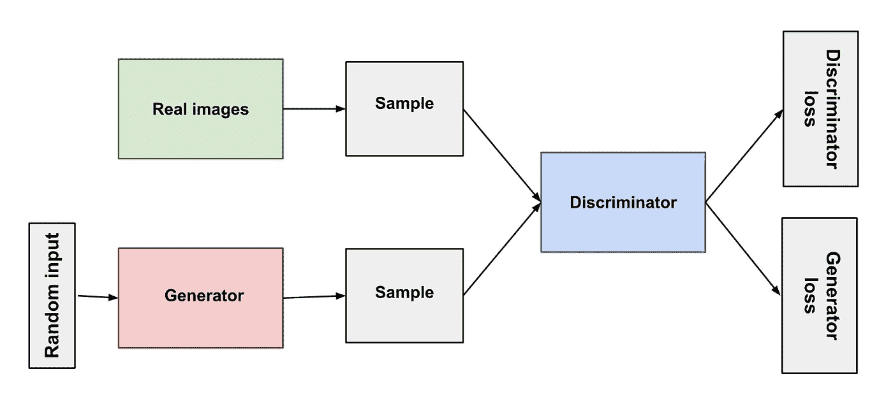
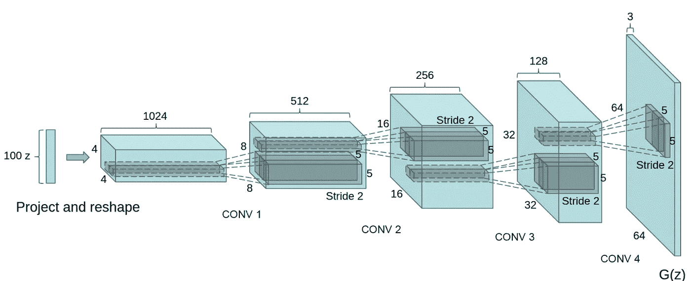
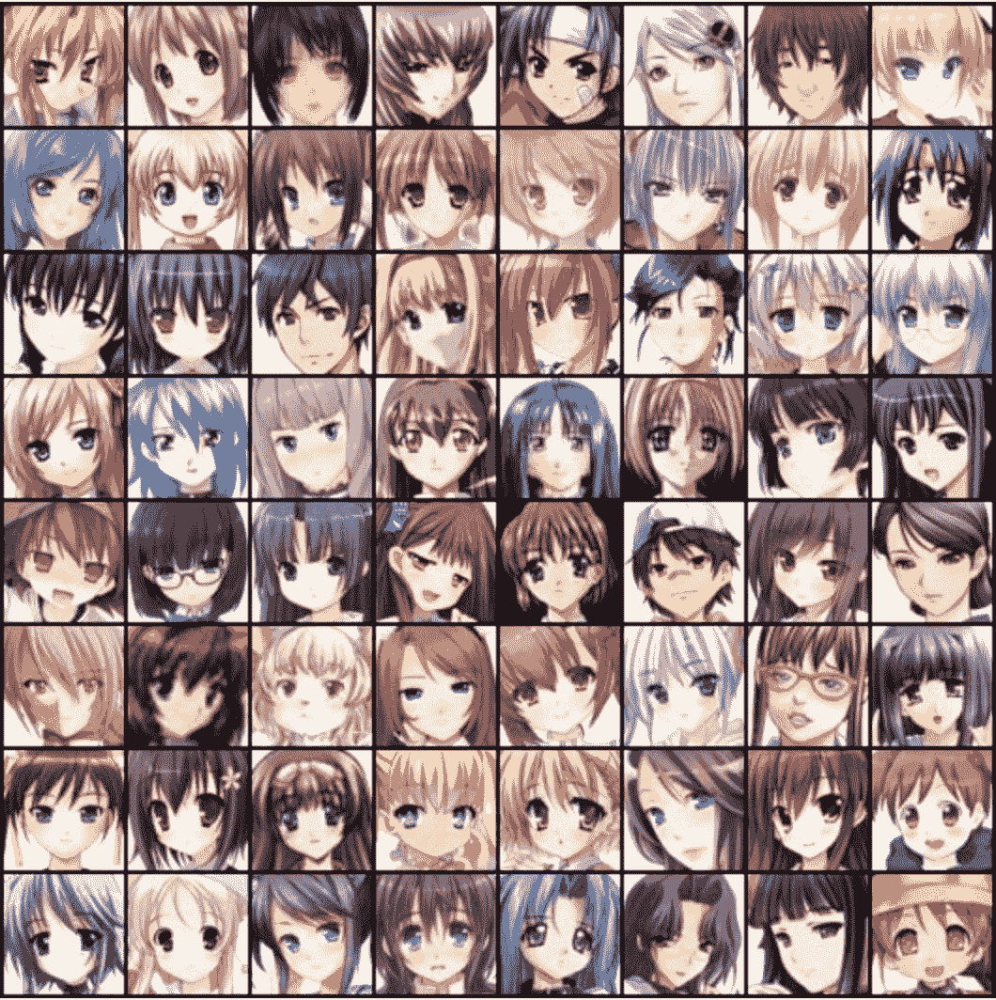

# 深度卷积生成对抗网络

> 原文：<https://medium.com/analytics-vidhya/deep-convolutional-generative-adversarial-network-4133bd4779ea?source=collection_archive---------17----------------------->

## 生成新的动漫头像

# **简介**

生成性对抗网络用于生成以前从未存在过的图像。他们能够了解这个世界，并创造那些从未存在过的图像的新版本。

它们分为两个基本部分:

*   一个**发生器**——产生图像。
*   一个**鉴别器**——评估图像并告诉生成器它们是否与训练图像相似。这些都是基于真实世界的例子。

训练网络时，生成器和鉴别器都是从零开始，一起学习。

GAN 的目标是训练数据生成器，以便模仿给定的数据集。这里要模仿的数据集是动漫人脸数据集。
GAN 类似于两个神经网络之间的零和游戏，一个是数据生成器，另一个是鉴别器，训练用于从生成器创建的伪数据中识别原始数据。

以下是 GAN 的结构:

氮化镓结构

# DCGAN

DCGAN 是最流行和最成功的 GAN 网络设计之一。它主要由卷积层组成，没有最大池或完全连接的层。它使用卷积步长和转置卷积进行下采样和上采样。

在深度卷积 GAN 中，数据发生器具有以下结构:

DCGAN 发生器

它采用一个噪声向量作为输入，以便使潜在的输出多样化。这个向量被重新整形为具有重要数量的通道的结构，随后是一连串的卷积层，这些卷积层将减少深度并在其他维度上形成图案，直到我们能够获得彩色图像的输出。

理想情况下，在训练之后，每个维度将对应于图像的一个特征，例如角色的头发颜色。

接下来是鉴别器，对于当前复杂的问题，它是一个简单的 CNN，非常灵活。

以下是训练图像的示例:

动漫人脸数据集

DCGAN 训练时需要注意的事项:

1.  由于鉴别器不断进化，使用梯度下降，成本函数可能收敛，也可能不收敛。
2.  鉴别器必须足够强大，以便发生器继续工作。
3.  最后，必须仔细选择学习率和衰减率。较高的学习速率可能导致过拟合，但同时学习速率应该足够高，以便生成器能够快速适应。建议的指数衰减率为 0.5。

生成器的 Keras 实现:

鉴别器的 Keras 实现:

# 决赛成绩

结果中的一些图像是令人信服的，它们呈现了各种不同的特征，包括发型、头发颜色或面部取向。在训练期间，我们能够避免模式崩溃，并且鉴别器的稳定准确度为 80%。
然而，生成器不能创建全局令人信服的人脸，例如，有些人脸在两只眼睛之间呈现不同的形状和颜色。

# 参考

[1]https://arxiv.org/abs/1511.06434