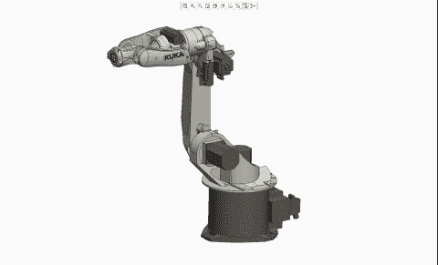

# 深度强化学习训练机械臂抓球

> 原文：<https://medium.com/analytics-vidhya/deep-deterministic-policy-gradients-ddpg-algorithm-2e07aadbf5ca?source=collection_archive---------12----------------------->

在这篇文章中，我们将训练一个智能体(机械臂)去抓一个球。该代理由一个双关节臂组成，可以移动到目标位置。代理的目标是在尽可能多的时间步长内保持其在目标位置的位置。我们将使用演员-评论家的方法来解决这个问题。