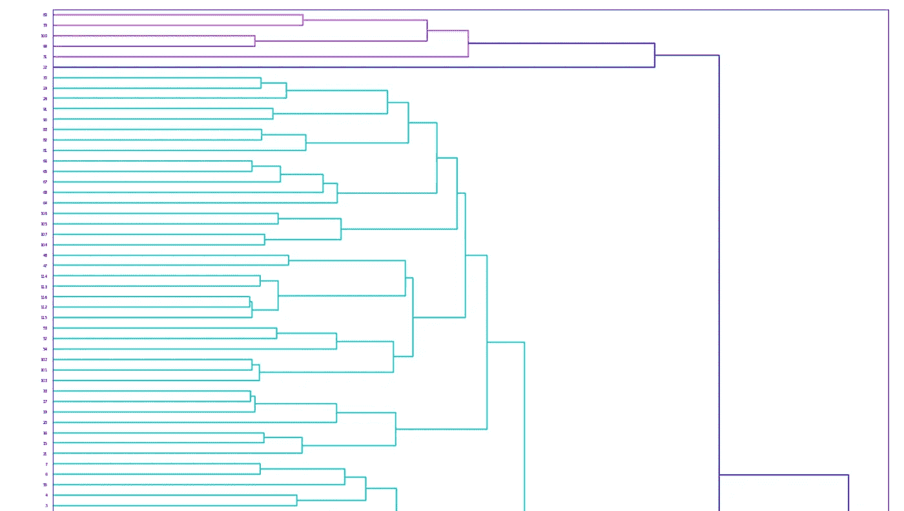
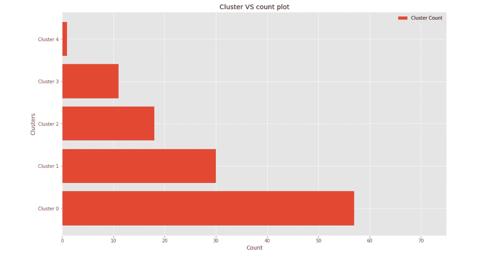
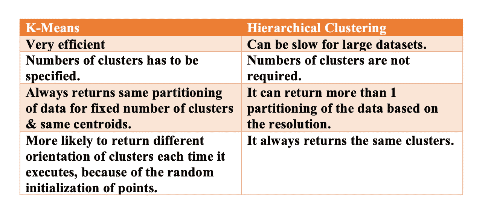
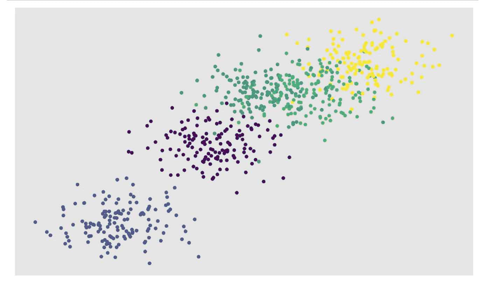
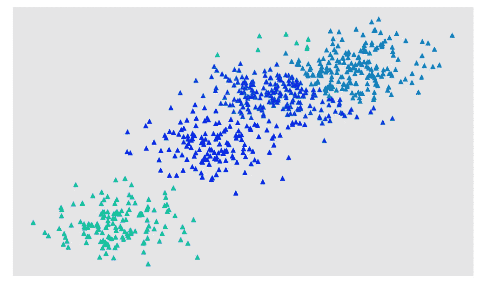
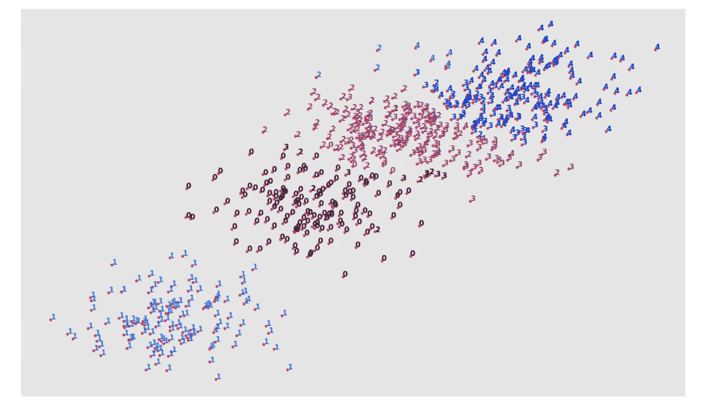
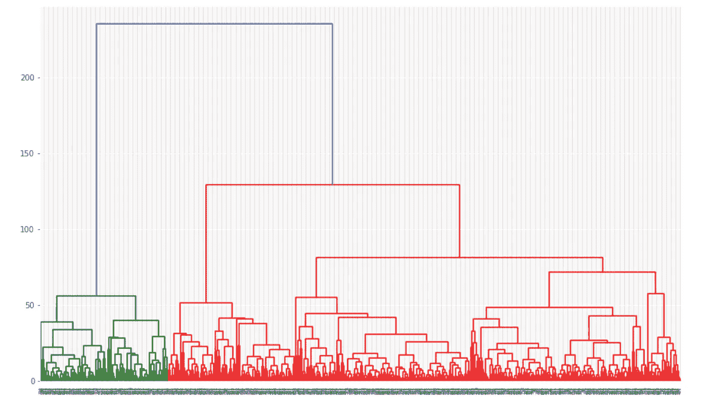

# 深潜凝聚集群！

> 原文：<https://medium.com/analytics-vidhya/deep-dive-agglomerative-clustering-e9af2bfd8daf?source=collection_archive---------11----------------------->

## 简介:这篇文章用一个项目涵盖了凝聚集群的每一个方面。

**凝聚聚类(非完整树状图)【作者图片】**

**作者图片**

请大家在阅读之前先阅读一下我关于聚类和层次聚类的文章，因为这将对你们有很大的帮助，因为它将有助于理解聚类的基础知识及其类型“层次聚类”！

 [## 什么是集群？

### 简介:有没有想过在没有实际标签/类/目标的情况下，根据相似的特性来排列数据…

medium.com](/analytics-vidhya/what-is-clustering-a23b3b432bc2)  [## 分层聚类

### 简介:它是一种特定类型的聚类，或者可以说它是执行聚类的一种特定方式…

medium.com](/analytics-vidhya/hierarchical-clustering-4a9ed95b56d5) 

## 凝聚聚类介绍！

*   这是一种自底向上的层次聚类方法。
*   它遵循一个非常简单的聚类模式，从识别距离最近的两个点开始，这种方法递归地继续，直到整个数据被聚类。
*   它将创建“n”个集群，每个集群对应一个数据点。
*   它将创建一个 ***【邻近矩阵】*** 也称为 ***【距离矩阵】*** 或 ***【相似矩阵】。*** 矩阵中的每个值对应于每个&每个点之间的距离。假设有 10 个点，那么矩阵的尺寸将为 10×10，计算每个&点到每隔一个点的距离。
*   在群集形成之后，邻近矩阵被更新。
*   重复上述步骤，直到数据集中没有要聚类的点。

## 求星团间距离的方法！

总共有 4 种方法可用于此:

1.  **单链聚类:**在这种方法中，考虑了两个聚类之间最近点之间的距离。
2.  **完全连锁聚类:**在这种方法中，考虑了两个聚类之间最远点之间的距离。
3.  **平均链接聚类:**在这种方法中，计算属于每个聚类的所有点的平均距离，&然后考虑两个聚类之间的距离。
4.  **质心-连接聚类:**在这种方法中，考虑了两个聚类的质心之间的距离。

## 层次聚类的优势！

*   不需要为该算法的工作指定簇的数量。
*   非常容易实现。
*   生成**树状图，**有助于理解数据。

## 层次聚类的缺点！

*   在整个算法中，它永远无法撤消上一步。例如，如果这个算法最初找到一个聚类，然后意识到它不是最优的，那么这个步骤不能撤销。
*   与 KMeans 等其他聚类算法相比，通常需要更长的运行时间。
*   有时，很难从树状图中确定正确的聚类数。

## **层次聚类的区别&k 均值聚类！**

**作者图片**

> 项目——对随机生成的数据进行聚合过滤！

## 项目开始！

*在这个项目中，凝聚过滤已经在从零开始生成的数据上得到了说明！*

在上面的代码中，为项目导入了重要的库。每个图书馆的要求如下:

*   **Numpy:** 用于处理 python**“Numpy . ndarrays”。**很厉害，速度很快。
*   **Pandas:** 用于处理数据科学中的**数据帧**。
*   **Scipy:** 代表科学 python。在上面的代码中，distance_matrix &层次结构是从 scipy 库中导入的，以便计算邻近矩阵(如上所述)，&来说明如上所述的树状图。
*   **Matplotlib:** 用于说明 python 中的各种情节。
*   **Sklearn:** 它是一个机器学习库&几乎用于机器学习的每一个任务。

*   在上面的代码中， **"make_blobs"** 用于生成随机数据，" n_samples "表示我们要生成的样本数， **"centers"** 参数接受一个列表作为输入，其中包含将由" make _ blobs "&**" cluster _ STD】**生成的每个分类的中心，表示每个分类与另一个分类的标准偏差。

> 在“X”和“y”中，make_blobs 将返回随机生成的点及其对应的类。

*   行号“9”表示用于随机生成的点的绘图的样式。
*   行号“11”表示随机生成的点的图形大小。
*   行号“13”将使用随机生成数据的第一列和第二列绘制散点图。
*   行号“14 和 15”禁用散点图的 x 和 y 标签。
*   行号“17”用于显示绘图。

**上述随机生成数据的散点图。【作者图片】**

在上面的代码中，凝聚聚类模型用一些参数初始化，如代表聚类数的**、【n_clusters】、**(如果我们不指定聚类数，即使这样也没关系)、**、**被设置为欧几里德，即“欧几里德”距离将用于计算点之间的距离，最后**、【链接】、**被设置为 average，代表“平均链接聚类”(如上所述)。

上面的代码将根据聚集聚类计算出的聚类来绘制数据点。

**凝聚星团的输出【作者图片】**

上面的代码用于在散点图上绘制数据，并为对应于其聚类的点分配一个数字。

分配给每个数据点的聚类数。[图片由作者提供]

上面的代码首先说明了“X”和“X”之间的距离矩阵的创建，以便计算属于数据“X”的每个点之间的距离，然后用数据和平均链接聚类初始化树状图。最后，绘制树状图。

**输出树状图【图片由作者提供】**

> 关于这个项目的更多详细信息，请点击下面的链接在 Github 上查看这个项目。

 [## harshit dawar 55/机器和深度学习

### permalink dissolve GitHub 是超过 5000 万开发人员的家园，他们一起工作来托管和审查代码，管理…

github.com](https://github.com/HarshitDawar55/Machine_And_Deep_Learning/blob/master/Projects/Machine_Learning_Projects/Agglomerative_Clustering_Random_Data/Agglomerative%20clustering%20on%20Random%20Data.ipynb) 

> 如果你对在真实数据集上实现的凝聚项目感兴趣，也可以点击下面的链接查看。

 [## harshit dawar 55/机器和深度学习

### permalink dissolve GitHub 是超过 5000 万开发人员的家园，他们一起工作来托管和审查代码，管理…

github.com](https://github.com/HarshitDawar55/Machine_And_Deep_Learning/blob/master/Projects/Machine_Learning_Projects/Agglomerative_Clustering_on_Vehicle_Dataset/Agglomerative_Clustering_on_Vehical_Dataset!.ipynb) 

***我希望我的文章在解释项目的同时解释了与凝聚式层次聚类相关的每一件事情。非常感谢你花时间阅读我的文章，增长你的知识！***