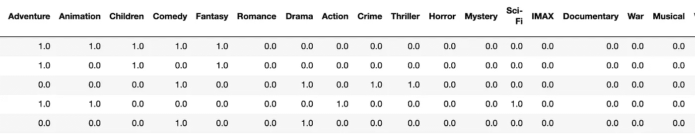

# 基于内容的深度推荐系统！

> 原文：<https://medium.com/analytics-vidhya/deep-dive-content-based-recommendation-systems-600541b5bab8?source=collection_archive---------19----------------------->

## 简介:基于内容的推荐系统和基于记忆的方法，以及它们的优点、缺点，还有一个真实的项目实例都将在这个博客中解释。

**作者图片**

推荐系统是当今市场上的一个热门词汇，无论你看一下像 Flipkart、Amazon 等电子商务网站，它都被广泛使用。、在线流媒体平台，如网飞、亚马逊 Prime、Youtube 等。

存在多种类型的推荐系统，每一种都有它们不同的工作算法，它们都有一些优点和缺点。

讨论多种推荐系统超出了本文的范围，因为在这篇博客中，将解释基于内容的推荐系统。

出于了解的目的，我列出了一些推荐系统的类型:

*   基于内容的推荐系统
*   协同过滤
*   混血儿等。

推荐系统流行的原因是与它们相关联的优势，这将在下面讨论。

## 推荐系统的优势

*   通过向客户推荐产品为公司收集更多的收入，而客户很可能会拒绝。
*   为公司吸引更多的顾客。
*   能够识别不同口味的顾客群体。
*   推荐顾客可能需要的产品，让顾客感到愉快。
*   增加平均订单价值。
*   增加特定产品的销售。
*   为公司带动更多流量等。

## **基于内容的推荐系统**

它基于基于记忆的方法工作，这意味着它基于收集特定用户的完整简档的方法工作，即，它识别特定用户可能对哪些产品类型感兴趣。

这种方法不使用任何模型。

> 基于内容的推荐系统方法也可以被认为是基于项目到项目相似性的方法。

在这种方法中，对用户的完整简档进行深入研究，以了解用户偏好，然后基于用户偏好，识别从用户偏好中获得的具有相同类别的其他产品，然后将它们推荐给用户。

**结合实例深入讲解基于内容的推荐系统**

考虑一个基于用户的简档向用户推荐电影的例子。为了完成这项任务，我们必须首先识别用户感兴趣的电影类型。其示例如下图所示。

**用户可能感兴趣的类型的示例【作者图片】**

在上面所示的图像中，存在各种类型，并且该图像仅包含用户已经评级的电影的数据，因为它是从用户简档生成的。

在其列中具有 1 的类型表示用户对具有该类型的电影感兴趣，而在其列中具有的类型表示用户对具有该类型的电影不感兴趣。

> 现在，为了进一步创建我们的基于内容的推荐系统，我们必须创建一个适当的类型列表，它对特定用户的电影选择贡献最大，为此，首先，我们必须将上面获得的用户类型偏好与用户提供的评级进行点积。

**通过取上面解释的点积获得的最终流派列表。【作者图片】**

现在，从上面的类型列表中，我们必须找出每部电影的类型权重。

**每部电影的类型权重【作者图片】**

在上面显示的图像中，仅电影的数据仅作为示例显示。

> 现在，对于数据集中的每部电影，必须计算其总类型权重&应该除以用户感兴趣的总类型和，这将给出每部电影的加权平均值。这导致推荐的最终值，基于该推荐值，向用户推荐电影。现在，为每部电影获得的推荐值应该以降序排序，并且可以将它们对应的电影推荐给用户。

**获得示例推荐【作者图片】**

在上图中，左栏显示电影 Id，右栏显示该电影类型的加权平均值，根据电影推荐的完成情况按降序排序。

**给用户的最终电影推荐【作者图片】**

现在，完整的推荐系统已经准备好了！

## **基于内容的推荐系统的优势**

*   有效地学习用户的偏好。
*   它对用户来说是高度个性化的。

## 基于内容的推荐系统的缺点

*   它没有考虑其他用户对某个特定商品的看法，因此可能会出现低质量的商品推荐。
*   数据提取并不总是直观的。
*   确定用户不喜欢或喜欢项目的什么特征并不总是显而易见的。
*   如果存在不包含用户喜欢的任何因素/类别的新项目，则该项目将不被考虑用于推荐，即使该项目可能与该用户高度相关。

欲了解更多详细信息&一个真实的项目，请查看下面的链接！

 [## harshit dawar 55/机器和深度学习

### permalink dissolve GitHub 是超过 5000 万开发人员的家园，他们一起工作来托管和审查代码，管理…

github.com](https://github.com/HarshitDawar55/Machine_And_Deep_Learning/blob/master/Projects/Machine_Learning_Projects/Content_Based_Recommendation_System/Content_Based_Recommendation_System.ipynb) 

***我希望我的文章能够解释与基于内容的推荐系统相关的每一件事情，以及解释相同的&配置。非常感谢你花时间阅读我的博客&来增长你的知识！***