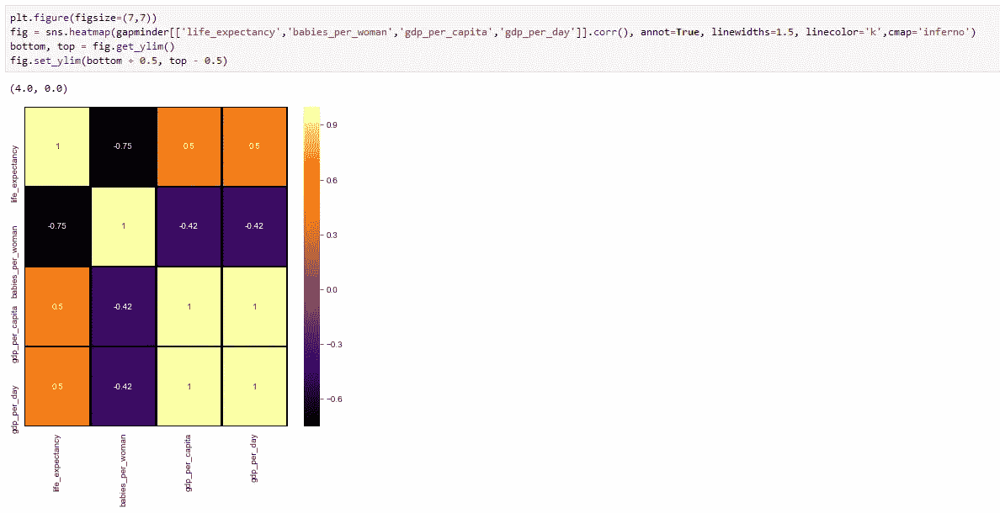

# 使用 Python 深入研究机器学习

> 原文：<https://medium.com/analytics-vidhya/deep-dive-in-machine-learning-with-python-19a67423218c?source=collection_archive---------13----------------------->

## 第十二部分:数据可视化


欢迎来到另一个深入研究 Python 机器学习的博客，在上一个 [**博客**](/@Rajesh_ML_Engg/deep-dive-in-machine-learning-with-python-a5c1d0c8ed8a) 中，我们使用了 **Gapminder 数据集**来了解数据分布、直方图和密度图。在今天的博客中，我们将重点关注**热图**，这些热图通常用于利用各种颜色编码方法可视化数值的广义视图。我们还将探索**对图**，它允许我们找到多个变量之间的关系。

在今天的博客中，我们将继续使用 **Gapminder 数据集**。在这篇博客的最后，我还将分享一个与数据可视化相关的额外技巧。


感谢 [JW](https://giphy.com/gifs/johnwick-john-wick-3-parabellum-5zf2M4HgjjWszLd4a5)

## 导入必要的 python 库


必需的库

## 导入数据集

我们将从一个 CSV 文件(即 *gapminder.csv* )导入数据集，并创建一个熊猫数据框架。


从 CSV 文件读取的数据

# 问题 1:什么是热图，什么时候或者为什么使用它们？

当我第一次听到术语“**热图**”时，我脑海中的第一个想法是它与天气预报的关系。如果你也在思考同样的问题，那你就对了，因为热图是用来显示地图上的“**热区**”和“**冷区**”的。

根据定义，热图是数据的图形化表示，可以让用户关注最重要的区域。它们包含多种颜色编码方案，您可以通过这些方案来可视化大型数据集。因此，如果你想找到数据集变量之间的相互关系，那么就使用热图。

# 问题 2:如何使用 Gapminder 数据集绘制关联热图？


关联热图

这里，我使用了 **Seaborn** 库( ***又名 sns*** )并提供了关联矩阵作为热图的输入。


相关矩阵

如你所见，热图只是用“**冷暖**”颜色编码方案表示了上述矩阵结果。您可以使用各种其他的方案，我稍后会谈到这些方案。除了**色彩图** ( ***又名 cmap*** )之外，我使用了以下参数:

```
**annot** : If True, write the data value in each cell.**linewidths** : Width of the lines that will divide each cell.**linecolor** : Color of the lines that will divide each cell. It also accepts 'R','G','B' and 'K' as values. 
```


## 彩色地图

你可以使用几种配色方案，如“地狱”、“绿色”、“冬季”、“夏季”等。



**魔族**


**绿色的**

Bonus 提示—热图

看到上面的图，你可能想知道为什么我明确地设置了 y 轴的限制。所以，这是因为我正在使用的 **seaborn** 版本有一个 bug。参考下图:


**图像截断问题**

因此，为了解决这个问题，我明确地改变了 y 轴的上限和下限。

# 问题 3:如何使用热图可视化变量中的空值？


**可视化空值**

这里，我简化了热图，它将找到空值。


**变量中的空值**

因此，热图中突出显示的行表示“**life _ expectation**”列中的 9929 个空值。

# 问题 4:什么是配对图，为什么要使用它们？

配对图表示数据集中的成对关系。它创建了一个轴网格，这样数据中的每个变量将在 y 轴的一行中共享，在 x 轴的一列中共享。对角轴被区别对待，绘制一个图来显示该列中变量的数据的单变量分布。

# 问题 5:如何创建一个 pair plot ' **预期寿命**'、**年龄 5 _ 存活**'、**婴儿 _ 每个妇女**'和基于'**区域**'着色的数据？


**KDE 对剧情**


**历史配对图**

这里，我们创建了描述变量之间关系的直方图和 KDE 对图。

BONU 提示—配对图

在许多情况下，在进行数据可视化时，您可能需要添加一条穿过轴的垂直线，以便于分隔数据值。为此， **axvline** 用于在您的绘图中添加垂直线作为一个级别。


**绘图 _ 数据功能**

在这个函数中，我使用**每日 GDP**和**预期寿命**创建散点图。此外，增加了 3 个级别，其中**每天的 GDP**为 4、16 和 64。


**等级散点图**

恭喜你，我们的博客到此结束。总而言之，我们致力于围绕热图和结对图建立理解。在下一篇博客中，我们将从 EDA 概念开始。

> **如果你想下载这个博客的 Jupyter 笔记本，请访问下面的 GitHub 库:**
> 
> [**https://github.com/Rajesh-ML-Engg/Deep_Dive_in_ML_Python**](https://github.com/Rajesh-ML-Engg/Deep_Dive_in_ML_Python)

谢谢你，祝你学习愉快！！

***Blog-13:***[***与数据逆向***](/@Rajesh_ML_Engg/deep-dive-in-machine-learning-with-python-64bcbe0b1b40)