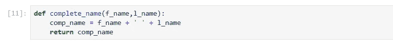
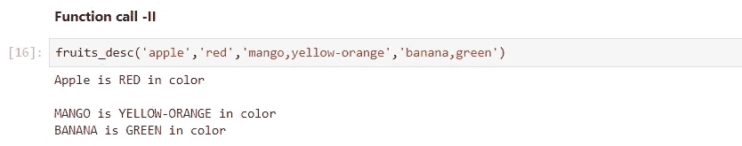

# 使用 Python 深入研究机器学习

> 原文：<https://medium.com/analytics-vidhya/deep-dive-in-machine-learning-with-python-1e315c426571?source=collection_archive---------7----------------------->

## 第六部分:列出 Python 中的理解和函数

欢迎来到**用 Python 深度学习机器**的第六篇博客，在上一篇博客([用 Python 深度学习 ML——第五部分](/analytics-vidhya/deep-dive-in-machine-learning-with-python-41a36cac3279))中我们讨论了元组和字典的实时场景。

在今天的博客中，我们将介绍列表理解和函数，这是两个最广泛使用的 python 组件。

# Python 函数

> 函数是用于执行一个或多个动作的可重用代码块。

Python 已经提供了几个内置函数，比如 print()、type()和其他函数，但是，您也可以创建自己的自定义函数。这些功能被称为**用户自定义功能**。

# 用户定义的函数

在 Python 中，用户可以创建两种类型的函数:

**1。带有 return 语句的函数**

这些函数执行一些代码，然后在函数被调用时返回输出。

**2。没有返回语句的函数**

这些函数执行一些操作，然后不返回结果，而是在控制台上打印输出。

# 问题-1:如何创建自定义函数？

## 案例 I:带有 return 语句的函数

解决方案-1.1

在上面的例子中，我们创建了一个函数**‘add _ two _ numbers’**，它接受两个输入参数**‘num 1’**和**‘num 2’**。并且，它返回两个输入参数的相加。

## 案例二:用打印语句代替返回语句的函数

解决方案-1.2

这里，上面的函数只是使用一个 **print()** 语句打印输出，而不是返回结果。

## 情况 III:覆盖参数值并返回结果的函数

解决方案-1.3

这里，在这个例子中，虽然我们在调用函数时提供了参数的值(即 ***num1*** 为 ***9*** 和 ***num2*** 为 ***3*** ),但是在函数定义中我们将它们的值改写为 ***16*** 和 ***8***

**因此，结果打印为 2.0。**

# 问题-2:调用/调用自定义函数的方法有哪些？

## 第一种情况:显式函数调用

解决方案-2.1

如上行所示，我们调用了用户定义的函数 **'add_two_numbers'** ，并通过显式写入两个参数的名称，将这两个参数 **'num1'** 传递为 ***7*** 和 **'num2'** 为 ***8*** 。

> 在显式函数调用中，其参数的位置/顺序并不重要，因为我们提供了参数名及其值。

## 案例二:隐式函数调用

解决方案-2.2

在上面的例子中，我们调用了用户自定义函数 **'add_two_numbers'** ，并隐式传递了参数 **'num1'** 和 **'num2'** 的值。这意味着这些值将基于它们在函数定义中定义参数的位置来选取。这样， ***7*** 会到 **num1** 和**8到 **num2** 。**

# 问题-3:如何编写一个高效的、描述性的用户自定义函数的 docstring？

解决方案-3

在上面的例子中，我们将 docstring 添加到函数中，并提到了三个主要类别:

**1。描述:**它解释了该功能的目标

**2。参数:**表示该函数可以接受的参数

**3。Return:** 它提到了函数将返回的输出

# 问题-4:如何查看自定义函数的 docstring？

解决方案 4

因此，通过在定义函数时提供 docstring，有助于将来对它的描述。

# 问题-5:函数参数的类型有哪些？

有几种功能参数:

# 1.必需的参数

调用函数时需要提供其值的参数称为必需参数。

**情况一:提供所有参数的值**

解决方案-5.1.1

因此，在上面的例子中，已经创建了一个函数 **complete_name** ，它接受两个参数 **f_name** 和 **l_name** 。这两个参数都是必需的参数，无论何时被调用， **complete_name** 都需要它们的值。

解决方案-5.1.2

这里，我们将参数 **f_name** 提供为' **Jetts** '，将 **l_name** 提供为' **Watson** '。并且，得到了预期的输出'**杰特沃森**'。现在，让我们试着用一个参数调用同一个函数。

**情况二:仅提供一个必需参数的值**

解决方案-5.2

正如您在上面的错误中看到的，complete_name 函数需要两个必需参数的值。但是我们只提供了 **f_name** 为' **Jetts** ，跳过了 **l_name** 。

**因此，得到了'*缺少 1 个必需的位置参数'*错误*。***

# 2.默认参数

如果函数调用中没有提供值，这些参数会考虑默认值。

## 案例一:用缺省参数定义函数

解决方案-2.1

在本例中，我们创建了一个函数' **batsmen_score** '，它有三个参数' **first_name** '、 **last_name** 和' **team** '。

其中，'**名字**和'**姓氏**'是必需参数，但是，'**团队**'是默认参数，这意味着如果函数中没有提供其值，则将使用默认值'**印度**'。

## 第二种情况:调用函数并向默认参数传递一个值

解决方案-2.2

因此，上面的例子演示了默认参数的使用。

# 3.可变长度参数

这些是我们不在函数定义中指定的参数，比如必需的或缺省的参数。但是，该函数仍然会处理它们。

## 示例-I

解决方案-3.1

正如我们在上面的单元格中所看到的，函数调用中的后 3 个值(' **ICC World Cup 2007** '、 **ICC Champions Trophy 2012** '、 **VB Series 2013** ')被视为变长参数，没有在函数定义中命名。

> 星号(*)放在变量名称的前面，变量名称包含所有非关键字变量参数的值。

## 实施例二

解决方案-3.2

在这个例子中，只有必需的参数被传递给函数。如上所述，可变长度参数是不需要的参数。因此，即使在函数调用中没有提供它们的值，您也不会收到任何错误。

这里，除了必需的参数，我们还在函数调用中简化了可变长度参数的值。因此，输出中显示了相同的内容。

# 匿名函数

当一个函数没有使用' **def** '关键字以标准方式声明时，该函数被称为匿名函数。我们使用' **lambda** '关键字来创建一个匿名函数。我更喜欢使用匿名函数，因为它们简单易用，最重要的是足够强大，可以执行任何操作。

让我们尝试使用**‘lambda’**函数来解决一些问题:

# 问题-1:如何创建 lambda 函数？

解决方案-1

如上面的单元格所示，我们使用**‘lambda’**关键字创建了一个匿名函数。在本例中，该函数接受两个参数 x 和 y，并返回它们的和，即 x + y。

# 问题-2:如何用 lambda 将两个数相加？

解决方案 2

这里你可以看到一个简单的方法，通过'**λ**将两个数字相加。

# 问题-3:如何用 lambda 给一个列表的每一个值加一个数？

解决方案-3

所以，在这个例子中，我们给列表中的每个元素都加了 10。

# 问题-4:如何给 python 变量对象赋 lambda 函数？

解决方案 4

在本例中，我们定义了 lambda 函数并将其分配给 python 对象' **cal_power_of_number** '，然后将参数值传递给在后端运行 lambda 函数的对象。

# 问题-5:如何在标准函数内部定义 lambda 函数？

解决方案 5

在这里，'**numbers _ multiplication**'函数调用 lambda 函数，并将参数传递给它。

# 地图功能

在将函数应用于 iterable(列表、元组等)的每个元素后，该函数返回结果列表。)

映射、减少和过滤功能

# 问题-1:如何使用 MAP 函数在 iterable 上应用？

解决方案-1

这是在任何 iterable 上映射函数的方法(例如，在上面的例子中，我们还使用了 **student_scores** )

# 问题-2:将 MAP 函数应用于 iterable 后，如何获得结果值？

解决方案 2

这就是在将 **MAP** 函数应用于 iterable 后获得结果值的方法。

# 问题-3:如何使用 MAP 函数在 iterable 上应用 LAMBDA 函数？

解决方案-3

在上面的例子中，我们将 lambda 函数映射到一个 iterable 上(即 **batsmen_last5_runs** )

# 减少功能

reduce 函数将参数中传递的特定函数应用于所有列表元素。它在' **functools** 模块中定义。

# 问题-1:如何导入 REDUCE 函数？

解决方案-1

# 问题 2:如何在 iterable 上使用 lambda 函数应用 REDUCE 运算？

解决方案 2

在本例中，我们对'**batsmen _ scores _ in _ a _ series**'应用了 reduce 函数，以获得一名击球手在系列赛中的总得分。

# 问题-3:如何对标准函数内部的 iterable 应用 REDUCE 运算？

解决方案-3

这里，我们使用了可变长度参数，并对'**水果**'列表应用了 **REDUCE** 函数来获得水果的数量。

# 滤波函数

**filter()** 方法通过使用验证每个元素是否满足特定条件的函数来过滤数据。

# 问题 1:如何对标准函数中的数据应用过滤方法？

解决方案-1

在上面的例子中，我们简单地将 **'filter_int_values'** 函数应用于可迭代的 **[20，40，' Mathew']** 。因此，iterable 的非整数值被打印出来。

# 问题-2:如何通过使用 LAMBDA 函数应用 filter 方法？

解决方案 2

在上面的例子中，我们只是删除了不能被 2 整除的记录。

# 列表理解

这是一种在 python 中定义和创建列表的方法。当我们可以根据一行中的一些语句/条件创建列表时，我们称之为列表理解。

# 问题-1:如何通过一系列数字创建列表？

解决方案-1

在上面的例子中，我们基于一个大于 10 且能被 2 整除的数字创建了一个从 1 到 39 的数字列表。

# 问题-2:如何利用 LAMBDA 和 REDUCE 函数创建数字列表？

解决方案 2

在上面的例子中，我们创建了一个大于 10 小于 30 并且能被 5 整除的数字列表。

恭喜，我们的博客到此结束，总结一下，我们使用了各种 python 函数和列表理解。下一篇博客，我们将从**数据争论库**——**熊猫**开始。

> *如果你想下载这个博客的 Jupyter 笔记本，请访问下面的 GitHub 库:*
> 
> [*https://github.com/Rajesh-ML-Engg/Deep_Dive_in_ML_Python*](https://github.com/Rajesh-ML-Engg/Deep_Dive_in_ML_Python)

*谢谢大家，学习愉快！！！！*

***Blog-7:***[***关于熊猫的一切***](/analytics-vidhya/deep-dive-in-machine-learning-with-python-f45414f32ca2?source=your_stories_page---------------------------)