# 使用 Python 深入研究机器学习

> 原文：<https://medium.com/analytics-vidhya/deep-dive-in-machine-learning-with-python-2845d61c46fc?source=collection_archive---------18----------------------->

## 第四部分:Python 列表指南

欢迎来到第四篇博客**用 python 深入研究机器学习**，在上一篇博客([用 Python 深入研究 ML——第三部分](/analytics-vidhya/deep-dive-in-machine-learning-with-python-bce7acfdab5f))中，我们介绍了如何有效地使用 Python 字符串对象，并通过方法、函数和操作符解决了几个问题。

在今天的博客中，我们将使用 python 列表，并通过编写解决一些场景的代码来获得它的洞察力。

## 问题-1:python 中的列表是什么？

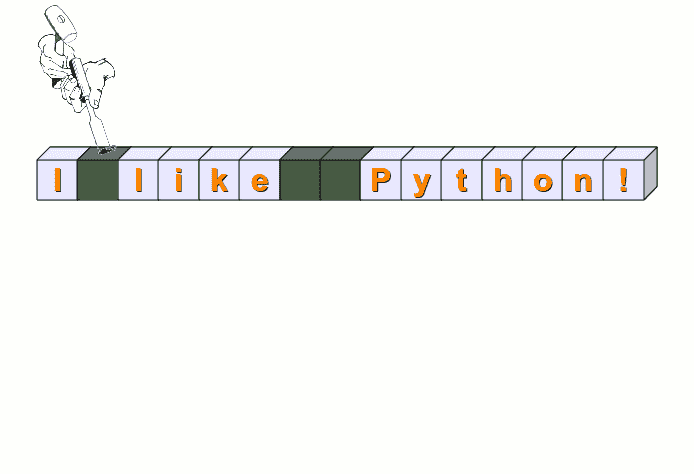

列表是存储多种数据类型的数据的 python 容器。用方括号表示(即[ **值 1** 、**值 2**……等等】)。列表可以存储同类或异类数据类型值。

## 问题 2:如何创建列表？

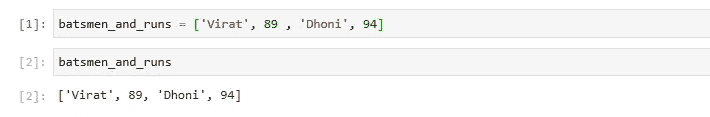

解决方案 2

如上面的输出 y 所示，可以看到一个列表(即 **batsmen_and_runs** )存储了两个字符串(即' **Virat** '和' **Dhoni** ')和两个整数值(即 **89** 和 **94** )。

## 问题-3:如何定义空列表？

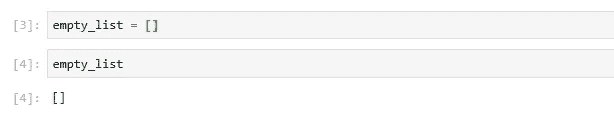

解决方案-3

在上面的例子中，我通过写方括号(即 **[]** )来初始化一个空白或空列表(例如 **empty_list** )。

## 问题 4:如何检查上面创建的 python 对象的类型？

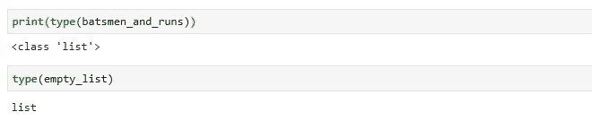

解决方案 4

上面例子中第一个单元的输出告诉我们 **batsmen_and_runs** 是类 **list** 的 python 对象。同样， **empty_list** 也属于同一类。

## 问题-5:如何计算 list 对象的长度？

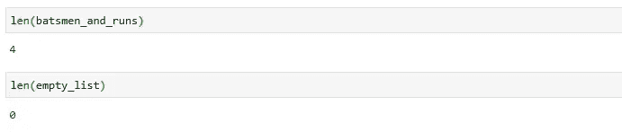

解决方案 5

列表的长度对应于它包含的元素数量。

因此，在上面的例子中， **batsmen_and_runs** 的长度是 4，而 **empty_list** 的长度是 0，因为它不包含任何元素。

## 问题 6:如何打印一个列表的每个元素？

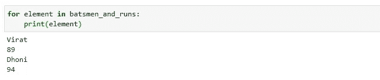

解决方案 6

在这个例子中，我们使用循环的**来迭代列表并打印其元素。**

## 问题 7:如何检查列表中每个元素的数据类型？

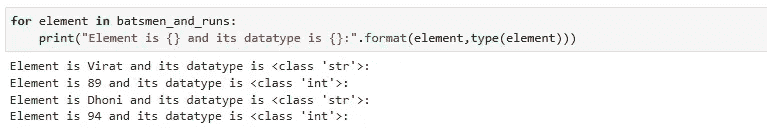

解决方案 7

这里，与前面的问题类似，我们迭代了列表(例如 **batsmen_and_runs** )并使用 **format** 方法接受两个参数:一个是元素，另一个是其类型，并将其传递给 print 语句。

> **格式化**方法:是一种允许多次替换和值**格式化**的格式化方法。
> 
> 因此，在上面的例子中， **print** 语句中的第一个 **{}** 在每次迭代中接受来自**元素**变量的值。
> 
> 同样，**中的第二个 **{}** 打印**语句，接受来自**类型**函数的结果。

# python 列表中的索引

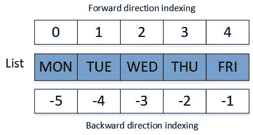

## 问题-8:如何看到一个列表中元素的索引？

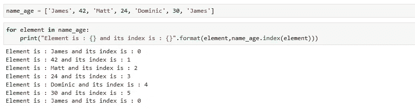

解决方案-8

在上面的例子中，首先，我们创建了一个包含 6 个元素的列表 **name_age** 。然后，我们使用 **index** 方法通过 **format** 方法将每个元素的位置返回给 **print** 语句。

> **Index** 方法:返回列表中元素的第一个索引/位置的方法。如上例所示，**詹姆斯**在**索引 0** ， **42** 在**索引 1** ，**马特**在**索引 2** 等等。

N 注意:如果你看到上面例子的最后一行输出，那么对于 James 来说，索引再次返回为 0，这是因为 **index** 方法返回了一个元素的第一个索引。

## 问题 9:如何访问列表中的任何元素？

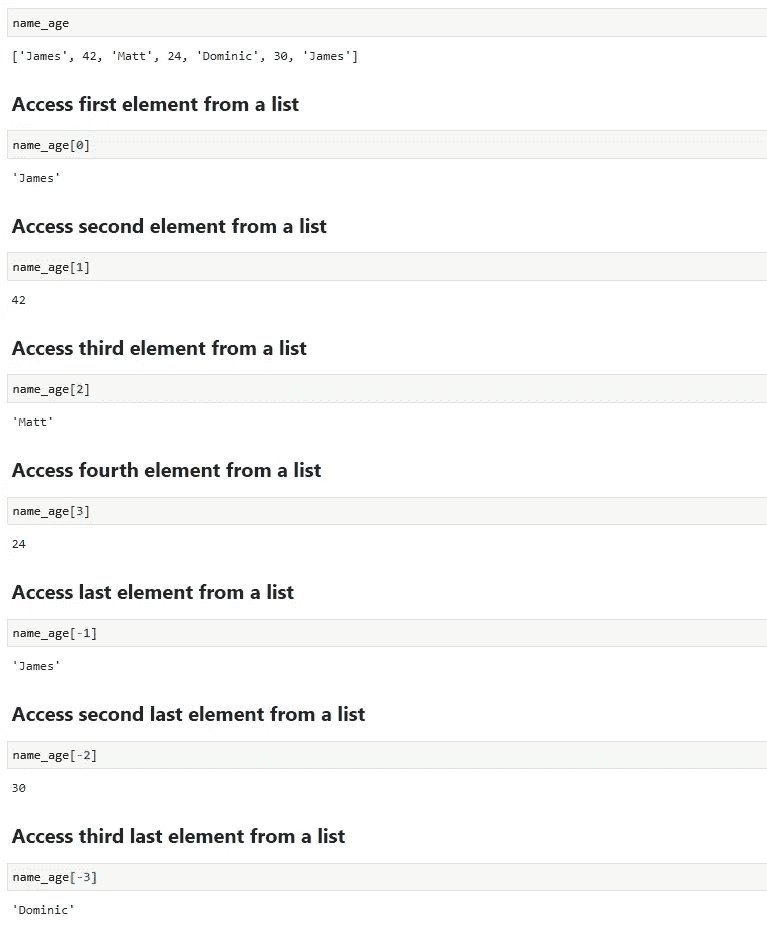

解决方案-9

在上面的例子中，我展示了在特定的索引位置从列表中访问元素的方法。正索引从列表的左侧读取元素，负索引从列表的末尾读取元素。

## 问题-10:如何在列表中追加元素？

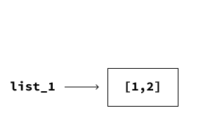

添加到列表中

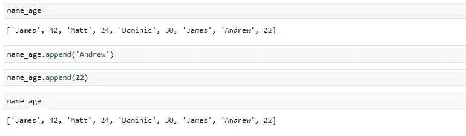

解决方案-10

在上面的例子中，两个新元素(例如 **Andrew** 和 **22** )被添加到一个现有的列表中(例如 **name_age** )。

## 问题-11:如何在列表中追加列表？

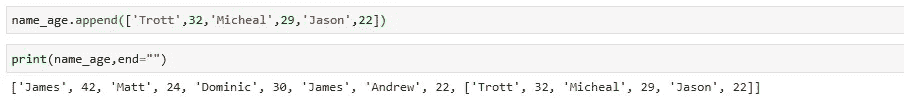

解决方案 11

在上面的例子中，我们在一个现有的列表(即 **name_age** )中追加了一个列表(例如 **['Trott '，32，' Micheal '，29，' Jason '，22]** )。

N 注:在上面例子的打印语句中，使用了一个附加参数(即 **end= ""** )。这个**结尾**表示追加在最后一个值之后的字符串，默认为换行符。所以，我不想在这样提供的每个元素后都有一个换行符。

在上面例子的第二个单元格中，我们看到了一个列表结构中的列表。现在，让我们看看当我们访问 name_age 的最后一个元素时会返回什么。

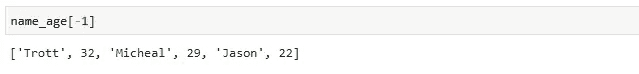

解决方案-11.1

## 问题 12:如何从列表中获取多个元素？

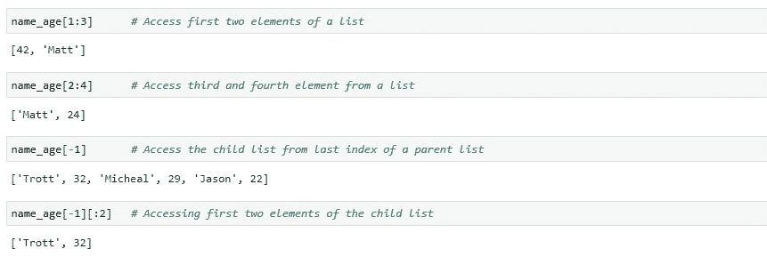

解决方案-12

在上面的例子中，我们通过使用索引位置访问了列表中的多个元素。这里 **[1:3]** 表示我们想要访问从索引 1 到 3 的元素，其中 3 是非包含性的。因此，返回索引位置 1 和 2 的元素。

# 具有重复值的列表

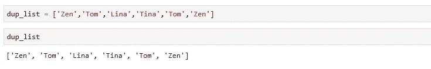

具有重复值的列表

## 问题-13:如何从列表中获取唯一元素？

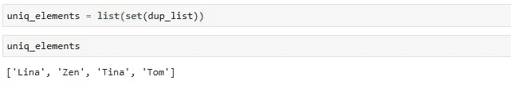

解决方案-13

在上面的例子中，我们通过使用 **set()** 方法从 **dup_list** 中创建了一个包含唯一元素的列表 **uniq_elements** 。

> **Set** ()方法用于将 iterable 对象转换为 distinct 元素。

## 问题 14:如何获取列表中的所有其他元素？

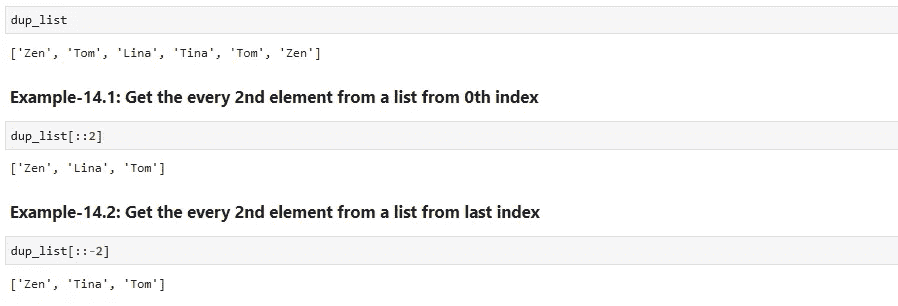

解决方案-14

在这个例子中，我们从列表的开始和结尾获取每第 2 个元素。

## 问题-15:如何在列表中的特定索引处插入元素？

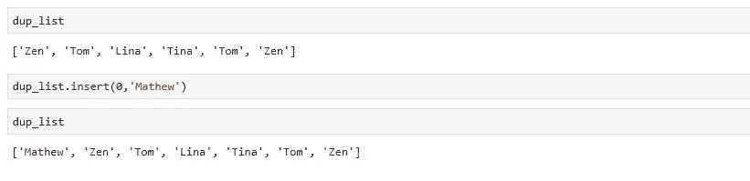

解决方案-15

在本例中，我们在 **dup_list** 的第 0 个位置/索引处插入了一个新元素 **Mathew** 。

## 问题-16:如何反转一个列表的元素？

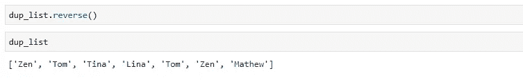

解决方案-16

在上面的例子中，我们颠倒了 dup_list 中的元素。并且， **reverse()** 函数更新列表中的变化。

## 问题 17:如何从列表的特定索引中删除项目？

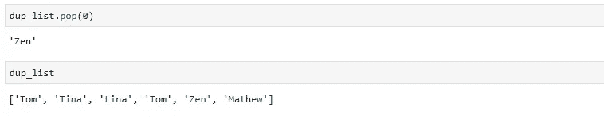

解决方案-17

在上面的例子中，我们使用了 **pop()** 方法从列表中删除一个元素。

> **pop()** 方法移除并返回我们已经移除的元素的索引(默认为 last)。

## 问题-18:如何从一个列表中获得任意元素的计数？

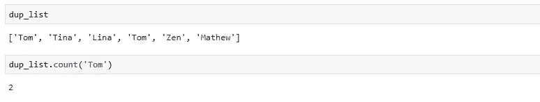

解决方案-18

在上面的例子中，通过使用 **count()** 方法，我们可以从列表中获得一个元素出现的总次数。

## 问题-19:如何将一个列表的元素追加到另一个列表中？

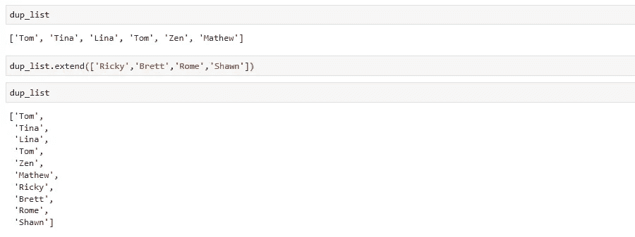

解决方案-19

在上面的例子中，我们通过使用 **extend()** 方法将不同列表的元素(例如 **['Ricky '，' Brett '，' Rome '，' Shawn']** )追加到 **dup_list** 中。

## 问题 20:如何对列表中的元素进行升序排序？

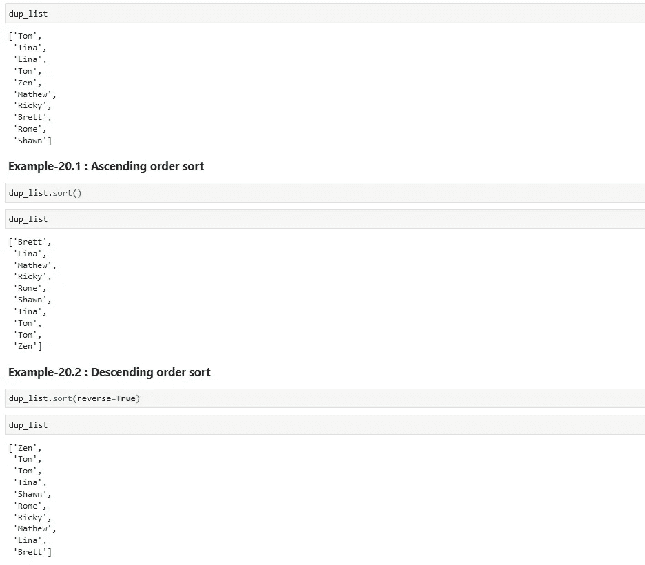

解决方案-20

在上面的例子中，通过使用 **sort()** 方法，我们可以改变列表中元素的顺序，升序或降序。

## 问题 21:如何使用 while 循环访问列表元素？

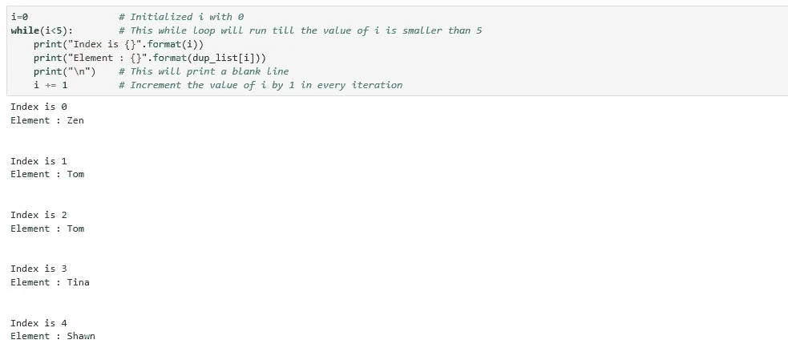

解决方案-21

在上面的例子中，while 循环将从 dup_list 返回前 5 个元素。这是因为我们正在运行循环，直到 **i** 小于**5**(即 **i** 可以是 **0、1、2、3 和 4** )。

恭喜，我们的博客到此结束，总结一下，我们通过解决一些问题，讲述了如何使用 python 列表。

> *如果你想下载这个博客的 Jupyter 笔记本，请访问下面的 GitHub 库:*
> 
> [*https://github.com/Rajesh-ML-Engg/Deep_Dive_in_ML_Python*](https://github.com/Rajesh-ML-Engg/Deep_Dive_in_ML_Python)

**谢谢你，学习愉快！！！！**

*[***Blog-5:Python 中的字典和元组***](/analytics-vidhya/deep-dive-in-machine-learning-with-python-41a36cac3279?source=your_stories_page---------------------------)*