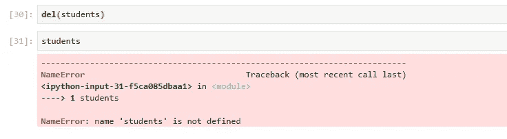

# 使用 Python 深入研究机器学习

> 原文：<https://medium.com/analytics-vidhya/deep-dive-in-machine-learning-with-python-41a36cac3279?source=collection_archive---------12----------------------->

## 第五部分:Python 中的字典和元组

欢迎来到第五篇博客**用 python 深度学习机器**，在上一篇博客中([用 Python 深度学习 ML——第四部分](/analytics-vidhya/deep-dive-in-machine-learning-with-python-2845d61c46fc))我演示了如何毫不费力地使用 Python 列表和与之相关的操作。

在今天的博客中，我们将关注两个非常突出的 python 对象(Tuple & Dictionary ),并尝试学习如何有效地使用它们。

# 元组

*   元组是一系列不可变的 Python 对象
*   元组类似于列表
*   元组和列表的区别在于，元组不能像列表那样改变，元组使用括号，而列表使用方括号

## 问题-1:如何定义一个元组？

解决方案-1

在上面的例子中，我们通过提供括号中的值序列创建了两个元组**学生**和**学生标记**。

## 问题-2:如何创建空元组？

解决方案 2

在这个例子中，我们通过只写括号(即 **()** )创建了一个空元组(例如 **tup1** )。

## 问题-3:如何验证上面创建的元组的类型？

解决方案-3

在上面的例子中，通过使用**类型**函数，您可以找出**学生的班级**。

## 问题-4:如何在一个元组中进行切片和索引？

解决方案 4

这里，类似于列表，我们可以通过在方括号中提供索引位置来访问元组的元素。

## 问题-5:如何更新一个元组？

> 元组是不可变的，这意味着我们不能更新或改变元组元素的值。然而，我们可以利用现有元组的一部分来创建新的元组。

解决方案 5

在上面的例子中，首先，我们创建了一个名为 **accessories** 的元组。然后，我们创建了一个名为 **sub_acc** 的新元组，它保存了从第 4 个位置开始的**配件**的元素和两个新元素(即'**袜子**和'**吊带**')。

## 问题-6:如何从元组中获取元素的计数？

解决方案 6

在上述示例的第一个单元格中，创建了一个新的**附件**副本，它包括**附件**的现有元素和 5 个新元素(即**‘帽子’，‘口袋方巾’，‘帽子’，‘腰带’，**)。然后，在第三个单元格中，通过使用 **count()** 方法，我们找出**带**出现的总次数。

## 问题-7:如何从元组中删除元素？

假设我们想从**附件**中删除第 3 和第 4 个索引元素。

解决方案 7

在上面的例子中，在第一个单元格中，我们试图从**附件**中删除一个元素，但是我们得到一个错误，即**‘元组’对象不支持项目删除**。这是因为 tuple 是一个不可变的 python 对象。

因此，我们可以遵循第二个单元中使用的方法来消除元组的第四个元素。

## 问题-8:如何检索任意元组元素的索引？

解决方案-8

在上面的例子中，我们从 **new_accessories** 中获得了元素“ **caps** 的索引值。同样，从**附件**中检索到的元素**帽子**的索引值。

## 问题-9:如何删除一个元组？

解决方案-9

在上面的例子中，通过使用 **del** 函数，我们删除了元组 **students** 。

# 元组操作

通过下面的例子，你将能够理解一些与元组相关的操作。

实施例 1

实施例 2

实施例 3 和 4

# 词典

*   它是一个 python 对象，以键和值对的形式存储数据
*   每个键用冒号(:)和它的值分开，项目用逗号分开，并且都用花括号括起来

> 字典的键是唯一的，而值可能不是。字典的值可以是任何类型，但是，键必须是不可变的数据类型，如字符串、数字或元组

## 问题-1:如何定义字典？

实施例 1

在这个例子中，我们创建了一个 python 字典 **score_card** ，它包含两个关键字' **student_name** '、 **marks** 以及它们的列表值。

## 问题 2:如何访问字典的键？

实施例 2

这里，在上面的例子中，通过使用 **keys()** 方法我们可以获得字典的键。

## 问题 3:如何访问字典中的条目？

实施例 3

在这个例子中，我们使用了 **values()** 方法从 **score_card** 字典中检索值。

## 问题 4:如何在一个列表中检索一个字典的所有键和值？

实施例 4

这里，在上面的例子中，通过使用 **items()** 方法，我们以列表的形式列出了 **score_card** 字典的所有**键**和**值**。

## 问题 5:如何更新字典中某个键的值？

实施例 5

在这个例子中，我们使用 **update()** 方法来更新 **score_card** 字典的键“**标记**的值。

## 问题 6:如何从字典中访问键值？

我们可以通过以下方式访问键值:

解决方案-6.1

在这个例子中，类似于列表，我们通过将字典键写在方括号中来访问它，它显示与之相关的值。

解决方案-6.2

在这个例子中，我们使用了 **get()** 方法来获取与一个键相关的值。

> 如果你给 **get()** 方法传递了一个字典中不存在的键，那么它将返回 **None** 。参考上例的第三个单元格。

## 问题-7:如何求字典的长度？

解决方案 7

在上面的例子中，通过使用 **len()** 函数我们找出了字典 **score_card** 的长度。

> 字典的长度相当于每个键-值对的总数。

## 问题 8:字典中一个关键字可以有多个条目吗？

解决方案-8

如上例所示，如果我们在一个字典中多次提供键，那么这个键将只保存最后提供的值。

## 问题-9:如何清除字典？

解决方案-9

在上面的例子中，我们通过使用 **clear()** 方法删除了字典 **new_dict** 的所有键和值。

## 问题-10:如何删除词典？

解决方案-10

在上面的例子中，通过使用 **del** 函数，我们删除了字典 **new_dict** 。

恭喜你，我们的博客到此结束，总结一下，我们讨论了如何有效地使用 python 元组和字典。

> *如果你想下载这个博客的 Jupyter 笔记本，请访问下面的 GitHub 库:*
> 
> [https://github.com/Rajesh-ML-Engg/Deep_Dive_in_ML_PythonT21](https://github.com/Rajesh-ML-Engg/Deep_Dive_in_ML_Python)

谢谢你，祝你学习愉快！！！！

***Blog-6:***[***列出 Python 中的理解和函数***](/analytics-vidhya/deep-dive-in-machine-learning-with-python-1e315c426571?source=your_stories_page---------------------------)