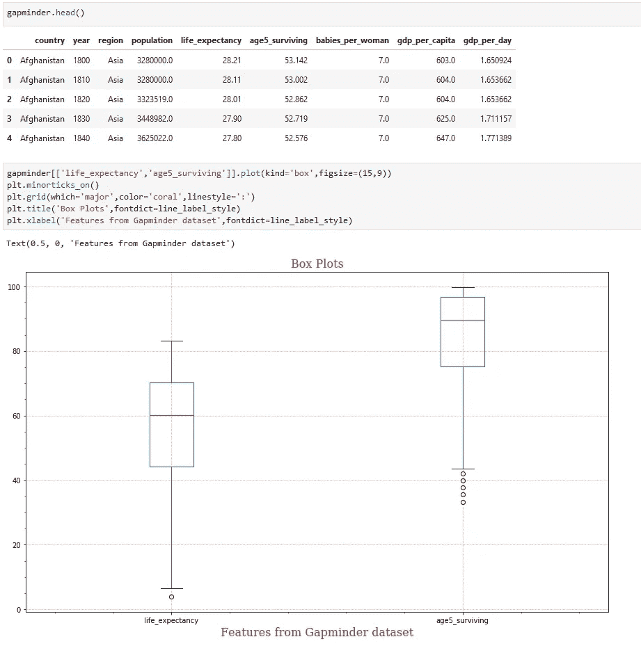

# 使用 Python 深入研究机器学习

> 原文：<https://medium.com/analytics-vidhya/deep-dive-in-machine-learning-with-python-4a29f4dde483?source=collection_archive---------25----------------------->

## 第十部分:使用 Pandas 和 Matplotlib 实现数据可视化

欢迎来到另一个深入研究 Python 机器学习的博客，在上一个 [**博客**](/@Rajesh_ML_Engg/deep-dive-in-machine-learning-with-python-f75730311afa) 中，我们使用**心脏病数据集**处理了高级熊猫函数。在今天的博客中，我们将重点关注使用 Pandas 和数据可视化库( **Matplotlib** )来可视化数据。

对于这个博客，我们将使用流行的 **Gapminder 数据集**并创建各种交互式和非交互式图表。

# 导入必要的 python 库

必需的库

# 导入数据集

我们将从一个 CSV 文件(即 *gapminder.csv* )导入数据集，并创建一个熊猫数据框架。

从 CSV 文件读取的数据

# 问题 1:如何绘制显示一些国家总人口的条形图？

## 案例 1:手动分配颜色

**数据框架** - **国家 _ 流行**

因此，我们创建了一个新的数据框架 **COUNTRY_POP** ，其中包含了每个国家的总人口**T21。**

根据国家手动分配颜色

在上面的步骤中，我们在 **COUNTRY_POP** 数据框架中创建了一个新的列 **COLORS** ，其中颜色被映射到一些国家。

**COUNTRY_POP** 新增栏目

**水平条形图**

## 案例 2:使用彩色地图

分配颜色所需的随机值数组

在这一步中，我们创建了一个 **Numpy** 数组，其中有 182 个不同的值，与数据集中国家的数量相同。

**色彩映射表对象**

在这一步，我们使用 **CM** 函数创建了 Colormap 对象(即 ***颜色*** )，并提供了类型“**绿色**”。

## 案例 2.1:水平条形图

**水平条形图**

## 案例 2.2:垂直条形图

**垂直条形图**

在上面的例子中，我们生成了垂直图，并提供了参数值' **bar** ，而不是' **barh** '。

## 其他参数:

> **plt.minorticks_on** :该参数将启用 x 轴上的刻度& y 轴
> 
> **plt.grid** :该参数将使用提到的颜色和线条样式绘制图形的方形网格线
> 
> **plt.xlabel** :为 x 轴提供标签
> 
> **plt.ylabel** :为 y 轴提供标签

# 问题 2:如何绘制散点图，显示各地区的婴儿总数与国内生产总值之比？

**各地区婴儿总数和国内生产总值总额**

**散点图**

在这里，在上面的例子中，我们创建了**散点图**，显示了各大洲的**婴儿总数**与**总 GDP** 的对比。

# 问题 3:如何绘制交互式散点图来显示从 1950 年到 2015 年婴儿总数与人均 GDP 的关系？

**全年婴儿总数和各地区 GDP 总量**

在步骤 1 中，我们创建了一个新的数据框架 **babies_in_region** ，其中包含每年和每个地区的婴儿总数和 GDP 总数。

**婴儿 _ 地区:婴儿总数和地区 GDP 总量**

**创建互动情节的功能**

**带年份滑块的散点图(视频上传至 GitHub)**

# 问题 4:如何通过线形图显示人口的增长？

解决方案-4.1

在这一步中，我们创建了**人口**数据框架，其中包含全年的总人口。

**线图**

# 问题 5:如何使用箱线图查看数据集中的异常值？

**箱形图**

> 在描述统计学中，箱线图是一种通过四分位数图形化描述数字数据组的方法。箱形图也可能有从箱形图(须状图)垂直延伸的线，表示上下四分位数之外的可变性，因此称为箱形图和箱形须状图。异常值可以绘制为单个点。

# 问题 6:如何使用饼状图绘制各大洲的人口比例？

解决方案-6.1

**饼图**

# 问题 7:如何使用饼状图绘制各大洲平均每位妇女生育的婴儿比例？

解决方案-7.1

**饼图**

在上面的两个例子中，我们创建了代表**人口**和**婴儿/妇女**在各地区所占比例的**饼状图**。

恭喜你，我们的博客到此结束。总之，我们使用 Pandas 和 Matplotlib 创建了各种图表。在下一篇博客中，我们将讨论直方图、配对图、密度图等。

> **如果你想下载这个博客的 Jupyter 笔记本，请访问下面的 GitHub 库:**
> 
> [**https://github.com/Rajesh-ML-Engg/Deep_Dive_in_ML_Python**](https://github.com/Rajesh-ML-Engg/Deep_Dive_in_ML_Python)

谢谢你，祝你学习愉快！！！

***Blog-11:***[***数据可视化— II***](/@Rajesh_ML_Engg/deep-dive-in-machine-learning-with-python-a5c1d0c8ed8a)