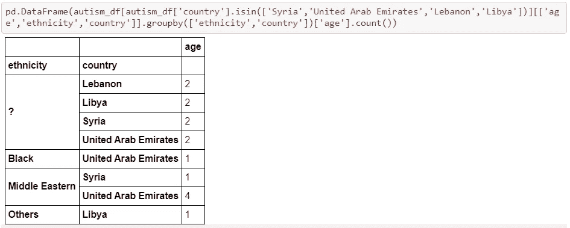
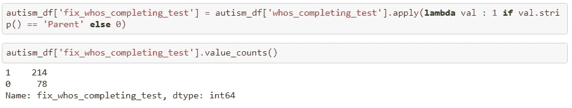
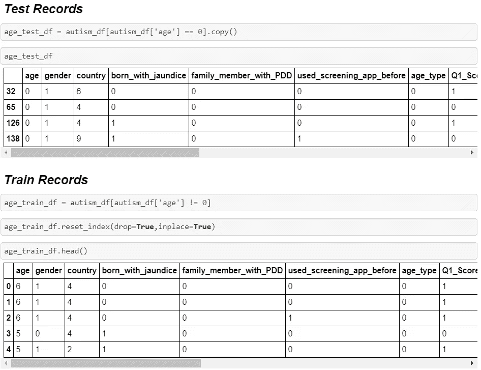

# 使用 Python 深入研究机器学习

> 原文：<https://medium.com/analytics-vidhya/deep-dive-in-machine-learning-with-python-4d4d8ab37f07?source=collection_archive---------12----------------------->

## 第十五部分:初始数据分析(二)

欢迎来到另一个关于用 Python 深入研究机器学习的博客。在之前的 [**博客**](/analytics-vidhya/deep-dive-in-machine-learning-with-python-ea09959c6e71) 中，我们使用了**自闭症谱系障碍**(儿童)数据集来了解如何有效地执行初始数据分析的前两个阶段。

在今天的博客中，我们将继续 IDA 的进一步阶段，并填充'**种族**'和'**WHOS _ 完成 _ 测试**'中缺失的**值。此外，构建我们的第一个机器学习回归模型，以预测'**年龄**'中的缺失值。**

礼貌:[期限](https://tenor.com/view/lets-go-lets-get-going-hurry-hurry-up-excited-gif-15088892)

# 第一手清洁数据框

**前一篇博客中获得的第一手清洁数据帧**

# 步骤 3:填充缺失值

**“种族”和“WHOS _ 完成 _ 测试”包含缺失值**

## 步骤 3.1:修复“种族”中缺失的值

**缺少种族的国家**

## 国家/地区为“约旦”的种族计数分布

**约旦的民族**

## 国家/地区为“埃及”的种族计数分布

埃及的少数民族

## 国家为“卡塔尔”、“沙特阿拉伯”、“俄罗斯”和“巴基斯坦”时，种族计数分布

**卡塔尔、沙特阿拉伯、俄罗斯和巴基斯坦的种族**

## 国家为'叙利亚'，'阿拉伯联合酋长国'，'黎巴嫩'和'利比亚'时，种族计数分布

**“叙利亚”、“阿拉伯联合酋长国”、“黎巴嫩”和“利比亚”的种族**

## 国家为“中国”、“科威特”、“伊拉克”、“拉脱维亚”、“奥地利”和“马来西亚”时，种族计数分布

**“中国”、“科威特”、“伊拉克”、“拉脱维亚”、“奥地利”和“马来西亚”的种族**

在这里，我们探究了来自上述国家的哪些种族的人参与了这个数据集。现在，通过观察这一趋势，我们将用占主导地位的种族来取代缺失的价值。

**没有缺失值的新种族列**

**比较:有无缺失值**

## 步骤 3.2:修复“Whos_completing_test”中缺失的值

**统计‘Whos _ completing _ test’中的分布**

在这个特性中，我们在'**父类**'和其他类别之间有一个最重要的区别。因此，将“Parent”标记为 1，将其他类别标记为 0。

**‘母’标为 1，其他类别标为 0**

# 步骤 4:删除不需要的列

在这一步中，我们将从数据帧中删除缺少值的列，我们已经通过创建没有任何缺少值的新列修复了这些列。

**删除“种族”和“谁在完成测试”**

# 步骤 5:将分类数据转换成数字形式

在这一步中，我们将把“种族”和“国家”中的定性数据转换成数值。

## 步骤 5.1:数字形式的种族栏

在这里，你也可以使用 **LabelEncoder** 来执行标记，但是，我在字典中定义了映射，以一种容易理解的方式来解释事情。

## 步骤 5.2:数字形式的国家/地区列

**“国家”中的计数分布**

如在“国家”列中，我们在类别计数中存在差异，因此，将计数≤ 7 的所有国家归为一类，并标记为 9。

## 第 5.3 步:数字形式的年龄 DESC 列

AGE_DESC 中所有标记为 0 的行。

# 步骤 6:预测年龄变量中缺失值的 ML 模型

**我们将“年龄”中缺失值标记为 0 的记录**

这里，我们将数据帧分为两部分:

1.  年龄为 0 的测试记录
2.  年龄不为 0 的训练记录

首先，我们检查了母公司、培训和测试记录数据框架中的尺寸。然后，我们实例化 RandomForestRegressor，并在使用 train_test_split 创建的火车记录数据帧的子集( ***)上对其进行训练。***

这里，模型预测了子集记录的年龄。然后，我们在包含年龄为 0 的记录的测试数据帧上运行它。

并且，我们得到了可以替换' **AGE** 中缺失数据的值。

恭喜你，我们的博客到此结束。总而言之，我们涵盖了**初始数据分析(IDA)** 的剩余阶段。

请关注即将发布的帖子，我们将使用示例数据集围绕**探索性数据分析**建立理解。

> **如果你想下载这个博客的 Jupyter 笔记本，请访问下面的 GitHub 库:**
> 
> [https://github.com/Rajesh-ML-Engg/Autism_Spectrum_DisorderT21](https://github.com/Rajesh-ML-Engg/Autism_Spectrum_Disorder)

***谢谢大家，学习愉快！！***