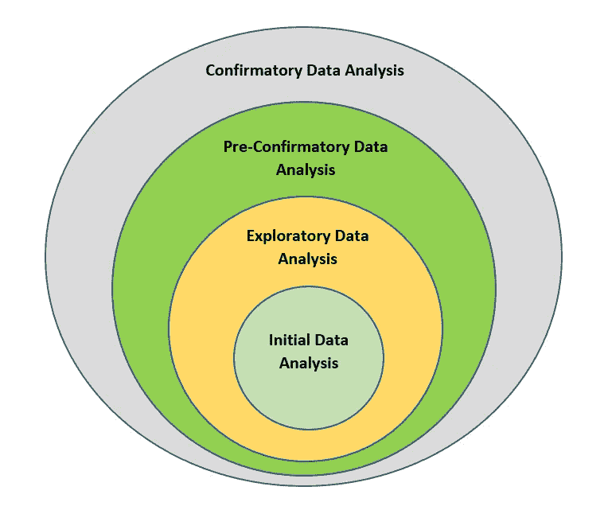

# 使用 Python 深入研究机器学习

> 原文：<https://medium.com/analytics-vidhya/deep-dive-in-machine-learning-with-python-64bcbe0b1b40?source=collection_archive---------9----------------------->

## 第十三部分:与数据对话

图片提供:[数据精灵](https://www.datapine.com/blog/talking-with-a-data-genie/)

欢迎来到另一个深入研究 python 机器学习的博客，到目前为止，我们已经广泛学习了 Python 编程、数据争论和数据可视化的概念。在上一篇 [**博客**](/analytics-vidhya/deep-dive-in-machine-learning-with-python-19a67423218c) 中，我们了解了热图和结对图。

在今天的博客中，我们将深入探讨各种层次的数据分析。并且，学习如何使原始数据能够发现隐藏的模式。

作为一名数据科学家或 ML 工程师，你的主要任务是以多种可能的方式倾听数据，以展现一个可信的数据故事。

# 数据分析的层次

ML 问题的每个阶段都需要进行不同类型的数据分析。

图像创建者:[拉杰什](https://github.com/Rajesh-ML-Engg/Deep_Dive_in_ML_Python/tree/master/Blog-13)

如上图所示，我们有 4 个级别的数据分析，每个级别在 ML 任务中都有其重要性。

# 初始数据分析

IDA 是我们在处理数据科学问题时执行的第一项活动，它解决了以下问题:

1.  检测重复记录
2.  检测是否有任何功能需要字符编码
3.  检测要素中的数据类型不兼容
4.  检测空值或缺失值
5.  检测可编码为 0 或 1 的分类变量
6.  用不同的测量单位检测定量特征
7.  检测特征中是否存在双峰或偏斜分布
8.  检测数据中的异常值

# 探索性数据分析

在执行 IDA 之后，我们在数据集中进行调查，目的是发现模式，这被称为探索性数据分析。

1.  它解决了一个广泛的问题“这里发生了什么？”。
2.  它需要你像侦探一样去理解数据。
3.  主要致力于从数据中学习。
4.  它使用可视化方法回答有关数据的问题。
5.  在 EDA 中，我们考虑许多假设，寻找模式，并根据数据提出假设。

# 预先确认数据分析(PCDA)

1.  在前期 CDA 中，我们使用评估方法对所有可信模型进行初步评估。
2.  在这一步中，我们根据对不同数据进行交叉验证的结果，找出最佳模型。

# 验证性数据分析

1.  在验证性数据分析中，我们使用概率技术(如置信区间或显著性检验)来测试特定的假设。
2.  CDA 是通过质疑他们对数据的假设来评估证据的过程。这就像在审判中检查证据和询问证人，试图确定被告是否有罪。

> EDA 的目标是控诉；CDA 的目标是信念。(作者:**伯伦斯&史密斯**)

恭喜你，我们的博客到此结束。总之，我们讨论了不同层次的数据分析。在下一篇博客中，我将展示现实生活数据集上每个层次的数据分析。

***谢谢，学习愉快！！***

***Blog-14:***[***初始数据分析(IDA)举例***](/analytics-vidhya/deep-dive-in-machine-learning-with-python-ea09959c6e71)