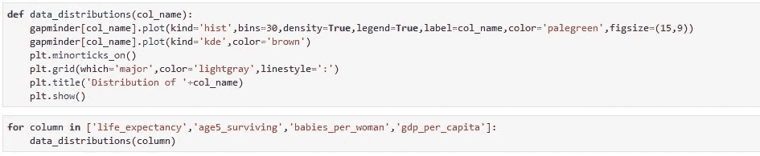

# 使用 Python 深入研究机器学习

> 原文：<https://medium.com/analytics-vidhya/deep-dive-in-machine-learning-with-python-a5c1d0c8ed8a?source=collection_archive---------24----------------------->

## 第二部分— XI:数据可视化— II

图片[链接](https://docs.bokeh.org/en/latest/docs/gallery.html)

欢迎来到另一个用 Python 深入研究机器学习的博客，在上一个 [**博客**](/analytics-vidhya/deep-dive-in-machine-learning-with-python-4a29f4dde483) 中，我们通过绘制几个图表，如条形图、散点图、折线图等，对 **Gapminder 数据集**有了更好的理解。在今天的博客中，我们将使用 Pandas 和数据可视化库来可视化数据分布。

在今天的博客中，我们也将继续使用 **Gapminder 数据集**。而且，与之前的博客类似，我们也将关注于那些可以让你的情节更吸引人的选项。

链接: [Giphy](https://giphy.com/gifs/lego-fight-dc-13RH0eYA9vEAso)

## 导入必要的 python 库

必需的库

## 导入数据集

我们将从一个 CSV 文件(即 *gapminder.csv* )导入数据集，并创建一个熊猫数据框架。

从 CSV 文件读取的数据

# 问题 1:什么是直方图？

这是一个给出数据的潜在频率分布的图。直方图允许我们检查基本分布(如正态或钟形分布)、异常值、偏斜度等。

它在以下方面不同于条形图:

1.  条形图涉及两个变量，而直方图只涉及一个变量
2.  要构建直方图，第一步是“收集”数值范围(即，将整个数值范围分成一系列区间)，然后计算每个区间内有多少个数值。

如果箱的大小相等，则构建一个高度与频率(即每个箱中的案例数)成比例的矩形。

# 问题 2:如何可视化‘寿命 _ 预期’的分布？

数据帧的前 5 条记录

解决方案 2

在上面的单元格中，我们创建了一个“**步骤**”直方图的“**寿命 _ 预期值**”。如果你仔细观察图表，你会发现**主网格**线。

所以，在这个图表中，我们发现在 gapminder 数据集中，71 岁是一个人预期的平均寿命。

> 您可以使用不同的**线条样式**，如“-”、“—”、“-”, ":".并且，我定义了一个字典( **bar_font** )，其中包含了我想在标签中使用的字体的定制细节。

# 问题-3:如何可视化‘age 5 _ surviving’的区块类型分布？

数据帧的前 5 条记录

解决方案-3

在上面的结果中，创建了“ **age5_surviving** ”的左向或负向倾斜直方图。

# 问题 4:有哪些不同类型的数据分布？

直方图分布

## **偏态分布**

向右偏斜的分布**被称为正偏斜**。这种分布在低值单元格(左侧)中大量出现，在高值单元格(右侧)中很少出现。****

**向左倾斜的分布**被称为负倾斜**。这种分布在高值单元格(右侧)中大量出现，在低值单元格(左侧)中很少出现。**

## **双峰分布**

**有两个峰值的直方图称为“**双峰**或“**双峰**”。它包含数据中最常出现的两个值或数据区域。这种直方图反映了数据中存在两种不同的过程。**

## **截断分布**

**当我们处理不完整的报告数据或提供的数据超出规格范围时，会出现“**截断的**”**直方图。****

## ****平稳分布****

****“**平台**”直方图是多条钟形曲线的组合，是双峰分布的极端版本。****

# ****问题 5:什么是密度图？****

****密度图是根据数据创建的直方图的平滑和连续版本。估计直方图密度曲线的常用方法是*核密度估计*。****

*****核密度估计* (KDE)是一种算法，它采用高斯混合，并使用由每个点的一个高斯分量*组成的混合，从而产生一个基本上非参数的密度估计值。*****

****Python 中有几个版本的内核密度估计可用( *SciPy 和 StatsModels 包*)，我更喜欢使用 Scikit-Learn 的(`sklearn.neighbors.KernelDensity`)版本，因为它更高效(*使用基于树的算法*)。并且，使用六个内核之一和一个距离度量来处理多维 KDE。****

# ****问题 6:如何创建‘寿命 _ 预期’的密度图？****

********

****在这里，我们创建了“**预期寿命**”的密度图和阶梯式直方图。****

> ****种类= '密度'与 KDE 相同****

# ****问题 7:如何通过用户自定义函数创建多列的 KDE 曲线和阶梯式直方图？****

********

****函数定义和调用****

********

******预期寿命******

********

******5 岁 _ 幸存******

********

******每个女人生的孩子******

********

******人均 Gdp******

********

****恭喜你，我们的博客到此结束。总之，我们讨论了不同的数据分布、直方图和密度图。在下一篇博客中，我们将讨论结对图和热图，然后我们将开始探索 EDA 的深度。****

> ******如果你想下载这个博客的 Jupyter 笔记本，请访问下面的 GitHub 库:******
> 
> ****[T3【https://github.com/Rajesh-ML-Engg/Deep_Dive_in_ML_Python】T5](https://github.com/Rajesh-ML-Engg/Deep_Dive_in_ML_Python)****

****谢谢你，祝你学习愉快！！！****

*******Blog-12:***[***数据可视化— III***](/@Rajesh_ML_Engg/deep-dive-in-machine-learning-with-python-19a67423218c)****