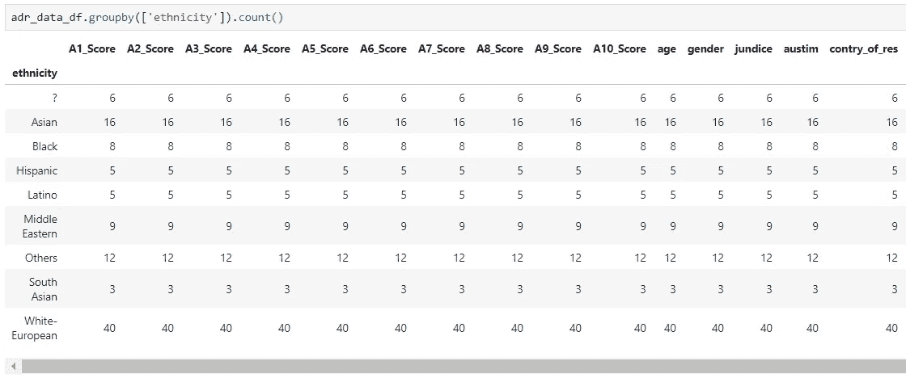
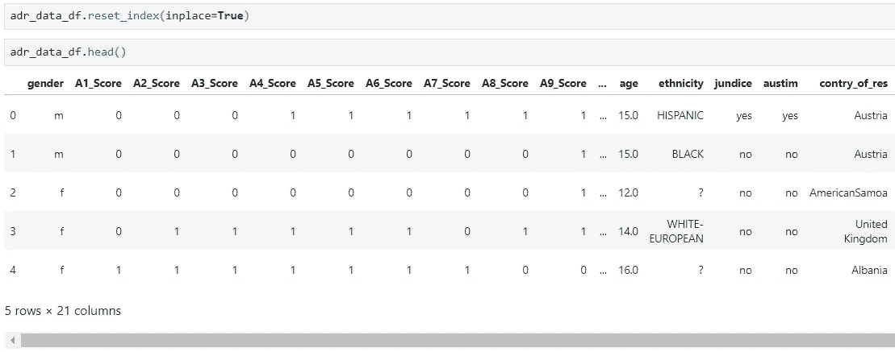

# 使用 Python 深入研究机器学习

> 原文：<https://medium.com/analytics-vidhya/deep-dive-in-machine-learning-with-python-b724b8d355a0?source=collection_archive---------4----------------------->

## 第八部分:几个熊猫行动

来自 pydata.org 的熊猫标志

欢迎来到关于使用 Python 进行机器学习的第八篇博客，在上一篇[博客](/analytics-vidhya/deep-dive-in-machine-learning-with-python-f45414f32ca2)中，我们介绍了如何开始使用‘T6’gapminder 数据集与**熊猫**合作。在今天的博客中，我们将关注如何在数据集上执行各种 Pandas 操作。

由于我对医学数据有着浓厚的兴趣，所以在这篇博客中，我们将使用**自闭症谱系障碍青少年数据**，这些数据可以在 **UCI 机器学习资料库**中找到。您可以从提供的[链接](https://archive.ics.uci.edu/ml/datasets/Autistic+Spectrum+Disorder+Screening+Data+for+Adolescent+++)下载这些数据(它将作为***Arff****文件*)。

在这篇博客的最后，我还将分享一个额外的技巧。

# 什么是 ARFF 档案？

ARFF 代表一种属性关系文件格式。它是一个 ASCII 文本文件，包含共享一组属性的数据实例。ARFF 文件是由怀卡托大学计算机科学系开发的，与机器学习软件一起使用。

如果你想了解更多关于 ARFF 文件的信息，请访问此链接。

# 什么是自闭症谱系障碍？

自闭症谱系障碍(ASD)是一种影响交流和行为的发育障碍。它被称为“发育障碍”,因为它的症状通常出现在出生后的头两年，然而，它可以在任何年龄被诊断出来。

如果你想了解更多关于 ASD 的知识，那么我推荐你查看 NIH(国家精神卫生研究所)的这个[链接](https://www.nimh.nih.gov/health/publications/autism-spectrum-disorder/index.shtml)，在这里你会找到关于 ASD 的体征、症状、原因、风险、治疗和临床试验的细节。

# 数据集描述

如果您在记事本编辑器中打开下载的 ARFF 文件，您会发现三个块/标签:

*   关系
*   属性
*   数据

参考下图:

ARFF 文件在记事本编辑器中打开

ARFF 文件主要包含两个部分:

*   页眉
*   数据

**关系**和**属性**标签共同构成了表头部分。并且，**数据**部分包含实际数据声明行。

# 数据集的特征

请参考下图了解数据集功能描述:

从 [UCI](https://archive.ics.uci.edu/ml/datasets/Autistic+Spectrum+Disorder+Screening+Data+for+Adolescent+++) 下载的 doc 文件中的特性描述

你也可以浏览这个和 ARFF 文件一起下载的描述文件。

# 问题 1:如何导入/加载 ARFF 文件？

解决方案-1.1

在上面的单元格中，我们导入了 ARFF 文件并显示了它的数据。

解决方案-1.1

我们已经将文件加载到数据类型为“**元组**”的“ **adr_data** ”对象中。

# 问题 2:如何从上面的 ADR_DATA 对象创建 Pandas DataFrame？

解决方案-2.1

如果仔细观察上面的输出，您会发现字符“b”与非数字列的数据值(如年龄和结果)相关联。这是 python 显示字节值或数组的方式，它表示您正在处理 ASCII 字符。

> 字符“b”仅用于表示，它不是数据的一部分。

解决方案-2.2

所以，这里你得到了没有额外字符的数据集(*参考额外提示了解更多细节*)。

# 问题 3:如何检查列的数据类型？

## 案例一

解决方案-3.1

这里，在上面的例子中，我们得到的输出是“O ”,它指的是 Pandas 中的“Object”dtype，意思是字符串格式。

## 案例二

解决方案-3.2

在上面的例子中，我们得到的输出是“float64 ”,这是 pandas 的数据类型，表示浮点格式。

# 问题 4:如何在熊猫数据帧上应用 where 条件？

解决方案 4

## 案例一

解决方案-4.1

在上面的示例中，我们应用了条件来获得其中'**关系**是'**父级**'的记录。

## 案例二

解决方案-4.2

在上面的例子中，我们应用了由 AND(&)分隔的两个条件来过滤记录。

## 案例三

解决方案-4.3

在上面的例子中，我们应用了由 OR(|)分隔的两个条件来过滤记录。

## 案例四

解决方案-4.4

在上面的示例中，我们通过使用~(波浪号)对筛选记录应用了否定条件。

## 案例五

解决方案-4.5

在上面的例子中，我们通过使用值列表来应用条件来过滤记录。

# 问题 5:如何根据列对熊猫数据帧进行排序？

## 案例一

解决方案-5.1

在上面的例子中，我们使用列'**性别**'对数据帧进行排序。

## 案例二

解决方案-5.2

在本例中，我们根据两列'**种族**和'**性别**'对数据帧进行了排序。

# 问题 6:如何对熊猫数据帧进行分组？

## 案例一

解决方案-6.1

在上面的示例中，我们对' **adr_data_df** '进行分组，以找到对'**性别**'和'**关系**'列的'**种族**类别的计数。

## 案例二

解决方案-6.2

在上面的例子中，我们对' **adr_data_df** '进行分组，以找到所有列的'**种族**'的计数类别。

## 案例三

解决方案-6.3

使用 series 函数( **value_counts()** )计算列的类别的另一种方法。

# 问题 7:如何更改现有 DataFrame 列的数据类型？

在更改数据类型之前

**将浮点列转换为整数**

更改'**结果**列的数据类型后

# 问题-8:如何将 STR 列值转换为大写？

解决方案-8

在本例中，我们将“**种族**”列值更改为大写的**。**

# **问题 9:如何通过对现有列应用操作来在数据帧中添加新列？**

****

**解决方案-9**

**在上面的示例中，我们添加了一个新列' **caps_autism** '，其中包含来自列' **austim** '的值。**

# **问题 10:如何从数据帧中删除列？**

## **案例一**

****

**解决方案-10.1**

**在上面的例子中，我们已经删除了新添加的列' **caps_autism** '，但是，这种删除并没有发生在 DataFrame 上。**

****

**解决方案-10.2**

**正如你在上面的单元格中看到的，'**caps _ autism【T21]'仍然在数据帧中。现在，要从数据帧中删除该列，您需要使用' **inplace** '参数，该参数对数据帧执行' **drop** '操作。****

****

**解决方案-10.3**

**给你，现在列' **caps_autism** '已经从数据框中删除了。你可能想知道' **axis=1** '的作用是什么，所以这个参数告诉我们' **caps_autism** '存在于 DataFrame 的水平线中(参考下图)。**

****

**解决方案-10.4**

# **问题 11:如何设置数据帧的新索引？**

****

**解决方案 11**

**因此，我们在数据帧中添加了新的索引，即“**性别**”。**

# **问题 12:如何从数据帧中删除重复项？**

****

**解决方案-12**

**这里，我们从' **adr_data_df** '中删除了单个重复记录。**

# **问题 13:如何重置数据帧的索引？**

****

**解决方案-13**

**在上面的示例中，我们重置了 DataFrame 的索引，并且' **gender** '列再次作为非索引列添加到 DataFrame 中。如果您不想将该列添加到数据帧中，则在 **reset_index** 中提供“ **drop=True** ”参数。**

# **问题-14:如何对数据帧的数据进行排序？**

## **案例一**

****

**解决方案-14.1**

**在上面的示例中，我们基于列'**种族**对数据帧进行了排序，并使用'**方法= min** 。Min 指的是记录的最低等级，所以它将等级 1 赋予带有种族'**'的前 6 条记录？**'然后，它将种族为'**亚洲人**'的数据列为第 7 位。**

## **案例二**

****

**解决方案-14.2**

**在上面的示例中，我们基于列'**种族**'对数据帧进行排序，并使用'**方法=密集**'。 **Dense** 指的是' **min** '，但是组与组之间的等级总是增加 1，所以它把等级 1 给了前 6 个有种族的记录'**？**'然后，它将第二个等级给予具有种族'**亚洲人**'的数据。**

## **问题-15:如何填充数据帧中缺失的值？**

## **第一种情况:IsNull()**

****

**解决方案-15.1**

## **案例二:ISNA()**

****

**解决方案-15.2**

**因此，在这个数据集中没有 **NULL** 或 **NA** 记录，但是有一些记录带有“**？**’。**

****

**解决方案-15.3**

**在“种族”一栏中，我们有 6 个带“？”的记录。**那么，我们怎样才能填充这样的值呢？****

****

**解决方案-15.4**

**恭喜你，我们的博客到此结束。总之，我们介绍了在数据集上执行的各种 Pandas 操作。**

****

# **额外小费**

# **1.熊猫的数据编码**

****

**额外提示-1**

**因此，通过在数据帧上应用用户定义的函数，我们改变了数据编码。**

**不要担心我们在**‘apply _ decode’**函数中使用的**‘apply’**和**‘lambda’**，因为在接下来的博客中我们将关注这些主题。**

**谢谢你，祝你学习愉快！！！**

> **如果你想下载这个博客的 Jupyter 笔记本，请访问下面的 GitHub 库:**
> 
> **[https://github.com/Rajesh-ML-Engg/Deep_Dive_in_ML_Python](https://github.com/Rajesh-ML-Engg/Deep_Dive_in_ML_Python)**

*****博客-9:*** [***高级熊猫作战***](/analytics-vidhya/deep-dive-in-machine-learning-with-python-f75730311afa?source=your_stories_page---------------------------)**