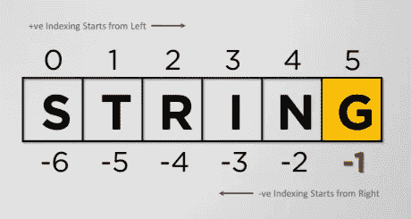
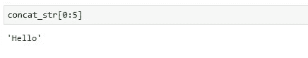

# 使用 Python 深入研究机器学习

> 原文：<https://medium.com/analytics-vidhya/deep-dive-in-machine-learning-with-python-bce7acfdab5f?source=collection_archive---------16----------------------->

## 第三部分:Python 基础知识

欢迎来到第三篇**用 Python 深度学习机器的博客**，我相信你现在对 Jupyter 笔记本和它的控制台已经很熟悉了。如果你需要复习 Jupyter notebook，那么请浏览我以前的博客([用 Python 深入研究 ML——第二部分](/analytics-vidhya/deep-dive-in-machine-learning-with-python-part-ii-getting-familiar-with-jupyter-notebook-b3f0bffbb73b))，在那里我演示了如何有效地使用它进行编码。

在 ML 的这个博客系列中，主要关注的是 python 的实际实现。因此，在今天的博客中，我们将运行一些有趣的 python 代码，并通过做几个问题来尝试理解它的对象。

## 问题-1:如何创建一个带有某个值的 python 对象(变量)？

解决方案-1

在上面例子的第一行，我们创建了一个 python 变量 **player** ，并给它赋值 **Sachin Tendulkar** 。在下一行中，我们只打印了**玩家**变量。

## 问题-2:如何识别一个变量的类别或类？

解决方案 2

这里，我们使用**类型**函数来标识**播放器**变量的**类**。所以， **str** 意味着**玩家**是一个字符串变量。

## 问题-3:如何求一个变量的总长度？

解决方案-3

通过使用 **len** *(又名 length)* 函数的能力，我们能够计算变量**玩家的长度(*又名总字符数*)。**

## 问题-4.1:如何串联 2 个字符串变量？

解决方案-4.1.1

在上面的例子中，我们创建了两个字符串对象 **str1** 和 **str2** 。在这里， **str1** 包含'**你好詹姆斯，你好吗？**和 **str2** 持有**我很好。你呢？**'我们使用 **+** 操作符连接这两个对象，并将结果存储到一个新的字符串对象 **concat_str 中。**

然后，在下一个单元格中，我们只打印 **concat_str** 。

> 串联字符串对象时，运算符 **+** 不添加空格。

(看下面的例子)

解决方案:4.1.2

在这里，在输出中，我们没有在第一个问号(*即在我是*之前)之后得到空格。

## 问题-4.2:确定 concat_str 变量的类型

解决方案:4.2

与问题 2 类似，在这里，我们也使用了**类型**函数来标识 **concat_str** 、**的类，但是，包含在 **print** 语句中，该语句提供的输出为**<class‘str’>**(*表示****concat _ str****属于* ***字符串*****

# python 中的索引

## 问题 5:如何通过索引访问字符串变量的字符？

解决方案 5

在上面的例子中，我们用值 **Python** 创建了一个字符串变量 **name** 。 **name** 变量的长度为 **6** ，这意味着其索引位于 0 到 5 之间(第 0 个位置索引存储第一个字符 **P** ，第 1 个位置索引存储第二个字符 **y** 以此类推)。

## 问题-6:如何创建一个从 0 到变量长度的数列？

解决方案 6

在上述示例的第一个单元格中，我们使用了 **range** 函数来定义一个范围的起点和终点。然后，在第二个单元格中，我们运行一个 for 循环来打印这个范围内的数字。

## 问题 7:如何获取 python 字符串的元素或字符及其索引？

解决方案 7

这是一个简单的问题，类似于前面的问题，但是，这里我们也使用了 **print** 语句来显示特定索引位置的变量元素。

## 问题 8:如何获取一个字符串的前 5 个字符？

解决方案-8.1

对于上面的例子，已经使用了 **concat_str** 变量，并且【T42【0:5】表示显示索引 0、1、2、3 和 4 的元素。因此， **Hello** 作为输出出现(*参考解决方案:4.1.2 如果你想知道 concat_str 包含什么*)

> 当我们访问像**【0:5】，**这样的字符串的索引时， **:** 之后的数字不包括在索引范围内。

参考下面的另一个例子:

解决方案-8.1.2

这里， **new_val** 包含一个字符串，在第二个单元格中，该字符串的前 10 个元素已经被获取。

**new_val** 中的索引分配

作为输出，我们得到了**这是 ne** ，因为只有前 10 个索引元素(*表示从 0 到 9* )被访问。

## 问题-9:如何获取一个字符串的后 4 个字符？

解决方案-9

在步骤 1 中，我们以相反的顺序打印 **concat_str** 的字符串(*的意思是从末尾*)。然后，在第 2 步中，我们只根据索引提取了前 4 个元素，在最后一步中，我们再次颠倒了前 4 个提取元素的顺序。

## 问题-10:如何从字符串中找到单词的索引？

解决方案-10

在上面的例子中， **find** 方法返回单词“ **how** 在 **concat_str** 中的索引位置。

## 问题-11:如何替换字符串中的单词？

解决方案 11

在这里，我们使用了 **replace** 方法将 **concat_str** 中的 **James** 替换为 **JOJO** 。

## 问题-12:如何将字符串转换成大写形式？

解决方案-12

这是一个相当简单的例子，这里， **str** 函数用于定义一个字符串，而不是给任何变量赋值。并且，**capital()**方法用于返回相同字符串的大写版本。

## 问题-13:如何获取适合无案例比较的字符串？

解决方案-13

在这个例子中，使用单引号和双引号( *aka ' '或" "*)来定义字符串。并且， **casefold()** 方法返回一个适合无案例比较的字符串。

## 问题-14:如何统计特定单词在字符串中出现的次数？

解决方案-14

在上面的例子中， **count** 方法已经被用来找出**出现的总次数？**中的**concat _ str**。

## 问题-15:如何将一个字符串转换为居中的字符串？

解决方案-15

这里， **25** 代表新字符串的期望宽度，其中 **David JOJO** 位于字符串的中心。

## 问题-16:如何以大写形式打印一个字符串的每个字符？

解决方案-16

在上面的例子中，循环的**将迭代**玩家**字符串的每个字符。并且， **Upper()** 方法会将每个字符转换成大写。**

**"+"** 用于为每个字符添加一个额外的**换行符(" \n")** 。

## 问题-17:如何验证字符串是否为数字类型？

解决方案-17

在本例中， **False** 意味着“**数字 123** ”不是数字类型。也参考下面几个例子:

解决方案-17.1

## 问题 18:如何在运行时获取用户输入？

**Step-1** :使用 **input()** 函数在运行时接受用户输入(参见下图):

解决方案-18.1

**步骤 2** :用户在文本框中输入内容(参见下图):

解决方案-18.2

**步骤 2** :一旦用户完成输入，输出就会显示出来(参见下图):

解决方案-18.3

好啊，我们到这个博客的结尾了，总结一下，我们通过解决一些问题介绍了如何使用 python 字符串。

> 如果你想下载这个博客的 Jupyter 笔记本，请访问下面的 GitHub 库:
> 
> 【https://github.com/Rajesh-ML-Engg/Deep_Dive_in_ML_Python 

在下一篇博客中，我们将继续使用列表等其他对象，敬请关注…..

谢谢你，祝你学习愉快！！！！

[***blog 4:Python 列表指南***](/analytics-vidhya/deep-dive-in-machine-learning-with-python-2845d61c46fc?source=your_stories_page---------------------------)