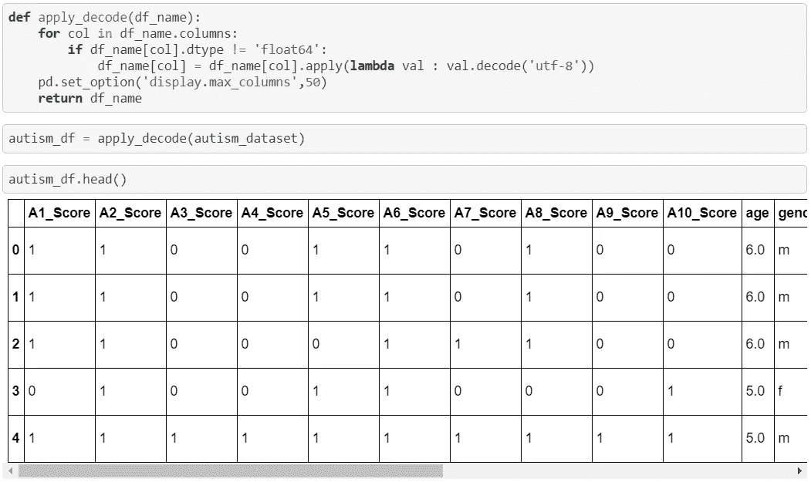

# 使用 Python 深入研究机器学习

> 原文：<https://medium.com/analytics-vidhya/deep-dive-in-machine-learning-with-python-ea09959c6e71?source=collection_archive---------14----------------------->

## 第十四部分:初始数据分析(IDA)及实例

图片[链接](https://www.finereport.com/en/data-analysis/comparison-of-data-analysis-tools-excel-r-python-and-bi.html)

欢迎来到另一个深入研究 Python 机器学习的博客，在上一个 [**博客**](/analytics-vidhya/deep-dive-in-machine-learning-with-python-64bcbe0b1b40) 中，我们将触及不同层次数据分析的基础。

在今天的博客中，我们将通过使用**自闭症谱系障碍**(儿童)数据集来深入研究初始数据分析(IDA)的核心概念。感谢数据集创建者和 [**UCI ML 知识库**](https://archive.ics.uci.edu/ml/datasets/Autistic+Spectrum+Disorder+Screening+Data+for+Children++) 提供此数据集。

## 导入所需的 python 库

**Python 包**

## 加载 ARFF(属性关系文件格式)数据集文件

**加载的 ASD 数据集**

# 步骤 1:更改字符编码

如果你参考上面的图像(即 ***加载 ASD 数据集*** )，那么你会发现**‘b’**与每个数据值相关联。这意味着数据是以字节为单位的，因此我们需要改变字符编码。

**字符编码**

## 浏览数据集

在这里，我们了解了数据集中要素的数量，并显示了前 5 条记录。

# 步骤 2:数据类型处理

**特征数据类型**

## 步骤 2.1:“年龄”转换为 dtype“INT”

因此，在将' **AGE** '变量的数据类型从 FLOAT 转换为 INT 之前，我们需要填充它的空值。因此，用 0 替换空值，然后处理这 4 条记录。

**填充‘年龄’中的空值**

**年龄数据类型转换为整数**

## 步骤 2.2:将“性别”标记为 dtype“INT”(1 表示 m(即男性)，0 表示 f(即女性))

**男性和女性的数量**

**性别编码为 0 和 1**

## 步骤 2.3:将“先天性黄疸”标记为 dtype“INT”(1 对应于“是”，0 对应于“否”)

**贴标签前**

**贴标签后**

## 步骤 2.4:将“FAMILY_MEMBER_WITH_PDD”标记为 dtype“INT”(1 对应于“yes”，0 对应于“no”)

**贴标签前**

**贴标签后**

## 步骤 2.5:将“USED_SCREENING_APP_BEFORE”标记为 dtype“INT”(1 表示“是”，0 表示“否”)

**贴标签前**

**贴标签后**

## 步骤 2.6:将“筛选问题”变量的数据类型转换为“INT”

## 步骤 2.7:将“SCREENING_SCORE”标记为 dtype“INT”

**数据类型转换前**

**数据类型转换后**

## 步骤 2.8:将“ASD_Label”标记为 dtype“INT”(1 对应于“yes”，0 对应于“no”)

**贴标签前**

**贴标签后**

## 步骤 2.9:标准化“WHOS _ 完成 _ 测试”的数据

**标准化前**

**标准化后**

# 第一手清洁数据框

礼貌 **WWE** 和**新的一天**

恭喜你，我们的博客到此结束。总而言之，我们涵盖了**初始数据分析(IDA)** 的前两个阶段。

请关注我们即将发布的帖子，我们将努力填补'**种族**和'**WHOS _ 完成 _ 测试**'中缺失的值。并且，建立我们的第一个机器学习回归模型来预测' **AGE** '中的缺失值。

> 如果你想下载这个博客的 Jupyter 笔记本，请访问下面的 GitHub 库:
> 
> [**https://github.com/Rajesh-ML-Engg/Autism_Spectrum_Disorder**](https://github.com/Rajesh-ML-Engg/Autism_Spectrum_Disorder)

***谢谢大家，学习愉快！！***

***博客-15:*** [***初始数据分析-二***](/@Rajesh_ML_Engg/deep-dive-in-machine-learning-with-python-4d4d8ab37f07)