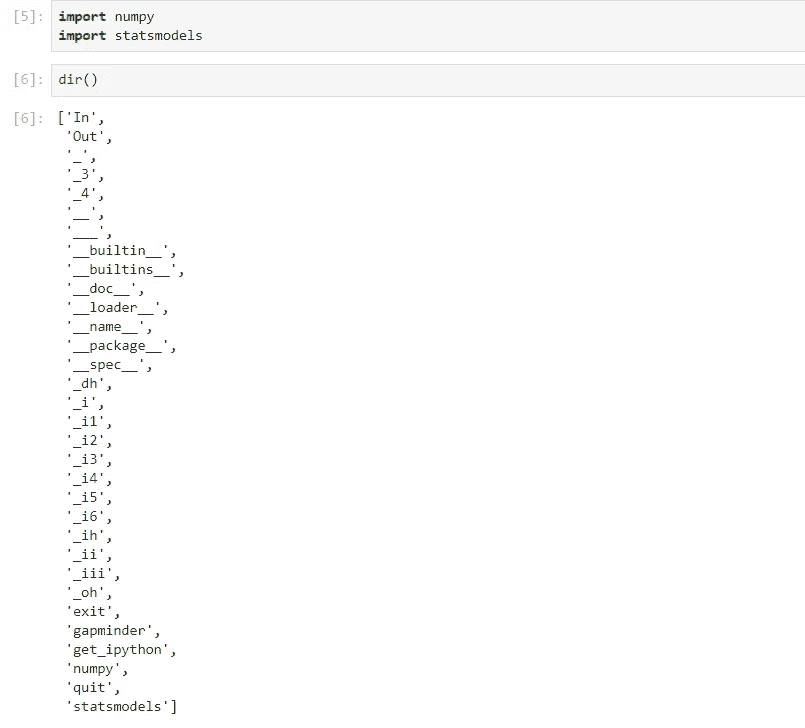
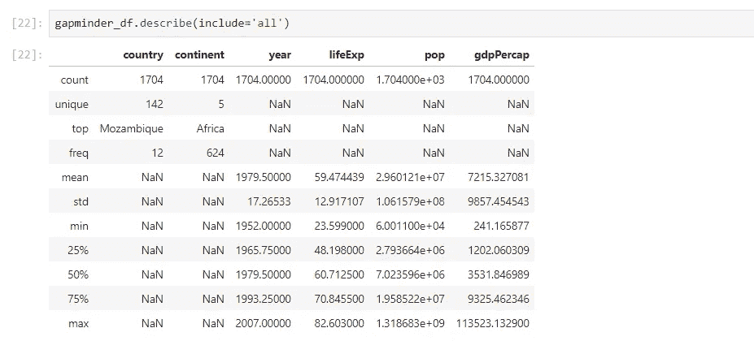

# 使用 Python 深入研究机器学习

> 原文：<https://medium.com/analytics-vidhya/deep-dive-in-machine-learning-with-python-f45414f32ca2?source=collection_archive---------20----------------------->

## 第七部分:关于熊猫的一切

图片来自世界野生动物基金会

欢迎来到**的第七个博客，深入学习 python 的机器学习**，到目前为止，我们已经讲述了 Python 的基础知识。如果你想重温以前的话题，请访问下面的博客:

**Python 和 ML 基础** : [用 Python 深入研究 ML—第一部分](/analytics-vidhya/deep-dive-in-machine-learning-with-python-part-i-introduction-and-fundamentals-52f21c05f2a7)

**Jupyter Notebook** : [用 Python 深入研究 ML—第二部分](/analytics-vidhya/deep-dive-in-machine-learning-with-python-part-ii-getting-familiar-with-jupyter-notebook-b3f0bffbb73b?source=---------8------------------)

**字符串** : [用 Python 深度挖掘 ML—第三部分](/analytics-vidhya/deep-dive-in-machine-learning-with-python-bce7acfdab5f?source=---------7------------------)

**列出了** : [用 Python 深入研究 ML—第四部分](/analytics-vidhya/deep-dive-in-machine-learning-with-python-2845d61c46fc?source=---------6------------------)

**元组&字典** : [用 Python 深度挖掘 ML—第五部分](/analytics-vidhya/deep-dive-in-machine-learning-with-python-41a36cac3279)

**函数&列表理解** : [用 Python 深入研究 ML—第六部分](/analytics-vidhya/deep-dive-in-machine-learning-with-python-1e315c426571?source=---------4------------------)

今天，我们将使用使用最广泛的数据科学库，即 Pandas，它是为执行数据清理、数据争论(包括数据管理和转换)、数据分析和类似活动而构建的。

在这篇博客中，我将使用流行的 [Gapminder](https://www.gapminder.org/data/) 数据集。您可以从提供的链接下载它，或者使用 pip( **例如 python -m pip 安装 gapminder** )安装 Gapminder 包。因为，我已经在我的系统上安装了这个包，所以，在这个博客中使用相同的包。然而，在以后的博客中，我们将探索熊猫从文件中读取数据的功能。

在这篇博客的最后，我还会分享一些与熊猫有关的小贴士。

# 导入 gapminder 包

导入包并阅读它的帮助

# 问题-1:如何查看‘gapminder’包的属性？

使用 **dir()** 方法，一个内置函数，返回任何对象的属性和方法列表(例如，pandas 数据帧、模块、函数、字符串、列表、字典等)。

解决方案-1

# 问题 2:在没有任何参数的情况下执行“dir”会发生什么？

它返回添加到本地名称空间的模块名，包括所有现有的和以前的模块名

## 案例一

解决方案-2.1

## 案例二:导入更多模块

解决方案-2.2

这样， **dir()** 返回的对象中也增加了“ **numpy** ”和“ **statsmodels** ”。

P **和 as** 主要包括两个数据存储组件:

> **DataFrame** :行列形状的数据容器，可能包含也可能不包含标题。
> 
> **系列**:指数据帧的单列。

# 问题 3:用 gapminder 数据创建一个熊猫数据框架

解决方案-3

因此，在上面的例子中，我们已经创建了 Pandas 数据帧，即' **gapminder_df** '，上面的行和列结构就是数据帧表示。因此，该数据帧包含 1704 行和 6 列(命名为'**国家**'、**洲**'、**年**'、**生活支出**'、**流行**'、 **gdpPercap** ')。

> **注**:从 0 到 1703 的最左边的连续数字序列是数据帧的索引。

# 问题-4:如何查看 gapminder 数据集的列/特征/变量？

解决方案 4

通过使用数据帧的'**列**属性，即' **gapminder_df** ，我们可以查看其列名。

# 问题 5:如何查看数据集的前 5 条记录？

解决方案 5

通过使用 head()函数，我们可以查看数据帧的前 5 条记录。

# 问题-6:如何通过 HEAD 命令查看前 n 条记录？

解决方案 6

这里，在 head()函数中，您可以指定想要从 dataframe 中检索的记录数，比如说 20 条。

# 问题 7:如何查看一个数据帧的最后 5 条记录？

解决方案 7

通过使用 tail()函数，我们可以查看数据帧的最后 5 条记录。

# 问题 8:如何通过 TAIL 命令查看一个数据帧的最后 n 条记录？

解决方案-8

这里，在 tail()函数中，您可以指定想要从 dataframe 中检索的记录数，比如 15 条。

# 问题 9:如何找到数据帧的摘要？

解决方案-9

因此，通过使用 info()函数，我们知道在 **gapminder_df** 的六个变量中，四个是**定量**和两个是**定性**。

*   **定量:**数值型变量。它们代表一个可测量的量。例如，城市中的人口数量是一个可测量的实体。因此，人口被认为是一个数量变量。
*   **定性:**接受名称或标签等值的变量。球的颜色(例如，红色、绿色、蓝色)或世界上的国家将是定性或分类变量的主要例子。

# 问题-10:如何找到 DataFrame 特征的基本统计量？

解决方案-10

在上面的例子中，虽然在 **gapminder_df** 中有六个特征，但是在执行 describe()方法后，**国家**和**洲**特征的统计没有显示出来。

**这是因为默认情况下 describe()方法考虑了这些统计数据的定量变量。**

# 问题-11:如何在 describe()方法中包含定性变量，以找到它们的基本统计量？

解决方案 11

因此，在上面的示例中，我们可以看到专门为定性变量添加了 3 个新的统计参数(**‘unique’，【top’**和**‘freq’**)。

# 问题 12:如何重命名数据帧中的一列？

解决方案-12.1

解决方案-12.2

# 问题 13:如何在现有数据框架中添加新列？

解决方案-13.1

让我们在上面的数据帧中添加一列'**行星**'，即' **gapminder_df** '，值为'**地球**'。

解决方案-13.2

通过这种方式，我们可以向 DataFrame 添加一个新列。

# 索引和切片

它表示以下任一种情况:

*   选择所有行和一些列
*   选择一些行和所有列
*   选择一些行和一些列

**索引也指从数据帧中选择子集。**

# 问题 14:如何选择数据帧的第一列？

解决方案-14.1

由于我们选择的是一个单列，因此其类型返回为**系列**。

解决方案-14.2

我们再次选择了单列，因此其类型返回为**系列**。

# 问题 15:如何从一个数据帧中选择所有行的前 3 列？

解决方案-15.1

由于我们选择了多个列，因此其类型返回为 **DataFrame** 。

解决方案-15.2.1

## iloc 代表什么？

每个人对 iloc 都有自己的理解。有人称之为'**整数位置**'，也有人称之为'**索引位置**'，然而我更愿意称之为'**索引整数位置**'。

解决方案-15.2.2

## loc 代表什么？

对于这一个，它非常简单的锁定意味着“**基于标签的索引**”。这意味着您需要指定它的列名/标签，而不是索引。当你的数据帧的索引被命名时，这就变得非常容易了。

> 而使用 iloc 和 loc 时，方括号内逗号(即'，')前的数值指向行索引，其后的数值对应列索引。

# 问题-16:如何为最后 3 列选择从第 20 到第 30 个索引位置的记录？

解决方案-16.1

如果您仔细查看上面的单元格结果，您会发现从第 20 到第 29 个索引位置的记录。而且，如果你记得列表索引，那么对你来说可能很容易，因为熊猫也遵循同样的概念。

解决方案-16.2

这次记录只显示了 2 列(即不包括“Planet”列)，这是因为 PANDAS 也遵循相同的列概念。

解决方案-16.3

看到上面的结果后，您可能会挠头，因为这一次使用 loc，即使在为行提供范围 20:30 后，我们也获得了与使用 iloc 提供范围 20:31 相同的结果。

因此，为了消除混淆，这是 b/w iloc 和 loc 的基本区别。

**loc** 返回数据包含索引边界值，然而 **iloc** 不考虑结束边界值。

恭喜你，我们的博客到此结束。在接下来的博客中，我们将探索类似 SQL 的功能和 Pandas 的高级功能。

我在博客开始时承诺，我会分享一些与熊猫有关的额外建议。所以你开始吧:

# 额外提示

## 1.未来预警--。ix 已被否决

额外提示-1

请务必仔细阅读此类警告，因为它会提醒您哪些功能可能在未来的版本中不存在。

## 2.单列或多列选择

每当从数据帧中选择单个或多个列时，建议使用方括号符号。因为以下原因:

1.  提供良好的代码可读性
2.  为将来可能处理您的代码的开发人员提供良好的理解

## 3.深层拷贝和浅层拷贝

假设您从父对象创建了一个子对象，然后在:

*   **浅拷贝**:子对象将始终引用父对象，子对象中的任何变化将自动反映到父对象中
*   然而，在**深度复制**中:子对象将是其父对象的副本，没有任何引用，因此两者都有各自的个性，子对象的任何变化都不会反映在父对象中

在 Pandas 中，我们通常遵循浅层复制，这意味着我们只是创建一个新的变量来引用前任/前一个对象。

> 如果你想下载这个博客的 Jupyter 笔记本，请访问下面的 GitHub 库:
> 
> [https://github.com/Rajesh-ML-Engg/Deep_Dive_in_ML_Python](https://github.com/Rajesh-ML-Engg/Deep_Dive_in_ML_Python)

## 谢谢你，祝你学习愉快！！！

***博客-8:*** [***几只熊猫行动***](/analytics-vidhya/deep-dive-in-machine-learning-with-python-b724b8d355a0?source=your_stories_page---------------------------)