# 使用 Python 深入研究机器学习

> 原文：<https://medium.com/analytics-vidhya/deep-dive-in-machine-learning-with-python-f75730311afa?source=collection_archive---------28----------------------->

## 第九部分:先进的熊猫行动


感谢功夫熊猫:)

欢迎来到 Python 机器学习深度探索的第九篇博客，在上一篇[博客](/analytics-vidhya/deep-dive-in-machine-learning-with-python-b724b8d355a0)中，我们介绍了如何使用**自闭症谱系障碍数据集**执行几个熊猫手术。在今天的博客中，我们将了解如何使用各种先进的熊猫功能。

在今天的博客中，我将继续我对医学数据的兴趣，并使用流行的 [**心脏病数据集**](https://archive.ics.uci.edu/ml/datasets/Heart+Disease) ，该数据集可在 [**UCI 机器学习资源库**](https://archive.ics.uci.edu/ml/machine-learning-databases/heart-disease/) 上获得，并由以下机构捐赠:

```
**1.** Hungarian Institute of Cardiology. Budapest: Andras Janosi, M.D.**2.** University Hospital, Zurich, Switzerland: William Steinbrunn, M.D.**3.** University Hospital, Basel, Switzerland: Matthias Pfisterer, M.D.**4.** V.A. Medical Center, Long Beach and Cleveland Clinic Foundation: Robert Detrano, M.D., Ph.D.
```

与我以前的博客类似，我也将在这篇博客的结尾分享一个**奖励**提示。

那么，我们开始吧。

# 下载数据集

我们将使用**克利夫兰**数据集，因此从 UCI ML 资源库链接下载文件**processed . Cleveland . data**。文件 **heart-disease.names** 中也提供了数据集特征的简要信息。

# 导入数据集

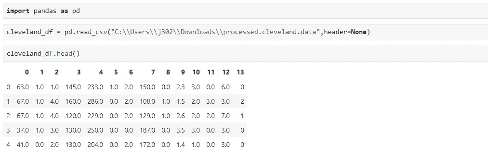

在 Pandas 数据框架中导入数据文件

在这里，我们将数据集导入为 Pandas DataFrame。接下来，将列名添加到数据帧中。

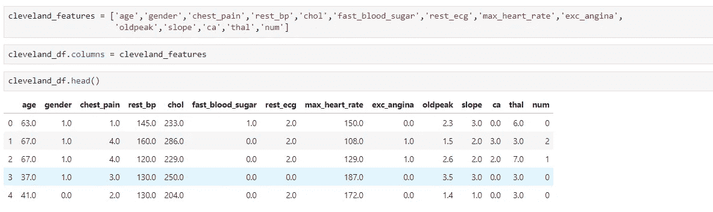

向数据帧添加列名

# 问题-1:如何使用' for '循环和' iterrows()'方法打印 dataframe 行？

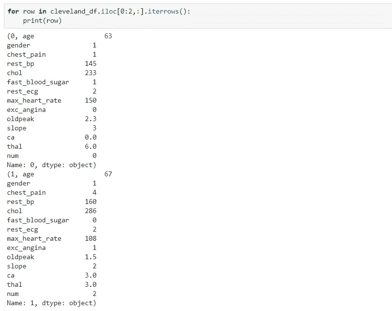

解决方案-1

在上面的例子中，我们以“元组”的形式获得了数据帧的前两行。

# 问题 2:如何以“？”的形式查看缺少值的行在任何一列里？

## 案例一

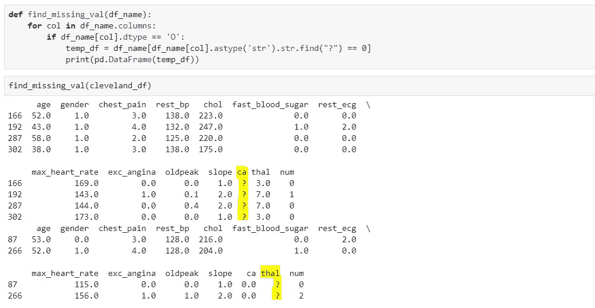

解决方案-2.1

在上面的例子中，我们能够发现' **CA** 和' **THAL** '这两列有缺失值。

## 案例二

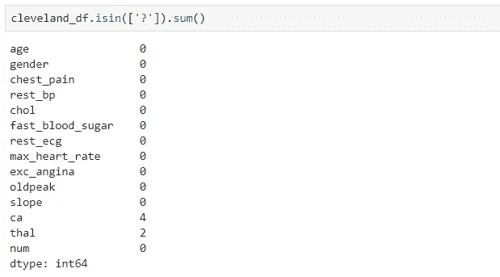

解决方案-2.2

这是查找值为'**'的列的更简单的方法？**’。

## 案例三

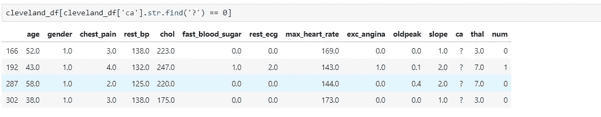

解决方案-2.3

在上面的例子中，我们得到了在' **CA** '特性中缺少值的记录。

## 案例四

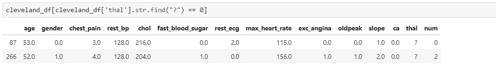

解决方案-2.4

在上面的例子中，我们得到了在' **THAL** '特征中缺少值的记录。

# 问题 3:如何替换丢失的值？数据框里什么都没有？

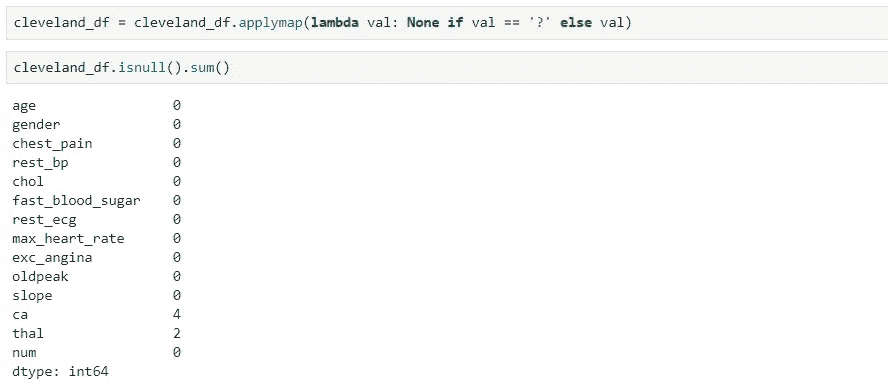

解决方案-3

所以，在上面的例子中，我们替换了**'？'**与**【CA】****【THAL】**栏中的**无**。

> **DataFrame.applymap()** 方法对 DataFrame 的每个元素应用一个函数，并对每个元素返回一个值。

# 问题 4:如何在 Pandas 数据帧中执行 SQL UNION 操作？

## 案例 1:在行级别执行 UNION

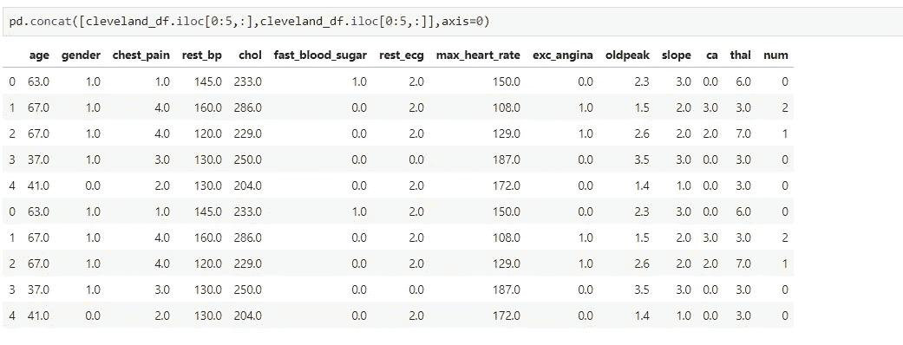

解决方案-4.1

在上面的例子中，我们将 **cleveland_df** 的前 5 条记录作为两个独立的数据帧合并成一个输出数据帧。

## 案例二:在列级执行 UNION

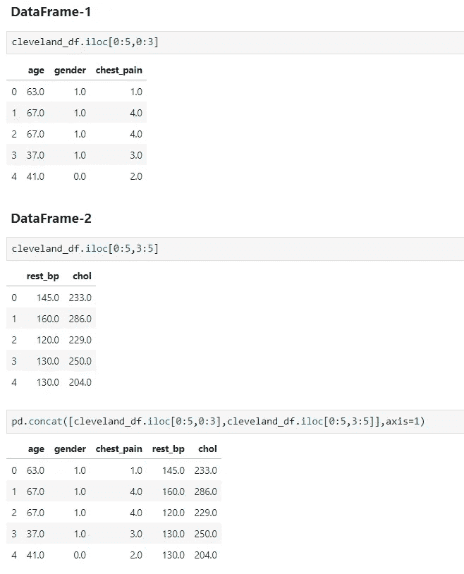

解决方案-4.2

在上面的例子中，我们将两个不同维度的数据帧(即行和列)在列级别合并成一个数据帧。

# 问题 5:如何为记录中的某些类别建立频率表？

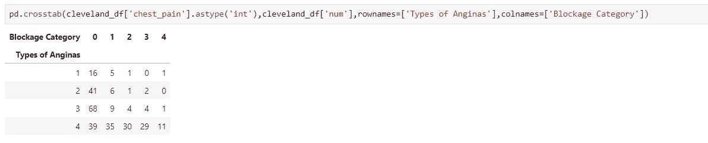

解决方案 5

这里，在上面的例子中，**交叉表**函数构建了交叉制表表，该表具有跨越**阻塞类别**的某些**胸痛**类型的频率。

# 问题 6:如何连接两个数据帧？

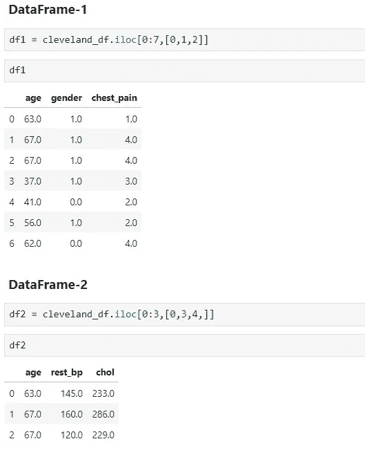

数据集 1 和数据集 2

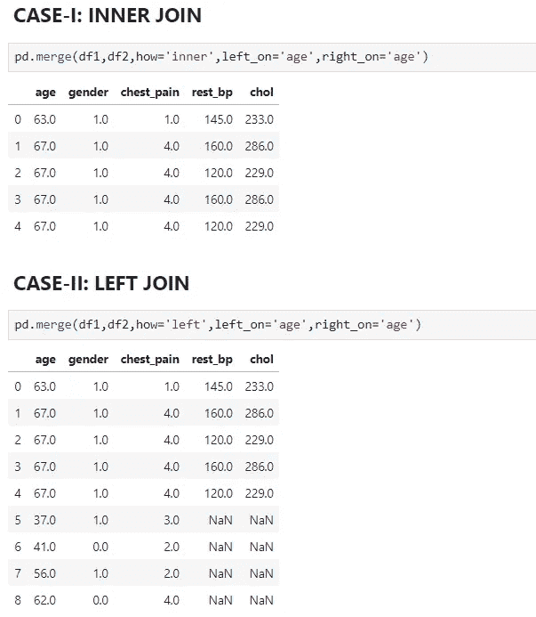

内部和左侧连接

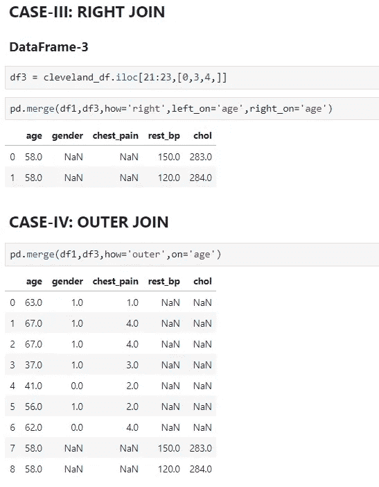

右连接和外连接

# 问题 7:如何使用列“CHOL”在数据帧中添加新列“FIX_CHOL”？

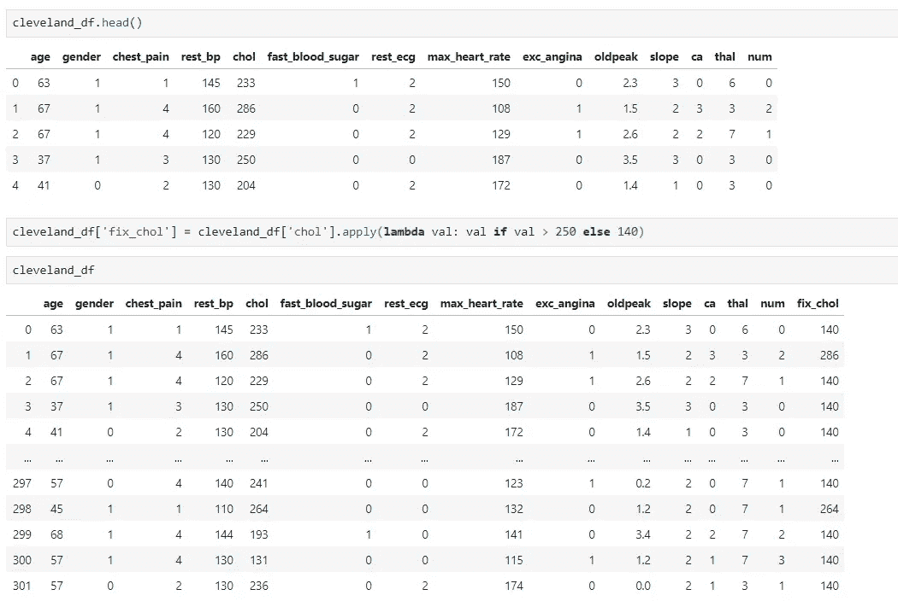

解决方案 7

这里，在这个例子中，我们添加了一个新列 **fix_chol** ，它包含基于条件的来自 **chol** 列的值。

> **Pandas.apply** 使我们能够传递一个函数，并将其应用于 Pandas 系列的每个元素(意味着列)。

# 问题 8:如何将 DataFrame 最里面的列转换为行索引？

## 案例一

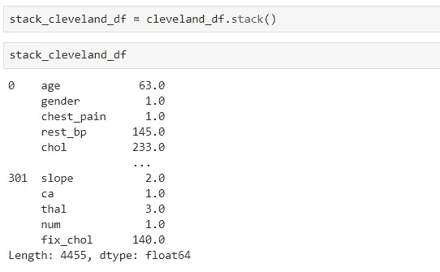

解决方案-8.1

**堆叠**一个数据帧意味着移动最里面的列索引成为最里面的行索引。

## 案例二:拆分

**拆栈**一个数据帧意味着移动最里面的行索引成为最里面的列索引，这意味着栈的逆操作。

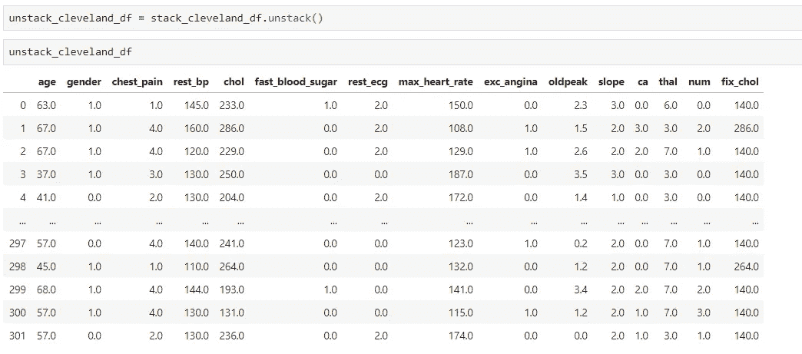

解决方案-8.2

# 问题 9:如何将分类变量转换为虚拟/指示变量？

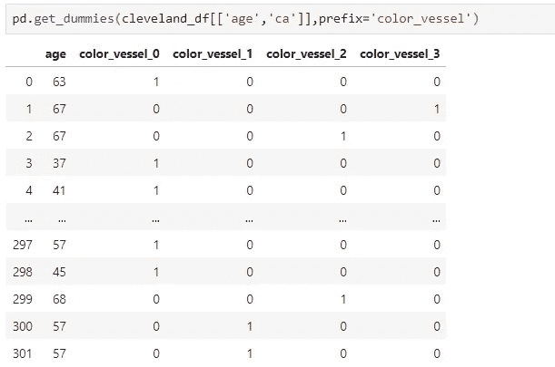

解决方案-9

这里，在这个例子中，我们通过使用 **get_dummies** 函数将 **CA** 特性转换为数据类别的不同指标变量。

# 问题 10:如何在数据帧中添加具有“胸痛”和“exc 心绞痛”列值的新列？

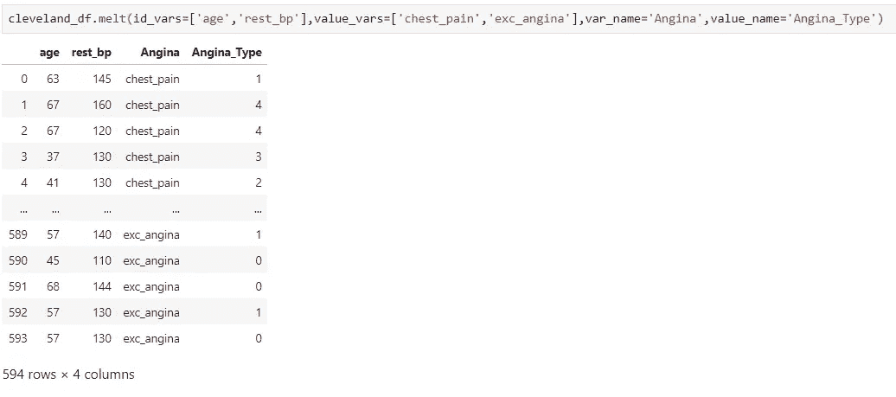

解决方案-10

这里，在上面的示例中，我们添加了两个新列**心绞痛**，它包含心绞痛形式的名称(这意味着胸痛或运动诱发的心绞痛)和**心绞痛类型**，它通过使用**融化**函数来存储心绞痛类型。

> pandas 中的 **Melt** 将一个数据帧从宽格式转换为长格式，可选地保留标识符变量集。

# 额外小费

# 1.循环 v/s 应用方法

## 使用循环

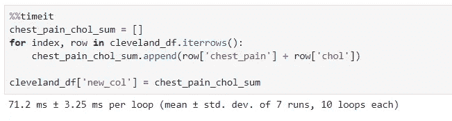

# 使用应用方法

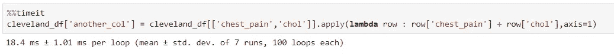

这向我们展示了**循环**与**应用**方法相比效率低下且耗时更多。因此，总是使用**应用**方法来执行数据帧中的任何操作。

恭喜你，我们的博客到此结束。总之，我们介绍了一些先进的熊猫手术。从下一篇博客开始，我们将开始使用 Pandas、MatplotLib 和 Seaborn 来可视化数据。


> 如果你想下载这个博客的 Jupyter 笔记本，请访问下面的 GitHub 库:
> 
> [https://github.com/Rajesh-ML-Engg/Deep_Dive_in_ML_Python](https://github.com/Rajesh-ML-Engg/Deep_Dive_in_ML_Python)

*谢谢你，学习愉快！！！！*

***Blog-10:***[***数据可视化使用熊猫& Matplotlib***](/analytics-vidhya/deep-dive-in-machine-learning-with-python-4a29f4dde483?source=your_stories_page---------------------------)