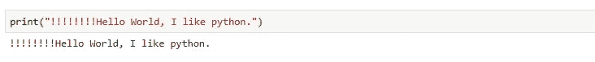
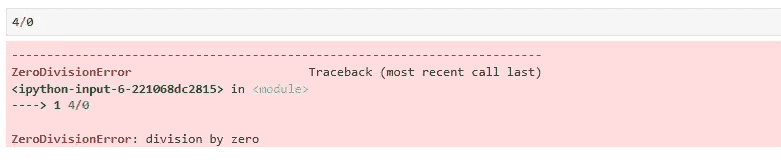

# 使用 Python 深入研究机器学习

> 原文：<https://medium.com/analytics-vidhya/deep-dive-in-machine-learning-with-python-part-i-introduction-and-fundamentals-52f21c05f2a7?source=collection_archive---------13----------------------->

## 第一部分:导言和基本原理

# 背景

不久前，我在一家 IT 公司从事一个项目时，偶然发现了一个. py 文件。作为一名软件工程师，这种新的文件扩展名和 python 标志深深吸引了我，我立刻急切地开始探索用它编写的代码。作为一个当时的新手，一些像朴素贝叶斯、交叉验证等术语对我来说是陌生的。在那典型的一天和随后的许多天里，我小心翼翼地围绕这些术语进行研究，在很短的时间内，我为自己设定了一个目标，成为一名机器学习工程师。

# 目标

在这一系列用 Python 进行机器学习的**深度探索中，我将为任何想要发现 python & ML 的新人或任何想要进入这一迷人领域的人提供一步一步的指南。此外，我将分享我在处理多个机器学习项目/用例时获得的真实工作经验。**

# 基本原则

在这篇博客中，我们将针对一些关于 python 和 ML 的基本问题。

***Q1:为什么要学 Python？***

***回答*** :有效，这个问题可以有多种原因。但我的共同点是:

*   它的语法或编程方式简单易用
*   它是如此方便和精确(看下面的例子)

看，这是纯正的英语。没什么特别的，直截了当。

*   这是一种非常令人愉快的编程语言(请看下面的例子)

比方说，你想执行任何数学计算(如加法)，然后简单地写数字，用算术运算符分隔，就这样！！！！

*   在下面的例子中，它会以一种非常简单且人类可以理解的方式告诉你到底哪里出了问题

*   另一个原因是 python 为机器学习任务提供了各种各样的库，如 Numpy、Pandas、Scikit-Learn 等。而且，python 社区的支持也是巨大的

***Q2:什么是机器学习？我们为什么需要它？***

***回答* :** 关于这一点，你可以找到成吨的定义，但在我看来，ML 意味着赋予计算机完全精确地自动执行任务的能力，并且没有时间限制。

> ***以*** 为例，想象一下，如果向你提供了 10，000 笔信用卡交易，并要求你找出欺诈交易，那么手动完成这项工作需要多长时间？想象一下，如果每分钟发生 1000 笔交易，那么需要多少人力来追踪欺诈交易；还要考虑顾客和信用卡公司的损失。因此，我们训练机器在没有人工干预的情况下立即识别这些活动。类似的例子还有很多。

***Q3。哪些行业使用机器学习？***

***答:*** 有大量行业显著借力 ML。其中一些是:

## 金融服务业

银行和其他企业使用 ML 主要有两个目的:
a .识别数据中的一些重要信息
b .防止欺诈交易

## 医疗保健行业

医疗保健领域正在进行各种研究，这些研究主要使用 ML 来预测任何异常或识别趋势以改进诊断。

## 石油和天然气行业

这些行业正在石油和天然气运营中使用机器学习来节省时间、提高效率、降低成本，同时他们还关注安全改进。

## 运输行业

运输行业分析数据以识别模式和趋势，这有助于他们提高路线效率和盈利能力。

## 汽车工业

在这里，趋势和模式在与车辆所有权相关的大型数据集上确定，重点是提供更好的经销商网络、高效的实时零件库存和更好的客户服务。

## 零售业

许多机器学习技术被零售领域的公司用来吸引更多的客户，如产品推荐，同时根据以前的订单、优惠券和其他激励措施实时调整定价、最合适的尺寸。

***Q4:如何安装 python？***

***答案:*** 贯穿本系列，我们将使用 python anaconda 发行版。Anaconda 发行版是用于科学计算的 Python 和 R 编程语言的开源发行版。它包含了 1500 多个为数据科学设计的包。

请参考下面的链接来安装 Anaconda 发行版:

**1。在 Windows 上安装**

 [## 在 Windows 上安装 Anaconda

### Anaconda 是一个包管理器、环境管理器和 Python 发行版，它包含许多开放的…

www.datacamp.com](https://www.datacamp.com/community/tutorials/installing-anaconda-windows) 

**2。在 Mac 上安装**

 [## 如何在 Mac OS X 上安装 Anaconda

### Anaconda 是一个包管理器、环境管理器和 Python 发行版，它包含许多开放的…

www.datacamp.com](https://www.datacamp.com/community/tutorials/installing-anaconda-mac-os-x) 

**3。在 Linux 上安装**

 [## 在 Linux 上安装 Anaconda

### 本节详细介绍了 Python 的 Anaconda 发行版在 Linux 上的安装，特别是 Ubuntu 18.04，但是…

problemsolvingwithpython.com](https://problemsolvingwithpython.com/01-Orientation/01.05-Installing-Anaconda-on-Linux/) 

万岁，我们来到这个博客的结尾，总结，我们接触 python 和机器学习的基础，以获得一个概述。

在下一篇博客中，我们将开始学习 python 基础知识，并尝试解决一些基本问题。

> **注意:如果你不是来自编码背景，那么不要担心，我会讲述 python 的基础知识，并以一种容易理解的方式描述事情。**

快乐学习！！！！

[***Blog-2:熟悉 Jupyter 笔记本***](/analytics-vidhya/deep-dive-in-machine-learning-with-python-part-ii-getting-familiar-with-jupyter-notebook-b3f0bffbb73b?source=your_stories_page---------------------------)