# 使用 Python 深入研究机器学习

> 原文：<https://medium.com/analytics-vidhya/deep-dive-in-machine-learning-with-python-part-ii-getting-familiar-with-jupyter-notebook-b3f0bffbb73b?source=collection_archive---------7----------------------->

## 第二部分:熟悉 Jupyter 笔记本

欢迎来到第二个博客**深入学习 Python 的机器学习**，我希望你们的系统中都安装了 python anaconda 发行版。如果没有，那么请浏览之前的博客([用 Python 深入研究 ML—第一部分](/@Rajesh_ML_Engg/deep-dive-in-machine-learning-with-python-part-i-introduction-and-fundamentals-52f21c05f2a7))，在那里我们通常涵盖了 Python & ML 的高层次概述，并参考 anaconda 安装链接。

在这篇博客中，我们将介绍如何突出使用 Jupyter Notebook 进行编码，并执行我们的第一个 python 程序。到现在为止，你们中的许多人可能在想:

***Q1。朱庇特是什么？***

> 2014 年，费尔南多·佩雷斯宣布了 IPython 的一个剥离项目，名为 **Project Jupyter** 。

Project Jupyter 的名字是对 Jupyter 支持的三种核心编程语言 Julia、Python 和 R 的引用，也是对伽利略记录木星卫星发现的笔记本的致敬。

Jupyter 是语言不可知的，它支持几十种语言的执行环境(意味着内核),其中包括 Python、Julia、R、Haskell、Ruby 等。

***Q2。什么是 Jupyter 笔记本？***

Jupyter Notebook 是一个基于 web 的数据科学工具，它为编写代码或创建文档提供了一个交互式计算环境。术语“笔记本”与 Jupyter web 应用程序和 Jupyter Python web 服务器等实体密切相关。

Jupyter Notebook 文档是一个 JSON 文档，包含一个有序的输入/输出单元格列表，这些单元格可以包含代码、文本(使用 Markdown)、数学、图表和富媒体，通常以“.”结尾。ipynb”扩展名。它的前身是 IPython 笔记本电脑。

Jupyter 笔记本可以通过 NBCONVERT 库，通过 web 界面中的“下载为”转换为多种 pen 标准输出格式(HTML、演示幻灯片、LaTeX、PDF、ReStructuredText、Markdown、Python)。

## 其他产品

Jupyter 笔记本已经成为一种流行的用户界面，还有一些其他产品，如:

*   **木星枢纽**

它是 Jupyter 笔记本电脑的多用户服务器

*   JupyterLab

> 我更喜欢在 JupyterLab 上工作，因为它提供了经典 Jupyter 笔记本的所有熟悉的构建模块(笔记本、终端、文本编辑器、文件浏览器、丰富的输出等。)在灵活而强大的用户界面中

*   **Colab**

Colaboratory(也称为 Colab)是一个免费的 Jupyter 笔记本环境，它运行在云中，并将笔记本存储在 Google Drive 上。Colab 只支持 Python 2 和 Python 3 内核，不支持其他 Jupyter 内核 Julia 和 r。

# 如何运行 Jupyter 笔记本？

**步骤— 1:运行命令提示符**

*   类型 *Jupyter 笔记本*
*   点击回车

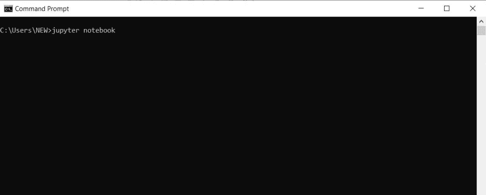

命令提示符窗口

按下回车键后，将出现以下窗口:

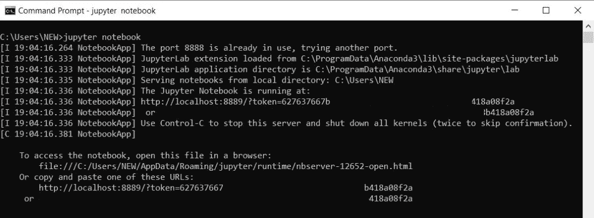

主要称为 **Jupyter 服务器**

Jupyter 服务器一运行，它的控制台就会在你的浏览器中打开(参考下图)

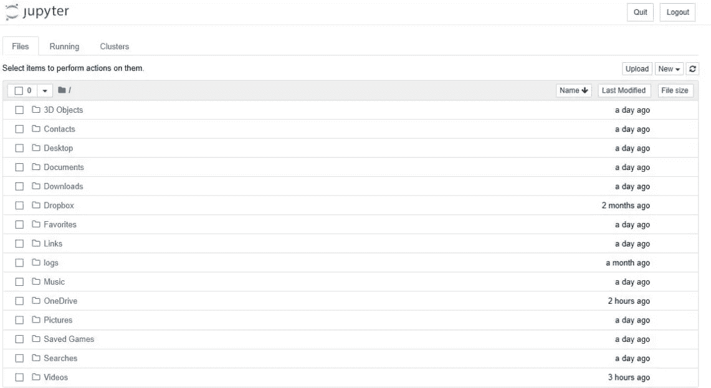

Jupyter 控制台

## 如何通过 Jupyter 控制台添加目录？

**步骤— 1:** 点击右上角的**新建**，从下拉菜单中选择**文件夹**(请看下图)

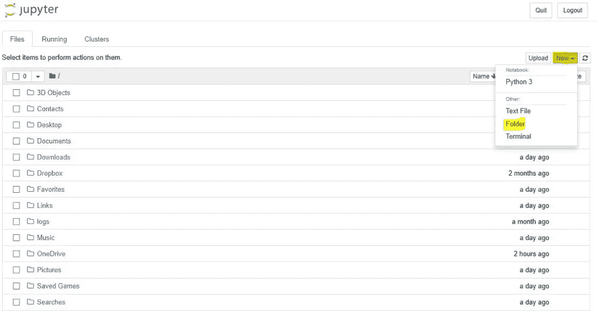

这将在您的位置添加**无标题文件夹**。

## 如何通过 Jupyter 控制台重命名新添加的目录？

**Step — 1** :选中**无标题文件夹**左侧出现的复选框

**步骤— 2** :然后，点击出现在左上角的重命名

第三步:给你的目录起一个新名字，然后点击回车

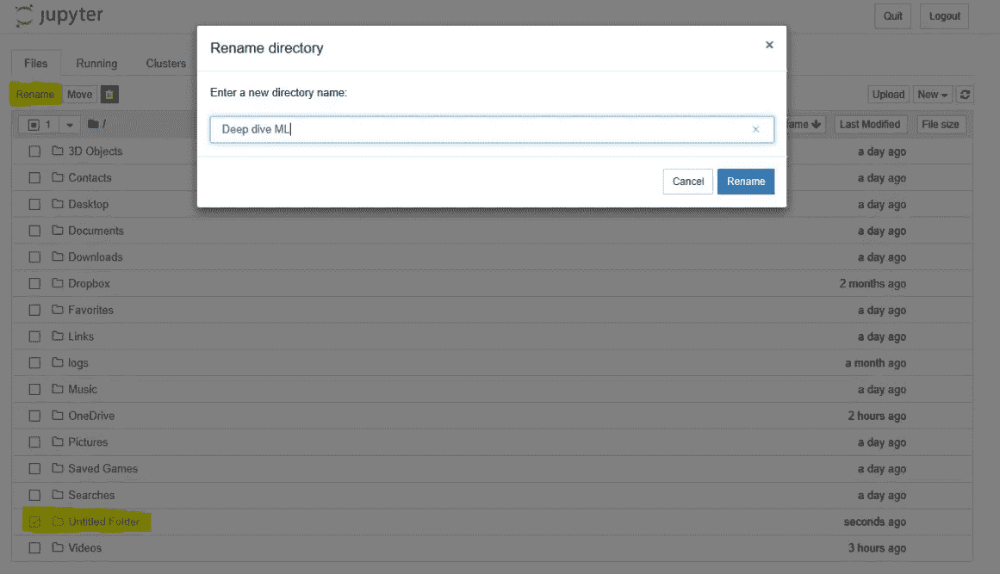

重命名目录

## 如何从控制台创建 Python-3 Jupyter 笔记本？

**Step — 1** :点击右上角的 **New** ，从下拉框中选择 **Python 3** (参见下图)

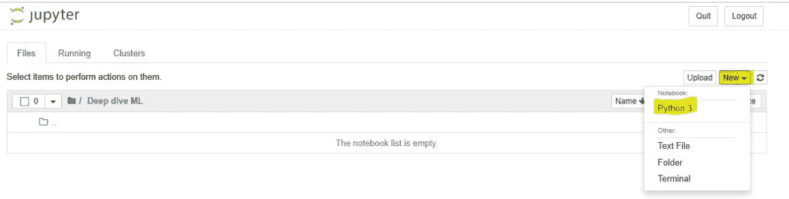

这将创建一个全新的 Jupyter 笔记本，如下所示:

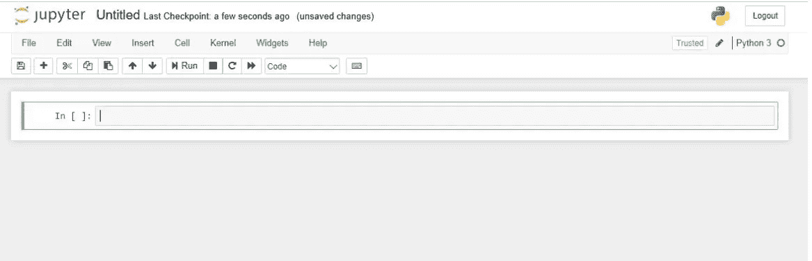

带有空代码单元格的新笔记本

## 如何在 Jupyter 笔记本中高效编码？

在 Jupyter notebook 中，我们使用它的单元格来编写我们的代码或任何标题(参见下图):

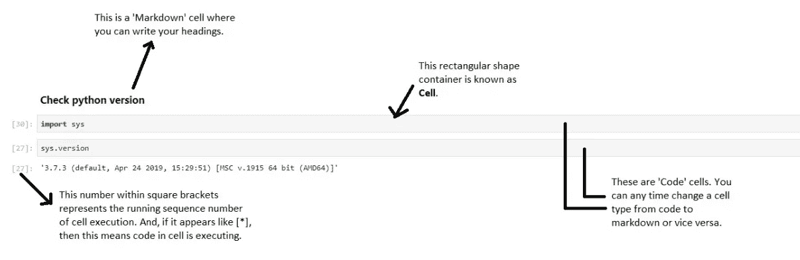

## 如何将任意单元格转换成 Markdown 单元格？

**Step — 1** :选择单元格，点击顶部菜单栏中的下拉菜单

**Step — 2** :从下拉框中选择降价

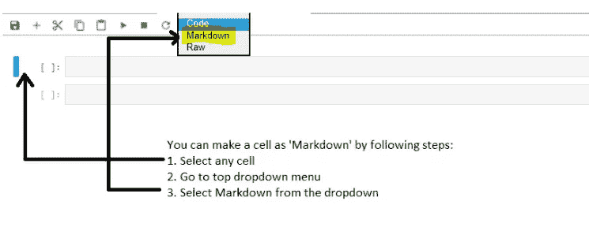

创建降价单元格

您可以将 markdown 单元格用于编写 HTML 标签、创建标题、导入图像等任务。

## 如何在 Markdown 单元格中写标题？

在 markdown 单元格中，您可以通过以##、##、###或####开始文本来编写标题。

如果文本包含在**中，则以粗体显示。类似地，如果文本包含在 _(又名下划线)中，那么它将显示为斜体。

参考下图:

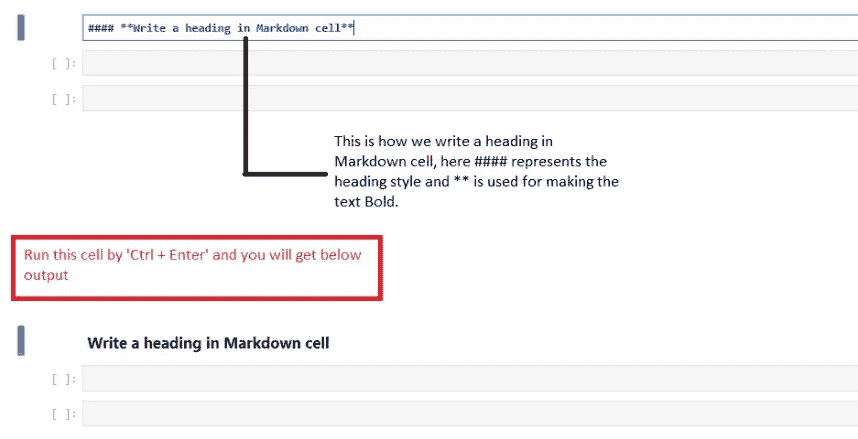

## 如何执行一个单元格？

您可以使用' **Ctrl + Enter** '或' **Shift + Enter** '来执行单元格。

*   **'Ctrl + Enter':** 通过使用这个，控制在执行后保持在同一个单元格上
*   **'Shift + Enter':** 通过使用这个，它执行当前单元格，控制移动到下一个单元格

## 如何添加或删除单元格？

如果要在任何单元格上方添加一个单元格，则选择一个单元格并按“ **a** ”作为快捷键。同样，如果你想将一个单元格放到任何单元格下面，那么按' **b** 作为快捷键。

如果您想要删除一个单元格，则选择一个单元格，然后按“ **dd** ”作为快捷键。

**注**

**1。**您可以使用菜单栏下拉菜单中的选项来执行这些操作。但是，我更喜欢使用键盘快捷键。

**2。**有关笔记本快捷方式的更多信息，请参考帮助。

# 现在，是时候运行我们的第一个 python 程序了

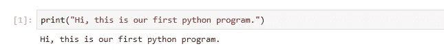

第一次 python 代码执行

是啊，就这么简单！！！看下面的例子:

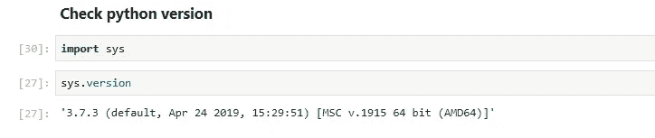

看到上面的图片，你会惊讶地发现，甚至没有使用**print**python 版本也显示为输出结果。

> 这是 jupyter notebook 的独特之处，因为它会打印单元格中最后一个命令的执行结果。

那么，让我们看看下面的例子:

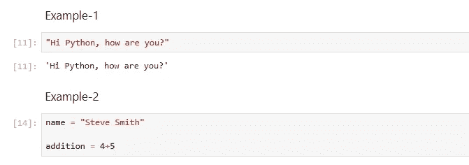

这里，在例 2 中，没有打印任何东西，因为我们只是给一个 python 对象分配了一些值(*也就是 4+5)*(*也就是加法*)。

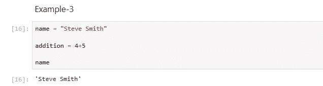

在例 3 中，在给 python 对象(又名**名称**和**加法**)赋值后，我们要求解释器显示什么对象**名称**正在保存。因此，这是在单元格内执行的最后一个命令，所以它显示'**史蒂夫·史密斯**'作为输出。

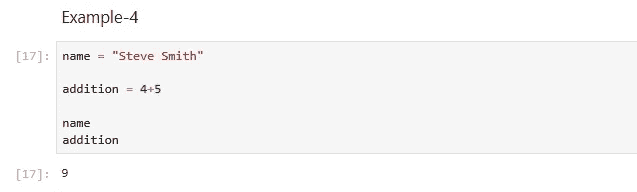

这将澄清所有的疑问，这里我们首先将**“史蒂夫·史密斯”**赋给**名称**，然后将 **4+5** 即 9 赋给**加法**。然后，我们尝试查看**名称**和**加法**包含什么，因此**加法**将在该单元格中最后执行。因此， **9** 作为单元输出。

所以，我们到了这个博客的结尾。在下一篇博客中，我们将继续进行一些 python 实践编码。

快乐学习！！！！

[***博客-3: Python 精要***](/analytics-vidhya/deep-dive-in-machine-learning-with-python-bce7acfdab5f)

***参考链接:***

[https://en.wikipedia.org/wiki/Project_Jupyter](https://en.wikipedia.org/wiki/Project_Jupyter)