# 深入研究反向传播(三)

> 原文：<https://medium.com/analytics-vidhya/deep-dive-into-back-propagation-iii-e96234a4f7fd?source=collection_archive---------24----------------------->

这是“深入研究反向传播”的第三部分。要继续阅读，我建议如果你还没看过的话，可以看看第一部分和第二部分。第一部分和第二部分的链接可以在[这里](/analytics-vidhya/deep-dive-into-back-propagation-part-ii-c392f804a784)和[这里](/analytics-vidhya/deep-dive-into-back-propagation-part-i-e1a92b6dbdb9)找到。

既然我们理解了链式法则，我们可以继续我们的**反向传播**例子，在这里我们将计算梯度。

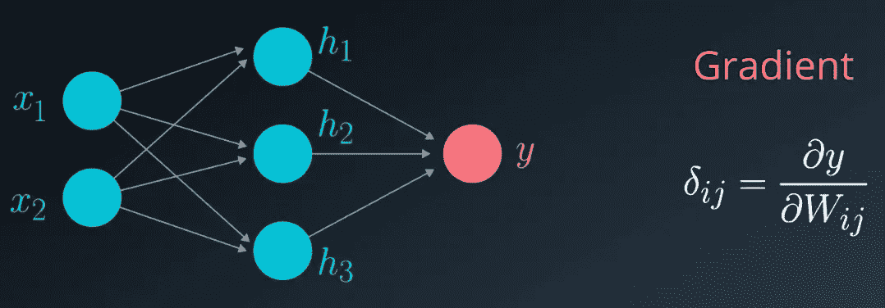

在我们的例子中，我们只有一个隐藏层，所以我们的反向传播过程将包括两个步骤:

步骤 1:计算相对于权重向量 W 的梯度(从输出到隐藏层)。
步骤 2:计算相对于权重矩阵 W 的梯度(从隐藏层到输入)。

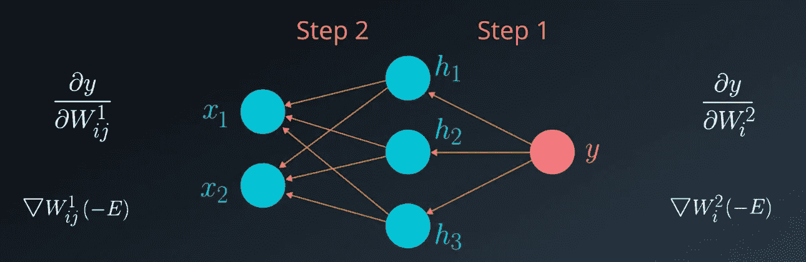

**第 1 步**(注意，此处引用的权重向量将为 W。所有引用 W 的指数均已从计算中省略，以保持符号简单)。

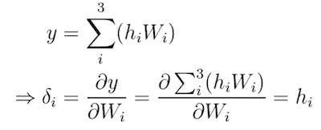

等式 1

您可能还记得:

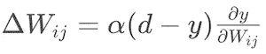

在这个特定的步骤中，由于输出只有一个值，我们可以按照下面的方式重写等式(其中我们有一个权重向量*):*

*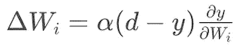*

*因为我们已经计算了梯度，我们现在知道第一步需要的增量值是:*

*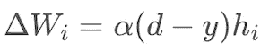*

*等式 2*

*计算完增量值后，我们可以通过以下方式更新向量 W2 *W* 2:*

*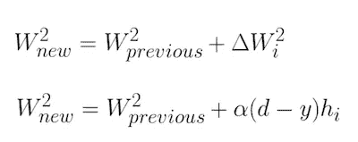*

*等式 3*

***步骤 2** (在这一步中，我们将需要使用两个权重矩阵。因此，我们不会忽略权重指数。)*

*在我们的第二步中，我们将通过计算 y 相对于权重矩阵 W 的偏导数来更新矩阵 W 的权重*

*链式法则将按以下方式使用:*

*获得 y *y* 相对于 h 的偏导数，并将其乘以 h 相对于 W 中相应元素的偏导数。我们可以观察每个元素并以如下方式表示方程，而不是参考向量 h:*

*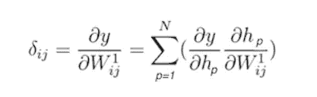*

*等式 4*

*在这个例子中，我们在单个隐藏层中只有 3 个神经元，因此这将是三个元素的线性组合:*

*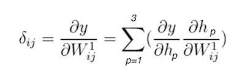*

*等式 5*

*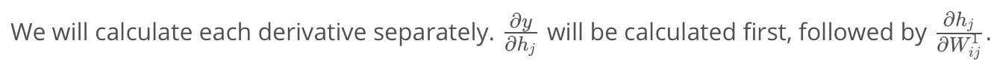**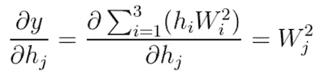*

*等式 6*

*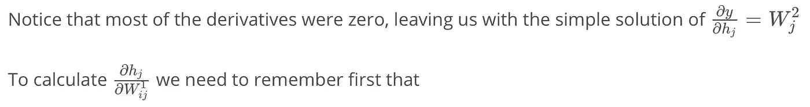**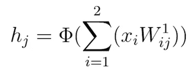*

*等式 7*

*因此:*

*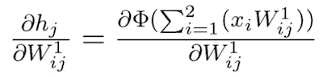*

*等式 8*

*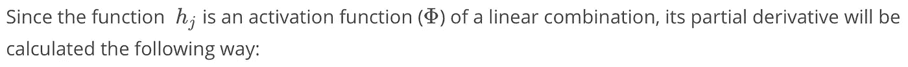**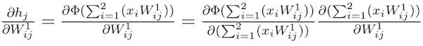*

*等式 9*

*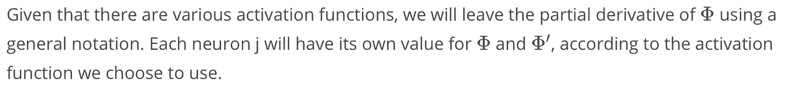**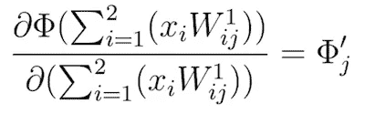*

*等式 10*

*等式 9 的第二个计算可以通过以下方式计算:*

*(注意结果是多么简单，因为这个偏导数的大部分分量都是零)。*

*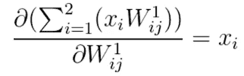*

*等式 11*

*在理解了如何分别对待等式 9 的每个乘法之后，我们现在可以将它总结如下:*

**

*等式 12*

*我们准备完成**步骤 2** ，其中我们通过计算等式 5 所示的梯度来更新矩阵 W 的权重。从以上计算，我们可以得出结论:*

*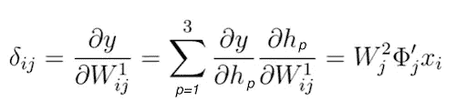*

*等式 13*

*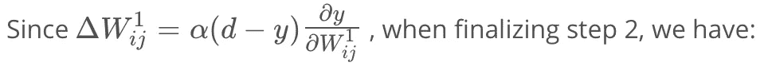**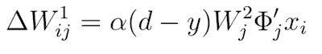*

*等式 14*

*计算完增量值后，我们可以按以下方式更新矢量 W:*

*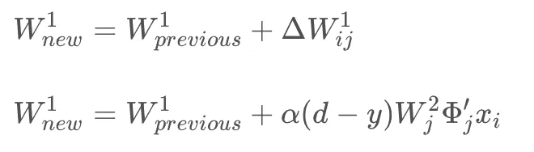*

*等式 15*

*在所有这些计算中，我们没有强调有偏差的输入，因为它不会改变我们涵盖的任何概念。正如我之前提到的，简单地认为偏差是一个常数输入，它也通过权重连接到隐藏层的每个神经元。偏差和其它输入之间的唯一区别是，当其它输入改变时，偏差保持不变。*

*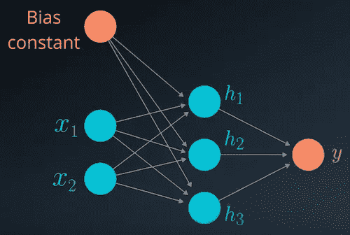*

*在更新权重矩阵之后，我们再次开始前馈过程，再次开始更新权重的过程。*

*在本例中，对于每个新输入，我们在每次计算输出后更新权重。每 N 步更新一次权重通常是有益的。这被称为小批量训练，包括在实际更新重量之前，在多个步骤中平均重量的变化。*

*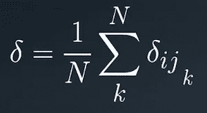*

*使用小批量训练有两个主要原因:*

1.  *降低培训过程的复杂性*
2.  *噪声降低*

*内容鸣谢:Udacity 深度学习计划*