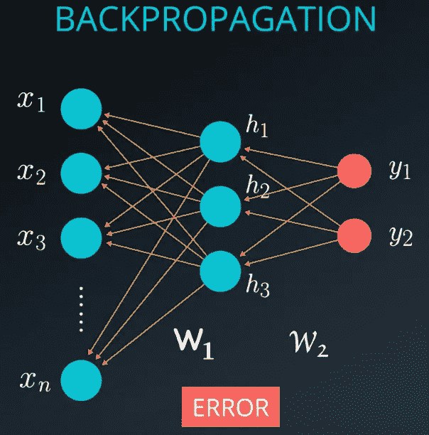
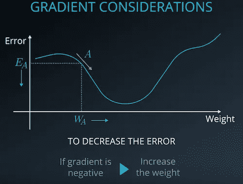
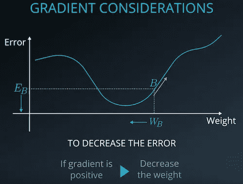
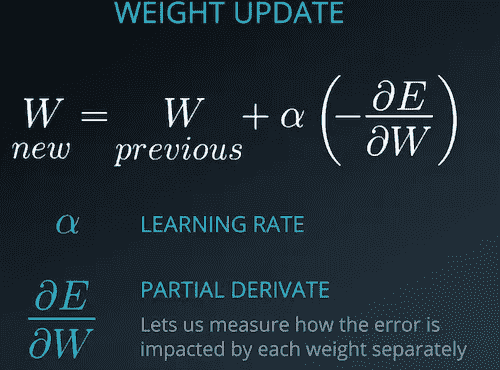
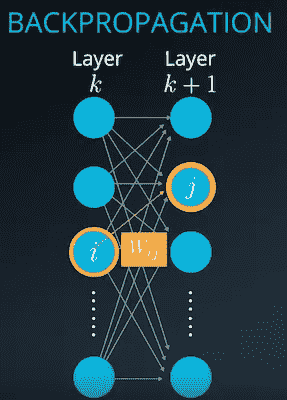
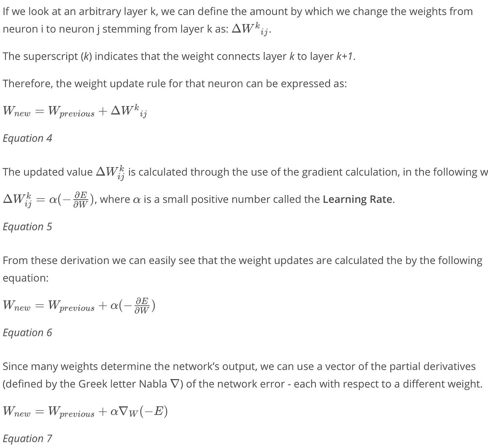
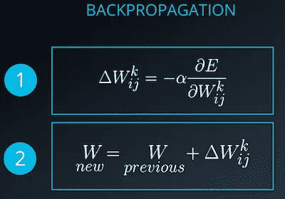
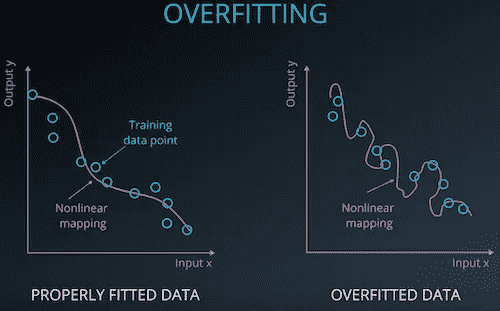
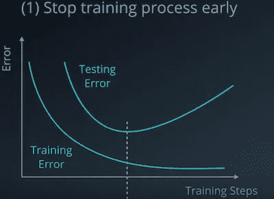
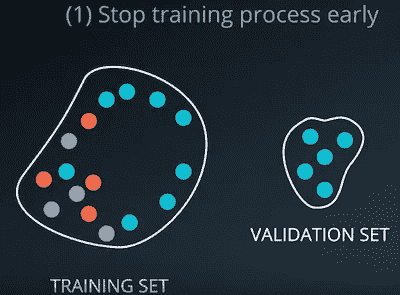

# 深入研究反向传播(第一部分)

> 原文：<https://medium.com/analytics-vidhya/deep-dive-into-back-propagation-part-i-e1a92b6dbdb9?source=collection_archive---------17----------------------->

本文是对神经网络中前馈过程的深入解释的继续。文章链接可在[这里](/analytics-vidhya/in-depth-explanation-of-feedforward-in-neural-network-mathematically-448092216b63)找到。

既然我们已经完成了前馈传递，接收了输出，并计算了误差，我们准备返回来改变我们的权重，目标是减少网络误差。当改变权重时，从输出到输入反向进行是我们称之为反向传播的过程，其本质上是使用链规则计算的随机梯度下降。

为了能够实现一个基本的神经网络，我们并不真的需要深刻的数学理解，因为现在我们有开源工具。但要真正理解它的工作原理并优化我们的应用，了解数学总是很重要的。

我们的目标是找到最小化网络误差的一组权重。我们使用一个迭代过程，每次向网络提供来自我们训练集的一个输入。在每个输入的前馈过程中，我们计算网络误差。然后，我们可以使用这个误差来稍微改变正确的方向，每次只减少一点误差。我们继续这样做，直到我们确定误差足够小。现在让我们看看梯度的考虑。

在这里，您可以找到了解和调整学习率的其他好资源:

*   [资源 1](http://blog.datumbox.com/tuning-the-learning-rate-in-gradient-descent/)
*   [资源二](http://cs231n.github.io/neural-networks-3/#loss)

基本上，反向传播归结为计算误差 E 相对于每个权重的偏导数。然后根据 Wij 的δ的计算值调整权重。这些计算是针对每一层进行的。

# 过度拟合

当我们使用反向传播使网络误差最小化时，我们可以适当地使模型适应数据，也可以过度适应。一般来说，当我们有一个有限的训练集时，会有过度适应的风险。

过度拟合意味着我们的模型将过于紧密地拟合训练数据。换句话说，我们过度训练了模型或网络来适应数据。因此，我们无意中也模拟了训练集中的噪声或随机元素。如果发生这种情况，我们的模型在测试新输入时将不能很好地推广。

通常有两种主要方法来解决过拟合问题。

1.  尽早停止训练过程
2.  正规化的使用

## 1.提前停止培训过程

当我们提前停止训练过程时，我们在网络开始过度适应的区域这样做。通过这样做，我们减少了测试集的性能下降。如果我们准确地知道何时应该停止训练过程，那将是理想的。确定何时停止训练的一种方法是从训练集中划分出一个小数据集，我们称之为验证集。假设验证集的精度与测试集的精度相似，我们可以用它来估计训练应该何时停止。这种方法的缺点是我们最终用较少的样本来训练我们的模型，所以我们的训练集较小。

## 2.正规化的使用

正则化意味着我们对网络的训练施加约束，以便可以实现更好的泛化。辍学是一种广泛使用的正规化计划，以这种方式提供帮助。

因为偏导数是反向传播中使用的关键数学概念，所以对自己计算偏导数的能力有信心是很重要的。一旦你知道如何计算基本导数，计算偏导数就很好理解了。
欲了解更多关于偏导数的信息，请点击以下[链接](http://www.columbia.edu/itc/sipa/math/calc_rules_multivar.html)

为了在本课的未来测验中进行计算，您可以使用以下链接作为[常见衍生工具](http://tutorial.math.lamar.edu/pdf/Common_Derivatives_Integrals.pdf)的参考。

内容鸣谢:Udacity 深度学习计划

第二部分的链接可以在[这里](/@aungkyawmyint_26195/deep-dive-into-back-propagation-part-ii-c392f804a784)找到。