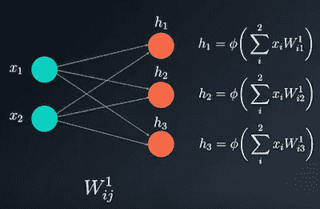

# 深入研究反向传播(第二部分)

> 原文：<https://medium.com/analytics-vidhya/deep-dive-into-back-propagation-part-ii-c392f804a784?source=collection_archive---------14----------------------->

这是“深入研究反向传播”的第二部分。要继续阅读，我建议如果你还没看过，先看看第一部分。第一部分的链接可以在这里找到[。](/analytics-vidhya/deep-dive-into-back-propagation-part-i-e1a92b6dbdb9)

我们现在将继续关注反向传播过程的示例，并考虑具有两个输入[x1，x2]，单个隐藏层中的三个神经元[h1，h2，h3]和单个输出 y 的网络。

要更新的权重矩阵是从输入到隐藏层的 W1 和从隐藏层到输出的 W2。注意，在我们的例子中，W2 是一个向量，而不是一个矩阵，因为我们只有一个输出。

我们将从网络上输入的前馈传递开始，然后计算输出，基于该误差，使用反向传播来计算偏导数。

计算三个隐藏神经元的激活值很简单。我们有输入与矩阵 W_1 的相应权重元素的线性组合。接下来是激活函数。

输出是权重为 W2 的前一层向量 H 的激活的点积。

计算输出后，我们终于可以找到网络错误。

提醒一下，最常用的两个误差函数是[均方误差(MSE)](https://en.wikipedia.org/wiki/Mean_squared_error) (常用于回归问题)和[交叉熵](https://www.ics.uci.edu/~pjsadows/notes.pdf)(常用于分类问题)。

在本例中，我们使用 MSE 的一个变体:

其中 d 是期望输出，y 是计算输出。注意，在这种情况下， **y** 和 **d** 不是向量，因为我们只有一个输出。

误差是它们的平方差，也称为网络的**损失函数**。我们将误差项除以 2，以简化符号，这一点很快就会清楚。

反向传播过程的目的是使误差最小化，在我们的情况下是损失函数。为了做到这一点，我们需要计算它对所有重量的偏导数。

由于我们刚刚找到输出 y，现在可以通过找到更新值 Wkij 来最小化误差。上标 k 表示我们需要更新每一层 k。

如前所述，权重更新值 Wkij 通过使用梯度以如下方式计算:

(注意 d 是一个常数值，所以它的偏导数就是一个零)

输出相对于每个重量的偏导数定义了梯度，通常用希腊字母δ表示。

我们将使用链式法则找到梯度的所有元素。

回顾链式法则

第三部分的链接可以在这里找到[。](/@aungkyawmyint_26195/deep-dive-into-back-propagation-iii-e96234a4f7fd)

内容鸣谢:Udacity 深度学习计划