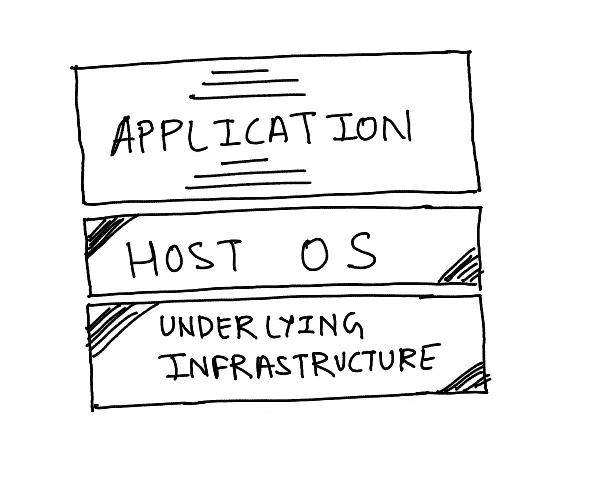
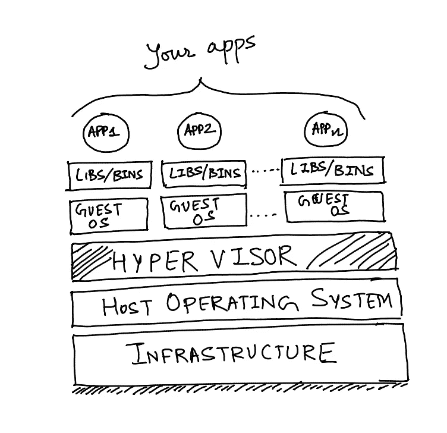
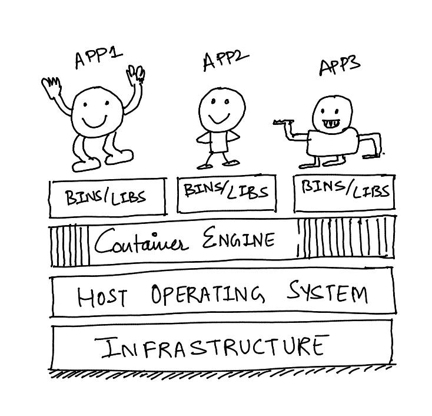
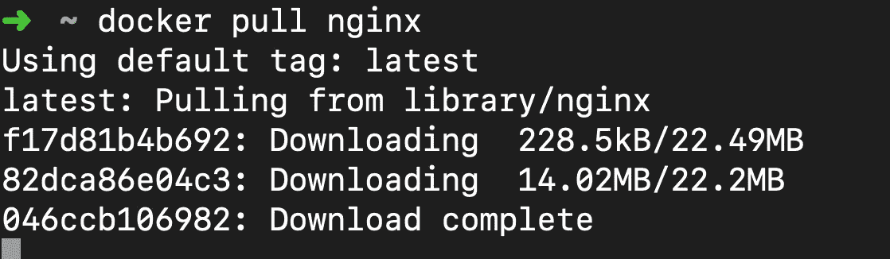
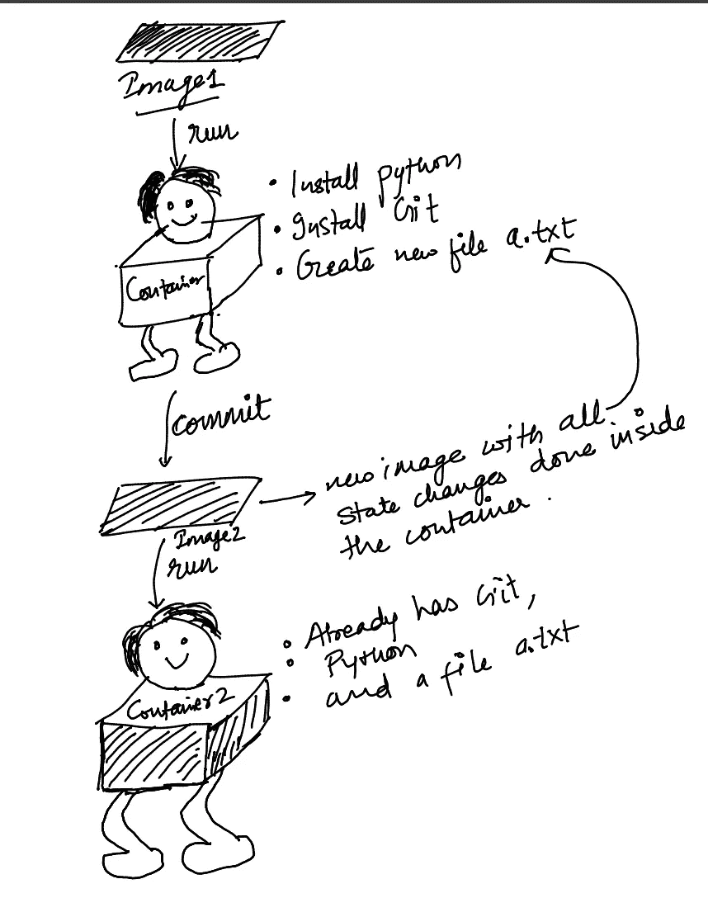

# 深入了解集装箱——码头工人

> 原文：<https://medium.com/analytics-vidhya/deep-dive-into-containers-docker-b6c9fd9e4e6d?source=collection_archive---------1----------------------->

你是否听过很多关于 Docker 的事情，却不知道它是什么？还是一知半解？如果是的话，那么这篇文章可能会帮助你回答你头脑中所有关于 docker 的开放性问题。不要担心，即使您从未听说过 Docker 这个词，这篇文章也是为您准备的，因为它从最基本的开始，深入到它是如何工作的，一些最佳实践，也涵盖了动机。

在跳到 ***docker*** 之前，先回答这些快速问题:

1.  您是否遇到过这样的情况:您的代码可以在您的机器上完美运行，但在其他人的机器上却无法运行😠？
2.  你面临过开发缓慢的问题吗😫，测试和部署？
3.  您是否制作了生产代码的副本以在本地运行(但仍然无法重现某些问题)😏？
4.  嗯，所有这些问题都可以用容器来解决👌

> 等等…什么是**容器**？

好的——让我们从应用程序开发的开始说起。

仔细看下面的图片。你怎么想呢?你看到了什么问题？把它写在一张纸上。让我们看看我们是否有相同的观点。



每台机器一个应用程序

巨大努力👏 👏，现在让我们看看我认为它有什么问题。

1.  一个应用程序在一台机器上运行😳，有自己的环境。
2.  机器上只有一个主机操作系统，您不能安装另一个主机操作系统来部署其他应用程序。
3.  现在，如果您的应用程序的资源使用率非常低，该怎么办呢？你只会浪费机器资源，这是非常不经济的。
4.  那么解决方案是什么呢？看到下图，现在你怎么看？



虚拟机(虚拟机管理程序)

好吧，那么这个显然更好。

这里我们有一个称为虚拟机管理程序的额外层，它为我们提供了在一台机器上部署多个操作系统的功能。这些就像单个物理机上的虚拟机。虚拟机是复制真实计算机行为的系统。

所以现在你可以在一台物理机器上运行多个应用程序😍 在多个虚拟盒子里面托管不同的操作系统。与第一种方法相比，这是一个巨大的胜利。

> 但是，我们可以做得更好。这仍然有很多冗余、开销，虚拟机很重，并且占用大量系统资源。

行..现在看看下面的图表，看看你的应用程序看起来有多开心🚀，这是因为他们是。



集装箱发动机👌

好吧，让我们试着理解这意味着什么。因此，有一个新的层取代了虚拟机管理程序，被称为容器引擎。这个引擎提供了丰富的功能。它为您的应用程序提供了运行所需的库和环境，而没有不必要的客户操作系统开销。

现在，你可以把你的应用程序封装在一个容器里，里面有你的应用程序顺利运行所需的一切🏃。

> 嗯，有意思。但是这里的***docker*T3 在哪里呢？**


照片由 [Toshi](https://unsplash.com/@toshidog?utm_source=medium&utm_medium=referral) 在 [Unsplash](https://unsplash.com?utm_source=medium&utm_medium=referral) 上拍摄

Docker 是一个给你 ***容器化*** (操作系统级虚拟化)能力的软件。

这意味着(**利益**)—

*   使用容器构建和部署应用程序更快。
*   您的应用程序将被打包到一个容器中，其中包含您的应用程序操作库、运行时环境、系统工具和其他依赖项所需的一切。
*   最重要的是，你的软件可以在任何支持 docker 的平台上运行。
*   现在你不会有这样的问题…但它在我的机器上工作😞 😥


[Radu Florin](https://unsplash.com/@raduflorin?utm_source=medium&utm_medium=referral) 在 [Unsplash](https://unsplash.com?utm_source=medium&utm_medium=referral) 上拍摄的照片

让我们开始吧，✈️ ✈️

> **安装 docker** —官网上都有

[](https://docs.docker.com/install/) [## 关于 Docker CE

### Docker Community Edition (CE)非常适合希望开始使用 Docker 和……

docs.docker.com](https://docs.docker.com/install/) 

> **一些重要的概念:**

*   **映像** —映像是一个可执行文件，它包含了应用程序正常运行所需的一切，包括代码、运行时库和其他依赖项。它是只读的，可以使用容器激活。
*   **容器** —这是一个图像的运行实例。它有一个可以改变的状态。

***类比*** *—图像就像一个 java 类，容器就像它的对象🐣*

*   **Docker Registry** —一个存储所有 Docker 库的中心位置，以后可以下载。官方的、公开的 docker 图片在这里发布[https://hub.docker.com](https://hub.docker.com/)
*   **docker 守护进程** —一个(永久)运行在您的主机操作系统上的程序，它执行 Docker 命令，这些命令是使用 Docker 客户端及其 REST Apis 触发的。
*   **Docker 客户端** —用于与守护程序通信以执行命令的 CLI。

好吧，还是没意思？让我们把手弄脏吧。

> **Docker 命令** —这些是用于管理我们的图像和容器的指令。Docker 有丰富的命令集。让我们来看看几个重要的命令。

> docker 图像

这列出了我们系统上的所有图像。它提供了详细信息，如存储库、标签、图像 Id、创建日期。

储存库 -这是一个你可以储存你的 docker 图片的地方。例如，如果你去 docker hub，你可以看到官方的 mysql、redis、nginx 等等。这些宿主图像的许多版本(标签)。

**图片 Id** -图片的唯一 Id。看起来像是 5cde56dc5a15

现在你的机器上还没有任何图像。让我们用下一个命令下载一些图像。

> docker pull {imagename:tag}



上面的命令' ***nginx*** '是一个 repo/image 名称，我没有提供任何标签，所以默认为 ***最新的*** 标签。但是，建议提供一个标签。

现在，如果您再次运行 docker images 命令，您可以看到下载的图像。

下一步是什么？令人兴奋的东西。用图像运行你的容器。

> docker run { image:tag } {在容器中运行的命令}

例如***docker run my image:1 . 15 . 6******echo【hello world】***

这将从前景中带有标签“1.15.6”的图像“myimage”启动一个容器(附加模式)。如果您想在分离模式下运行您的容器，该怎么办？好吧，-d 选项来拯救。

***docker run-d { my image:tag }睡眠 1000***

sleep 1000 将在您的容器中运行。

要以交互模式运行容器，可以在 docker run 中使用-i 选项。

好的……所以我们的容器现在正在运行。真的..没有吗？好，您可以使用我们的下一个命令来检查自己。

> docker ps {-a}

显示所有正在运行的容器。创建的每个容器都有一个唯一的 id。您可以使用 ***— name*** 选项和您的 ***docker run*** 命令为您的容器提供名称。

现在你的容器正在运行，你的应用程序也在你的容器中运行。你如何访问它？

假设您有一个监听端口 **8080** 的服务。然后您应该能够点击 **localhost:8080** 并看到您的响应。对吗？

不，这是有原因的。您的应用程序运行在一个容器内，如果 ***不暴露您的端口*** ，则无法在容器外访问该应用程序。

> ***你容器里面的 8080 和你主机上的 8080 不一样。它需要被映射。***

怎么会？ ***-p 选项。***

> docker run-p {集装箱港口:主机港口}

它用于将容器中的端口暴露给主机端口。

现在，如果您尝试 localhost:8080，您可以看到您的服务响应。

> 注意，如果本地主机不起作用，你应该试试 docker 机器的 ip。这取决于你的平台。

现在你的容器正在运行，让我们也来谈谈图像和容器是如何工作的，以及它们是如何构造的。

> Docker 图像由**层**组成。要了解哪些图层组成了您的图像，请使用 docker history 命令。

> ***码头工人历史{imagename:tag}***

这将显示您的图像中的所有层。每一层标识一个不同的状态，该状态作为图像的一部分被捕获。

层到底是什么意思？好的，等一下，你知道如何建立自己的形象吗？到目前为止，我们只使用了来自 docker hub 的图片，这是由其他人创建的。但是现在是时候了，我们应该创造自己的形象。🖼

这是一个文本文件，包含了一些构建图像的指令。每条指令负责在现有层的顶部添加一层。

示例:

```
FROM ubuntu:15.04  **#layer1**
COPY . /app        **#layer2**
RUN make /app      **#layer3**
CMD python /app/app.py **#layer4**
```

上面的 docker 文件包含一些使用标准关键字的指令，如 FROM、COPY、RUN、CMD 等。

FROM 指令构成了 docker 映像的基础层，可以使用 docker 文件构建该映像。

在顶部，每条指令构建一个新的层。因此，当构建整个 ***Dockerfile*** 时，会在结果图像中产生多个层。

好了， ***所以现在我们知道我们说 docker 图像有分层结构是什么意思了。*** 👊

现在让我们使用 docker build 命令来构建我们的映像

> **docker 构建{ imagename } { directory _ with _ docker file }**

一旦你运行它，观察输出，就会清楚 docker 是如何构建图像的。

太神奇了！👏 👏让我们看看另一种创建图像的方法。

另一种方法是什么？ ***使用容器*** 🎊



是的，没错。它就像在 Java 中当你有一个 ***对象(容器)*** ，你如何保存对象的状态？连载一下。类似地，如果你有一个正在运行的容器，你可以用图像的形式保存它的状态。

> docker 提交{container_id} {imagename:tag}

一旦你这样做了，你会看到无论容器有什么状态，它都在映像中，如果你使用这个新映像创建一个容器，新容器将以新的状态启动。

现在我所说的 ***状态*** 是什么意思？对文件系统、安装等进行的任何更改👍

> 现在是时候快速浏览一些重要的 docker 文件指令了:

*   **来自**从给定的基础图像创建图像
*   **ENV** 更新容器中的环境变量。
*   **复制**将一个文件从构建上下文复制到容器中。
*   **添加**类似于复制，但具有从互联网下载一些文件的附加功能
*   **运行**运行一些安装，如 apt-get 更新、apt-get 安装等。建议用& &链接运行指令，以避免创建不必要的图像层。
*   **CMD** 运行镜像所包含的软件，并输入参数。
*   **ENTRYPOINT** 主要用于为你的应用程序设置 ENTRYPOINT，它是你的图像的主要命令。

那么，你还在等什么？使用我们讨论过的各种命令开始探索 docker，并向您的工具箱中添加更多命令，以最大限度地利用 docker。🐳 🐳

我希望，这篇文章能够提供一个关于 docker 是什么以及为什么它几乎在任何地方都被使用的好主意。🕺

**欢呼**，🍻 🍻

**Kaivalya Apte**