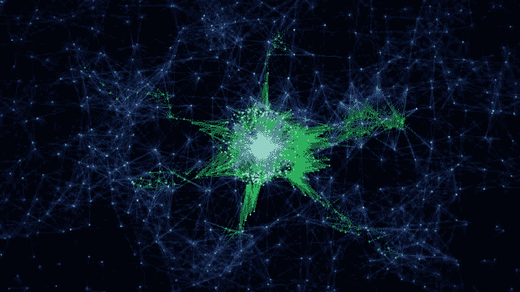
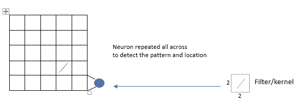
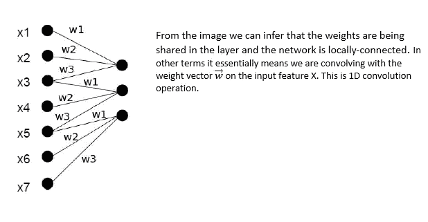
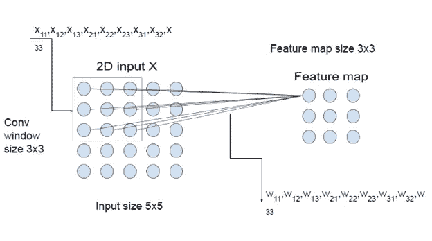
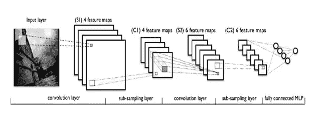
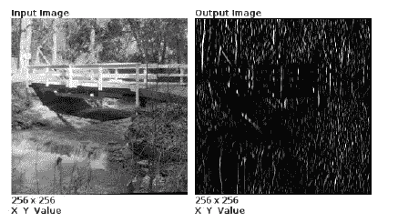
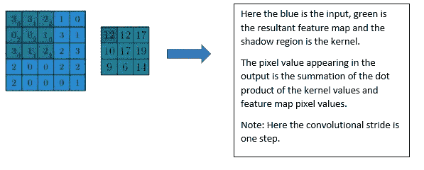
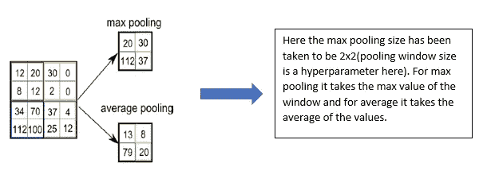

# 深入探究卷积神经网络

> 原文：<https://medium.com/analytics-vidhya/deep-dive-into-convolutional-neural-networks-800a7fdf9fd9?source=collection_archive---------0----------------------->

在我们深入探究 CNN 的架构和功能之前，让我们先了解一下为什么会有从多层感知器(MLP)模型到这种架构的转变。

非结构化数据问题和结构化数据问题的基本区别在于，对于结构化问题，数据是在表中。但是，我们也可以拥有非结构化数据，其形式为 28x28 矩阵图像的像素值。如果我们将它转换为长度为 784 的向量，并对所有可用的图像都这样做，那么它或多或少就变成了结构化数据。然而，这里有一个问题:在这种情况下，数据的顺序对我们很重要，不像结构化数据问题那样。因此，尽管作为向量的数据看起来是结构化的，但空间排列在构建模型时仍然起着重要作用，这就是深度 MLP 可能不适合非结构化数据问题的地方。

此外，让我们考虑下面的例子，以了解为什么 MLP 不是正确的解决方案:

比方说，我想建立一个模型来检测/分类上述两个图像 w.r.t 到模式的位置。假设输入的大小为 10x10。现在，如果我们建立一个 MLP 来分类这个问题，我们需要 100 个神经元来分类这个问题。假设我有 100 个不同的模式位置要检测，这意味着模型需要学习大约 100×100 个权重来分类。更复杂的是，如果有 10 个不同的边缘/类别(不同的方向)，那么模型必须学习 10×100×100 的权重来对图像进行分类。

所以，想象一下模型收敛所需的时间。此外，这当然会导致过度拟合，并且模型将不能通用化。因此，我们需要一种更好、更智能的方法来建立一个更快收敛和更好泛化的模型。

用于对输入图像进行卷积的滤波器

**可能进场:**

让我们分割输入图像，如上所示，现在尝试以更有效的方式找到模式。现在，我们使用 2×2 矩阵的过滤器/内核，而不是学习如此多的权重来对问题进行分类，也就是说，它具有 4 个权重，可以告诉我们该模式是否存在于该位置，并且该过滤器/内核可以在整个图像上重复，以告诉我们该模式是否存在。这意味着我们可以为每个类(边的类型)设置 10 个这样的过滤器/内核，这基本上可以告诉我们该特定类的位置，因此，这里我们需要 10x2x2 = 40 个权重，而不是我们的 MLP 中的 100000 个。这种用滤波器对给定输入图像进行卷积的有效方式称为卷积运算。现在，如果有一张狗的图片要分类呢？卷积仍然遵循相同的程序，但是这里我们有许多内核，每个内核检测不同的特征。

**1D 卷积:**

1D 卷积运算

在上面的例子中，卷积步幅是两步。(注:卷积步幅表示卷积运算期间移动的步数。)

到目前为止，我们只看到了 1D 卷积。

现在，让我们进入 **2D 卷积**:

2D 卷积运算

上图所示的特征图是卷积运算的结果，其窗口大小为 3x3，即特征图中的每个像素值都连接到 9 个神经元，这些神经元具有 9 个权重，并在整个范围内共享。神经元的输出是一个 sigmoid 函数，方程仍然是ϕ(∑w ⃗x+b).该操作有助于保留空间排列并在卷积层中共享相同的权重。

卷积运算的主要优点是:

1.参数共享(共享相同的权重)

2.尺寸缩减(在上述示例中，5x5 图像转换为 3x3)

3.图像的空间排列。(保留图案的位置)

**基本 CNN 架构:**

CNN 架构

在进入 CNN 的子采样层之前，让我们深入了解卷积层的空间排列特征。

考虑下面的例子:

我们的问题陈述是对图像中的桥进行分类。输出图像是对输入图像进行一次卷积运算的结果，这意味着卷积层中的内核保留了图像中的垂直边缘。但是，我们必须保留垂直边缘的位置吗？因为我们不试图重建图像，所以仅仅有垂直边缘而没有其位置是不够的吗？

与一个核卷积后的图像输出

想想看…

.

.

.

CNN 总是试图在给定的输入图像上建立一个特征层次。因此，有必要保留垂直边缘的空间排列，因为它可能需要与其他层中的水平边缘结合，以更好地理解图像。此外，在卷积时，有一个称为卷积步距的东西，它是继续卷积运算所需移动的步数。

步长等于 1 的卷积运算。

**汇集操作:(子采样层)**

有两种类型的池操作可以应用:

1.平均合并:该操作包括在特征图上的合并窗口大小中取像素值的平均值。

2.Max-Pooling:该操作包括在特征图上的池窗口大小中取像素值的最大值。

联营业务

如果你注意到这里的步幅等于池窗口的大小，而在卷积中步幅是 1。为什么？这是因为，在卷积中，如果我们迈了不止一步，我们总有可能会错过两步之间的模式。在池化的情况下，可以将步距设为最大池化窗口大小，因为在上面的图像中，如果步距为 1，则生成的特征图的大小将为 3x3，第一行中的值将为 20，30，30。这实质上意味着我们正在考虑冗余信息，即我们正在寻找甚至在输入图像中不存在的模式。

注意:可能有两个连续的卷积层，但没有两个连续的最大池层。此外，我们可以有多组卷积和最大池层。

汇集操作的主要优点是局部过渡不变性，即，由于我们考虑窗口大小中的最大像素值，最大值的位置无关紧要，这意味着图像中对象的位置无关紧要，但对象本身很重要。因此，在一系列卷积和最大池层之后，即使输入图像中的对象位置发生了巨大变化，它在层的深处也保持不变。

**展平操作**

CNN 总是在末端连接一个 MLP，而 MLP 只接受 vector 作为输入。因此，我们应用展平操作将 CNN 末端的矩阵转换为向量，以使其具有足够的兼容性，可以被 MLP 接受。

你可能会怀疑，经过一系列的卷积和最大池操作，因为两者都减少了图像的维度，我们很可能最终只有一个像素值。….？？

是的，你是对的…在一系列卷积和最大池化之后，您的要素地图大小始终有可能是 1x1，这在构建模型时会成为一个问题。然而，为了防止这种情况，我们应用了一种叫做填充的操作。

**填充:**

填充操作是简单地在矩阵周围添加零的列和行，以防止它减少到一个像素值或一个向量。

特征图上的填充操作

此外，填充还有另一个优点:一般来说，在卷积运算过程中，核保留了其中心的大部分特征，而没有赋予边界太多的重要性，这是足够直观的，因为我们作为输入给出的任何图像的边界可能并不太重要。但是，网络深处的边界可能很重要，添加额外的零值将有助于模型保留网络深处的要素。

CNN 的超参数:

1.卷积层:卷积步距、内核数量、内核大小和填充

2.池层:池内核大小和池类型(最大或平均池)。

注意:许多论文已经发表，表明最大和平均池给出或多或少相同的结果。

即使在这些操作之后，网络仍然类似于具有 sigmoid/ Re-Lu 激活函数的 MLP，并且使用反向传播来更新权重。这就是 CNN 的魅力所在😉。

感谢您阅读文章，并希望您已经获得了 CNN 的彻底解释。请留下您对文章的评论和反馈。