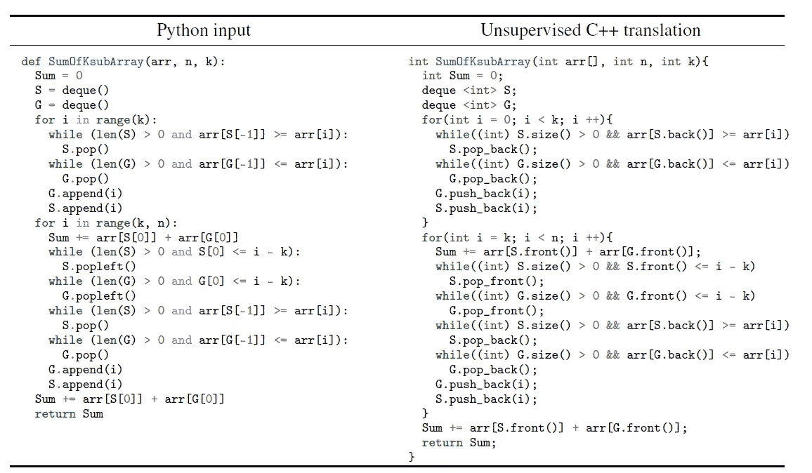
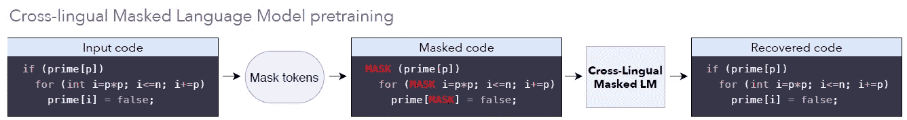
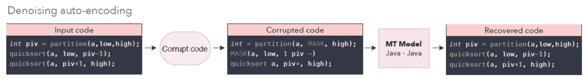
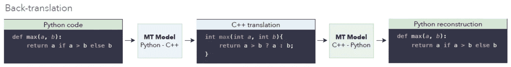
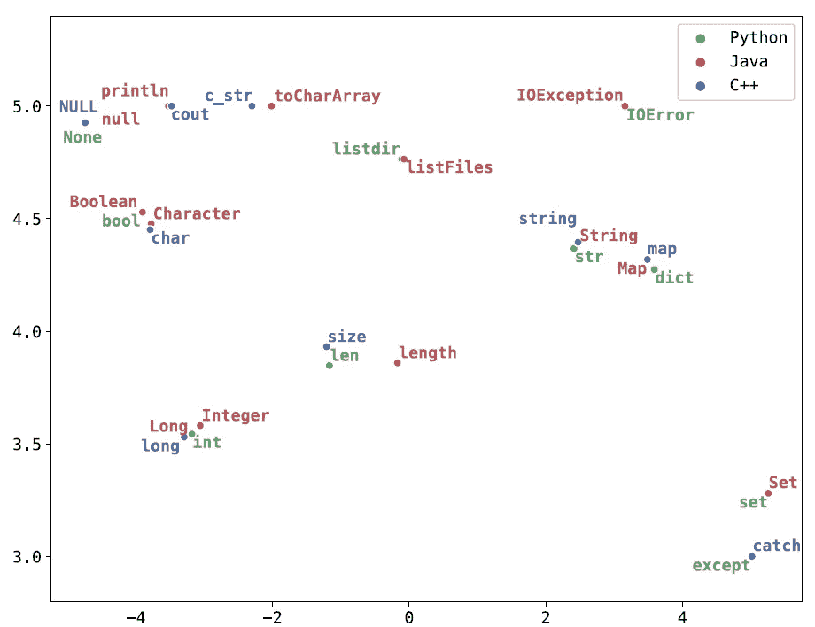
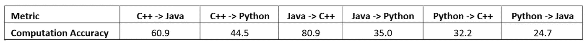
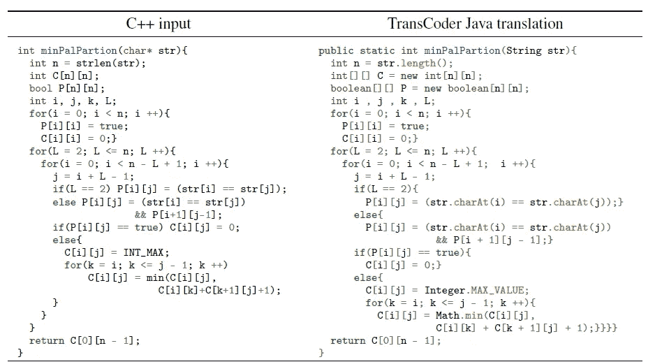
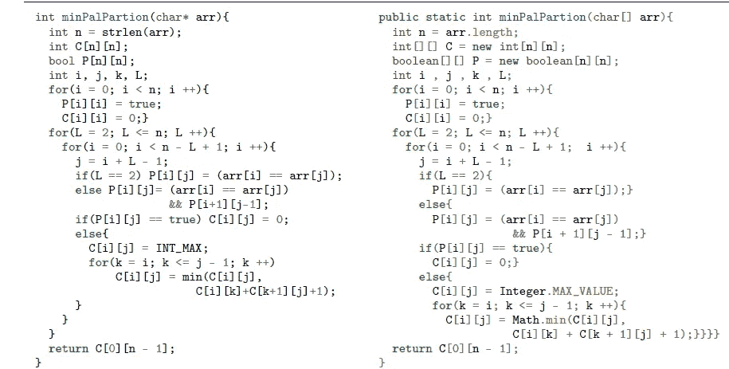
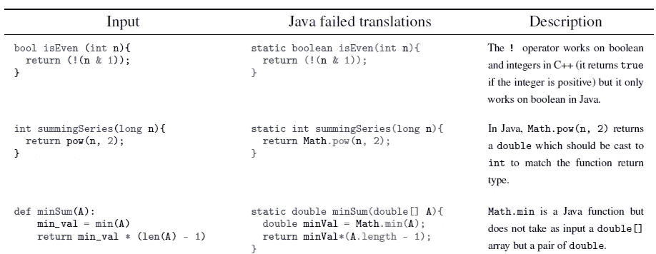

# 深入探究脸书的人工智能转码器

> 原文：<https://medium.com/analytics-vidhya/deep-dive-into-facebooks-ai-transcoder-6cc80880aae3?source=collection_archive---------22----------------------->

仅仅一个多星期，你们大多数人都会听说 Facebooks 人工智能研究团队(FAIR)开发了一种**神经转换器**，它使用**【无监督翻译】**将代码从 C++、Python、Java、Cobol 等高级编程语言转换成另一种语言。传统的方法是将源语言标记化，并将其转换为**抽象语法树(AST)** ，翻译器将根据定义翻译的手写规则使用该树翻译成选择的目标语言，这样就不会丢失抽象或上下文。几十年来，神经语言翻译取得了如此重大的进展，以至于这些神经模型往往比硬编码的手写规则好得多，尽管唯一的限制是足够的平行语料库的可用性。“无监督的 ML 翻译”方法在更大程度上解决了这一问题，其中脸书的研究团队使用 Github 的不同编程语言的单语源 cod e 的**大型语料库来训练模型。**

从 Python 到 C++的无监督翻译([来源](https://arxiv.org/pdf/2006.03511.pdf))

这让许多组织松了一口气，特别是在保险、政府和银行部门，他们继续使用遗留应用程序，几乎没有改进或微调的余地，因为它们是在美好的旧时代由真正精通它们的程序员编写的，例如 COBOL、Pascal、Fortran 等。尽管编程语言随着时间的推移不断发展，但从一种代码库移植到更高效或更现代的语言(如 Java、Swift、Ruby、python)是一件非常痛苦的事情，因为它需要源语言和目标语言方面的专业知识。例如，有报道称澳大利亚联邦银行花费了高达 7 . 5 亿美元和五年时间将其核心软件从大型机上的 COBOL 迁移到现代平台上。**基于规则的翻译**实现复杂，灵活性和可解释性较差。脸书的代码转换器解决了这个长期存在的问题。

**公平代码转换器的主要组件**

FAIR 代码转换器基于一个**转换器架构**，由一个**编码器和一个**解码器组成，基于“关注是你所需要的”论文。公平代码转换器依赖于编码器和解码器的单一模型，并基于 3 个原则:

1.**屏蔽语言模型预训练**

2.**去噪自动编码**

3.**反向翻译**

1.  **掩蔽语言模型预训练**

屏蔽语言预训练模型基于 BERT paper，它训练编码器从源代码中识别**屏蔽标记**。编码器被训练以理解编程构造，从而在某些令牌被屏蔽时识别丢失的令牌并重建它们。因此，编码器通过学习考虑了记号的统计共现或共存的**嵌入空间**，学习哪些记号和构造经常一起出现，从而学习代码的结构。这意味着在不同编程语言中通常表示相同意思的记号在高维空间中共享相同或相似的嵌入，这使得识别屏蔽记号成为可能。分类层是编码器的最外层，它基于条件概率对每个位置的标记进行预测。

研究论文中的例子说明了这一点，在这个例子中，即使关键字“if”被屏蔽了，但它还是被重新构造了。然而，这不仅适用于特定语言的“关键字”，也适用于源代码中的任何标记。

使用屏蔽令牌的模型预训练([来源](https://arxiv.org/pdf/2006.03511.pdf)

**去噪自动编码(DAE):**

以类似的方式，使解码器进行去噪自动编码，该编码从编码器获取输入，并以自回归方式每次输出一个令牌，该令牌被循环回同一解码器，以对后续令牌进行预测。解码器可能与编码器并行训练。论文中所说的“去噪”有助于解码器**识别源代码中被破坏的代码段**，这与编码器如何被训练来处理被屏蔽的令牌非常相似。部分损坏是屏蔽一些令牌，这也可以扩展到令牌或子令牌的加扰，甚至丢弃令牌。因此，被破坏的代码被馈送到编码器，解码器必须基于其被训练的单语源代码的语料库来生成恢复的代码，从而以由选择的语言令牌(Java、python、C++)确定的期望的目标语言生成输出..).

如论文“*中所述，DAE 目标的操作类似于监督机器翻译算法，在给定该序列的损坏版本的情况下，该模型被训练来预测令牌序列“*

消除代码损坏

因此，我们有一个编码器，它创建跨越多种语言的**共享嵌入空间**,还有一个解码器，如果给定的代码被破坏，它被调整为产生一个有效的代码，并且根据编码器所知道的，它应该将所有被破坏的代码映射到一个相似的嵌入空间。这种作品，但它并不完美，这就是为什么论文的作者选择了来自机器翻译文献的一个想法，称为**‘反向翻译’。**

**反向翻译:**

反向翻译已被证明在监督机器学习方法中非常有效，是无监督机器学习设置的重要组成部分，它通过使用**“源到目标”模型**和**“目标到源”模型**来查看翻译的功效。由于没有“基本事实”，目标-源模型试图首先创建其源语言版本，这是一个相当“嘈杂”的版本，而“源-目标”模型试图使用嘈杂翻译的输出并行地重新创建原始源代码。这两个模型并行训练，直到收敛，这时我们已经完美地翻译了原始源代码。

使用源->目标和目标->源模型同时训练的反向翻译进行验证([源](https://arxiv.org/pdf/2006.03511.pdf)

**模型架构:**

如论文所述，该模型使用一个具有 6 层的**转换器架构**，8 个维度为 1024 的注意头，对所有编程语言使用单个编码器和解码器。这在很大程度上简化了模型，减少了在学习共享嵌入的过程中完成的大部分繁重工作的内存需求。这些模型在**‘py torch’**中实现，并在 32 个 V100 GPUs 上训练。为了进一步减少内存需求和加快计算速度，使用了浮点运算。使用 **Adam optimizer** 对“代码转换器”进行了优化，学习率为 10–4

*“在预训练期间，我们在 C++、Java 和 Python 的批处理之间交替，由 512 个令牌的 32 个源代码序列组成。在训练时，我们在去噪自动编码和反向翻译目标之间交替，并使用大约 6000 个标记的批次”(摘自研究论文)*

对所有语言使用一个通用的、通用的标记器被认为是次优的，因为不同语言的语言构造存在差异，因此必须使用语言特定的标记器，例如，'[Java lang](https://github.com/c2nes/javalang)' tokenizer for Java，[clang【T3]' tokenizer for c++和内置的](https://pypi.org/project/clang/) [tokenizer](https://docs.python.org/3/library/tokenize.html) for Python 源代码，以确保标记化的序列是语言特定的关键字、运算符和构造的有效表示。

**跨语言令牌嵌入空间**

下面是共享嵌入空间的二维 t-SNE 表示，展示了特定语言关键字的嵌入。正如我们所看到的，意思相同或在相似的上下文中使用的关键字彼此非常接近。

所有编程语言的共享嵌入空间

**模型训练:**

该模型在来自 Github 公共数据集的超过**280 万个**开源 GitHub 知识库上进行训练。从数百万个可用的项目中，transcompiler 被训练来评估函数，而不是整个项目(因为这是最终所期望的)，因为函数更简洁，足以适合内存，并且还允许在单元测试期间进行更简单的评估。

**模型评估:**

代码转换器的性能是在从“GeeksforGeeks”中提取的 **852** **并行函数**上进行评估的，GeeksforGeeks 是一个在线平台，以几种编程语言托管问题及其解决方案。他们使用了一种新的度量标准——计算精度，来测试假设函数在给定相同输入的情况下是否会产生相同的输出，尽管还有其他度量标准，如“参考匹配”和“BLEU”分数。代码转换器使用**波束搜索**解码生成多个翻译，并且仅考虑那些具有最高对数概率的假设。通过这样做，脸书能够推断出，即使性能最好的代码转换器版本不能产生与参考代码完全相同的功能，它的翻译也具有**高“计算精度”**

下面是使用 Beam 1 的“计算精度”度量进行单元测试的结果。根据专家使用基于规则的系统得出的基线分数来评估这些分数。“波束 1”是**贪婪解码**，意味着保留具有最高计算精度的翻译，而丢弃其他翻译。这样做是为了提高速度效率，尽管该论文也提到了波束搜索的类型。我提到这个只是为了保持整洁。

计算准确度—用于评估翻译效率

**代码转换器对样本代码的评估**

根据作者的说法，与基于规则的模型相比，代码转换器表现出了**卓越的翻译能力**，并且能够成功地在数据类型之间转换，找到语言之间等效的数据结构、方法和库。

例如，在下面的源代码中，我们有一个 **C++ - > Java 翻译**，源代码中，C++函数使用了一个**字符指针** (char *str)作为参数，它定义了代码块中的数组级访问，代码转换器将其正确解释为类型**‘string’**，并在翻译版本中使用了**字符串特定方法**。

基于变量名的数据类型的模型转换:第 1 部分([来源](https://arxiv.org/pdf/2006.03511.pdf)

再次测试了相同的源代码，但是这次在源代码中将参数名从“str”更改为“arr ”,这导致代码转换器将 java 等效物评估为字符数组(char [] array ),并因此在翻译版本中使用字符特定的方法。这显示了相对于使用对人类编写代码的统计推断的基于规则的系统的显著优势，其也更不容易出错。

基于变量名的数据类型的模型转换:第 2 部分([来源](https://arxiv.org/pdf/2006.03511.pdf)

**远非完美**

尽管代码转换器已经被证明比基于规则的系统优越得多，但它们远非完美。作者提到了主要由于编译错误而导致翻译失败的案例。大多数编译错误都是由于**重载**方法或函数，需要类型转换等等。但是，如果模型在足够的代码基础上进行推理，以理解编程语言中方法调用的差异，这可能会得到解决。下面是研究论文中翻译失败的一些例子。

失败的翻译示例([来源](https://arxiv.org/pdf/2006.03511.pdf))

**概要:**

我们从脸书人工智能研究所(FAIR)看到的是机器代码翻译的巨大飞跃。虽然这可能处于初期阶段，但肯定有巨大的潜力，可以转化为数十亿美元的节省收入，更少的人为干预和更少的错误。虽然它们可能远非完美，但目前，它们可以帮助人类完成代码翻译中的大部分繁重工作，谁知道呢，在不久的将来，我们可能会有完美的代码转换器。

感谢阅读这篇文章。我试图尽可能准确地解释我的研究论文。期待收到你的来信。干杯。

**参考文献:**

1.  [编程语言的无监督翻译](https://arxiv.org/pdf/2006.03511.pdf)
2.  [BERT:用于语言理解的深度双向转换器的预训练](https://arxiv.org/pdf/1810.04805.pdf)
3.  [一路下来都是 COBOL](https://increment.com/programming-languages/cobol-all-the-way-down/)
4.  [BLEU 评分](https://en.wikipedia.org/wiki/BLEU)