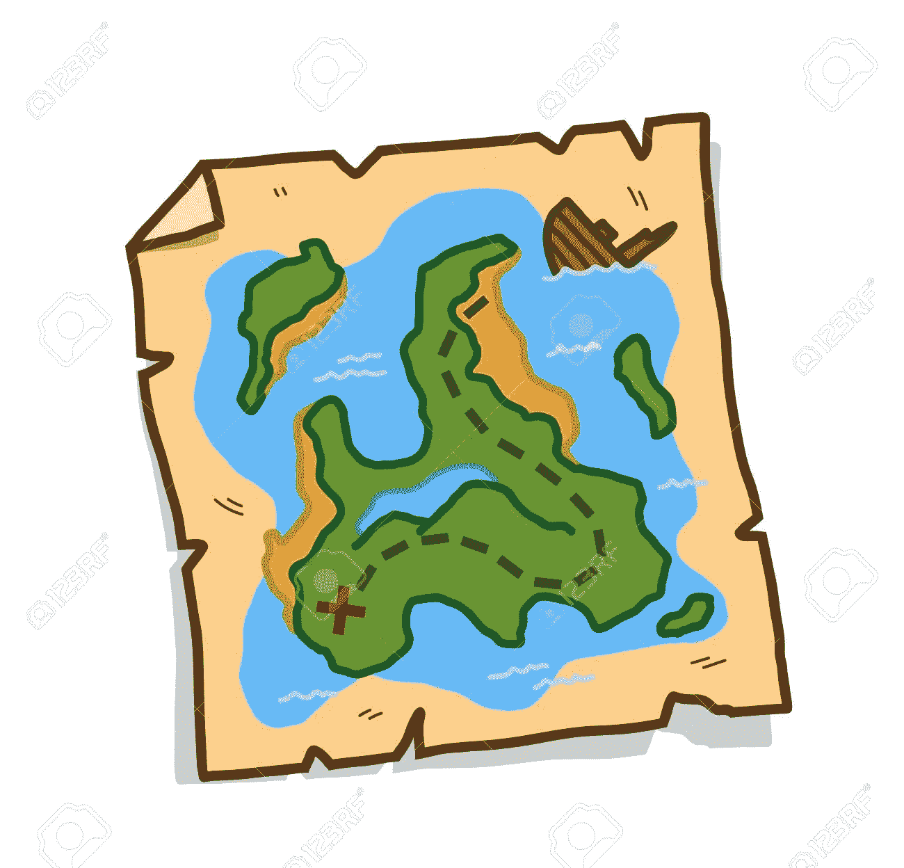

# 深入研究 JavaScript 地图对象

> 原文：<https://medium.com/analytics-vidhya/deep-dive-into-javascript-map-object-24c012e0b3fe?source=collection_archive---------15----------------------->



JavaScript 从诞生到现在已经走过了漫长的道路。多年来，JavaScript 逐渐向语言中引入了新的特性，使其更加健壮。

ES6 的引入为 JavaScript 带来了大量新特性，这极大地简化了开发人员的工作。其中一个特性是**映射**数据结构。

当您需要一组严格的键/值对，但是需要比常规 JavaScript 对象提供的更多的功能时，JavaScript map 数据结构是一个强大的工具。

# 什么是地图？

如前一段所述，在计算机科学术语中，映射是保存键/值对的数据结构。映射允许在数据结构中快速查找关键字，在 0(1)个访问时间内轻松访问一个值。地图在 Java 和 C#等其他语言中已经存在了很长时间。

让我们从地图的一些基本操作开始:

## 创建地图

通过调用它的构造函数并用 **new** 关键字实例化它来创建一个地图。有两种方法可以做到这一点。

1.  您可以用无参数构造函数实例化一个映射。

```
let myMap = new Map()
```

这将创建一个没有默认值且大小为 0 的新地图。

```
console.log(myMap.size);
//0
```

2.实例化 map 的另一个选项是将值传递给构造函数

```
let myMap = new Map([[1, 'one'],[2, 'two'],[3, 'three'],]);
```

这将创建一个默认大小为 3 的映射，并将传递的参数作为键/值对。

## 向地图添加新元素

您可以通过调用 **set** 方法向地图添加新元素，该方法需要两个
参数——一个键和值。

```
let myMap = new Map()
myMap.set('Ford', 'American');
myMap.set('Kantanka', 'Ghana');
myMap.set('Toyota', 'Japan');
myMap.set('Volkswagen', 'German');
```

## 从地图中检索元素

从 map 中检索元素非常简单，只需调用 map 的 **get** 方法，并使用**键**作为参数。继续上面的“设置”示例:

```
console.log(myMap.get('Kantanka')); //Ghana
console.log(myMap.get('Toyota')); //Japan
console.log(myMap.get('Ford')); //American
console.log(myMap.get('Volkswagen')); //American
```

如果您试图访问一个不存在于映射中的键，将返回一个未定义的

```
console.log(myMap.get('unknown')); //undefined
```

****小心**:如果你将一个**对象**类型的值赋给一个键，它将是一个引用类型，这意味着对该对象的任何更改都将反映在映射中。**

```
let myMap = new Map();const car = {
 name: 'Impala'
 Year: '2020'
}myMap.set('myNewCar', car);
console.log(myMap.get('myNewCar')); // {name: "Impala", year:"2020"}car.name = 'Malibu';
car.year = '2015';console.log(myMap.get('myNewCar')); // {name: "Malibu", year:"2015"}
```

# **地图与常规对象**

**前面我提到过，Map 是一种键/值对数据结构。JavaScript 中的常规对象也是如此，但应该指出两者之间的一些差异:**

*   **JavaScript(JS)对象是属性的集合， **JS 对象只接受两种类型的属性类型 string 和 Symbols** ，如果你试图将任何其他类型作为键传递给 JS 对象，它会将它们转换成 String。**

```
//Regular JS Object
const car = {
  name: 'Impala',
  year: '2020',
  true: 1
}console.log(Object.keys(car)); //["name", "year", "true"]
```

**而 Map 将接受任何类型的键，不会将其转换为字符串。地图甚至可以接受一个函数作为它的键。**

```
let myMap = new Map()
myMap.set('Ford', 'American');
myMap.set('Kantanka', 'Ghana');function randomKey() {
  return 'key1'
}myMap.set(randomKey(), 'generated random key');
console.log(myMap.get('key1')); //generated random key
```

*   **映射是可迭代的，这意味着您可以使用循环，如 *forEach* 或 *for…of* 来迭代它的值。**

```
let myMap = new Map()
myMap.set('Ford', 'American');
myMap.set('Kantanka', 'Ghana);
myMap.set('Toyota', 'Japan');
myMap.set('Volkswagen', 'German');//Using forEach loop
myMap.forEach((value, key) => {
  console.log(key, value);
})
//Ford American
//Kantanka Ghana
//Toyota Japan
//Volkswagen German -----------------------------------------------------------------//Using for...of to iterate over valuesfor (let value of myMap.values()) {
  console.log(value);
}
//American
//Ghana
//Japan
//German
```

**至于 JavaScript 对象，默认情况下它们是不可迭代的。试图使用上述循环(forEach，for…of)迭代 JS 对象将会抛出一个 **TypeError** 异常**

```
const car = {
  name: 'Impala',
  year: 2020
}for (let value of car) {
  console.log(value);
}
//Uncaught TypeError: car is not iterable
```

**迭代对象的唯一方法是在循环中使用*for…或 *Object.keys* 通过它的键***

```
const car = {
  name: 'Impala',
  year: 2020
}//Using for...in loop
for (let key in car) {
  console.log(key);
}//name
//year
----------------------------------------------------------------//Using Object.keys()
console.log(Object.keys(car));
//["name", "year"]
```

*   **map 跟踪它的集合大小，您可以使用 **size** 方法来检索 map 的当前大小，其访问时间为 **O(1)** 。**

```
let myMap = new Map()
myMap.set('Ford', 'American');
myMap.set('Kantanka', 'Ghana');console.log(myMap.size); //2
```

**JS 对象不跟踪它的大小，获得对象大小的唯一方法是迭代它的键，这是访问时间的一部分。**

*   **插入到地图中的键保持它们的顺序。当你迭代一个地图时，它将按照插入的顺序返回键。**

```
let myMap = new Map()
myMap.set('Ford', 'American');
myMap.set('Kantanka', 'Ghana);
myMap.set('Toyota', 'Japan');
myMap.set('Volkswagen', 'German');myMap.forEach((value, key) => {
  console.log(key);
})
//Ford
//Kantanka
//Toyota
//Volkswagen
```

**直到引入 ES6，常规 JS 对象才保持键的顺序。但是即使在 ES6 中，JS 对象也只能以正确的顺序保存字符串和符号的键，任何其他被转换成字符串的类型都不能以正确的顺序保存**

```
const car = {
  name: 'Impala',
  year: '2020',
  true: 'boolean',
  7: 'just random number'
}
console.log(Object.keys(car)); //["7", "name", "year", "true"]
```

**以上几点显示了地图与常规对象的不同，以及它相对于普通的旧 JavaScript 对象的优势。**

# **其他有用的映射方法**

*   ****clear()** :从 map 实例中删除所有键/值对。**
*   ****delete(key):** 如果传递的参数存在于 map 实例中并已被移除，将返回布尔值 true，否则返回 false。**
*   ****entries():** 返回一个新的迭代器对象，该对象包含 map 实例中每个元素的，并且按其插入顺序排列。**
*   ****iterator():** 返回一个新的 iterator 对象，它包含 Map 对象中每个元素的键/值对的数组，按照元素的插入顺序排列。**

# **何时使用地图**

*   **当需要除字符串和符号之外的不同数据类型的键值时，应该考虑映射。**
*   **当您要求键/值对是可迭代的时，应该考虑映射。**
*   **映射有更多有用的插入和删除功能，这使得在必须插入和删除的情况下更容易使用对象。**

**您是否一直在使用地图对象，或者对它不熟悉？请在下面留下您对地图对象的想法和使用案例的评论。**

**如果你喜欢这篇文章，一定要点击鼓掌按钮，看看我下面的其他文章！**

*   **[**什么是打字稿元组**](/@ericsarpong/what-is-a-typescript-tuple-814a016f61fd)**
*   **[**概括地说异步编程(理论)**](https://ericsarpong.medium.com/asynchronous-programming-in-a-nutshell-theory-d5fd07cf3b22)**
*   **[**角度路由:命令式 vs PopState**](https://medium.com/p/7d254b495c54/edit)**