# 深入探究逻辑回归:简单却如此强大

> 原文：<https://medium.com/analytics-vidhya/deep-dive-into-logistic-regression-simple-yet-so-powerful-3a9468dc6819?source=collection_archive---------6----------------------->

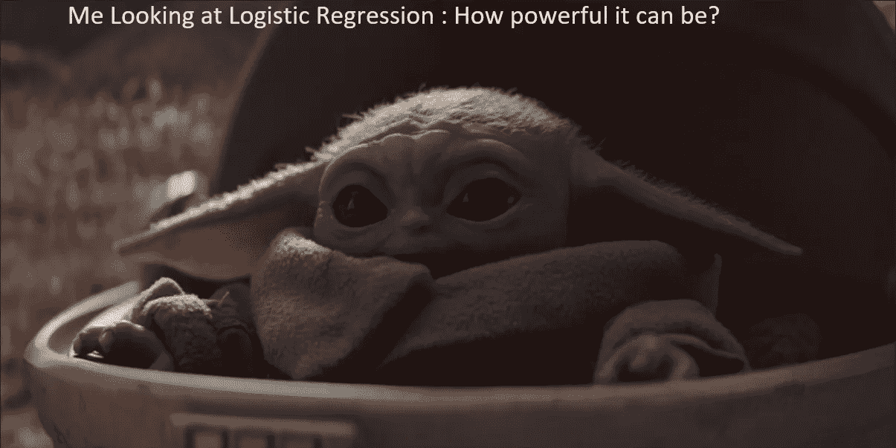

[信用](https://external-content.duckduckgo.com/iu/?u=https%3A%2F%2Fstatic1.srcdn.com%2Fwordpress%2Fwp-content%2Fuploads%2F2019%2F11%2FThe-Mandalorian-Baby-Yoda-2.jpg&f=1&nofb=1)

```
This blog is beginner friendly, will start from scratch and cover up to a medium-advance level of intuitive understanding of Logistic Regression.Blog is divided into 3 parts. Contents of each part are mentioned below.All the techniques and concepts are explained using [first principle technique](https://jamesclear.com/first-principles).This blog uses various references as well which I have mentioned below.Criticism and doubts are welcome.Please go through each image carefully as these images carry details and essence if the blog.Hope you enjoy learning with me :)
```

## **目录**

**第一部:**

1.  对逻辑回归的直观理解
2.  几何解释
3.  逻辑回归和挤压背后的数学
4.  损失最小化解释:物流损失
5.  逻辑损失的概率解释
6.  调整:权衡 b/w 过度拟合和欠拟合

**第二部分:**

1.  逻辑回归的时间复杂性
2.  各种情况下逻辑回归行为
3.  模型可解释性
4.  特征重要性
5.  逻辑回归的利与弊

**第三部分:**

1.  伪代码实现
2.  是什么让逻辑回归变得强大？
3.  哪里不应该使用逻辑回归？
4.  复习学习
5.  结论和面试问题
6.  额外资源

# 第一部分:

# 1.对逻辑回归的直观理解

> 从最简单的意义上来说，逻辑回归是一种机器学习分类模型。假设数据集是线性可分的，使用线性边界(线、平面、超平面)来分类两个类。

假设，我们有[二元类分类](https://external-content.duckduckgo.com/iu/?u=https%3A%2F%2Fraw.githubusercontent.com%2Fritchieng%2Fmachine-learning-stanford%2Fmaster%2Fw3_logistic_regression_regularization%2Fmulticlass_classification.png&f=1&nofb=1)问题，即我们想要使用两个特征'**身高**和'**头发长度**'来分类两个类'**男性**和'**女性**'。

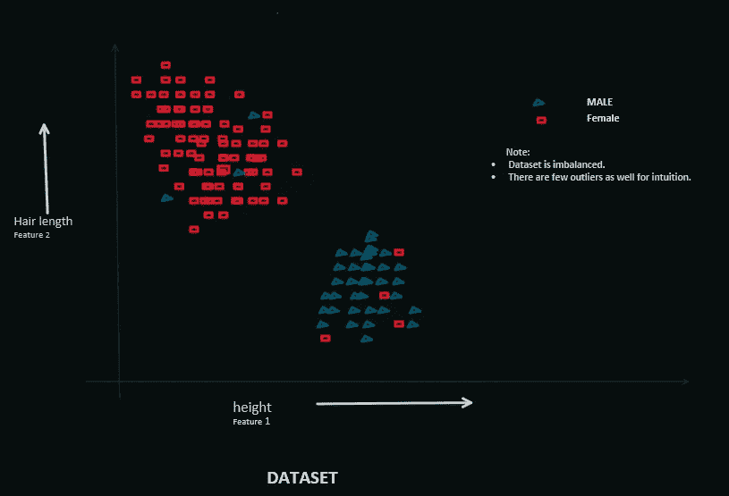

数据集示例

***对数据集*** 的观察:

**数据集不平衡**，即与男性数据点相比，女性数据点的数量非常多。并且它还**包含很少的离群值**来模拟真实生活数据集。**数据集男女比例为 70:30**

现在，我们想使用逻辑回归来预测查询点 x *_q 的类别。*

这里，为了便于理解，我将**公**级表示为**正级**，将**母**级表示为**负级**

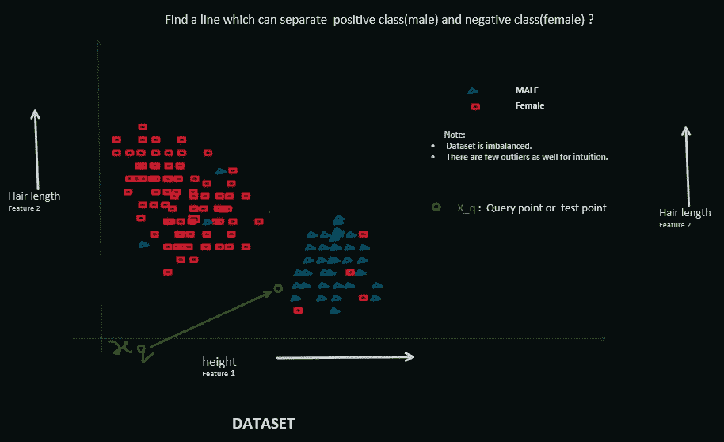

通过使用线分隔“男性”类和“女性”类来预测查询点 x *_q 的类*

仅仅通过看这张图片，甚至一个蹒跚学步的孩子也能画出一条线来区分积极和消极的阶层。

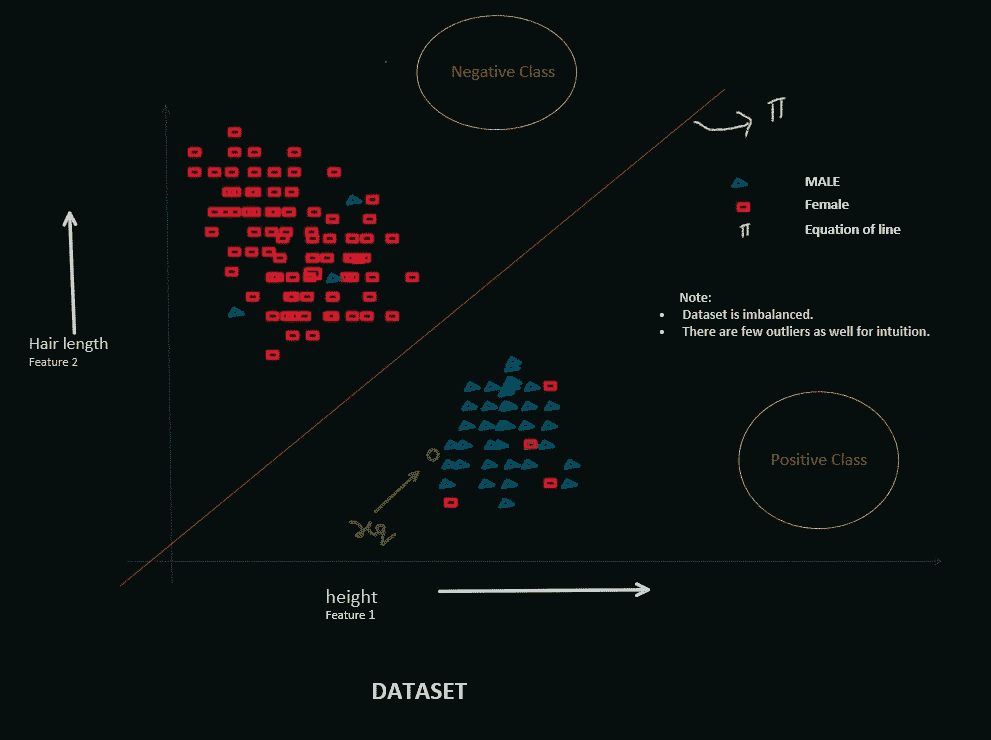

画一条线 **π** 来区分正类和负类

这是在卫生逻辑回归所做的。看着这个图像，我们可以说**所有的阳性点(男性类)在线**的一侧，而**所有的阴性点(女性类)在线**的另一侧。而 o **ur 查询点 x_q 属于正类。**

逻辑回归试图找出一条“线”或“超平面”来区分两个类别。

在两个类之间画一条线，对于人类来说，仅仅通过看图像来画一条线可能很容易，但是如何教机器找到这条线呢？

为了理解这一点，我们需要了解一些基本的数学和参数，决定了线或超平面的方程。

# 2.逻辑回归的几何解释

首先，让我们学习什么是决定线方程的参数，以及它如何影响决策边界。

**决定线方程的参数**

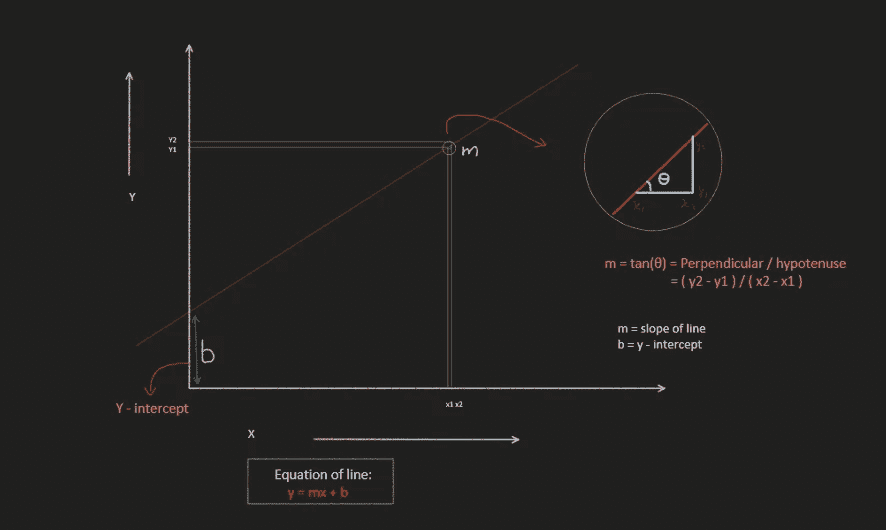

直线方程

现在，我们已经得到了直线的两个参数斜率(m)和 y 轴截距(b)。

下一个问题来了，如何确定 **m** 和 **b 的正确值？。**查看下图，选择正确的 **m** 和 **b** 值。

**情况 1:相同的 y 轴截距，但斜率不同**

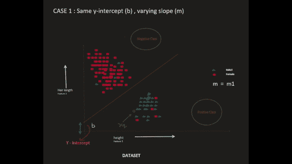

案例 1:y 轴截距相同，但斜率不同

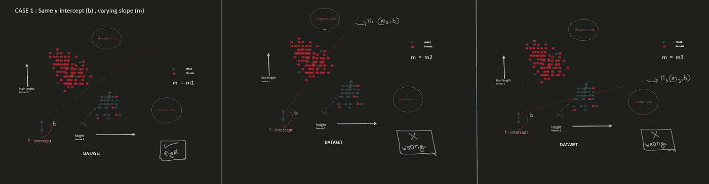

案例 1:y 轴截距相同，但斜率不同

**情况 2:**V**y 轴截距不同但斜率相同**

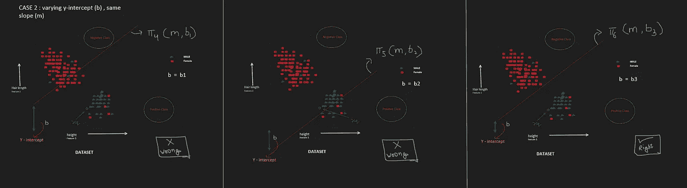

情况 2:y 轴截距变化但斜率相同

在上述两种情况下，只有两次我们得到了正确的直线方程，从而能够正确地划分男女阶级。这就是逻辑回归的任务。找到正确的线或超平面的参数，可以正确地分类两类。

# 3.逻辑回归背后的数学

到目前为止，由于可视化的原因，我们只使用了二维，但是现在我们将使用**‘d’**维数来进行公式的数学推导。

因此，从逻辑回归的所有几何解释中，我们知道我们需要找到参数(m，b)来找到直线方程。

这里，我使用**权重(w)交换斜率(m)和偏差(b)交换 y 截距(b)**

假设 **H 是权重(w)和偏差(b)** 的函数

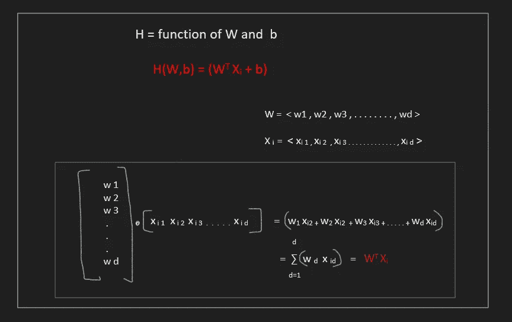

求直线方程的数学函数

现在，我们已经得到了线的数学方程，但是我们如何知道一个查询点是否属于哪一类，以及它是否被正确分类。

假设，我们已经得到了划分两类的方程线或超平面。但是如何计算这条线给出的模型的精度或性能呢？

看看这两个例子就明白了:

**实例 1 :**

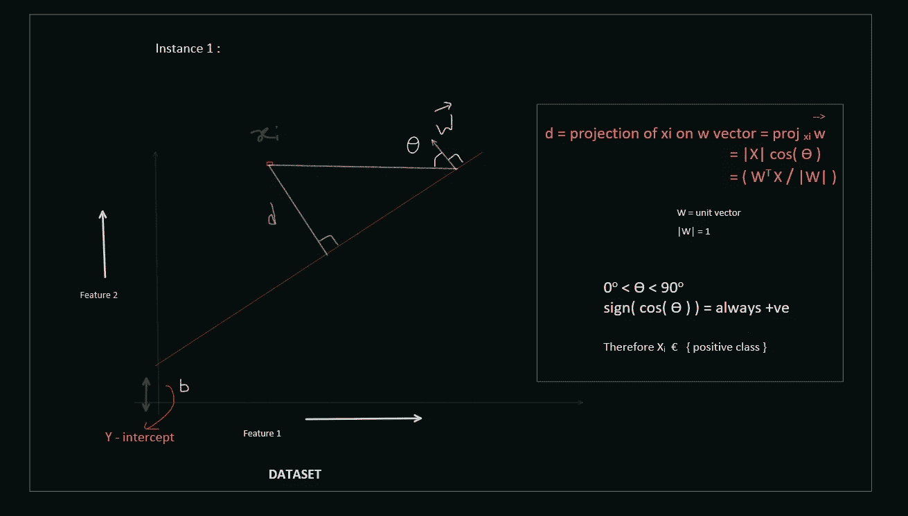

实例 1 : Xi 属于阳性类

**如果数据点与垂直于直线的权重向量在同一侧，则 Xi 属于正类**

**实例二:**

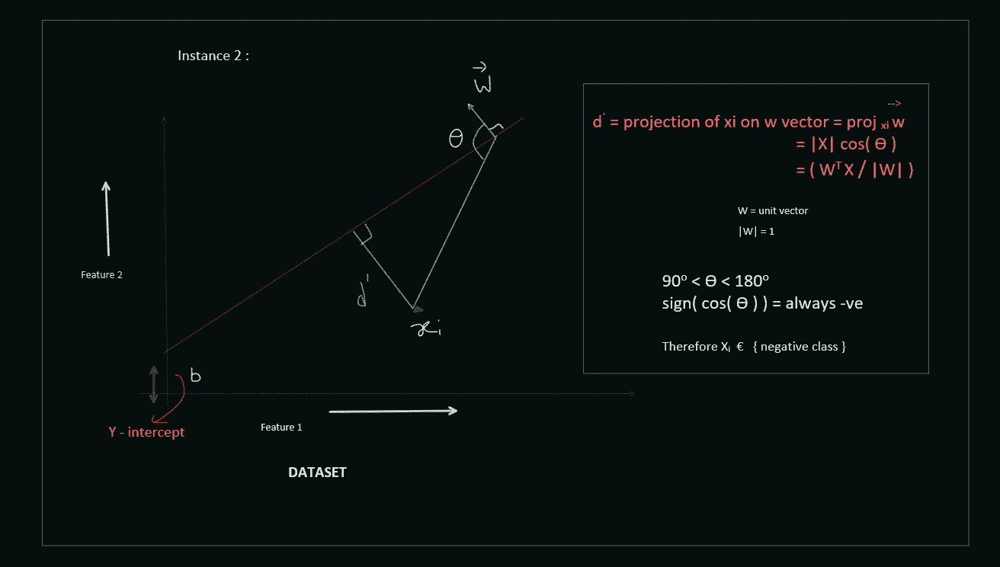

例证 2: Xi 属于消极类

**如果数据点在线的对面，那么 Xi 属于正类**

让我们看几个案例来更好地理解它。

**案例 1 :**

实际类别:正

预测类:正

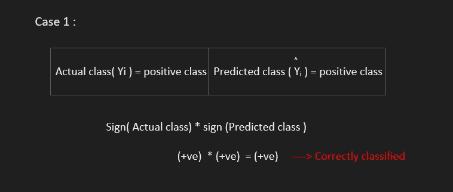

正确分类

**按型号正确分类**

**案例二:**

实际类别:负

预测类别:负

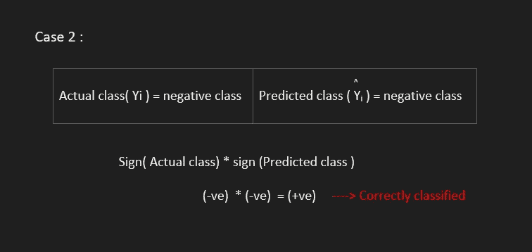

正确分类

**按型号正确分类**

**案例三:**

实际类别:正

预测类别:负

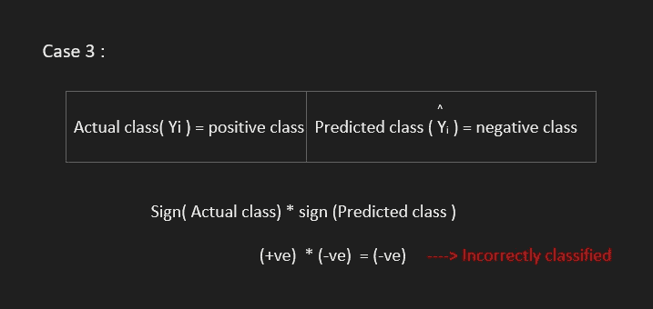

分类不正确

**被型号错误分类**

案例 4 :

实际类别:正

预测类别:负

**被型号**错误分类

查看以上四种情况，我们可以得出**简单损失函数(L)** 来找到能够正确分类两类的大多数数据点的最佳超平面。

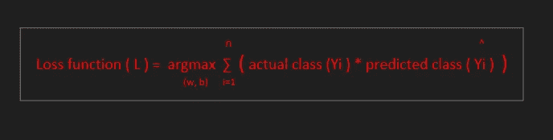

基于上述四种情况的简单损失函数

让我们像读诗一样读英语方程式。

> ***我们需要找到能够最大化所有实际类和预测类数据点的乘积之和的* w *和* b *。***

上面的损失函数看起来很合理，但是在这个损失函数中有一个小问题。如果两个类的实际分布有非常远的异常值怎么办。

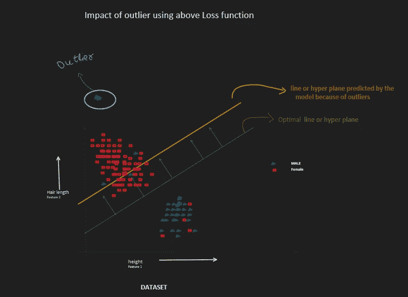

异常值对简单损失函数的影响

仅仅因为几个异常值，我们最简单的损失函数模型悲惨地失败了。

那么，有没有什么方法可以克服异常值的影响呢？

是的，有。**挤压:使用 Sigmoid 函数**

# **挤压:乙状结肠功能**

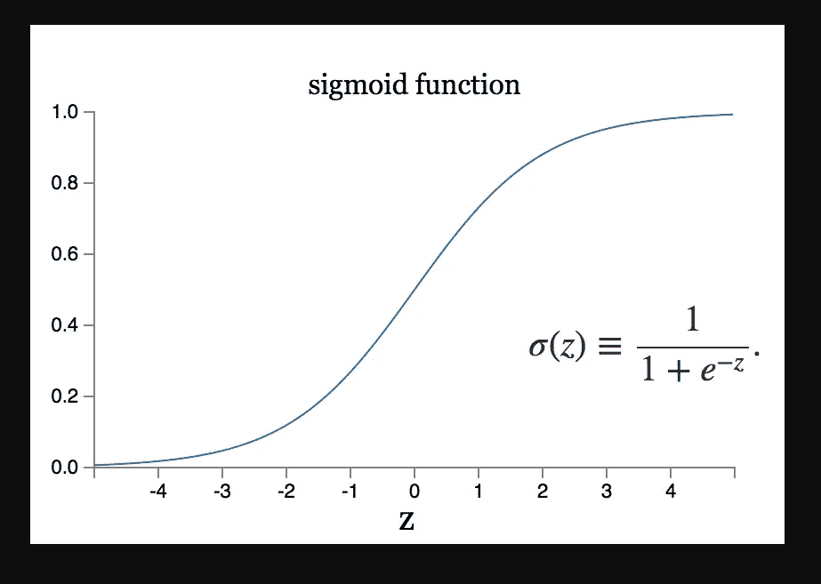

[乙状结肠功能](https://external-content.duckduckgo.com/iu/?u=https%3A%2F%2Fcdn-images-1.medium.com%2Fmax%2F1600%2F1*sOtpVYq2Msjxz51XMn1QSA.png&f=1&nofb=1)

使用 **sigmoid** 函数，我们可以减少离群值的影响。因为 **sigmoid 函数的范围在 0 到 1**【0，1】之间，最适合我们的二元类分类问题。

即使一个数据点是异常值，该点的不正确分类的贡献也只是一个单位，不会对总损失函数产生太大影响。

**更新损失函数:**

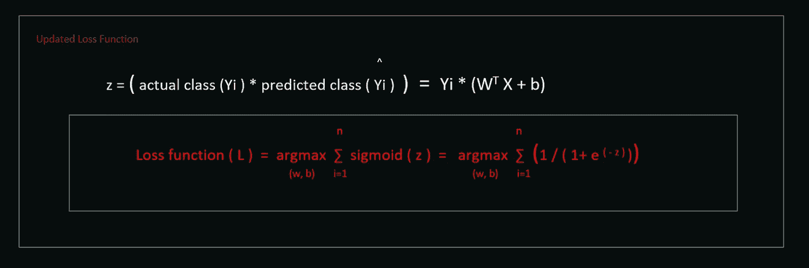

更新损失函数:包括 sigmoid 函数

在平均意义上，sigmoid 函数充当挤压函数，将极端正点挤压为 1，极端负点挤压为 0。因此，如果有一个极端的异常值，在压缩其损失后，它不会对整体损失产生太大影响。

仍然需要对损失函数做一些改变，我们将在下一节**‘损失最小化解释’中看到。**

# 4.损失最小化解释:物流损失

为了理解这一点，从这个角度考虑，我们需要一个度量或一个函数，它可以根据该点的概率得分计算所有错误的类别预测。

例如

**实际等级:易= 1**

**预测类别的概率:p(y_hat) = 0.6**

**预测类:y_hat =1**

虽然我们预测的类别分类正确，但如果看概率得分，我们只有 60 %的把握它属于类别{1}。因此，如果你把这个概率分数给一个医生，说我只有 60%的把握这个人有患癌症的机会，医生不会把这个人归类为患癌症，但他们会进一步在病人或询问者身上做更多的实验以确定结果。

**上面的例子清楚地表明，我们需要一些函数来惩罚不正确的预测类，即使是概率得分的小偏差。**除此之外，我们希望我们的损失以**最小化损失**的形式出现，这样我们就可以找到损失函数的[****最小值****](https://duckduckgo.com/?q=minima+math&iar=images&iax=images&ia=images&iai=http%3A%2F%2Fmathonline.wdfiles.com%2Flocal--files%2Flocal-maxima-and-minima-and-absolute-maxima-and-minima%2FScreen%2520Shot%25202014-08-31%2520at%25202.33.00%2520PM.png) **。**

**[**对数函数**](https://www.britannica.com/science/logarithm) 的性质完全符合我们的要求。所以我们将 Log 合并到我们更新的损失函数中。请看下图，逐步过渡。**

**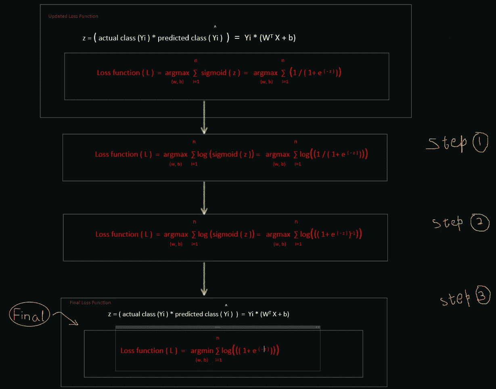**

**逐步过渡到最终损失函数:**物流损失****

## **逻辑回归的最终损失函数:逻辑损失**

**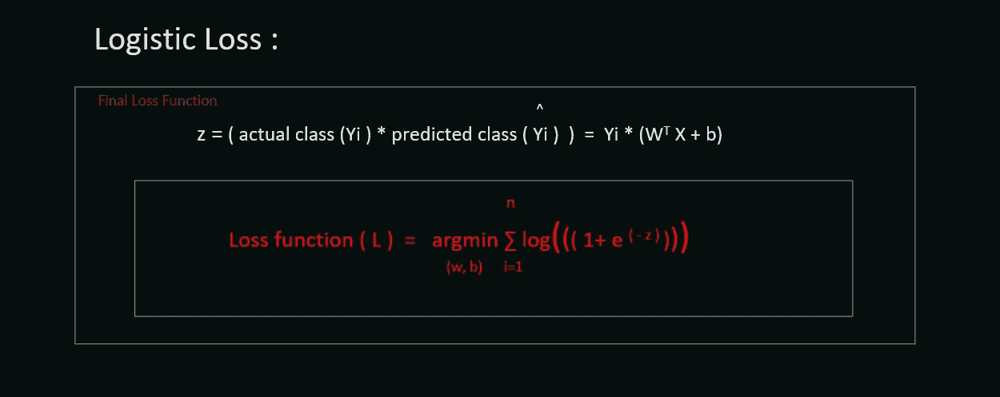**

****物流损失期末****

> *****用英文读逻辑斯谛损失函数*** :**
> 
> **找到**权重(W)** 和**偏差(b)** ，使得所有数据点的逻辑损失之和最小。**

**最后，我们得到了最终的逻辑损失函数，它具有最小化损失的行为，并且它将基于预测的概率得分惩罚不正确的分类点。而我们之所以只用对数函数，我们将在下一节看到**逻辑回归的概率解释。****

## **物流损失的图形行为**

**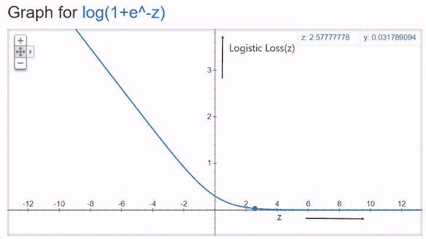**

**[物流损失图形行为](https://www.google.com/search?safe=active&sxsrf=ACYBGNROgZXSLcTTukVeg9ZuLCGRUKB0Kw%3A1575763633562&ei=sT7sXd77IYyd4-EPhLaPyA0&q=log+%281+%2B+e%5E-z%29&oq=log+%281+%2B+e%5E-z%29&gs_l=psy-ab.1.0.0i367.53078.53806..54752...0.3..0.217.345.0j1j1....1..0....1..gws-wiz.......0i71j0i30j0i5i30.qyT_ldBY-IY)**

**图表解释:**

****z 是+ve →正确分类****

****z 是-ve →分类不正确****

****对于每一个不正确的分类点，z 的值是大的负值，因此(z)的逻辑损失急剧增加。****

**逻辑回归的任务是找到使所有数据点的逻辑损失最小的权重(w)和(b)。**

**除了逻辑回归损失，逻辑回归中还需要一个小项来完成逻辑回归，它是**正则项，**在过度拟合和欠拟合之间进行权衡，我们稍后将在“第 1 部分的第 6 节”中对此进行研究。**

# **5.逻辑损失的概率解释**

**损失最小化解释和概率解释的最终结果或多或少是相同的，只是我们将在本节中看到的逻辑损失推导方式略有变化。**

**我们将使用对数损失作为度量来计算我们预测的损失。**

**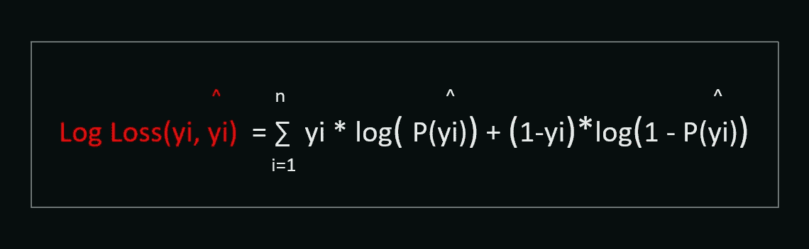**

**原木损失公式**

**P(Yi _ hat)= Yi 属于类 1 的预测概率得分。**

****Yi = Yi 的实际值****

**这里易属于{0，1}。**

**现在，我们只需要想出一个可以计算的函数**

**p(yi=1| Xi)**

**我们在逻辑损耗的几何解释中已经看到，sigmoid 函数是可以计算这个值的函数。因此，我们将使用 Sigmoid 函数来计算 p(y=1|Xi ),并在上述对数损失函数中输入该值。**

**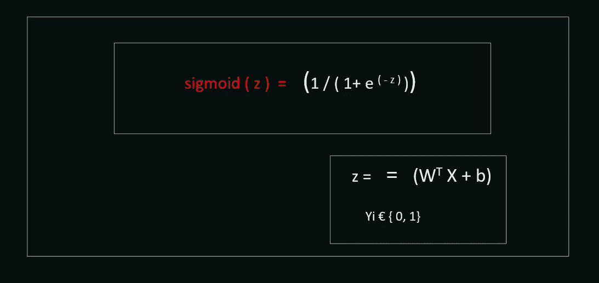**

**计算 P(yi=1 | Xi)的 Sigmoid 函数**

**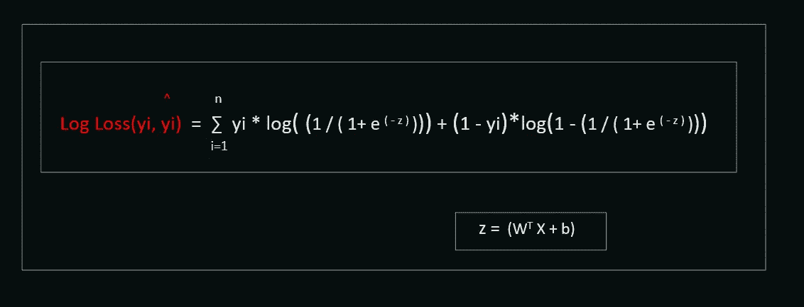**

**在输入 sigmoid 函数的值后**

****这是我们在对数损失函数中输入 sigmoid 函数后，以逻辑损失**的概率解释形式给出的最终损失函数。经过一些数学处理后，这个损失和我们从几何解释中得到的损失看起来是一样的。但是为了简单起见，我们就让它保持原样或者[参考这个](http://himarsh.org/the-math-of-logistic-regression/)。**

**到目前为止，这就是逻辑回归的概率解释。**逻辑损失的概率解释和几何解释的唯一区别是，这里 Yi 属于{0，1}，在几何解释的情况下 Yi 属于{-1，1}。****

# **6.调整:权衡 b/w 过度拟合和欠拟合**

**这是什么？如何在我们的损失函数中实现？**

**到目前为止，我们已经了解了逻辑回归的所有几何和概率损失解释，但我们还没有看到任何关于**欠拟合**的地方，即如果我的模型高度偏向多数类或**过拟合**如何解决问题，其中模型在训练数据上过度训练，并在验证数据上给出错误预测(高方差模型)。**

**参见此图，了解**过装配 V/S 欠装配****

**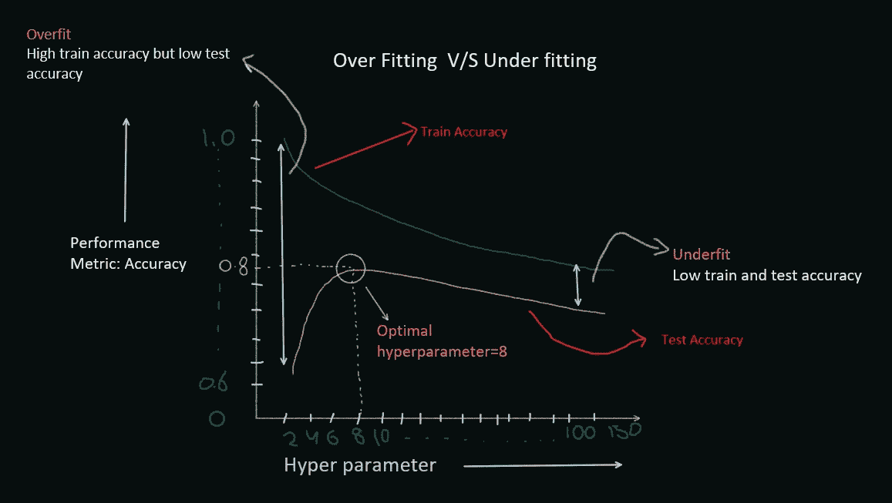**

****过装配 v/s 欠装配****

**在这两种损失解释中，我们已经看到，我们只是试图最小化损失，因此很有可能我们会根据训练数据过度训练模型，最终过度拟合模型。**

**这就是我们需要正则化模型的原因，这样我们就可以在过度拟合和欠拟合之间进行权衡。在下图中，我们正在解释正则项的公式，并了解它如何影响模型？**

****正则化项****

**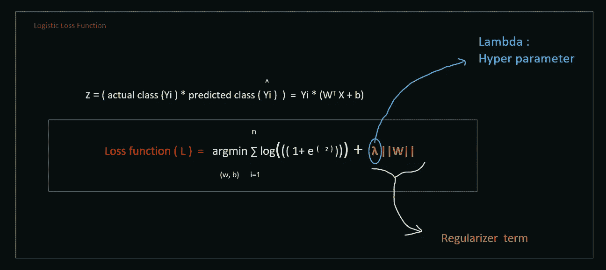**

**λ(**λ**)**为超参数****

## ******超调λ******

******案例:******

1.  ****λ非常大~所有的焦点将转移到最小化正则化项，因此在拟合下****
2.  ****λ非常小~所有的焦点将转移到最小化损失项，因此过度拟合****
3.  ****最佳λ~给出最小的确认损失。这就像过度拟合和欠拟合之间的完美权衡****

****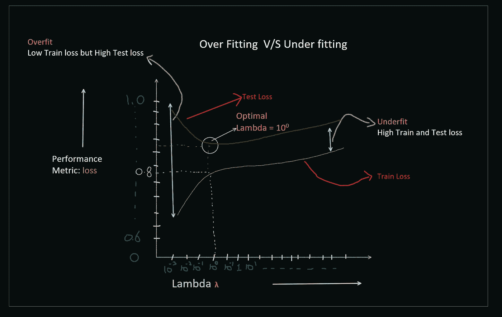****

******过度装配和欠装配之间的权衡******

****这是本博客第一部分的结尾。到目前为止，我们已经学习了这些话题****

1.  ****对逻辑回归的直观理解****
2.  ****几何解释****
3.  ****逻辑回归和挤压背后的数学****
4.  ****损失最小化解释:物流损失****
5.  ****逻辑损失的概率解释****
6.  ****调整:权衡 b/w 过度拟合和欠拟合****

****希望你们喜欢和我一起学习。在本博客的下一部分再见 **:)******