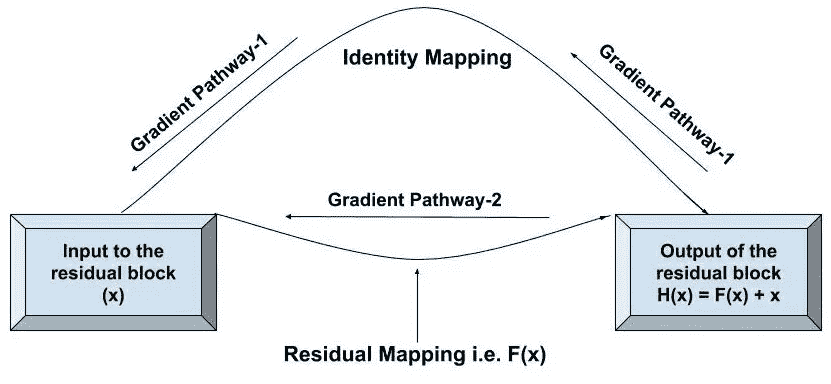
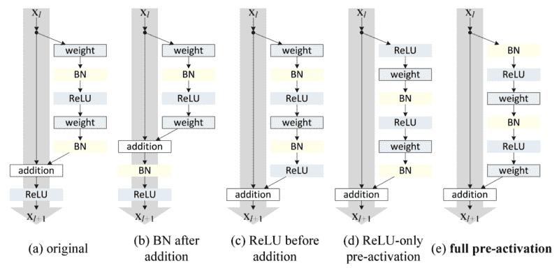

# 深入研究 ResNets

> 原文：<https://medium.com/analytics-vidhya/deep-dive-into-resnets-eb4ec48dfcb0?source=collection_archive---------10----------------------->

## 本文详细讨论了 ResNet 模型的基本架构，并对 ResNet 的构建块进行了解释。

几乎所有在深度学习领域工作的人，或者更具体地说是卷积神经网络，都熟悉 ResNet 这个名字。虽然它很受欢迎，但理解 ResNets 的基本工作原理是至关重要的。在使用这个网络的同时，我们也应该了解 ResNets 背后的架构。

人们普遍认为网络越深，精确度越高。然而，并不是所有的情况都是如此。

自 2013 年以来，深度学习社区开始建立像 AlexNet、VGG、Google Net(Inception Network)这样的深度卷积网络，因为它们能够实现高精度值。此外，这些更深的网络可以表示更复杂的特征，因此可以提高模型的鲁棒性和性能。然而，堆积更多的层对研究人员来说并不起作用。当训练更深的网络时，观察到精度下降的问题。换句话说，向网络中添加更多图层要么会使精度值饱和，要么会突然开始下降。精度下降的罪魁祸首是**消失*梯度效应*。**

CIFAR-10 数据集的较大平原网络的误差增加

# **什么是消失渐变效果？**

在机器学习中，当用梯度学习方法和反向传播训练网络时，网络的每个权重接收与误差函数相对于当前权重的偏导数成比例的更新。有时这个梯度变得很小，几乎不会引起重量的变化。由于这个问题，精度在特定值时开始下降或饱和。

ResNet 解决了这个问题。所以，

# **什么是 ResNet？**

残差神经网络或最常见的 ResNet 几乎类似于具有卷积、汇集、激活和完全连接层的网络。使深度卷积网络成为剩余网络的唯一构造是层之间的身份连接。下图显示了网络中使用的基本残差块。同一性连接是从输入开始并下沉到剩余块末端的弯曲箭头。

残余块

再多了解一点**残块。**现在

# **残块背后的直觉是什么？**

ResNet 的作者观察到，无论一个网络有多深，它都不应该比一个较浅的网络差。这是因为如果我们认为神经网络可以逼近任何复杂的函数，那么它也可以学习相同的函数，即输入=输出，有效地跳过某些层的学习过程。但是，在现实世界中，由于消失梯度和维数灾难问题，情况并非如此。

每个网络都有一组达到最高分数所需的理想函数。实际上，在基本模型中，网络直接试图学习这些输出函数，即没有任何额外的支持，并且网络不可能学习理想的函数。然而，我们假设的深度网络太差，无法理解这些理想函数，因为梯度消失效应，也因为不支持的训练方式。

对训练的支持将由添加到剩余输出的身份映射给出。首先，让我们看看身份映射的含义是什么？对输入应用身份映射将得到与输入相同的输出( *XI = X* :其中 *X* 是输入矩阵， *I* 是身份映射)。

ResNet 的创建者认为:**“如果多个非线性层可以渐近逼近复杂函数，那么等价于假设它们可以渐近逼近剩余函数”**。

现在你想到的第一个问题是:

# **什么是剩余函数，它是如何工作的？**

不严格地说，残差意味着误差。这里，残差函数是残差块的输入和真实输出之间的差。从上图我们可以清楚的看到 *x* 是输入， *H(x)* 是残差块的真实输出。所以很明显剩余函数是***F(x)***其中***F(x)*=*H(x)-x***。

作者没有期望堆叠的层学习近似的*H(x)*，而是让层近似为剩余函数， ***F(x)*** *。*

上面的陈述意味着，如果网络可以学习残差块(即残差函数)的输入和输出之间的差异，则整体精度增加。这就是 ResNet 和传统神经网络的区别。传统的神经网络将直接学习 H(x ),而 ResNet 对层进行建模，以学习子网输入和输出的残差。这将通过使***F(x) = 0*** 使得 ***H(x) = x*** ( **身份映射**)来给予网络跳过子网的选项。换句话说，特定子网的输出只是最后一个子网的输出。

因此，这给了 ResNet 一个额外的选项，这可能是有用的，而不仅仅是严格地在所有层中进行计算。

# **身份映射如何给网络带来如此巨大的变化？**

仅仅一个简单的身份映射就能给我们的网络带来巨大的变化，这真是令人惊讶。我们已经讨论过简单深网中的消失梯度问题。现在我们将借助身份映射来解释同样的问题。我们知道在一个残差块中， **y = F(x，{Wi}) + x** ，其中 **{Wi}** 是 CNN 层的权重数组， **x** 是输入， **F** 是残差函数。

让我们考虑网络的第三层的上述函数。然后

F(x，{ wi })= w3*(𝞂(w2*x)——( 1)

其中，𝞂是*整流线性单元(ReLU)* 激活函数。

在反向传播过程中，由于身份映射和剩余函数，ResNet 中存在两条路径。

残余阻滞中的梯度路径

当上述方程(1)的计算梯度通过梯度路径-2 时，在剩余函数 ***F*** 中遇到两个权重层，即 **W2** 和 **W3** 。在反向传播期间，更新这些权重层，并计算新的梯度值。由于这种传播，初始层中的更新值要么变得非常小，要么消失。为了避免这个消失的问题，跳过连接或身份映射出现了。梯度可以直接通过*梯度路径-1，如上图中的*所示。在*梯度路径-1 中，*梯度不必遇到任何权重层，因此，计算的梯度值不会有任何变化。残余块将被立即跳过，并且梯度可以到达初始层，这将帮助它们学习正确的权重。此外，ResNet 版本 1 在加法运算后具有 ReLU 功能，因此，梯度值将在进入残差块后立即改变。

标识映射的另一个特性是它避免了额外的参数。因此，简单深度网络和 ResNet 的计算复杂度是相同的。

## 函数定义的改进:

由于相加，输入和剩余输出的维数必须相同。在某些情况下，图层的输出和身份输入具有不同的维度。例如，如果我们考虑一个 CNN，其中我们知道在卷积运算之后，输入的大小减小了(维度上)，那么将输入添加到新的输出是一个问题。因此，这里可以做的是，在跳过连接中，我们添加一些运算或函数(在本例中为卷积运算),以便将输入更改或配置为所需的维度。定义可以更新如下， **y = *f* (x，{Wi}) + Ws*x** ，其中 Ws 项可以用某种卷积配置实现，使输入和输出的维数相等。

# **网络体系结构:**

每个 ResNet 的名称后面都有一个数字，表示该 ResNet 中深层的层数。ResNet18、ResNet34 等。浏览下面给出的表格。

重新划分图层

每个 ResNet 架构都可以分成一系列具有一定数量滤波器的卷积层块，就像普通的卷积网络一样。在每两层的间隙处进行跳跃连接，即从一层的输入到第二层的输出，再从第三层的输入到第四层的输出。下图说明了这种机制。

因此，可以用同样的想法来构建具有更多层的更大的网络。

由于现在网络很深，时间复杂度很高。瓶颈设计用于降低复杂性，如下所示:

如图所示，1×1 conv 层被添加到网络的起点和终点。这是在**Network In Network**(*NiN*)和**GoogLeNet**(*Inception-v1*)中建议的技术。事实证明，1×1 conv 可以减少连接(参数)的数量，同时不会使网络性能下降太多。

值得注意的是，VGG-16/19 有 153/196 亿次翻牌。ResNet-152 的复杂度仍然低于 VGG-16/19。

## **雷斯内特·V2:**

到目前为止，我们已经讨论了版本 1 ResNet，即 ResNet-V1。ResNet 或 ResNet-V2 的版本 2 使用预激活，而不是权重层的后激活。下图会给你一个清晰的概念。

变体剩余块

前三个图使用了重量层的后激活，因此很明显这些是雷斯网-V1 的基本结构。其余两个图在配重层之前采用预激活。

让我们看看这两个版本之间的差异。

ResNet-V1 使用添加 **x** 和 **F(x)** 后的第二个激活函数。雷斯纳-V2 在加法之前激活非线性，以恒等函数的形式清除输入到输出的路径。

V1 先执行乘法，然后进行批量归一化和 ReLU 激活，而 V2 在与权重图层相乘之前将批量归一化和 ReLU 激活添加到输入中。

雷斯内特-V2 致力于将第二个非线性化为身份映射。因此，在输出层中计算的梯度可以容易地到达初始层，而无需网络中的任何改变。

# **结果:**

ResNet 模型是 2015 年 ILSVRC 图像分类、检测和定位的获胜者，也是 2015 年 MS COCO 检测和分割的获胜者。

上述结果(10-crop 测试)表明，具有 152 层的 ResNet 模型表现最佳，具有 5.71%的 top-5 错误率。

用 10 个作物测试+多尺度完全 conv+6 模式集成技术，误差率为 3.57%。

对于 CIFAR-10 数据集，结果如下:

通过跳过连接，我们可以更深入。然而，当层数从 110 增加到 1202 时，错误率从 6.43%增加到 7.93%。尽管如此，它仍可用于训练，因为它确实收敛到最优解。

*来源:*

[https://d2l.ai/chapter_convolutional-modern/resnet.html](https://d2l.ai/chapter_convolutional-modern/resnet.html)

[https://neuro hive . io/en/popular-networks/ResNet/#:~:text = Each %20 ResNet%20 block % 20 is % 20 要么，ResNet % 20(见% 20 上表% 20)。](https://neurohive.io/en/popular-networks/resnet/#:~:text=Each%20ResNet%20block%20is%20either,ResNet%20(see%20above%20table).)

[https://towards data science . com/residual-blocks-building-blocks-of-resnet-FD 90 ca 15d 6 EC](https://towardsdatascience.com/residual-blocks-building-blocks-of-resnet-fd90ca15d6ec)

[https://medium . com/@ 14 Prakash/understanding-and-implementing-architectures-of-resnet-and-resnext-for-state-of-art-image-cf 51669 e 1624](/@14prakash/understanding-and-implementing-architectures-of-resnet-and-resnext-for-state-of-the-art-image-cf51669e1624)

[https://cv-tricks.com/keras/understand-implement-resnets/](https://cv-tricks.com/keras/understand-implement-resnets/)

[https://towardsdatascience . com/review-resnet-winner-of-ils vrc-2015-image-class ification-localization-detection-e 39402 bfa5d 8](https://towardsdatascience.com/review-resnet-winner-of-ilsvrc-2015-image-classification-localization-detection-e39402bfa5d8)

ResNet 论文:[https://arxiv.org/abs/1512.03385](https://arxiv.org/abs/1512.03385)