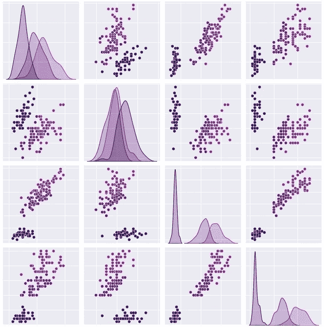

# 深入了解 seaborn:了解数据集

> 原文：<https://medium.com/analytics-vidhya/deep-dive-into-seaborn-meet-the-datasets-8d08755a320b?source=collection_archive---------11----------------------->

作者图片:带有 magma 调色板的 iris 数据集

## Python 绘图:关于处理 seaborn 数据集您应该知道的一切

在本文中，我们将了解 seaborn 提供了哪些数据集样本，以及如何使用它们。我们还将看到，您可以配置一个与 seaborn 接口无缝集成的本地数据集 repo。

我们开始吧！

> 自本月(4 月 22 日)起，Medium 决定你的作品必须拥有至少 100 名追随者才能获得奖励。 ***如果你喜欢这篇文章，只要你按下那个“关注”按钮，对我来说意义重大*** *:)非常感谢，我希望你喜欢这篇文章！*

为了演示 seaborn 及其强大的绘图功能，可以方便地快速获得用于绘图的样本数据集。为此，seaborn 提供了一个简单的接口来将数据集加载到 pandas dataframes 中。

# 列出数据集

截至今天(2020 年 16 月 12 日，seaborn v0.11)，seaborn 提供了 18 个数据集，存储在专用的 github 存储库中:

 [## mwaskom/seaborn-data

### seaborn 示例的数据仓库。这不是一个通用的数据存档。此存储库只存在于…

github.co](https://github.com/mwaskom/seaborn-data) 

除了浏览 seaborn-data repo，您还可以使用`get_datasets_names`函数直接从 python 获得可用数据集的列表。调用时，它将返回包含数据集名称的字符串列表:

此列表中的每个项目都映射到 repo 上的一个数据集:例如，名为“iris”的数据集映射到“iris.csv”文件。

# 加载数据集

既然您已经知道了可用的数据集，让我们加载它们吧！
为此，只需在数据集上使用`sns.load_dataset`方法。例如，`sns.load_dataset('iris’)`将把虹膜数据集加载到熊猫数据帧中。从那时起，我们可以开始处理数据集:

[https://gist . github . com/mocquin/4 db 6a 74 cf 6 ccbe 0 f 51 f 7 e 7a 8 f 7 AE 6 fc 6](https://gist.github.com/mocquin/4db6a74cf6ccbe0f51f7e7a8f7ae6fc6)

# 缓存数据集

由于 seaborn 数据集是在线存储的，所以您需要一个互联网连接来获取可用数据集的列表(使用`get_datasets_names`)和加载数据集(使用`load_dataset`)。

至少第一次是这样。

为了避免反复下载相同的数据，seaborn 默认将数据集(或“缓存”)存储在一个`data_home`文件夹中:默认情况下，seaborn 将数据集存储在`~/seaborn-data`中。或者，seaborn 将尝试在由`SEABORN_DATA`环境变量(如果已定义)给出的路径中存储数据。

所有这些都是因为默认情况下用`cache=True`调用`load_dataset`函数。这样，当使用`load_dataset`从在线回购中下载数据集时，seaborn 会将数据集保存在该文件夹中，稍后将直接从该文件夹中加载数据。

[https://gist . github . com/mocquin/69f 12145d 333 EC 40543035 b 66 a 54775 b](https://gist.github.com/mocquin/69f12145d333ec40543035b66a54775b)

访问数据集的另一种可能性是从 github repo 手动下载，并存储在您选择的文件夹中。然后您可以使用`load_dataset`的`data_home`参数。例如:

[https://gist . github . com/mocquin/BC 98 bdefe 92 a 903708 b 208409 b 568 CEC](https://gist.github.com/mocquin/bc98bdefe92a903708b208409b568cec)

要定位 seaborn 使用的默认`data_home`文件夹，使用`get_data_home`函数:

# 扩展您的本地 seaborn 数据主页

当然，您也可以在您的`data_home`文件夹中添加任何其他数据集，然后使用 seaborn 接口加载它们。为了匹配特定的数据集(在分隔符、索引方面)，您可以将 kwargs 传递给`load_dataset`，pandas 将使用它来读取数据。

# 包裹

在这篇文章中，我们看到:

*   数据集在线存储在哪里:位于 https://github.com/mwaskom/seaborn-data[的 github 专用仓库](https://github.com/mwaskom/seaborn-data)
*   如何列出可用数据集:使用`sns.get_datasets_names()`
*   如何加载数据集:使用`sns.load_dataset`
*   数据集缓存的位置:默认情况下在`~/seaborn-data`或由`SEABORN_DATA`环境变量给出的路径中。这是因为默认情况下用`cache=True`调用`load_dataset`。
*   如何定义和使用本地数据集文件夹，在 seaborn 中称为`data_home`:将数据放在一个文件夹中，并使用带有`data_home`参数的`sns.load_dataset`。

如果你喜欢这个，看看我关于 seaborn 调色板的文章:

 [## 深入了解 seaborn 调色板

### 淹没在海洋调色板中？

mocquin.medium.com](https://mocquin.medium.com/deep-dive-into-seaborn-palettes-7b5fae5a258e)