# 深入了解 Seaborn:调色板

> 原文：<https://medium.com/analytics-vidhya/deep-dive-into-seaborn-palettes-7b5fae5a258e?source=collection_archive---------1----------------------->

## 淹没在海洋调色板中？


照片由[罗伯特·卡茨基](https://unsplash.com/@ro_ka?utm_source=medium&utm_medium=referral)在 [Unsplash](https://unsplash.com?utm_source=medium&utm_medium=referral) 上拍摄

在本文中，我们将了解什么是 seaborn 中的调色板，如何使用它们，seaborn 提供了哪些调色板，以及如何从颜色中创建调色板。

多好的节目啊！

> ***记得使用右边的“关注”按钮来关注我→:您会收到新文章的通知，并帮助达到我的 100 个关注者的目标:)***

# 色彩空间

在进入 seaborn 调色板之前，让我们先回顾一下我们应该知道的不同颜色空间:

*   rgb 空间:颜色由 0 到 1 之间的三个浮点值定义，给出了红色、蓝色和绿色的比例。例如,`(0.1, 0.5, 0.9)`大部分是绿色，有一些蓝色，还有一点红色。
*   十六进制空间:颜色由 6 个十六进制字符`#RRGGBB`定义，其中 RR(红色)、GG(绿色)和 BB(蓝色)是介于 00 和 FF 之间的十六进制整数，指定颜色的强度。您可以将这个空格视为书写 rgb 值的另一种方式。
*   hls 空间:颜色由 0 到 1 之间的三个浮点值定义，其中 h 映射不同的颜色，l 映射亮度(有多“亮”)，s 映射饱和度(颜色看起来有多鲜艳或褪色)。
*   husl 空间:颜色由 0 到 1 之间的三个浮点值定义，其中 h 映射不同的颜色，l 映射亮度(有多“亮”)，s 映射饱和度(颜色看起来有多鲜艳或褪色)。

# 调色板概念

在 seaborn 中，调色板只是一个颜色列表。大多数时候，我们会在 rgb 空间中处理颜色，所以调色板只是 0 到 1 之间的三个浮点值的列表。例如:

```
[(0.125, 0.4, 0.705882), (1.0, 0.498, 0.055), (0.17313, 0.6269, 0.1)]
```

是三种颜色的调色板。

所以请记住:调色板是一系列的颜色。

注意，颜色的数量(列表的长度)可以是任何数量。

# 锡伯恩的调色板

让我们导入 seaborn 并加载一个数据集:

```
from IPython.display import display
import seaborn as sns
iris_df = sns.load_dataset("iris")
```

如果你想了解更多关于 seaborn 数据集的信息，请查看我以前的文章:

[](https://mocquin.medium.com/deep-dive-into-seaborn-meet-the-datasets-8d08755a320b) [## 深入了解 seaborn:了解数据集

### Python 绘图:关于处理 seaborn 数据集您应该知道的一切

mocquin.medium.com](https://mocquin.medium.com/deep-dive-into-seaborn-meet-the-datasets-8d08755a320b) 

Seaborn 使用调色板的概念来预定义您绘制的数据的颜色。我们可以用`sns.color_palette`看看默认的调色板是什么:

```
pal = sns.color_palette()
print(pal)
sns.palplot(pal)[(0.12156862745098039, 0.4666666666666667, 0.7058823529411765), (1.0, 0.4980392156862745, 0.054901960784313725), (0.17254901960784313, 0.6274509803921569, 0.17254901960784313), (0.8392156862745098, 0.15294117647058825, 0.1568627450980392), (0.5803921568627451, 0.403921568627451, 0.7411764705882353), (0.5490196078431373, 0.33725490196078434, 0.29411764705882354), (0.8901960784313725, 0.4666666666666667, 0.7607843137254902), (0.4980392156862745, 0.4980392156862745, 0.4980392156862745), (0.7372549019607844, 0.7411764705882353, 0.13333333333333333), (0.09019607843137255, 0.7450980392156863, 0.8117647058823529)]
```

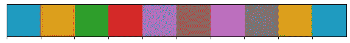

作者图片

我们可以注意到三件事:

*   在 seaborn 调色板上调用`print`将打印出三重 rgb 值的列表
*   使用`sns.palplot`可以看到调色板。注意，这也可以用`IPython.display.display(pal)`来完成
*   默认调色板有 10 种颜色

除了默认调色板之外，seaborn 还提供了许多预定义的命名调色板:

```
mpl_palette_named_palette = ['Accent', 'Accent_r', 'Blues', 'Blues_r', 'BrBG', 'BrBG_r', 'BuGn', 'BuGn_r', 'BuPu', 'BuPu_r', 'CMRmap', 'CMRmap_r', 'Dark2', 'Dark2_r', 'GnBu', 'GnBu_r', 'Greens', 'Greens_r', 'Greys', 'Greys_r', 'OrRd', 'OrRd_r', 'Oranges', 'Oranges_r', 'PRGn', 'PRGn_r', 'Paired', 'Paired_r', 'Pastel1', 'Pastel1_r', 'Pastel2', 'Pastel2_r', 'PiYG', 'PiYG_r', 'PuBu', 'PuBuGn', 'PuBuGn_r', 'PuBu_r', 'PuOr', 'PuOr_r', 'PuRd', 'PuRd_r', 'Purples', 'Purples_r', 'RdBu', 'RdBu_r', 'RdGy', 'RdGy_r', 'RdPu', 'RdPu_r', 'RdYlBu', 'RdYlBu_r', 'RdYlGn', 'RdYlGn_r', 'Reds', 'Reds_r', 'Set1', 'Set1_r', 'Set2', 'Set2_r', 'Set3', 'Set3_r', 'Spectral', 'Spectral_r', 'Wistia', 'Wistia_r', 'YlGn', 'YlGnBu', 'YlGnBu_r', 'YlGn_r', 'YlOrBr', 'YlOrBr_r', 'YlOrRd', 'YlOrRd_r', 'afmhot', 'afmhot_r', 'autumn', 'autumn_r', 'binary', 'binary_r', 'bone', 'bone_r', 'brg', 'brg_r', 'bwr', 'bwr_r', 'cividis', 'cividis_r', 'cool', 'cool_r', 'coolwarm', 'coolwarm_r', 'copper', 'copper_r', 'crest', 'crest_r', 'cubehelix', 'cubehelix_r', 'flag', 'flag_r', 'flare', 'flare_r', 'gist_earth', 'gist_earth_r', 'gist_gray', 'gist_gray_r', 'gist_heat', 'gist_heat_r', 'gist_ncar', 'gist_ncar_r', 'gist_rainbow', 'gist_rainbow_r', 'gist_stern', 'gist_stern_r', 'gist_yarg', 'gist_yarg_r', 'gnuplot', 'gnuplot2', 'gnuplot2_r', 'gnuplot_r', 'gray', 'gray_r', 'hot', 'hot_r', 'hsv', 'hsv_r', 'icefire', 'icefire_r', 'inferno', 'inferno_r', 'jet', 'jet_r', 'magma', 'magma_r', 'mako', 'mako_r', 'nipy_spectral', 'nipy_spectral_r', 'ocean', 'ocean_r', 'pink', 'pink_r', 'plasma', 'plasma_r', 'prism', 'prism_r', 'rainbow', 'rainbow_r', 'rocket', 'rocket_r', 'seismic', 'seismic_r', 'spring', 'spring_r', 'summer', 'summer_r', 'tab10', 'tab10_r', 'tab20', 'tab20_r', 'tab20b', 'tab20b_r', 'tab20c', 'tab20c_r', 'terrain', 'terrain_r', 'turbo', 'turbo_r', 'twilight', 'twilight_r', 'twilight_shifted', 'twilight_shifted_r', 'viridis', 'viridis_r', 'vlag', 'vlag_r', 'winter', 'winter_r']
sns_named_palettes = ['deep', 'muted', 'bright', 'pastel', 'dark', 'colorblind']

sns.palplot(sns.mpl_palette("Accent"))
```

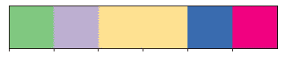

作者图片

我们可以使用`sns.color_palette`来反思其他调色板:

```
# named palette
pal = sns.color_palette("magma")
print(pal)
sns.palplot(pal)[(0.135053, 0.068391, 0.315), (0.372116, 0.092816, 0.499053), (0.594508, 0.175701, 0.501241), (0.828886, 0.262229, 0.430644), (0.973381, 0.46152, 0.361965), (0.997341, 0.733545, 0.505167)]
```


作者图片

注意，默认情况下，返回的调色板长度为 6。

还记得我们说过调色板是一系列颜色吗？

嗯，不完全是这样。

`sns.color_palette`返回的对象实际上不是一个三元组列表:

```
pal = sns.color_palette("magma")
print(type(pal))<class 'seaborn.palettes._ColorPalette'>
```

我们不需要进一步反省这个`_ColorPalette`对象是什么(特别是有了`_`意味着用户不应该走这么远)。所以它不是真正的颜色列表，但它的行为很像！

此外，调色板还可以使用另一种格式:matplotlib 的色彩映射表。您可以用`as_cmap=True`告诉 seaborn 返回一个 matplotlib colormap 对象:

```
cmap = sns.color_palette("magma", as_cmap=True)
print(type(cmap))<class 'matplotlib.colors.ListedColormap'>
```

# 使用调色板绘图

调色板的本质是赋予你的情节以意义。默认情况下，seaborn 将使用我们前面看到的默认调色板:

```
sns.color_palette()sns.scatterplot(
    data=iris_df,
    x="sepal_length",
    y="petal_length",
    hue="species",
)<AxesSubplot:xlabel='sepal_length', ylabel='petal_length'>
```

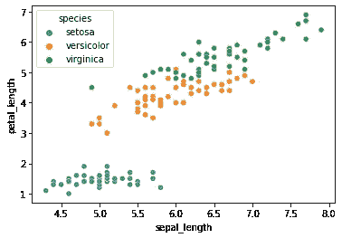

作者图片

注意`species`特征有 3 个可能的值(setosa、versicolor 和 virginica——鸢尾花的“类型”),因此使用当前调色板的前 3 种颜色。

在所有的 seaborn 绘图函数中，您可以使用`palette`参数为这个绘图使用一个特定的调色板。例如，让我们使用命名的调色板“magma”:

```
# review what the palette looks like
sns.palplot(sns.color_palette("magma"))
```


作者图片

```
sns.scatterplot(
    data=iris_df,
    x="sepal_length",
    y="petal_length",
    hue="species",
    palette="magma",
)<AxesSubplot:xlabel='sepal_length', ylabel='petal_length'>
```

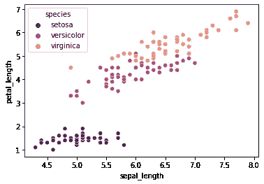

作者图片

请注意，图中使用的 3 种颜色不是上面显示的前 3 种颜色:在背景中，seaborn 基于 magma 调色板创建了 3 种颜色的调色板，如下所示:

```
sns.palplot(sns.color_palette("magma", n_colors=3))
```


作者图片

# 设置默认调色板

记住，默认情况下，seaborn 将使用默认调色板(除非在 plot 函数调用中另有说明)。

要设置默认调色板，使用`sns.set_palette`功能:

```
sns.set_palette(
    palette="magma",
    n_colors=3,
)
```

现在我们可以像以前一样绘制相同的散点图，而不使用`palette`参数:

```
sns.scatterplot(
    data=iris_df,
    x="sepal_length",
    y="petal_length",
    hue="species",
)<AxesSubplot:xlabel='sepal_length', ylabel='petal_length'>
```


作者图片

# 创建调色板

创建调色板的方法有很多。我们将看到以下内容:

*   使用`sns.dark_palette`和`sns.ligth_palette`基于单一颜色
*   基于使用`sns.blend_palette`的 n 种颜色列表
*   基于使用`sns.hls_palette`的 hsl 值
*   基于 husl 值使用`sns.husl_palette`

## 从颜色列表中创建调色板

让我们首先创建一个颜色列表:

```
rgb = [(0.15, 0.25, 0.35), (0.35, 0.55, 0.51), (0.5, 0.95, 0.34)]
```

然后我们可以使用`sns.blend_palette`基于这些颜色创建一个调色板:

```
sns.palplot(sns.blend_palette(rgb))
sns.palplot(sns.blend_palette(rgb, n_colors=10))
```


作者图片

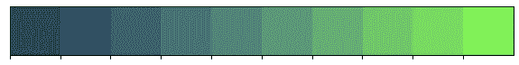

作者图片

当然，我们也可以使用命名的颜色:

```
# create a palette from named colors
sns.palplot(sns.blend_palette(["acid green", "adobe"], n_colors=4, input="xkcd"))
```

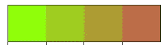

作者图片

您可以使用下面的语法创建一个带有`sns.color_palette`的混合调色板:

```
sns.palplot(sns.color_palette("blend:#31B3F3,#987"))
```

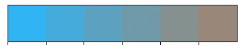

作者图片

## 从单一颜色创建调色板

从单一颜色创建调色板有几种方法:

```
color = (0.56, 0.87, 0.34)
```

我们可以从 rgb 值创建明暗调色板:

```
sns.palplot(sns.light_palette(color))
sns.palplot(sns.dark_palette(color))
```


作者图片


作者图片

从十六进制代码:

```
sns.palplot(sns.color_palette("light:#124683"))
sns.palplot(sns.color_palette("dark:#124683"))
```


作者图片


## 从 rgb/hsl/husl 值创建调色板

许多其他选项可用:

```
sns.palplot(sns.cubehelix_palette())
sns.palplot(sns.cubehelix_palette(rot=0.2, hue=0.2))
sns.palplot(sns.diverging_palette(0, 189))
sns.palplot(sns.diverging_palette(h_neg=20, h_pos=245))
sns.palplot(sns.diverging_palette(h_neg=20, h_pos=245, l=75))
sns.palplot(sns.hls_palette(h=0.01, s=0.1, l=0.45))
sns.palplot(sns.husl_palette(h=0.1, s=0.5, l=0.45))
```

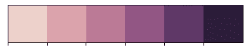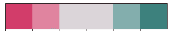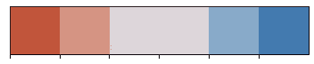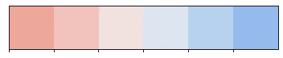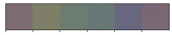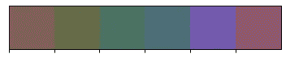

作者图片

# 命名颜色

seaborn 允许您使用“命名的”颜色，而不是使用颜色代码:命名的颜色只是映射到 rgb 颜色的字符串名称。你可以用`sns.xkcd_rgb`和`sns.crayons`得到一个命名颜色的字典。

```
# print(sns.xkcd_rgb)
# print(sns.crayons)
# not shown here to save space
```

然后我们可以使用`sns.crayon_palette`和`sns.xkcd_palette`函数来创建一个基于命名颜色列表的调色板:

```
p = sns.crayon_palette(["Midnight Blue", "Maroon"])
print(p)
sns.palplot(p)
sns.palplot(sns.xkcd_palette(["acid green", "adobe"]))[(0.10196078431372549, 0.2823529411764706, 0.4627450980392157), (0.7843137254901961, 0.2196078431372549, 0.35294117647058826)]
```

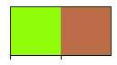

作者图片

# 奖励:调色板部件

如果您熟悉 jupyter 笔记本，seaborn 提供了简单的小部件来包装 seaborn 函数，以使用调色板:

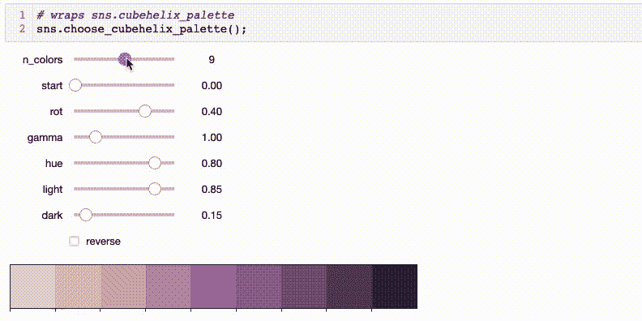

作者 Gif

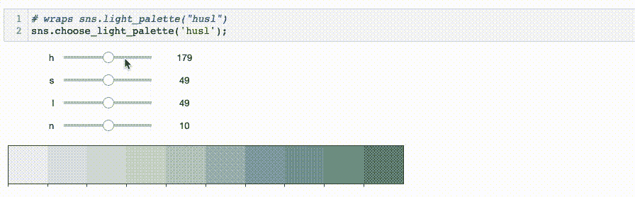

作者 Gif

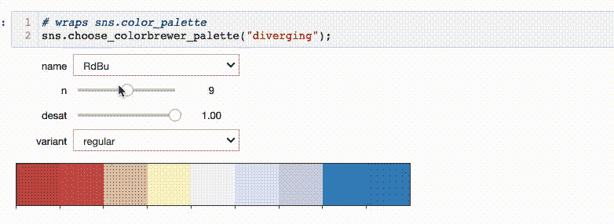

作者 Gif

# 包裹

在这篇文章中，我们看到:

*   什么是调色板:基本上，一系列的颜色
*   如何获得当前默认调色板:用`sns.color_palette()`
*   如何定义新的默认调色板:用`sns.set_palette(palette="magma")`
*   如何内省调色板:使用`print(pal)`获取 rgb 颜色列表，使用`sns.palplot(pal)`绘制调色板
*   有许多调色板可用:使用预定义的命名调色板，或使用`sns.light_palette` 和`sns.dark_palette`基于颜色创建自己的调色板，使用`sns.blend_palette`或`cubehelix_palette, sns.diverging_palette, sns.hls_palette, sns.husl_palette`基于颜色列表创建自己的调色板。

感谢阅读。干杯。