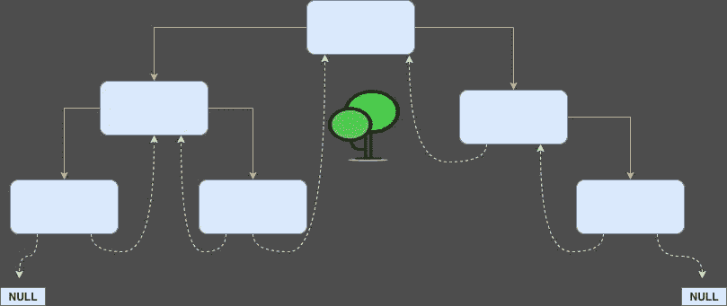
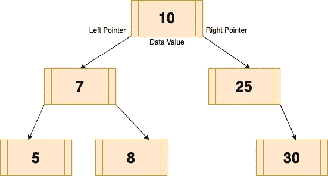
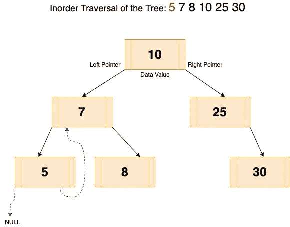
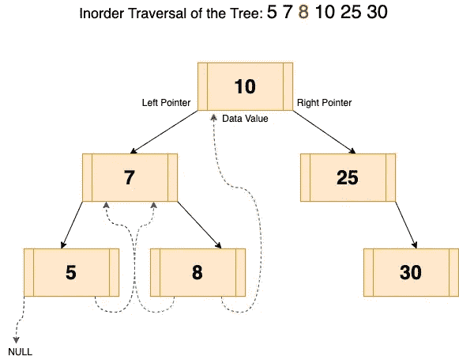
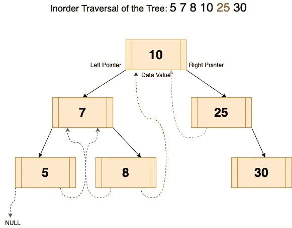
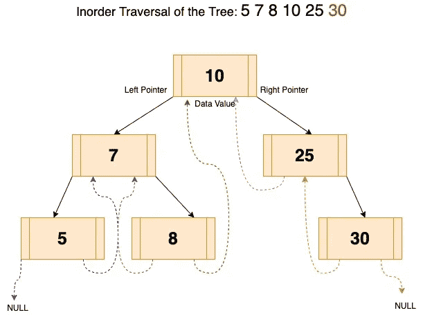
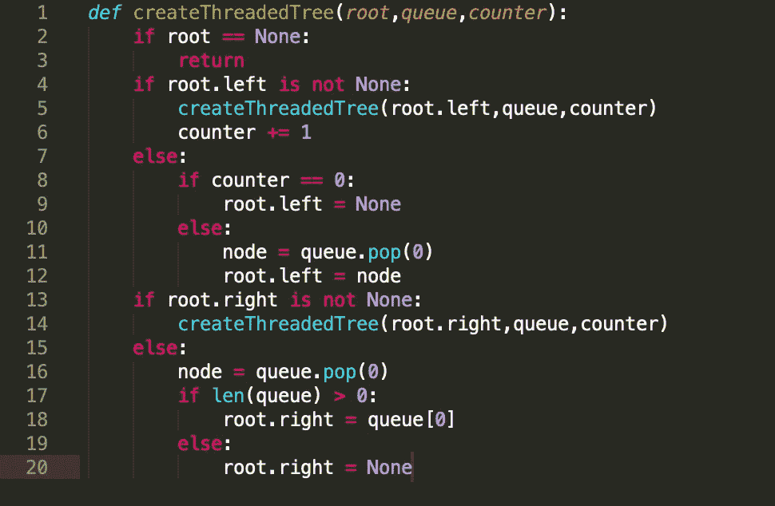
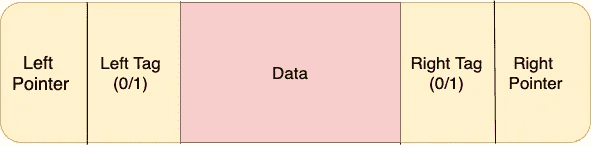

# 逐步深入到线程二叉树

> 原文：<https://medium.com/analytics-vidhya/deep-dive-into-threaded-binary-tree-step-by-step-aa8f90400c5a?source=collection_archive---------8----------------------->



你熟悉线程二叉树的概念以及它相对于标准二叉树(BT) /二叉查找树(BST)的优势吗？那么，这篇文章将一步一步地给你分析线程二叉树及其实现。在这篇文章中，我不会深入讨论二叉树和二分搜索法树，这篇文章是关于理解线程二叉树:它相对于二叉树的优势及其实现。我假设你熟悉二叉树和二分搜索法树。

从名字上看，线程二叉树表明节点是用线程连接的，但是等等，节点是通过**线程**连接的，但是**为什么**和**如何**与普通的二叉查找树有什么不同。对于线索二叉树，我还有几个问题:

Q1。什么是线索二叉树？

Q2。怎么比二叉树好？

Q3。线索二叉树有哪些类型？

Q4。线程二叉树将如何在 Python 中实现？

我们将逐一分析每个问题。有两种类型的线索二叉树。让我们从它们各自的定义开始:

在**双线程二叉树**中，节点的左指针应该指向*中的前序*，右指针应该指向*中的后序。*唯一的例外是树中最左边节点的左指针，和树中最右边节点的右指针都要指向 **NULL** 。

在**单线程二叉树**中，节点的左指针或右指针指向前序或后序。多线程二叉树的例外是树中最左边节点的左指针和树中最右边节点的右指针都应该指向 **NULL** 。

**迷茫？让我们想象一下。**

下面是简单的二叉查找树:



二叉查找树

现在二叉树/二叉查找树的问题是子节点的左右指针都被浪费了，因为它们都指向空的 T21，所以我们需要使用这些指针来更好地遍历，但是怎么做，为什么呢？

**为什么的答案是:**

> 在简单的迭代有序遍历中，我们需要使用栈来进行树的有序遍历；因此，通过将树转换成线程二叉树，我们不需要使用栈来进行有序遍历。因此节省了空间。
> 
> 第二个优点是从子节点到根节点的遍历需要较少的遍历；因此，这将增强树算法中的搜索特性，这需要逻辑的持续流动，以在树中频繁地向上和向后。

我相信用实现来解释会有更好的理解。我们将在本文中分析双线索树。

**如何的答案是:**

我假设你们大多数人会直接跳到实现，那么现在让我们开始有趣的部分:**它是如何实现的？**

让我们看看下面的树的有序遍历:


为了穿越二叉查找树

## 上述树的顺序遍历是:

## **5->7->8->10->25->30**

*(以防您忘记遍历顺序:访问左节点，然后根节点，然后右节点)*

非常简单，现在让我们跳到如何使用它来制作线程二叉树:

## **制作线索树的步骤:**

1.  让我们开始遍历，我们遍历到树的最左边的节点:



显示节点值为 5 的线程

最左边的节点是 5。5 的有序前任为空；因此，它指向 NULL，并且 5 的有序后继者是 7，因此节点值 5 的右指针指向 7。

2.遍历节点值 **8**



显示节点值为 8 的线程

在上图中，递归地回到根节点(7)，它检查正确的节点。在这种情况下，节点值 7 的右边节点是 8。首先，我们将检查节点的左指针；如果它为空，那么我们将把它指向该节点的后继节点，即 7。对于右边的指针，我们将检查它是否指向 NULL，然后我们将修改对后继节点的引用，即 10，因此它将指向 10。

3.对于 **25** 同样如此:



4. **30** 的逻辑类似。因为这是树的最右边的节点，所以它的右边指针将指向 NULL。



## **编码时间！！**

让我们看看上面的线程树的编程 Python 实现:

```
class Node: 
    def __init__(self,key): 
        self.left = None
        self.right = None
        self.val = keyif __name__ == "__main__":
queue = []
counter = 0
root = Node(10) 
root.left     = Node(7) 
root.right     = Node(25) 
root.left.left = Node(5) 
root.left.right = Node(8) 
root.right.right = Node(30)
```

在上图中，我已经初始化了节点并构建了一个树形结构。我还初始化了空队列(Queue)和一个计数器变量(我们将讨论在哪里使用队列和计数器变量)。

现在，在下面的代码中，我们正在对树进行有序遍历，我们将有序遍历结果节点存储在队列中，如下所示:

```
def printInorder(root,queue): 
    if root: 
        # Recursion on left child
        printInorder(root.left,queue)# Printing the data of the node
        print(root.val)
        queue.append(root)# Recursion on the right child
        printInorder(root.right,queue)
```

现在，主要的逻辑来了，**创建线程二叉树**:

```
def createThreadedTree(root,queue,counter):
    if root == None:
        return
    if root.left is not None:
        createThreadedTree(root.left,queue,counter)
        counter += 1
    else:
        if counter == 0:
            root.left = None
        else:
            node = queue.pop(0)
            root.left = node
    if root.right is not None:
        createThreadedTree(root.right,queue,counter)
    else:
        node = queue.pop(0)
        if len(queue) > 0:
            root.right = queue[0]
        else:
            root.right = None
```

下面是对上面创建线索树的代码的解释:



创建线程二叉树的 Python 实现

```
Line **4** to **5:** recursively reach till the left most node of the tree.Line **6:** counter is only incremented when it is not the leftmost node of the tree.Line **8**: Counter is used to identify weather it is 
left most node or node, if it is then assign NULL value to it.Line **11:** If not the leftmost node, thenPop the element from the queue (queue having Inorder traversal of nodes) and assign the left pointer of node to Inorder predessor to the nodeLine **13**: Similary, recursively find the right node, if the right pointer of node is pointing to null then pop the element from the queue and assign the Inorder successor to the right pointer of that node.Line **17**: Length of queue is used to identify weather it is right most child or not
```

现在，我们已经看到了创建线程二叉树的实现及其概念，此时我心中有一个问题:

遍历时，我如何识别子节点的指针是否指向有序的前趋/后继，或者它们是指向其子节点的父节点？这个问题的答案是创建一个带有两个标签的节点**左标签**和**右标签**。如果指针指向子节点，那么我们将把左/右标签的布尔值设置为 **1** ，否则如果指针指向前一个或后一个节点，那么我们将把左/右标签的布尔值设置为 **0** 。



**因此，下面是创建带有左右标签的线索二叉树的更新实现。**

```
def createThreadedTree(root,queue,counter):
    if root == None:
        return
    if root.left is not None:
        createThreadedTree(root.left,queue,counter)
        counter += 1
    else:
        # Added left tag
        root.left_tag = 0

        if counter == 0:
            root.left = None
        else:
            node = queue.pop(0)
            root.left = node
    if root.right is not None:
        createThreadedTree(root.right,queue,counter)
    else:
        node = queue.pop(0)

        # Added Right Tag
        root.right_tag = 0

        if len(queue) > 0:
            root.right = queue[0]
        else:
            root.right = None
```

在上面的实现中，每当子节点指向父节点时，左/右标签更新为 **0** ，这取决于哪个指针指向父节点。

**下面是线程二叉树的有序遍历代码:**

```
def inorderThreadedTree(root):
    node = root
    #This is to go the leftmost node of the tree
    while(node.left):
        node = node.left

    #this is to check for all nodes
    while(node is not None):
        # if the left pointers of the nodes pointing to parent node 
        # then print the value and go to the 
        # right node (parent node). 
        # This is identified using left_tag 
        # (0 means poiting to parent node)
        if node.left_tag == 0:
            print(node.val)
            node = node.right
        else:
            print(node.val)
            node = node.right
            # if pointing to child node then keep on moving to child
            # left node
            if node and node.left_tag == 1:
                node = node.left
```

**Pheww，就是这样！！**

我希望我已经成功地解释了我对线索二叉树的所有理解。请让我知道，如果逻辑/代码需要一些修改，或者如果你想提出更好的线程二叉树的实现。我非常乐意阅读你的建议。

## 数据结构很有趣！！编码快乐！！