# 深入研究时间序列建模。

> 原文：<https://medium.com/analytics-vidhya/deep-dive-into-time-series-modeling-4cf3159cbdfd?source=collection_archive---------11----------------------->

什么模型最适合给定的数据集？—从天真到 ARIMA。

> 时间序列建模:从头开始！！

这么说吧，你已经有了一个时间序列数据，并且已经对它做了所有基本的探索性数据分析。您还分解了时间序列，以了解数据中的各种固有成分。您对需要预测什么有一个相当好的想法，以解决手头的业务问题。

此时，您正在考虑要实现哪个模型！！

放心吧！！你来对地方了！！

本文将指导您完成实现目标的详细过程——“准确预测”，同时为建模步骤提供全面的解释。

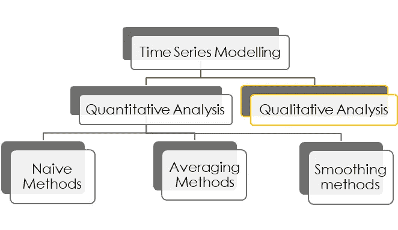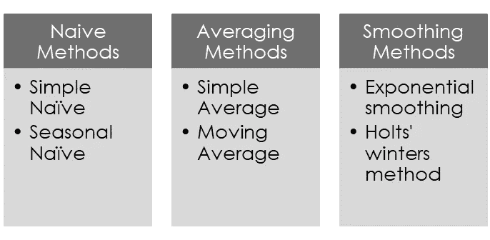

定量分析任何时间序列数据有 3 种基本方法。

1.  天真的方法
2.  平均方法
3.  平滑方法

让我们首先试着理解每个模型在预测方面的作用。

**1。** **天真的方法:**

这些建模技术将前期的值用作本期的预测。

这些方法可以进一步分为简单的和季节性的简单方法。

**简单的朴素方法** —预测值等于前一时期的值。

让我们以内置的 R 数据集“gas”(属于库—“forecast”)作为我们在这里将要讨论的所有示例。

在我们进行建模之前，让我们将气体数据分成训练和测试数据

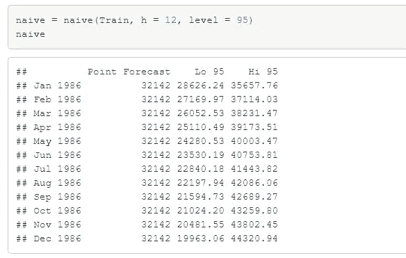

上图显示，对未来 12 年的预测与上一个时间间隔的实际值相同——“32142”，因为一个天真的模型没有考虑像“趋势”、“季节性”和“周期性”这样的时间序列的内在组成部分。相反，它只是将先前的值复制到因变量的当前值。

这种结果是非常不可取的。以月销售额为例。比方说，一家公司去年销售了价值 1000 万美元的产品。这并不意味着该公司今年也将销售价值 1000 万美元的商品。销售额可能会更高或更低。无论哪种方式，预测整个未来的恒定值对企业来说都不是很有洞察力。

这就是为什么天真的模型仅被用作二级预测模型，从而能够在更复杂的模型之间进行可靠的比较。

以下情节证实了上述情况。

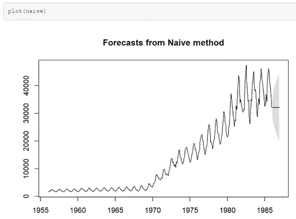

**季节性朴素方法—** 当时间序列具有很强的季节性时，最好使用季节性朴素方法。

在这种方法中，预测值等于前一个季节期间的数据。例如，如果必须预测 7 月份的雨伞销售，则它将等于上一年(上一季度)7 月份的销售值。因此，它考虑了季节性。

在 R 中实现季节性的 nave 方法得到如下输出。

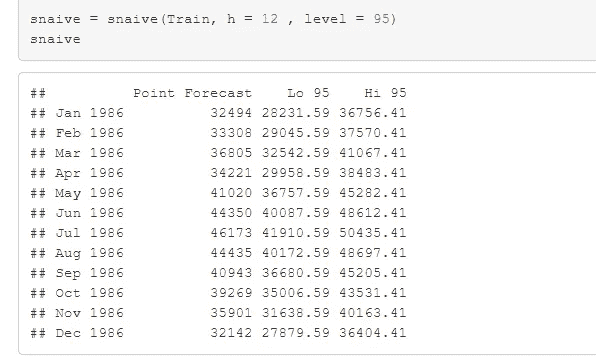

在这里，您可以看到，每个月的预测值并不相同。它取前一个季节的值。下面的情节也是如此。

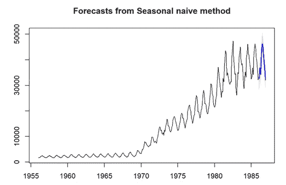

如果时间序列数据包含趋势和周期性成分，它仍然使预测不相关。这就是为什么即使是季节性的天真也常常不被认为是主要的预测模型。

**2。平均方法:**

**简单平均法:**将当期值等于过去所有期间的平均值的方法。

让我们来看看这个模型是如何处理“气体”数据的。

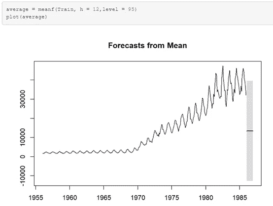

上面的输出图显示了未来 12 个月的持续预测，对应于“gas”数据集中所有过去数据的平均值。

这似乎不太对劲。是吗？

感觉不对是因为，数据有一个模式——趋势和季节性。预测一个常量值(就像天真的方法一样)似乎是不可接受的。

这就是为什么我们有这个模型的变体——“移动平均线”模型——它在预测中被大量使用。

**均线法:**在你跳到均线之前，让我们偏离一点，来设定一下背景。

有一个术语——“*自动回归*”——这很像任何简单意义上的多元线性回归。两者的区别在于

o 多元回归— 1 个 DV 和 1 个或多个 iv

o 自动回归— 1DV 回归其过去的值。

假设我们有一个如下所示的数据集。

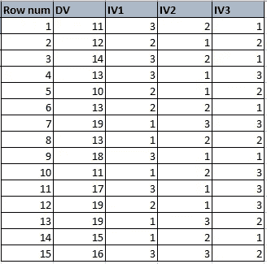

我们可以画一个多元线性回归方程和一个自回归方程。

**多元线性回归—回归方程:**

DV(估计值)= B0+B1(IV1)+B2(IV2)+B3(IV3)+***误差***

**自动回归—回归方程:**

DV(15-估计)= B0 + B1 (DV(14)) +B2 (DV(13)) +…。+B15 DV(1)) + ***错误***

在这两个回归中，我们最终得到一个误差项，这就是我们所关心的移动平均预测法。

现在回到我们的移动平均线方法。在这些方法中，取过去周期的自回归误差的平均值(对于指定的窗口),并将其分配给新的预测值。

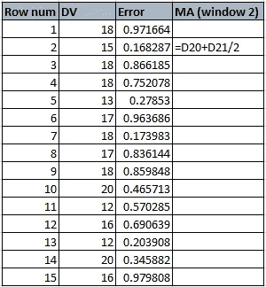

第二个项目的移动平均值将是(对于窗口 2)——(0.971664+0.168287)/2。然后用实际值调整该值，得到预测图，如下图所示。

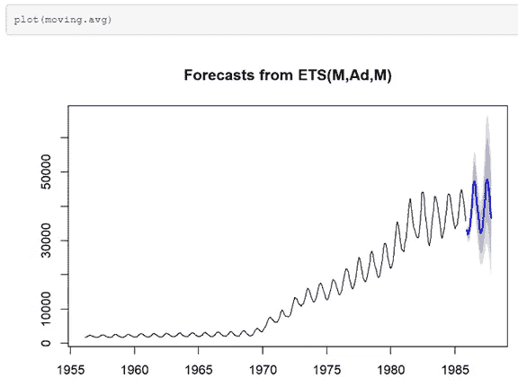

这种方法接近准确的预测。然而，我们也需要考虑数据的趋势和随机部分。

**3。平滑方法:**平滑从字面意义上来说，是指软化粗糙的边缘。

**指数平滑法**是一种将过去的预测值进行加权平均的方法。在这种方法中，我们根据值有多新来定义权重。当前值的最近数据点将具有最大的权重。随着时间的推移，权重呈指数下降。这就是为什么这种方法被称为“指数”平滑。

当数据中没有特定的趋势时，只给最近的数据点最大的权重才有意义。我们可以通过指定参数“α”来控制权重。

当这个α值接近 1 时，它与预测的天真方法没有什么不同。

当在 R 中绘制来自“gas”数据集的数据时，我们得到以下输出。

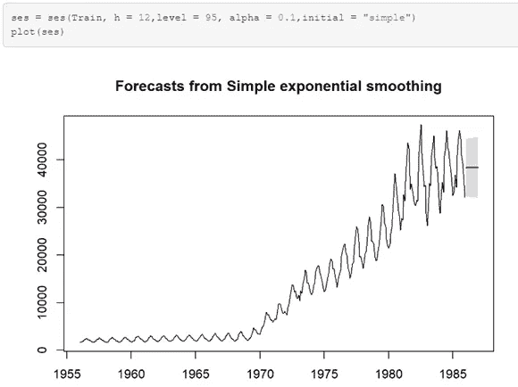

上面的图在整个预测期间预测了一个常量值。这是因为，我们还没有考虑趋势和季节性部分。

**霍尔特趋势法:**这种方法和指数平滑法中的一样。但是，在这种方法中，我们将过去值的加权平均值与趋势分量的加权平均值一起考虑。

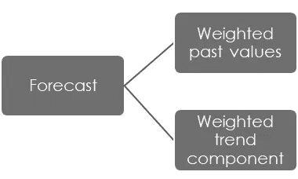

就像过去值有一个权重分量(“α”)一样，趋势分量也有另一个权重分量——“β”。与“α”一样，“β”也取 0 范围内的值< β <1\. The closer the value of β, the higher the weightage would be for the trend in the previous period.

> These weightages — “α”, “β”也称为平滑分量。

当我们为霍尔特的趋势模型绘制“气体”数据时，下图是我们得到的输出。

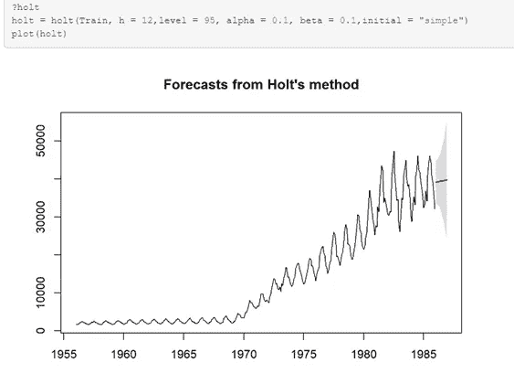

从上面的图中我们可以看出，由于我们只考虑了趋势部分，所以预测自始至终都是一个积极的趋势。

这感觉仍然不像是正确的预测。

为什么？因为我们在数据集中看到了季节性因素。我们还没有考虑到这一点。

**霍尔特-温特斯模型:**因为我们在这里也要考虑季节性因素，就像在 SES(简单指数平滑)和霍尔特方法中一样，我们在这种方法中为季节性因素考虑了一个单独的权重“γ”。“γ”也取 0 < γ < 1 的值

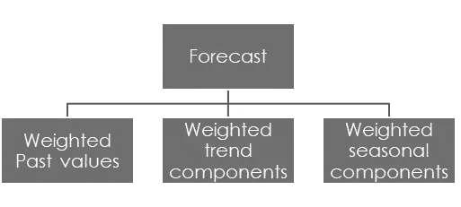

由于我们要应对季节性，我们有两种方法

1.  *附加季节性*-如果数据集的季节性始终不变。
2.  *倍增季节性* —如果季节性在周期内增加或减少。

当我们用我们的“气体”数据绘制 holt-winters 模型时，我们得到以下输出。

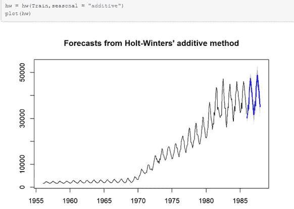

> 请注意，这里的季节性类型是“附加的”，因为潜在的季节性几乎是恒定的。

现在我们知道了所有基本的时间序列建模技术。让我们探索一种复杂的时间序列建模技术——ARIMA(自回归综合移动平均)。

**ARIMA:** 自回归综合移动平均模型处理任何非季节性的时间序列预测问题。

在深入 ARIMA 建模的本质之前，我们需要很好地理解两个基本术语

1.时间序列的平稳性

2.时间序列的差分。

当因变量的值不随时间变化时，称时间序列为**平稳**。因此，趋势和季节性的存在告诉我们，时间序列是非平稳的。

我们使用 r 中的“自相关函数”图来判断时间序列是否平稳。

*y 轴——自相关*——一个从-1 到 1 的值，是指因变量的值与其过去值的相关性。

*x 轴—“滞后”* —滞后 k 自相关是相隔 k 个周期的值之间的相关性*。例如，滞后 2 自相关是对应于时间序列中过去 2 项的相关性的值。*

因此，当我们绘制各种滞后的所有自相关值时，我们会得到如下图。

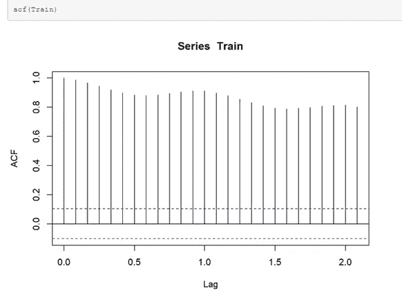

与线性回归一样，在对时间序列实施 ARIMA 之前，数据点需要尽可能地不相关。自相关值接近 0，表示对时间序列值的依赖性较小。

上图显示，即使对于较高的滞后值，自相关值也非常高，因此这些值不是随时间固定的。

我们不能为这样的数据集实现 ARIMA。

要在具有明确长期趋势或明确季节性的时间序列上建立 ARIMA 模型，需要使时间序列保持平稳。

我们如何做到这一点？

我们做了一件叫做“T10”差异的事情。当您减去一个时间序列中的两个连续值时，这是一个差分时间序列。当你做一次差分时，叫做一阶差分，当你做两次差分时，叫做二阶差分。

让我们对“气体”数据集进行差分，看看 ACF 值是否接近 0。

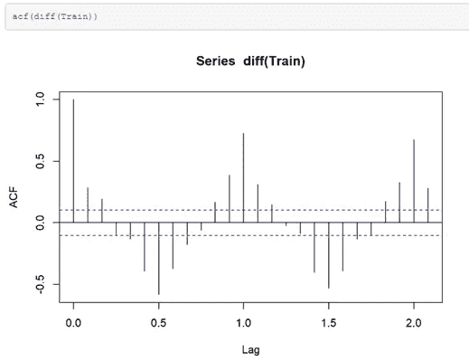

这里，您可以看到，在一阶差分后，时间序列在滞后(3)时变为接近 0 的 ACF 值。这表明该系列已趋于平稳。

您可以通过进行“kpss . test”([R KPSS 检验文档](https://cran.r-project.org/web/packages/tseries/tseries.pdf))来从统计上确认平稳性，在这里您将寻找证据来证明您的替代假设，即“数据不是平稳的”

当我们试图在我们的数据集中执行这个测试时，我们得到了下面的输出。

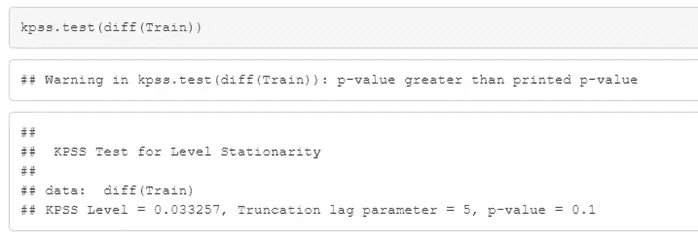

p 值没有提供任何证据来证明替代假设。所以，可以肯定地说这个数列是平稳的。

既然序列是稳定的，我们就可以继续在差异数据集上实现 ARIMA。

**现在，什么是 ARIMA？**

ARIMA 模型有三个组成部分

1.用“p”表示的自回归(AR)部分

2.用“d”表示的集成部分(I)

3.用“q”表示的移动平均部分(MA)

在构建 ARIMA 模型时，您需要指定这三个参数。你可以用下面两种方法中的任何一种来做。

1.通过 ACF 和 PACF 图手动找出 p、d 和 q 值。

2.在 R 中使用 auto.arima()函数，它可以得出 pdq 的最佳组合，从而提供最佳精度。

**手动查找:选择“AR”—“p”:**

自动回归(p)的阶可以通过用差分数据绘制偏自相关函数图(PACF 图)来找到。该图包含时间序列与其过去值之间的相关性。

例如，让我们用“气体”数据做一个 PACF 图。

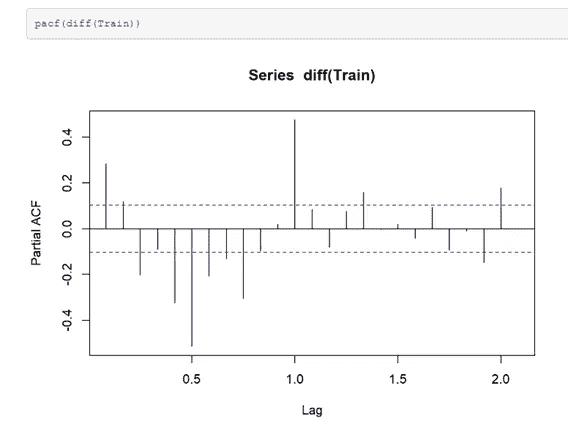

上图中的垂直线显示了不同滞后的相关性强度。蓝线表示置信度。在第一滞后(y(t)和 y(t-1)之间的相关性)，相关性大于 0.2。在第二个滞后时，相关性小于 0.2，但仍大于置信水平。

只有在第 4 个滞后(相关性 y(t)，y(t-1)，y(t-2)，y(t-3)，y(t-4))中，相关值才降到置信水平以下。

> 假设所有中间滞后的影响，y(t)和它的第四个滞后 y(t-3)之间的部分自相关被认为是仅 y(t)和 y(t-3)之间的相关性。某种程度上不完整。因此得名“部分”。

这标志着我们为 ARIMA 模型选择的自相关“AR”—“p”阶，即 p=3。

**选择‘I’—‘d’:**ARIMA 的‘I’代表集成自回归和移动平均建模。

我们需要指定对时间序列进行差分的顺序，因为 ARIMA 必须通过反向差分来整合自回归和移动平均部分，从而为序列中的所有期间提供预测。

也就是 y，积分部分携带代表“差异程度”的值“d”

在我们的例子中，我们将选择 d =1，因为我们已经执行了一阶差分。

**选择“马”的部分——“问”:**

像 PACF 一样，我们有一个单独的图 ACF，它描绘了不同滞后的误差项的自相关。ACF 不是寻找过去值之间的相关性，而是以回归的方式获取过去的误差值。

> 请参考上面的移动平均线解释。

因此，从 ACF 图中，我们可以找到最少的滞后点，此时误差项的自相关低于置信水平。

让我们为“气体”数据绘制一个 ACF 图。

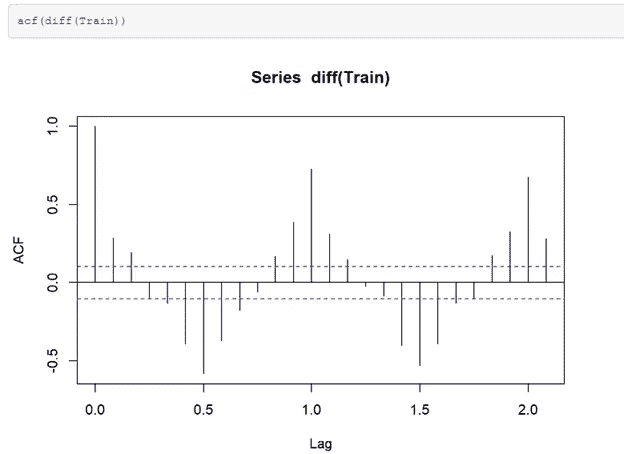

该图表明在滞后 3(忽略对应于 0 的滞后，因为它是第 0 个滞后)时，自相关下降到置信水平以下。所以这里的 q 等于 2。

让我们开始建造 ARIMA 吧。

对于我们提供的 p、d 和 q 值，我们得到下面的预测图。

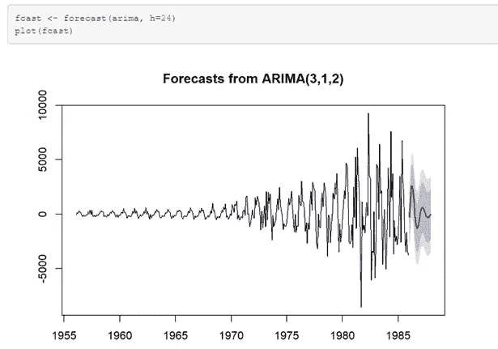

**最后但同样重要的是——模型评估:**

既然我们已经在“gas”数据集上处理了所有基本的时间序列预测模型，那么让我们比较测试数据中每个模型的准确性，以评估最适合我们数据的模型。

下表总结了此处考虑的模型的所有性能指标。

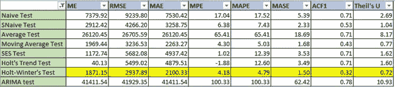

对于任何时间序列模型评估，要考虑的最佳指标是 RMSE(均方根误差)或 MAPE(平均绝对百分比误差)。

根据以上两个性能指标，我们可以有把握地说**热冬的**趋势和季节性模型明显优于所有其他模型。

用于比较模型准确性的另一个关键指标是“泰尔 U 统计量”。这些统计数据使用基准精度(原始模型精度)计算相对精度。数学上，U 统计量由下式给出:

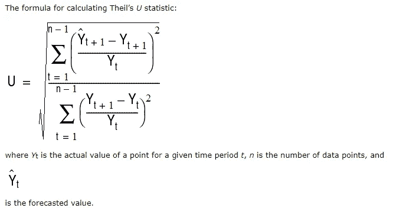

img . source—[https://docs . Oracle . com/CD/e 40248 _ 01/EPM . 1112/CB _ statistical/frameset . htm？ch07s02s03s04.html](https://docs.oracle.com/cd/E40248_01/epm.1112/cb_statistical/frameset.htm?ch07s02s03s04.html)

If U <1 — The chosen model performs better than the benchmark model

If u = 1 — both the models perform equally well

If U > 1 —所选模型的性能比基准测试差。

U 的值越接近 0，模型的表现就越好。

尽管如此，我们数据集的所有这些 U 统计值，对于考虑趋势和季节因素的 Holt-Winter 的模型来说是最少的。

因此，Holt-winter 模型是我们“天然气”消费数据集中预测值建模的赢家。

**下一步…**

现在，我们已经了解了模型选择及其背后的科学，我想将研究提升一个层次，并通过先进的时间序列建模技术(如“神经网络”)来指导大家。

如果你还需要复习时间序列的基本知识，请查看我以前的文章

 [## 时间序列预测基础

### 如果你能知道你下周要花多少钱呢？或者如果你能说出你的睡眠时间…

medium.com](/analytics-vidhya/fundamentals-of-time-series-forecasting-315b7b729bcb)