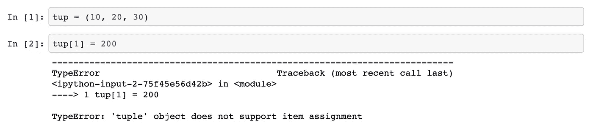
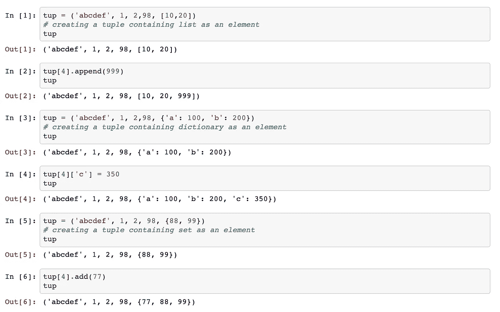
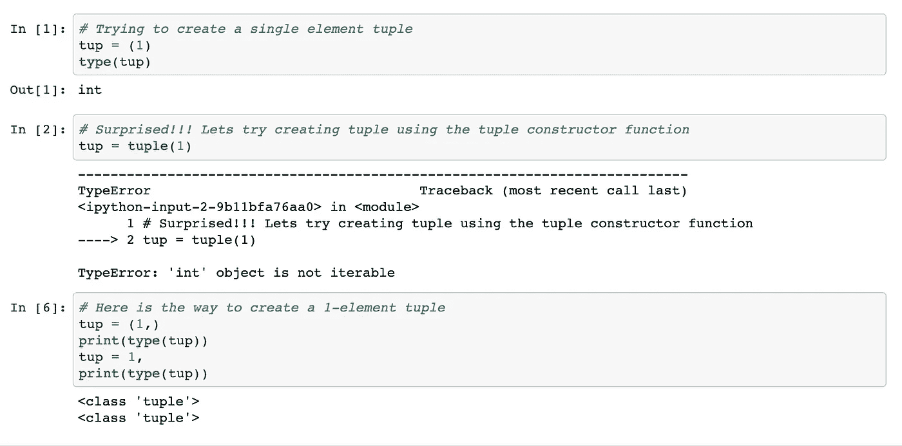

# 深入研究元组— Python

> 原文：<https://medium.com/analytics-vidhya/deep-dive-into-tuples-python-23c8e573f9f3?source=collection_archive---------17----------------------->

元组是只读列表，之后创建时包含一些元素，不能添加任何元素。因此它被称为只读列表。下面的示例展示了一个元组，以及在创建元组后添加元素时元组的行为。

基本元组创建示例

Github 链接:[https://github . com/bvvkrishna/Tuples/blob/master/Tuple % 20 basic % 20 example . ipynb](https://github.com/bvvkrishna/Tuples/blob/master/Tuple%20Basic%20Example.ipynb)

**元组可以修改吗？**

元组也可以像列表一样根据添加的元素类型进行修改。以下是显示如何修改元组的示例。

显示元组修改的示例

Github 链接:[https://github . com/bvvkrishna/Tuples/blob/master/Tuple % 20 modification % 20 example . ipynb](https://github.com/bvvkrishna/Tuples/blob/master/Tuple%20Modification%20Example.ipynb)

从上面的例子可以明显看出，我们可以用新值更新元组。只有当元组中的元素可变时，这才是可能的。正如你所看到的，所有的元素，即列表、字典和集合都是可变的数据类型。因此，我们可以更新元组。

让我们再深入一点，理解一下为什么这是可能的。原因是元组存储其元素的内存引用，并且在这些引用没有被任何赋值修改之前，它不会抛出任何错误。

因此，在上面的例子中，如果我们观察，我们没有向元组添加新元素。相反，元素(即列表、字典或集合)内部的值正在发生变化。

**如何创建单元素元组？**

创建一个元素元组很棘手，也不直接。下面是一个说明这一点的例子。

创建单元素元组

Github 链接:[https://github . com/bvvkrishna/Tuples/blob/master/1-element % 20 tuple % 20 creation % 20 example . ipynb](https://github.com/bvvkrishna/Tuples/blob/master/1-element%20tuple%20creation%20example.ipynb)

在上面的例子中，解释器将单个元素识别为整数类型，即使我们使用了括号。因为算术运算可以在括号中求值，以确定表达式求值的优先顺序。

这就是为什么我们需要使用不同的机制来表示单个元素元组。因此，我们使用逗号(，)符号作为后缀来表示元素是元组而不是整数。我用一个整数展示了这一点。这同样适用于使用其他数据类型，如 float 和 strings。

想了解 Python 的有趣技巧，请在 linkedin 上关注我-[https://www.linkedin.com/in/krishnabvv/](https://www.linkedin.com/in/krishnabvv/)