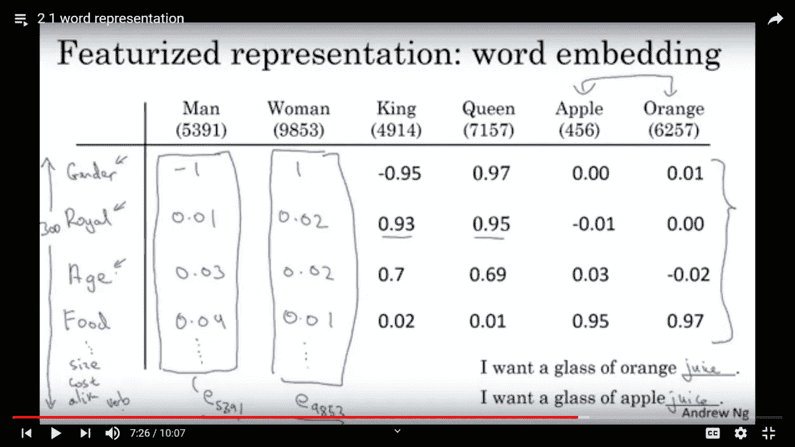

# 深入研究 Word2Vec

> 原文：<https://medium.com/analytics-vidhya/deep-dive-into-word2vec-7fcefa765c17?source=collection_archive---------3----------------------->


> **Word2vec** 是一组用于产生单词嵌入的相关模型。这些模型是浅层的两层神经网络，被训练来重建单词的语言上下文。Word2vec 将大型文本语料库作为其输入，并产生一个向量空间，通常具有数百个维度，语料库中的每个唯一单词都被分配一个空间中的相应向量。单词向量位于向量空间中，使得语料库中共享共同上下文的单词在空间中彼此靠近。在本文中，我们将看到嵌入如何帮助找到相似/不相似的单词。

# 为什么是单词向量？

首先，我们需要知道为什么我们需要把一个单词转换成一个向量？那么什么是矢量呢？

> **矢量**——既有方向又有大小的量，尤其是确定空间中一点相对于另一点的位置。

如果某物有大小和方向，我们可以用它来做数学运算，如果我们可以用一个词的矢量形式来做数学运算，那么它创造了在 N 维空间中比较一个词和另一个词的可能性。

好吧，这可能是一个很大的开始，让我举一个简单的例子来证明当单词被认为是数字而不是简单的字母组合时，数学是如何创造奇迹的。

**动物相似性和简单线性代数**

我们将从英语的一小部分开始:动物词汇。我们的任务是能够找到这些词和它们所指的生物之间的相似之处。为此，我们可以从制作一些动物及其特征的电子表格开始。例如:


这张电子表格将一些动物与两个数字联系起来:它们的可爱程度和大小，两者的范围都是从 0 到 100。(这些值本身是随机取的。)

这些值为我们提供了确定哪些动物相似所需的一切(至少，我们在数据中包含的属性相似)。现在如果我们试着回答一个问题:哪种动物最像水豚？您可以逐个查看这些值，并进行数学计算来做出评估，但是将数据可视化为二维空间中的点可以非常直观地找到答案:


剧情向我们展示了与水豚最接近的动物是熊猫(同样，就其主观大小和可爱程度而言)。计算两点“相距多远”的一种方法是找出它们的欧几里德距离。

你可以把这个箭头理解为狼蛛和仓鼠在大小和可爱程度上的关系。在同一个图中，我也调换了这个箭头(这次是红色的)，所以它的原点是“鸡”箭头的末端离“小猫”最近我们发现的是，和鸡差不多大但更可爱的动物是…一只小猫。打个比方来说:

```
Tarantulas are to hamsters as chickens are to kittens.
```

现在我们有了为什么我们需要把一个单词转换成一个向量的基本概念，我们继续理解如何在一个 N 维空间中得到一个单词的向量。

# 词向量从何而来？

此时一个很好的问题是，*这些维度和权重从何而来？！*生成词向量有两种常见方式:

1.  单词/上下文共现的计数
2.  给定单词的上下文预测(skip-gram 神经网络模型，即 word2vec)

# **这些单词在一个 N 维矩阵中是如何表示的？**

> ***步骤 1-*** 我们一键编码每个单词。这里假设词汇表是 10K 单词，并且每个单词用一维(1*10k)的一键编码来表示。


例如，Man(5391)在一个热编码中只有一个 1，其余的都是其他单词。也表示为 O5391。

现在，如果我们有一个矩阵，其中每个单词都被分类，并用基于其维度的数字评级来表示。例如，男性性别被归类为男性为-1，女性为+1。同样地，国王的性别是男性，所以会有一个负值，而女王是女性会有一个正值。



所以这里我们有对应于维度的行，维度有对应于它的列的数值，但是实际上，像性别、皇家和所有这些行很难解释，但是它们只是随着这个概念而发展。

> **可视化 2D 中的单词嵌入:**这可以使用用于降维的 TSNE 来完成。


> **步骤 2-** 当我们必须找到对应于单词的 N 维向量时，我们将嵌入矩阵乘以单词的独热编码形式，并且我们得到的输出是该单词的 N 维向量。

在这里，为了找到对应于一个单词的 300 维向量，我们将这个嵌入矩阵乘以该单词的一个热表示，该热表示是 10k*1，并且因为 10k 是唯一单词的组合，所以 1 热表示将只有“1”出现一次，所以当与这个嵌入矩阵相乘时，我们将得到(300*1)矩阵，该矩阵将具有所有 300 维的值(一个单词离其他维有多远)。所以，每当我们需要一个词的这种表示时，我们就使用这种方法。

> E.OJ = EJ(E =嵌入矩阵，O = 1-热表示)


现在我们已经掌握了单词嵌入，我们可以深入到 Word2Vec 的概念中。

# W **ord2Vec :**

我们将保持语料库简单，因为它有助于我们轻松理解每一步，而且我们可以清晰地可视化关系，使其更加具体。 **CBOW(连续单词包)和 Skip-Gram** 是两种最流行的单词嵌入框架。在 CBOW 中，在所选单词的上下文(周围单词)中出现的单词被用作输入，中间或所选单词被用作目标。在 Skip-Gram 中正好相反，这里中间的单词试图预测它前面和后面的单词。


考虑由从“a”到“z”的字符顺序组成的文本[a，b，c，d，e，f，g，h，I，j，k，l，m，n，o，p，q，r，s，t，u，v，w，x，y，z]，进一步让整数 0 到 25 代表相应的字母。在保持窗口大小为 2 的情况下实现 CBOW，我们可以看到“a”与“b”和“c”相关，“b”与“a”、“c”和“d”相关，依此类推。由此可见，表示输入单词的一个热向量的维数为[26，1]。在模型的帮助下，我们将找到大小为[10，1]的密集分布向量。嵌入向量的大小是任意选择的。

下图说明了上下文和目标词。


向左。CBOW 和 Skip-gram 模型的排列。没错。字符和相应的整数组合成输入和目标列表。对于每个条目，第一列代表输入字符，每个子列表中的其余条目是输入的目标。

想象关系的模式是很容易的。当它们在两个字符的范围内同时出现时，它们是相关的或者共现是真实的。下面的表格和地图描述了这种模式。


向左。一起出现的字符(没有完全可视化)。没错。黑色区域表示没有同现，白色区域表示在给定窗口大小为 2 #的情况下字符一起出现。还要注意对角线对称，这意味着从 a 到 b 的同现意味着从 b 到 a 的同现，但是这些关系在不同的轴上描述。

Word2Vec 是一个概率模型。该模型的关键组件是两个权重矩阵。第一矩阵(w1)的行和第二矩阵(w2)的列分别嵌入输入单词和目标单词。给定所选择的输入单词，这两个单词向量的乘积然后被用于获得成为目标单词的概率。在训练时，使用梯度下降优化这些嵌入向量，使得真实目标的概率最大化。显然，矩阵 w1 和 w2 是因式分解的概率矩阵，它非常类似于共生矩阵。

下图对模型进行了说明和解释。


Word2Vec 模型示意图。输入和输出向量的大小为 V，而隐藏向量(嵌入)的大小为 n .(来源:[https://lilian Weng . github . io/lil-log/2017/10/15/learning-word-embedding . html](https://lilianweng.github.io/lil-log/2017/10/15/learning-word-embedding.html))


在此图中，模型正在学习将 6 个字符(“a”到“f”)嵌入到三维嵌入向量中。 **A.** 这些字符的共现矩阵的窗口大小为 2，共现表示为存在或不存在。(大小 6，6) **B.** 权重矩阵 w1 —转置。矩阵 w1 的每一行是一个字的嵌入向量，因为一个热码向量唯一地选择一个热码向量的矩阵 w1(或 W1 转置的列)的对应行 **C.** ，每一列表示一个字/项**d .**W1 和输入矩阵的乘积导致矩阵 h(隐藏层)。这里，整个输入矩阵作为单位矩阵，并简单地将权重矩阵 w1 作为隐藏矩阵 h 传递。然而，单位矩阵不是必须的，输入矩阵(以及隐藏层)的顺序和大小可以不同 **E.** 权重矩阵 w2-转置(大小 6，3)。矩阵 w2 的每一列近似地表示目标词 **F.** 隐藏层— h，与之前描述的 w1 相同**g .**w2 的每一行—具有一列隐藏的转置乘积(其嵌入输入词)输出大小为 vocab 的长度的分数 **H.** 如上所述，w2 _ 转置的所有行与 1 列隐藏的相互作用—产生一列分数矩阵，w2 _ 转置和‘h’的总乘积是矩阵 S(大小为 6，6) 【T18 一列中的每个条目被转换成概率 **J.** 概率矩阵-该矩阵的一列中的每个项目表示在给定输入单词的情况下成为目标单词的概率 **L.** 误差-真实索引位置处的概率将被最大化，通过比较分配给对应于真实目标的索引的该概率来计算误差**m .**Back prop-在开始时随机初始化权重，并且所得的概率对于所有目标来说是低的和相似的。在训练、梯度的反向传播和权重的优化之后，概率在目标周围是密集的，而在其他地方接近于 0。

**余弦相似度**

在不同的距离度量中，余弦相似度更直观，在 word2vec 中使用最多。它是两个向量的归一化点积，这个比值定义了它们之间的角度。具有相同方向的两个向量的余弦相似度为 1，90°的两个向量的相似度为 0，直径方向相反的两个向量的相似度为-1，与它们的大小无关。


左上:余弦距离的等式右上:余弦距离从 1 到-1 变化，对应的角度从 0 到 180 度变化。左下角:从 c 到所有字符的余弦距离。右下角:用角度表示的相同距离。注‘c’与其自身最为相似。

# **参考:**

[](https://towardsdatascience.com/introduction-to-word-embedding-and-word2vec-652d0c2060fa) [## 单词嵌入和 Word2Vec 简介

### 单词嵌入是文档词汇表最流行的表示方法之一。它能够捕捉…的上下文

towardsdatascience.com](https://towardsdatascience.com/introduction-to-word-embedding-and-word2vec-652d0c2060fa) [](https://dzone.com/articles/introduction-to-word-vectors) [## 单词向量介绍- DZone AI

### 词向量代表了我们在分析词与词之间关系的能力上的一个重大飞跃…

dzone.com](https://dzone.com/articles/introduction-to-word-vectors) [](https://towardsdatascience.com/word2vec-made-easy-139a31a4b8ae) [## Word2vec 变得简单

### 这篇文章是 word2vec 的一个简单而深入的指南。在本文中，我们将实现 word2vec 模型

towardsdatascience.com](https://towardsdatascience.com/word2vec-made-easy-139a31a4b8ae) 

艾利森·帕里什的《理解单词向量:【https://gist.github.com/aparrish/2f56... 