# 深度梦:可视化 PyTorch 中卷积网络学习的特征

> 原文：<https://medium.com/analytics-vidhya/deep-dream-visualizing-the-features-learnt-by-convolutional-networks-in-pytorch-b7296ae3b7f?source=collection_archive---------2----------------------->

当涉及到计算机视觉相关任务时，卷积神经网络(CNN)是最有效的机器学习工具之一。他们的有效性可以从以下事实来衡量:大多数计算机视觉竞赛，如 ILSVRC、PASCAL VOC 和 COCO，已经被使用基于 CNN 的创新架构来实现其目标的参赛作品所主导。

因此，询问“在给定的 CNN 中，各种过滤器学习了什么特征”是有趣的。这个问题不仅从普通的“好奇心”的角度来看是有趣的，更重要的是知道这个问题的答案可以给我们非常有用的洞察力来改善我们 CNN 的性能。例如，ILSVRC-2013 挑战赛的获奖作品(Clarifai)是通过改进上一年的获奖作品(AlexNet)而设计的。这些改进是通过在 AlexNet 上应用特征可视化技术(Deconvnets)选择的。参见[这篇](https://cs.nyu.edu/~fergus/papers/zeilerECCV2014.pdf)论文(由 ILSVRC-2013 获奖者撰写)了解更多细节，或者[这篇](/coinmonks/paper-review-of-zfnet-the-winner-of-ilsvlc-2013-image-classification-d1a5a0c45103)博客进行精彩评论。

在这篇文章中，我们将学习如何使用一种叫做“激活最大化”的技术来可视化 CNN 学习的特征，这种技术从一个由随机初始化的像素组成的图像开始，这些像素的值被慢慢调整，以最大化我们希望可视化的层的输出。这是在[这篇](https://www.researchgate.net/publication/265022827_Visualizing_Higher-Layer_Features_of_a_Deep_Network)论文中首次介绍的，并在[这篇](https://arxiv.org/abs/1312.6034)论文中首次应用于 CNN。然而，对 CNN 的激活最大化的天真应用倾向于产生非常高频率的图像，这些图像看起来一点也不像人们每天遇到的真实世界的自然图像。例如，参见[此处](https://distill.pub/2017/feature-visualization/#enemy-of-feature-vis)对该问题的详细描述以及解决这些问题的常用方法的讨论。在本帖中，我们将限制自己使用三种简单的正则化技术来使图像更有意义:

1.  从一张 28 x 28 的小图片开始，慢慢放大到想要的尺寸，比如这里的。
2.  惩罚大像素值
3.  不利于图像中大的像素梯度，即不利于相邻像素值的任何急剧变化。

所以让我们开始吧。包含我尝试过的各种东西的完整代码可以在我的 [Github](https://github.com/praritagarwal/Visualizing-CNN-Layers/blob/master/Activation%20Maximization.ipynb) 上找到。这篇文章是基于笔记本中的试验#6。在这里，我将详细介绍一下代码。顺便提一下，我最近还看到了一个很棒的 Keras——Keras 的创造者 Francois Chollet 实现了同样的技术。我强烈推荐大家看看他的[帖子](https://blog.keras.io/how-convolutional-neural-networks-see-the-world.html)。

让我们从加载一个预训练模型开始:

```
import torch
from torchvision import models
model = models.googlenet(pretrained = True)
```

虽然我看到的大多数关于激活最大化的博客都倾向于使用 VGG16 作为他们的预训练模型，没有什么特别的原因，除了尝试一些不同的东西，我将使用 GoogLeNet。这个博客中的几乎所有代码都可以直接应用于任何其他经过训练的 CNN。

由于我们感兴趣的是可视化模型已经学习的内容，而不是重新训练模型，因此，我们应该冻结模型参数，以便它们在反向传播期间不会改变。

```
for param in model.parameters():
    param.requires_grad_(False)
```

请注意，模型中的各个层可以通过赋予它们的唯一名称轻松访问。因此，让我们列出模型中不同层的名称:

```
list(map(lambda x: x[0], model.named_children()))
```

在 GoogLeNet 上，这会产生以下输出

```
['conv1',
 'maxpool1',
 'conv2',
 'conv3',
 'maxpool2',
 'inception3a',
 'inception3b',
 'maxpool3',
 'inception4a',
 'inception4b',
 'inception4c',
 'inception4d',
 'inception4e',
 'maxpool4',
 'inception5a',
 'inception5b',
 'avgpool',
 'dropout',
 'fc']
```

出于演示目的，我将(随机)选择名为“inception4a”的图层。我们现在必须为这一层注册一个向前的钩子。[挂钩](https://pytorch.org/tutorials/beginner/former_torchies/nnft_tutorial.html#forward-and-backward-function-hooks)提供对所需图层的输出和 grad _ ouput 的简单访问。顾名思义，向前钩子在向前传递期间执行，并允许我们查看/修改层的输出。类似地，在向后传递期间执行向后挂钩，并允许我们查看/修改层的 grad _ ouput。查看这个[博客](https://blog.paperspace.com/pytorch-hooks-gradient-clipping-debugging/)和这个 [kaggle 内核](https://www.kaggle.com/sironghuang/understanding-pytorch-hooks/notebook)以获得更多关于钩子的信息。这里的实现基于 pytorch 讨论板上的这个[讨论](https://discuss.pytorch.org/t/visualize-feature-map/29597/2)。为了注册一个前向钩子，我们首先定义下面的工厂函数，它返回一个函数对象，我们将使用它作为钩子:

```
activation = {} # dictionary to store the activation of a layerdef create_hook(name):
 def hook(m, i, o):
   # copy the output of the given layer
   activation[name] = o

 return hook
```

我们现在注册挂钩:

```
# register a forward hook for layer inception4a
model.inception4a.register_forward_hook(create_hook(‘4a’))
```

请注意，PyTorch 上的预训练模型要求输入图像“必须加载到[0，1]的范围内，然后使用`mean = [0.485, 0.456, 0.406]`和`std = [0.229, 0.224, 0.225]`进行归一化”。因此，我们将在图像上定义以下转换:

```
# normalize the input image to have appropriate mean and standard deviation as specified by pytorchfrom torchvision import transformsnormalize = transforms.Normalize(mean=[0.485, 0.456, 0.406],
                                 std=[0.229, 0.224, 0.225])# undo the above normalization if and when the need arises denormalize = transforms.Normalize(mean = [-0.485/0.229, -0.456/0.224, -0.406/0.225], std = [1/0.229, 1/0.224, 1/0.225] )
```

现在让我们定义一个函数来生成由随机初始化的像素组成的图像。为了允许在反向传播期间调整图像，我们必须将图像的“requires_grad_”标志设置为真。

```
import numpy as npHeight = 28
Width = 28# generate a numpy array with random values
img = np.single(np.random.uniform(0,1, (3, Height, Width)))# convert to a torch tensor, normalize, set the requires_grad_ flag
im_tensor = normalize(torch.from_numpy(img)).requires_grad_(True)
```

让我们还定义一个函数来反规格化图像，并将颜色通道移动到最后的维度，以便使用 matplotlib 的 imshow 显示它。这在使用 open-cv 的 resize 方法调整图像大小时也很方便。

```
# function to massage img_tensor for using as input to plt.imshow()
def image_converter(im):

    # move the image to cpu
    im_copy = im.cpu()

    # for plt.imshow() the channel-dimension is the last
    # therefore use transpose to permute axes
    im_copy = denormalize(im_copy.clone().detach()).numpy()
    im_copy = im_copy.transpose(1,2,0)

    # clip negative values as plt.imshow() only accepts 
    # floating values in range [0,1] and integers in range [0,255]
    im_copy = im_copy.clip(0, 1) 

    return im_copy
```

正如我们之前提到的，我们希望惩罚图像中像素值的任何急剧变化，即我们将惩罚图像中像素值的 x 和 y 导数。这可以通过用[索贝尔滤镜](https://docs.opencv.org/2.4/doc/tutorials/imgproc/imgtrans/sobel_derivatives/sobel_derivatives.html)或[沙尔滤镜](https://docs.opencv.org/2.4/modules/imgproc/doc/filtering.html?highlight=scharr#scharr)创建卷积层来完成。我们可以定义一个卷积层，它可以接受以下任何一种滤波器:

```
import torch.nn as nn# class to compute image gradients in pytorch
class RGBgradients(nn.Module):
    def __init__(self, weight): # weight is a numpy array
        super().__init__()
        k_height, k_width = weight.shape[1:]
        # assuming that the height and width of the kernel are always odd numbers
        padding_x = int((k_height-1)/2)
        padding_y = int((k_width-1)/2)

        # convolutional layer with 3 in_channels and 6 out_channels 
        # the 3 in_channels are the color channels of the image
        # for each in_channel we have 2 out_channels corresponding to the x and the y gradients
        self.conv = nn.Conv2d(3, 6, (k_height, k_width), bias = False, 
                              padding = (padding_x, padding_y) )
        # initialize the weights of the convolutional layer to be the one provided
        # the weights correspond to the x/y filter for the channel in question and zeros for other channels
        weight1x = np.array([weight[0], 
                             np.zeros((k_height, k_width)), 
                             np.zeros((k_height, k_width))]) # x-derivative for 1st in_channel

        weight1y = np.array([weight[1], 
                             np.zeros((k_height, k_width)), 
                             np.zeros((k_height, k_width))]) # y-derivative for 1st in_channel

        weight2x = np.array([np.zeros((k_height, k_width)),
                             weight[0],
                             np.zeros((k_height, k_width))]) # x-derivative for 2nd in_channel

        weight2y = np.array([np.zeros((k_height, k_width)), 
                             weight[1],
                             np.zeros((k_height, k_width))]) # y-derivative for 2nd in_channel

        weight3x = np.array([np.zeros((k_height, k_width)),
                             np.zeros((k_height, k_width)),
                             weight[0]]) # x-derivative for 3rd in_channel

        weight3y = np.array([np.zeros((k_height, k_width)),
                             np.zeros((k_height, k_width)), 
                             weight[1]]) # y-derivative for 3rd in_channel

        weight_final = torch.from_numpy(np.array([          weight1x, weight1y, 
weight2x, weight2y,
weight3x, weight3y])).type(torch.FloatTensor)

        if self.conv.weight.shape == weight_final.shape:
            self.conv.weight = nn.Parameter(weight_final)
            self.conv.weight.requires_grad_(False)
        else:
            print('Error: The shape of the given weights is not correct')

    # Note that a second way to define the conv. layer here would be to pass group = 3 when calling torch.nn.Conv2d

    def forward(self, x):
        return self.conv(x)
```

事实证明，对于 3 x 3 内核，Scharr 滤波器优于 Sobel 滤波器，因此我们将使用 Scharr 滤波器:

```
# Scharr Filtersfilter_x = np.array([[-3, 0, 3], 
                     [-10, 0, 10],
                     [-3, 0, 3]])filter_y = filter_x.T
grad_filters = np.array([filter_x, filter_y])
```

现在让我们创建一个上面定义的卷积层的实例，把它传递给 Scharr 过滤器。

```
gradLayer = RGBgradients(grad_filters)
```

让我们也定义一个函数，它使用上面定义的 gradLayer 来计算输入图像的 x 和 y 导数，并返回它们的均方根值。

```
# function to compute gradient loss of an image def grad_loss(img, beta = 1, device = 'cpu'):

    # move the gradLayer to cuda
    gradLayer.to(device) gradSq = gradLayer(img.unsqueeze(0))**2

    grad_loss = torch.pow(gradSq.mean(), beta/2)

    return grad_loss
```

最后，让我们把所有东西都搬到 GPU 上。如果你没有 GPU 或者你想在你的 cpu 上进行计算，你可以跳过下面的步骤。

```
device = torch.device('cuda' if torch.cuda.is_available() else 'cpu')
print('Calculations being executed on {}'.format(device))model.to(device)
img_tensor = im_tensor.to(device)
```

正如我们之前提到的，我们也会慢慢提升形象。我们将使用 opencv 的 resize()方法来实现这一点(如果您愿意，也可以使用[torch vision . transforms . resize()](https://pytorch.org/docs/stable/torchvision/transforms.html#torchvision.transforms.Resize))。因此，我们需要导入 cv2。我们还需要 matplotlib.pyplot 和 torch.optim。

```
import cv2
from torch import optim
import sys
import matplotlib.pyplot as plt
```

我们现在准备调整我们的随机图像，使其最大化我们卷积层所选节点的输出。出于本文的目的，让我选择索引值为 225 的节点。

我将优化图像 20 次迭代，然后以 1.05 的因子重新缩放。我将重复这个循环 45 次，以得到最终尺寸为 249 x 249 的图像。

```
unit_idx = 225 # the neuron to visualize
act_wt = 0.5 # factor by which to weigh the activation relative to the regulizer termsupscaling_steps = 45 # no. of times to upscale
upscaling_factor = 1.05
optim_steps = 20# no. of times to optimize an input image before upscaling
```

我们现在将运行两个嵌套循环来优化我们的图像，然后按如下方式放大它:

```
model.eval()
for mag_epoch in range(upscaling_steps+1):
    optimizer = optim.Adam([img_tensor], lr = 0.4)

    for opt_epoch in range(optim_steps):
        optimizer.zero_grad()
        model(img_tensor.unsqueeze(0))
        layer_out = activation['4a']
        rms = torch.pow((layer_out[0, unit_idx]**2).mean(), 0.5)
        # terminate if rms is nan
        if torch.isnan(rms):
            print('Error: rms was Nan; Terminating ...')
            sys.exit()

        # pixel intensity
        pxl_inty = torch.pow((img_tensor**2).mean(), 0.5)
        # terminate if pxl_inty is nan
        if torch.isnan(pxl_inty):
            print('Error: Pixel Intensity was Nan; Terminating ...')
            sys.exit()

        # image gradients
        im_grd = grad_loss(img_tensor, beta = 1, device = device)
        # terminate is im_grd is nan
        if torch.isnan(im_grd):
            print('Error: image gradients were Nan; Terminating ...')
            sys.exit()

        loss = -act_wt*rms + pxl_inty + im_grd        
        # print activation at the beginning of each mag_epoch
        if opt_epoch == 0:
            print('begin mag_epoch {}, activation: {}'.format(mag_epoch, rms))
        loss.backward()
        optimizer.step()

    # view the result of optimising the image
    print('end mag_epoch: {}, activation: {}'.format(mag_epoch, rms))
    img = image_converter(img_tensor)    
    plt.imshow(img)
    plt.title('image at the end of mag_epoch: {}'.format(mag_epoch))
    plt.show()

    img = cv2.resize(img, dsize = (0,0), 
                     fx = upscaling_factor, fy = upscaling_factor).transpose(2,0,1) # scale up and move the batch axis to be the first
    img_tensor = normalize(torch.from_numpy(img)).to(device).requires_grad_(True)
```

在上面的代码片段中，我们为损失函数定义了三种贡献:

1.  rms:这是我们选择的卷积单元产生的输出张量中元素的均方根值。我们希望最大化这一点。
2.  pxl_inty:这是我们图像中像素值的均方根值。出于正则化的目的，我们希望惩罚大像素值，从而保持 pxl_inty 较低。
3.  im_grd:这是像素值的 x 和 y 导数的均方根值。通过保持低电平，我们可以确保像素值不会发生急剧变化。

因此，损失函数由下式给出

```
loss = -act_wt*rms + pxl_inty + im_grd
```

其中‘act _ wt’是我们分配给‘rms’相对于 pxl_inty 和 im_grd 的权重。因此，与图像中的像素强度和梯度相比，改变 act_wt 改变了单元激活的重要性。我们还检查在迭代的任何一点，这些是否成为 nan，在这种情况下，我们终止代码。

注意，在外部循环中，即放大循环中，每次我们调整图像尺寸时，我们都生成新的 img_tensor，因此，我们必须在每个放大时期的开始重建我们的优化器。

瞧啊。我们完了。执行上面的循环会生成以下图像:

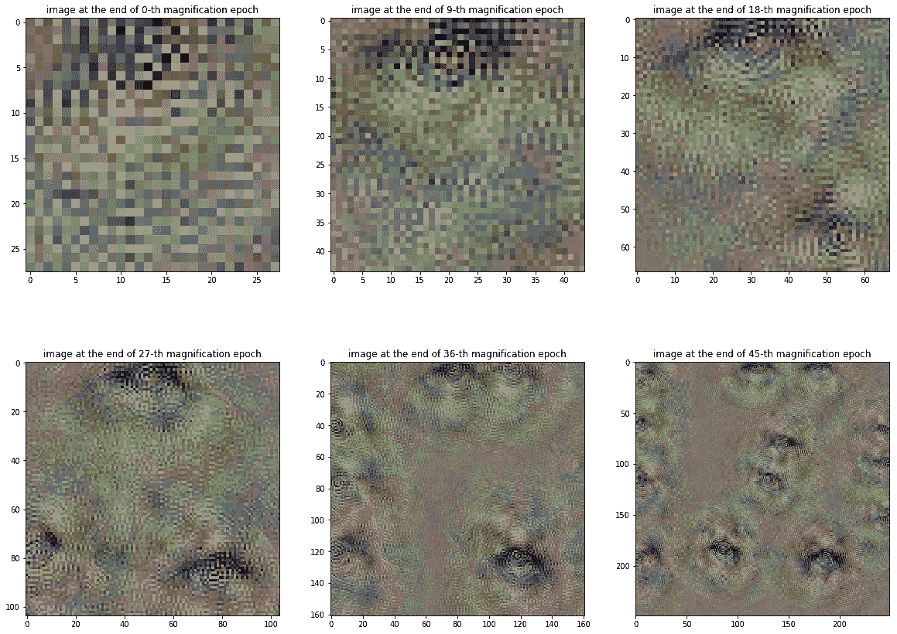

左上至右下:第 0、第 9、第 18、第 27、第 36 和第 45 倍放大结束时的图像

如果我没有偏见的话，那么这样产生的最终图像似乎包含了很多眼睛一样的特征。因此，我们可以推断，这里讨论的卷积单元必须在输入图像中寻找“眼睛”。看看其他卷积节点最终学到了什么将会很有趣。以下是每层中前 10 个最活跃单元的可视化效果:

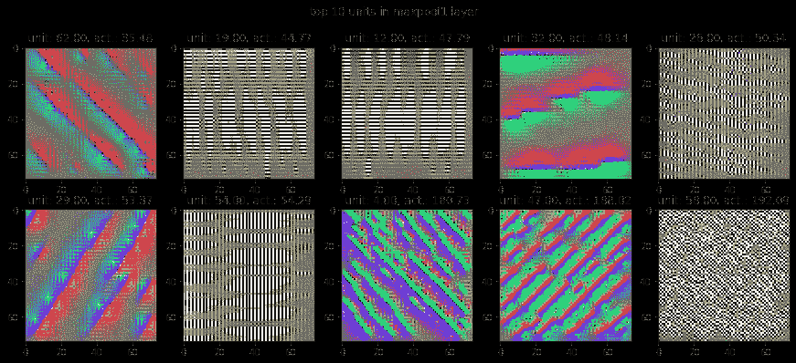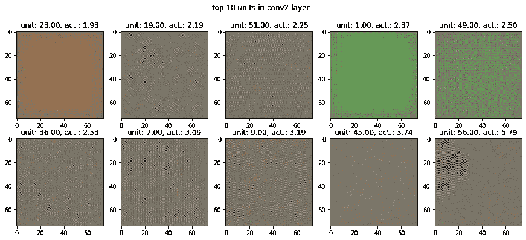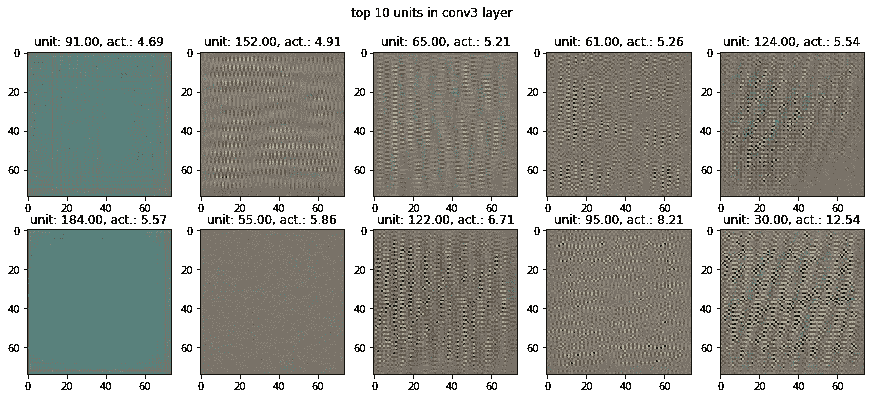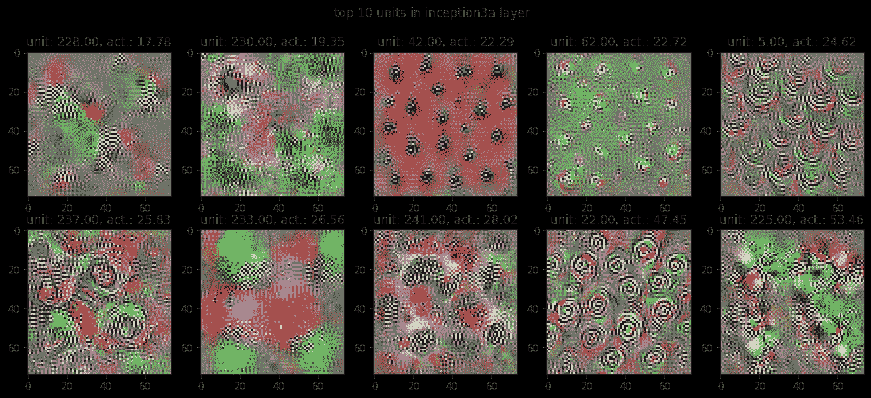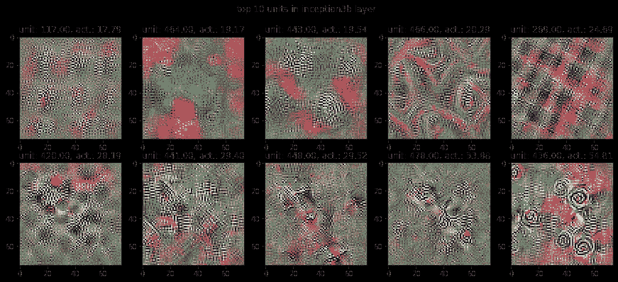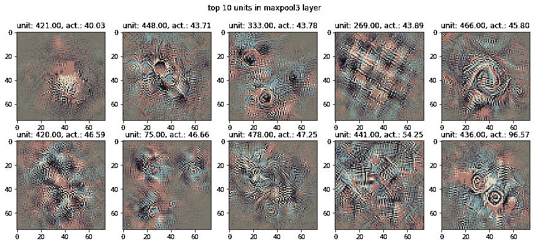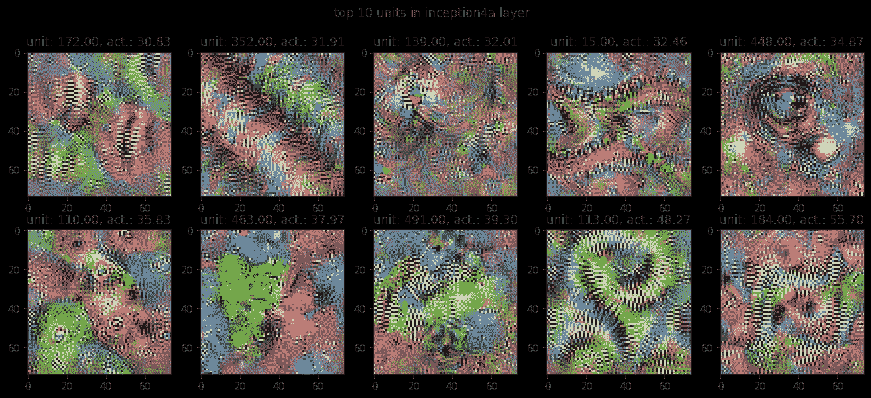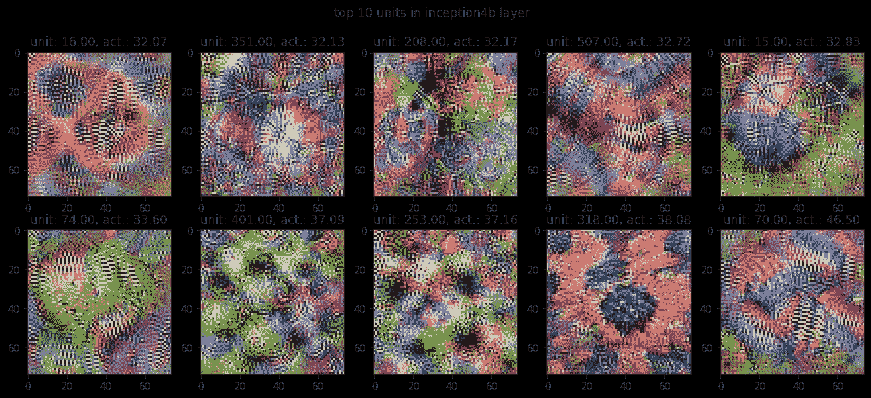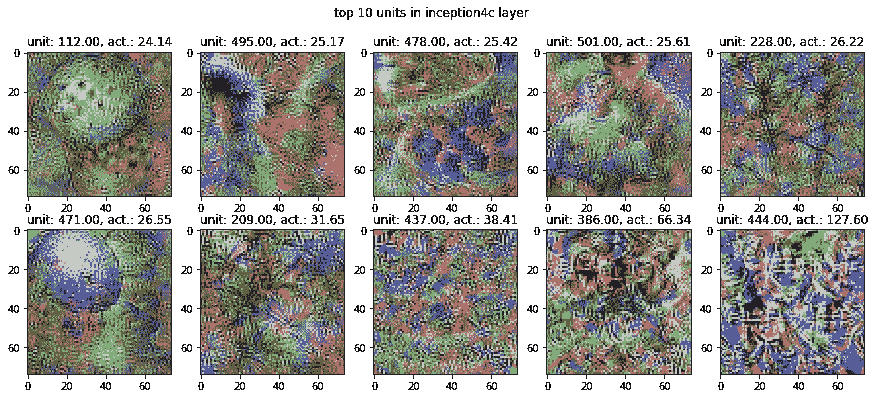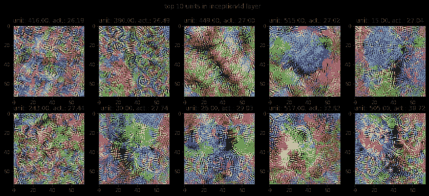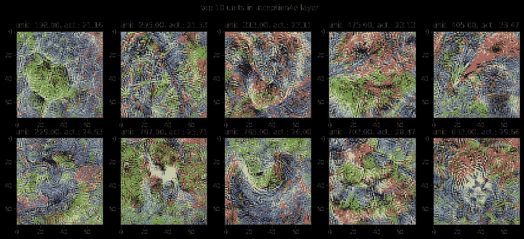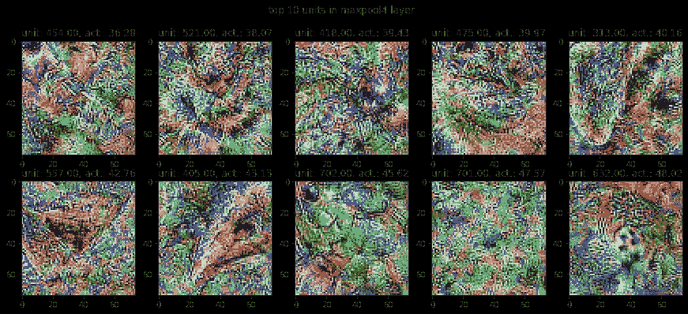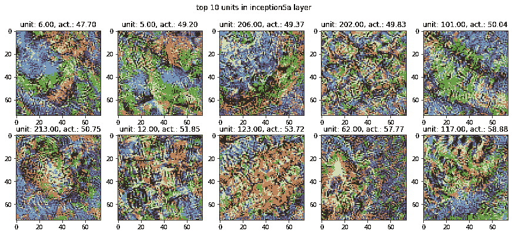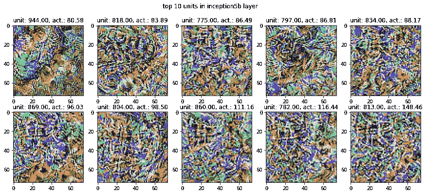

看起来 CNN 中的大多数单位最终都学习了不同种类的纹理。偶尔，有一些单位会学习面部特征，比如眼睛等等。我不知道为什么，但对我来说，它看起来像在第 4a 层-第 4e 层和第 5a 层的单位有最可辨别的特征。在许多地方都有人认为，CNN 的高层最终会学习用于训练的图像的内容，而低层则相反，它们最终会学习图像的纹理。从这个角度来看，我希望最后一层，即 inception5b 能够产生包含高度明显的人类可解释组件的图像。然而，对于主要包含非常高频率模式的相应图像来说，情况似乎并非如此。也许，我应该尝试一个大于 3 x 3 滤镜的渐变图层。Mahendran 和 Vedaldi 也主张使用抖动来规范这些高频模式的出现。这是我没有包括在内的东西，但尝试一下会很有趣。

希望你会和我一样玩得开心。😃