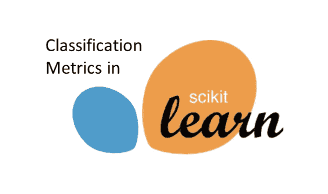
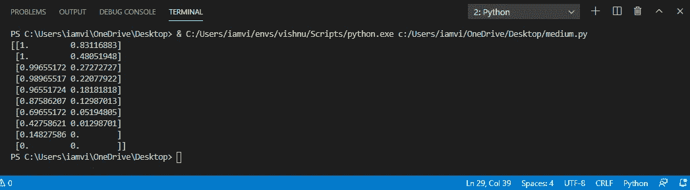
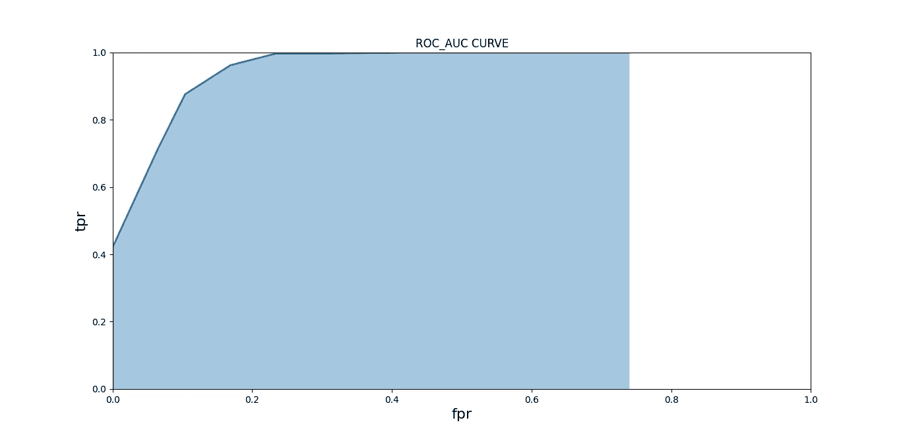
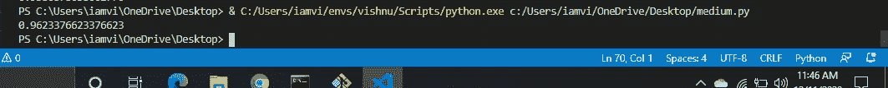

# ROC 曲线和 ROC 曲线下面积(AUC)背后的深层直觉和事物

> 原文：<https://medium.com/analytics-vidhya/deep-intuition-and-things-behind-the-roc-curve-and-area-under-roc-curve-auc-894337d96ed?source=collection_archive---------6----------------------->



这篇博客是[这篇文章](/analytics-vidhya/evaluating-metrics-for-classification-machine-learning-models-learners-at-medium-level-c956a8b8d889)的延续。

现在，我假设你知道混淆矩阵、准确度、精确度、回忆和 F1 分数。

我再次重申，在学习这些指标之前，您需要了解如何构建分类模型。

现在，我将为您构建一个模型...

让我们用同样的旧代码片段，

```
import pandas as pd
from sklearn.datasets import make_classification
from sklearn.model_selection import train_test_splitfrom sklearn.tree import DecisionTreeClassifierX,y = make_classification(n_samples=200,n_features=10,random_state=20)X_train,X_test,y_train,y_test = 
sklearn.model_selection.train_test_split(X,y,random_state = 43)model = DecisionTreeClassifier()
model.fit(X_train,y_train)
```

现在，你有一个模型。

到目前为止，你所理解的是，**“如果你看到一个不平衡的数据集，那么你必须使用 F1-Score(结合了精确度和召回率)的指标”**。

**注意:-** 请浏览我以前关于分类标准的博客，以了解下面的事情…

在深入研究 ROC_AUC 之前，我们需要了解一些东西，如真+ve 率(TPR)、假+ve 率(FPR)、假阴性率(FNR)、真-ve 率(TNR)、灵敏度和特异性。

1.  **真阳性率(TPR)** :-真+ve 率与 Recall 相同，“它是预测的+ve 值被正确预测为+ve 样本的比率”

**TPR = TP / (TP + FN)**

真阳性率也叫**灵敏度。**

如果模型的灵敏度高，那么我们的模型可以有效地预测+ve 样本。

2.**真阴性率:-** 真阴性率是预测 ve 值作为 ve 样本得到正确预测的比率。

**TNR = TN / (TN + FP)**

真阴性率也叫**特异性。**

如果我们的模型的特异性高，那么我们的模型可以有效地预测样本。

注意:-每当我们建立我们的模型时，我们需要以一种灵敏度和特异性非常高的方式来设计我们的模型。

3.**假阴性率(FNR):-** 假阴性率是阳性值被错误地预测为阴性样本的比率。

**FNR = FN / (FN + TP)**

还有，**(假-ve 率)+(真+ve 率)= 1**

即 **FPR = (1-灵敏度)。**

4.**假阳性率(FPR):-** 假阳性率是阴性值被错误地预测为阳性样本的比率。

**FPR = FP / (FP + TN)**

还有，**(假阳性率+真阴性率)= 1**

即**FPR =(1-特异性)。**

现在，你知道什么是 TPR，TNR，FPR 和 FNR。

如果你是机器学习的初学者，那么你可以通过做这个来预测课程

```
y_pred = model.predict(X_test)
```

当我们编译上面一行代码时，将会发生的是，

首先，模型将预测测试数据为正的概率。然后，通过与阈值 0.5 进行比较，即如果 prediction_probability > 0.5，则预测的测试样本将被称为+ve 样本，否则为负。其实我们也可以做实际执行。

请参见上面的实现示例:

我们来想一个测试样本，Predicted_probability = 0.68。然后，将这个概率与阈值= 0.5 进行比较，即，在代码语言中，

```
if( Predicted_Probability > 0.5) #0.5 is threshold 
{ 
    return 1;
} 
else 
{ 
    return 0;
}
```

1 ->正

0->负

这里，默认情况下，我们的模型将阈值视为(0.5)。因此，当预测概率> 0.5 时，如果预测概率< 0.5, then the predicted test label will be 0\. All these things will be automatically calculated by the model, and in y_pred, test labels will be appended.

y_pred will be look like this[1, 0, 0, 1, 1, 1, 1, 0].

All the metrics that were discussed in the previous blog will be calculated through the above procedure only. The below complete code represents the above explanation.

Read again, if you didn’t understand…

```
import pandas as pd
from sklearn.datasets import make_classification
from sklearn.model_selection import train_test_splitfrom sklearn.tree import DecisionTreeClassifierX,y = make_classification(n_samples=200,n_features=10,random_state=20)X_train,X_test,y_train,y_test = 
sklearn.model_selection.train_test_split(X,y,random_state = 43)model = DecisionTreeClassifier()
model.fit(X_train,y_train)#this will be predicted with the threshold of 0.5 as explained above
y_pred = model.predict(y_test)#y_pred will be look like[1, 0, 0, 1, 1, 1, 1, 0]
accuracy_score = sklearn.metrics.accuracy_score(y_true,y_pred)
```

Now, we’ll see another type of prediction in order to understand the ROC_AUC…

Till now, what you’ve studied is a type of prediction method which you won't use much in implementing real-time applications. Now, we’ll discuss a method of predicting, which will be used in real-world problem-solving.

The method is simple. As we consider the default threshold as 0.5, manually we’ll predict the probabilities of test samples and then, we’ll consider a threshold in such a way that our metric will give high accuracy.

Note:- From now, you should not use model.predict() function, see the below function and you should use it now.

the function is,

```
model.predict_proba(X_test)
```

the above function will predict the probabilities of test samples to be positive. The higher the value, the higher the chance that the test sample to be +Ve.

**ROC_AUC 得分:-** ROC_AUC 得分仅仅是 ROC 曲线的面积，则预测测试标签将为 1，而 ROC 曲线将根据不同的阈值通过使用不同的 TPR 和 FPR 来构建。

让我们一步步深入 ROC_AUC 分数:-

1.  考虑一组阈值，比如说，[0.1，0.2，0.3，0.4，0.5，0.6，0.7，0.8，0.9，1.0]。

现在，我们将测试样本预测概率与每个阈值进行比较，并预测离散值，即 0 或 1。

根据预测的离散值，可以计算出真+Ve 率、假+Ve 率。

请参见下面的上述要点实现…

```
model = sklearn.linear_model.LogisticRegression()   model.fit(X_train.values,y_train.values)y_prob = model.predict_proba(X_test.values)             print(y_prob)tpr = []
fpr = []for i in threshold_list:
   k = y_prob[:,1] > i
   j = []
   for i in k:
      j.append(int(i)
   tp = true_positive(y_test,j)
   fp = false_positive(y_test,j)
   tn = true_negative(y_test,j)
   fn = false_negative(y_test,j)
   tpr.append(tp/(tp+fn))
   fpr.append(fp/(fp+tn))data = list(zip(tpr,fpr))
dataset = pandas.DataFrame(data,columns = ["tpr","fpr"])
print(dataset.values)
```

上面的代码将给出如下所示的输出



在输出中，左边的值代表 TPR，右边的值代表 FPR

我上面考虑的数据集只是用来显示 FPR & TPR 将如何计算，不要为数据集而烦恼。只需关注 FPR 和 TPR 是如何计算的(你可以在这里看到数据集)。

2.现在，在 TPRs 和 FPRs 的帮助下，我们将绘制一个称为 ROC 曲线的图表，这是我们针对不同阈值计算的。

参见下面的代码和输出，

```
plt.figure(figsize = (7,7))
plt.fill_between(dataset.fpr.values,dataset.tpr.values, alpha=0.4)
plt.plot(dataset.fpr.values,dataset.tpr.values,lw = 2)
plt.title("ROC_AUC CURVE")
plt.xlim(0,1.0)
plt.ylim(0,1.0)
plt.xlabel("fpr",fontsize = 16)
plt.ylabel("tpr",fontsize = 16)
plt.show()
```

代码的输出是一个 ROC 曲线，见下图



不要为曲线而烦恼，只要专注于如何绘制 ROC 曲线。在建模之前，我没有对数据做太多预处理。所以，曲线不够好。

3.现在，我们需要找出图中蓝色区域的面积，这个面积叫做 ROC **曲线**的**面积，也叫**曲线下面积(AUC)。****

为了计算曲线下的面积，我们可以进入线性代数、积分和许多数学框架。但是我们不需要深入研究它们。我们可以使用 sklearn 计算面积，这样会给出 AUC(曲线下面积)。

这个 AUC 是机器学习中对于倾斜目标最流行的度量之一。

让我们看看计算这个面积的代码(只有一行😉):-

```
print(sklearn.metrics.roc_auc_score(y_test,y_prob[:,1]))
```

这将给出曲线下面积的输出，如下所示:-



AUC 分数

AUC 分数将在 0 和 1 之间。如果 AUC 分数接近 1，那么我们开发的模型是可以为所考虑的数据集开发的最佳模型之一(也有可能过度拟合，对此要小心)。如果 AUC 评分接近 0，那么我们的模型比随机猜测还要差。

如果我们的模型给出的分数= 0.5，那么我们的模型就是幼稚模型。

**大注:-**

我们也可以将 ROC 曲线用于另一个目的。从上面我们可以看到，不同的阈值，产生不同的离散预测，产生不同的 TPR 和 FPR。但是，在开发工业应用时，特定的阈值值将由项目领域专业人员选择，以这种方式，无论他们想要高 TPR 还是低 TPR，高 FPR 还是低 FPR，根据这一点，阈值将被选择。仅在该阈值的帮助下，将根据预测的概率进行离散值预测。这些预测和指标将会得到应用。

由于我们是机器学习的初学者，我们将以 TPR 和 FPR 都达到平衡的方式来选择阈值。任何 ROC 曲线左上角的值将给出一个平衡的阈值。

我觉得这都是关于 ROC_AUC 评分的…

如果有什么需要补充的，让我知道…

联系我这里:-[https://www . LinkedIn . com/in/Vishnu-vard Han-vara palli-b6b 454150/](https://www.linkedin.com/in/vishnu-vardhan-varapalli-b6b454150/)

快乐的 Learning✌！！