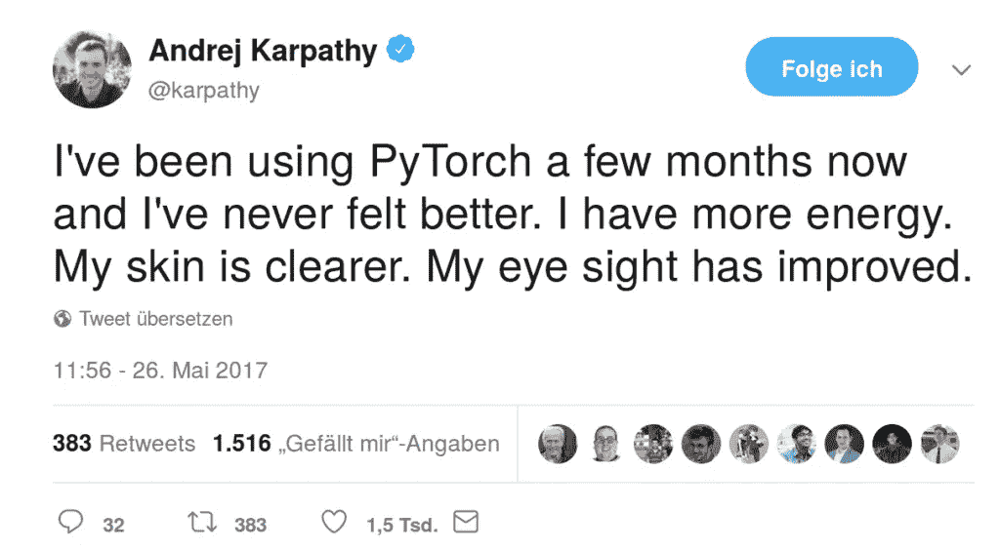

# 深度学习 101 —用 PyTorch 构建您的第一个神经网络

> 原文：<https://medium.com/analytics-vidhya/deep-learning-101-building-your-first-neural-network-with-pytorch-39d2709dce32?source=collection_archive---------4----------------------->

几个月前，我[开始尝试 PyTorch](https://www.datahubbs.com/reinforce-with-pytorch/) 并很快将其作为我的深度学习框架。除此之外，我还收到了一些请求，要求我按照我过去做过的一般深度学习介绍来介绍这个框架(这里是，[这里是](https://www.datahubbs.com/deep-learning-101-building-a-neural-network-from-the-ground-up/)，[这里是](https://www.datahubbs.com/deep-learning-101-first-neural-network-tensorflow/)，这里是)。在这种情况下，让我们从这款激动人心、功能强大的……