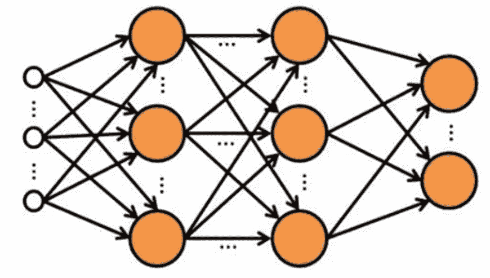

# 深度学习

> 原文：<https://medium.com/analytics-vidhya/deep-learning-13ee3d7e5b55?source=collection_archive---------20----------------------->

# 深度学习是什么？

> “机器学习涉及使用非常复杂的模型，称为“深度神经网络”。

*   这是组织神经网络的一种特殊方式，可以解决非常困难的问题，如从照片或视频中识别人脸和处理大数据。​
*   它是机器学习的一种高级形式，试图模仿人脑的学习方式。​​
*   它模拟了发生在我们大脑中的生物过程，使用人工神经网络来处理数字输入，而不是电化学刺激。​

# 神经元和神经网络

# 神经元

神经元是一种数学函数，被认为是生物神经元的模型，即神经网络。​

这些神经元依次被激活，并通过网络的其余部分传递信号。随着时间的推移，随着你学会如何有效地做出反应，神经元之间的连接会因频繁使用而得到加强。例如，如果有人向你扔球，你的神经元连接使你能够处理视觉信息，并协调你的运动来接球。如果你重复执行这个动作，当你学会如何更好地接球时，参与接球的神经元网络将变得更强。​

在我们的大脑中，我们有称为神经元的神经细胞，它们通过神经延伸相互连接，神经延伸通过网络传递电化学信号。​

当一个神经元受到刺激时，输入信号就会得到处理，如果它超过了特定的阈值，神经元就会被激活，并将信号传递给与之相连的神经元。

同样，人工神经元是一种数学函数，被视为生物神经元的模型，即神经网络。​

那么神经元是做什么的呢？​

它获取输入并乘以它们的权重，然后将它们相加，之后将激活函数应用于总和。​

所以，到目前为止，我们知道了神经元是什么，神经元做什么，现在我们剩下一个问题，神经元如何学习？

为此，让我们看看神经元的目标是什么。神经元的目标是根据输入和输出的大量例子来调整权重，并确定。​

*   哪些特征是重要的和积极的。​
*   哪些功能不重要
*   哪些特征是重要的，哪些是负面的。​

神经元基于输入和期望输出来学习权重。​

# 神经网络

神经网络是具有多层的神经元网络。

它也受到我们大脑中神经元网络的启发。例如，如果我们有一个单一的神经元，它可以执行一个简单的任务。但是当然，它可能不是 100%准确。所以，我们使用神经元网络。因此，当一个输入被给出时，神经元被激活，并将信号从一层传递到另一层，最终提供结果。通过这种方式，我们能够解决极其困难的问题，同时也提高了准确性。

让我们看一个神经网络的例子。这里，我们有四层:-

*   一个输入层，每个预期输入(x)值对应一个神经元。​
*   两个所谓的隐藏层，每个包含三个神经元。​
*   包含两个神经元的输出层-每个神经元对应一个由模型预测的类概率(y)值。​ ​

# 激活功能

激活函数是决定神经网络输出的数学方程。​

该函数附属于网络中的每个神经元，并根据每个神经元的输入是否与模型的预测相关来确定是否应该激活该函数。神经元的输出是激活函数的输出。​

# 损失函数

损失函数或成本函数是将事件或一个或多个变量的值映射到实数上的函数，该实数直观地表示与事件相关联的一些“成本”。优化问题寻求最小化损失函数。它告诉我们，在做这件事的时候，我们的损失是多少。

例如，假设通过训练过程的样本之一包含陈月娇样本(类别 0)的特征。

网络的正确输出应该是[1，0，0]。现在假设网络产生的输出是[0.4，0.3，0.3]。

比较这些，我们可以计算每个元素的绝对方差(换句话说，每个预测值离它应该的值有多远)为[0.6，0.3，0.3]。​

实际上，由于我们实际上是在处理多个观察值，所以我们通常会合计方差，例如通过对各个方差值求平方并计算平均值，这样我们最终会得到一个单一的平均损失值，如 0.16。​

# 人工神经元表示

# 优化者

我们已经看到，损耗是使用一个函数来计算的，该函数对网络最后一层的结果进行运算，这也是一个函数。网络的最后一层对前几层的输出进行操作，前几层也是函数。因此，实际上，从输入层到损耗计算的整个模型只是一个大的嵌套函数。优化是通过响应损失函数的输出更新模型来将损失函数和模型参数联系在一起的函数

# 学习率

现在，让我们看看学习率是什么意思。

*   训练期间权重更新的量被称为步长或“学习率”​.​
*   它是一个超参数，用于控制每次更新模型权重时，根据估计误差对模型进行多大程度的更改。​
*   选择学习率是有挑战性的，因为值太小可能导致长时间的训练过程而停滞不前，而值太大可能导致学习一组次优权重过快或训练过程不稳定。​
*   在配置神经网络时，学习率可能是最重要的超参数。因此，了解如何研究学习率对模型性能的影响，并建立学习率对模型行为的动态影响的直觉是至关重要的。​

# 过度拟合和欠拟合

*   当模型学习训练数据中的细节和噪声达到对新数据的模型性能产生负面影响的程度时，就会发生过度拟合。​
*   欠拟合指的是既不能对训练数据建模也不能推广到新数据的模型。​

所以，我们已经看到了两个最坏的情况。我们做什么呢

# 正规化

*   正则化是添加信息以解决不适定问题或防止过度拟合的过程。​
*   正则化适用于不适定优化问题中的目标函数。​ ​

# 二元分类

二元分类是指那些具有两个类别标签的分类任务。

二元分类任务包括一类是正常状态，另一类是异常状态。

例子包括:

*   垃圾邮件检测(垃圾邮件与否)。​
*   流失预测(流失与否)。​
*   转化预测(买不买)。通常用预测每个例子的伯努利概率分布的模型来模拟二元分类任务。

# 线性回归

线性回归试图通过将线性方程拟合到观察到的数据来模拟两个变量之间的关系。一个变量被认为是解释变量，另一个被认为是因变量。例如，建模者可能希望使用线性回归模型将个体的体重与其身高相关联。

线性回归假设您的输入和输出之间的关系是线性的。它不支持任何其他内容。这可能是显而易见的，但是当你有很多属性的时候记住它是很好的。您可能需要转换数据以使关系呈线性(例如，指数关系的对数转换)。

## 用于逻辑回归的表示法

逻辑回归是一种统计模型，其基本形式使用逻辑函数来模拟二元因变量，尽管存在许多更复杂的扩展。在回归分析中，逻辑回归(或 logit 回归)是估计逻辑模型的参数(二元回归的一种形式)。

逻辑回归使用一个方程作为表示，非常像线性回归。

使用权重或系数值(称为希腊大写字母 Beta)对输入值(x)进行线性组合，以预测输出值(y)。与线性回归的一个关键区别在于，建模的输出值是二进制值(0 或 1)而不是数值。

下面是一个逻辑回归方程的例子:

y = e^(b0+B1*x)/(1+e^(b0+B1*x))

其中 y 是预测输出，b0 是偏差或截距项，b1 是单一输入值(x)的系数。输入数据中的每一列都有一个关联的 b 系数(一个恒定的实值)，该系数必须从训练数据中获取。存储在内存或文件中的模型的实际表示是方程中的系数(beta 值或 b 值)。

# 反向传播

神经网络的真正力量是它们的多层变体。训练单层感知器很简单，但是得到的网络不是很强大。问题变成了，我们如何训练多层网络？这就是反向传播的由来。

反向传播是一种用于训练具有许多层的神经网络的算法。它分两个阶段工作。第一阶段是输入通过神经网络传播到最后一层(称为前馈)。在第二阶段，该算法计算误差，然后将该误差从最后一层反向传播(调整权重)到第一层。

在训练过程中，网络的中间层自行组织，将部分输入空间映射到输出空间。通过监督学习，反向传播识别输入到输出映射中的错误，然后相应地调整权重(通过学习率)来纠正该错误。反向传播仍然是神经网络学习的一个重要方面。随着更快和更便宜的计算资源，它继续被应用于更大和更密集的网络。

# 训练深度神经网络

深度神经网络的训练过程包括多次迭代，称为历元。对于权重(w)和偏差 b 值，过程如下:

*   具有已知标注值的数据观测值的要素被提交到输入图层。
*   神经元然后应用它们的功能，如果被激活，将结果传递到下一层，直到输出层产生预测。
*   将预测值与实际已知值进行比较，计算预测值和真实值之间的差异量(我们称之为损失)。
*   基于该结果，计算权重和偏差值的修正值以减少损失，并且这些调整被反向传播到网络层中的神经元。
*   下一个时期用修正的权重和偏差值重复批量训练向前传递，有希望提高模型的准确性(通过减少损失)。

# 神经网络的类型

# 人工神经网络

*   它是深度学习算法的最基本类型。
*   它被设计用来模仿人类大脑中的过程。
*   他们创造了一种机器学习的工具，而不是被硬编码。
*   它也被称为香草神经网络

# 卷积神经网络

*   它们最初是在 80-90 年代发明的，用于手写支票和信封上的字符识别。
*   它们现在被用于处理从面部识别到自动驾驶汽车的任何类型的视觉数据。
*   也是监督学习的一个分支。

# 递归神经网络

*   rnn 是监督网络的重炮。
*   这个想法是让神经网络有内存，让他们能够处理时间序列数据和解决复杂的问题，如翻译和视频字幕。
*   这很可能是由于一种叫做长短期记忆网络的特殊类型的 RNN。

# 玻尔兹曼机器

*   它是一种无监督的神经网络。
*   神经元的极端互联性使它们强大但计算量大。
*   简化的受限玻尔兹曼机器速度更快，并且在特征检测方面表现出色，这使得它们成为推荐系统的热门选择。