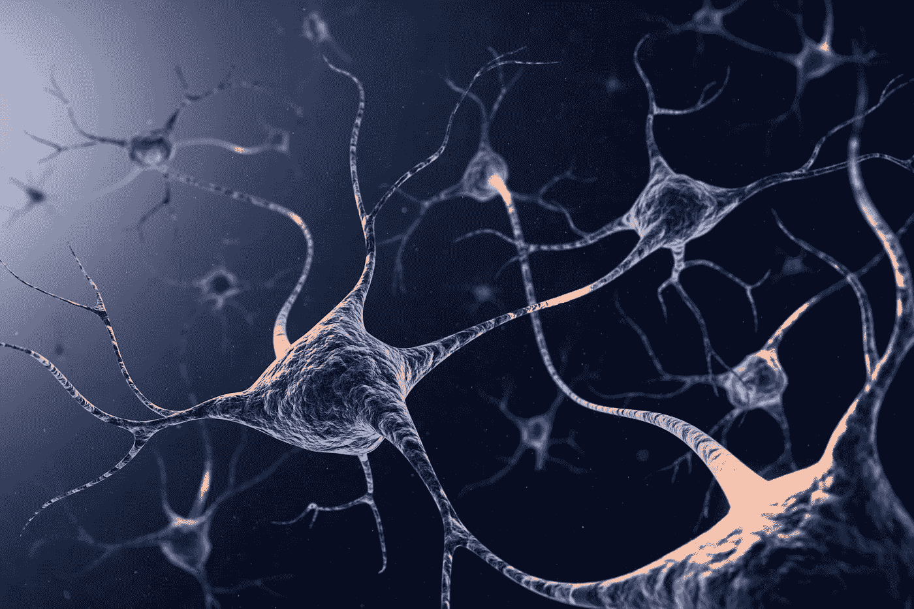
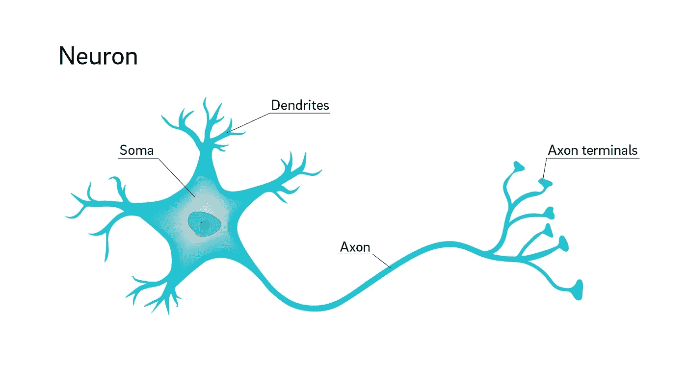
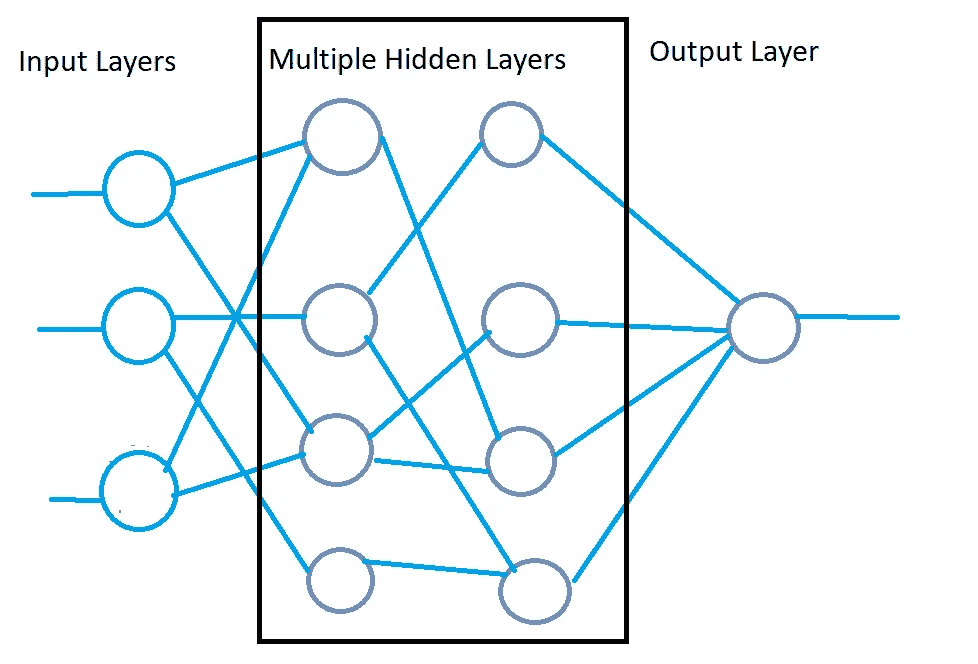

# 深度学习

> 原文：<https://medium.com/analytics-vidhya/deep-learning-6db817adf64d?source=collection_archive---------22----------------------->

在这篇文章中，我们将了解深度学习，它与人类大脑的相似性，它的工作原理及其应用。

今天，这个世界上的每个人都对人工智能、机器学习和深度学习这些词着迷，无论人们在做什么，他们都希望在市场上领先。在这个数字时代，我们在互联网上有大量的数据，我们越来越依赖机器来分析这些数据。

假设我们想预测房子的价格。如果我回到 50 年前，我会寻求有经验的专业人士可以告诉价格给某些参数，如面积，卧室数量，距离等。现在我们可以训练一个深度学习模型，它可以很容易地预测房子的价格。

听起来很棒！但是什么是深度学习呢？

## 深度学习——定义

> 深度学习可以定义为一种强大的机器学习，通过计算机算法进行自我学习和改进。它与人工神经网络一起工作，这有点类似于人脑中的神经元。

## 深度学习如何类似于人脑中的神经元？

如果我们在人脑中看到神经元，它看起来会像这样，

来源:[https://www . genengnews . com/news/mechanism-than-prevented-the-death-of-neurons-identified/](https://www.genengnews.com/news/mechanism-that-prevents-the-death-of-neurons-identified/)

这里有许多相互连接的神经元。如果我们选择一个神经元并靠近它看。

来源:[https://medical xpress . com/news/2018-07-neuron-axons-spindly-they re-optimization . html](https://medicalxpress.com/news/2018-07-neuron-axons-spindly-theyre-optimizing.html)

信号通过树突来自我们身体的感觉(鼻子、眼睛、耳朵)，通过称为轴突的长尾传播，并通过轴突末端传递到另一个神经元。这种信号或信息可以通过多个神经元进行传递，从而使一些动作得以进行。

类似地，在深度学习中，我们有一些输入节点和多个隐藏的节点层，相关的信息通过这些节点层传递到输出层。

神经网络

## 深度学习是如何工作的？

正如你在上面的神经网络图片中看到的，我们有 3 层:

1.  输入层
2.  隐藏层
3.  输出层

输入层包含多个独立变量，如面积、距离、卧室数量。所有连接到隐藏层的边都有与之关联的权重。

在隐藏层中，基于哪些信息对于隐藏层中的神经元或节点是重要的，我们可以取权重和输入信号的乘积之和。我们将激活函数应用于这个加权乘积和。

我们对所有隐藏层重复上述过程。然后我们最后求和，计算出我们的输出。

**激活函数
*激活函数*** *是决定神经网络输出的数学方程。* ***函数*** *附属于网络中的每个神经元，根据每个神经元的输入是否与模型的预测相关来确定是否应该激活***。**

*有许多激活功能，但最常用的是:*

1.  *阈值功能→(是/否)*
2.  *Sigmoid 函数→ ([0，1])*
3.  *整流器→ (≥0)*
4.  *双曲正切→[-1，1]*

## *深度学习的应用*

*   *自动驾驶汽车。*
*   *新闻聚合和欺诈新闻检测。*
*   *自然语言处理。*
*   *虚拟助理。*
*   *视觉识别。*
*   *欺诈检测。*

**参考文献:**

1.  *[https://missing link . ai/guides/neural-network-concepts/7-types-neural-network-Activation-functions-right/#:~:text = Activation % 20 functions % 20 are % 20 数学% 20 方程式，相关% 20 for % 20 模型% 20 预测](https://missinglink.ai/guides/neural-network-concepts/7-types-neural-network-activation-functions-right/#:~:text=Activation%20functions%20are%20mathematical%20equations,relevant%20for%20the%20model's%20prediction)。*
2.  *[https://www . udemy . com/course/machine learning/learn/lecture/6760386 #公告](https://www.udemy.com/course/machinelearning/learn/lecture/6760386#announcements)*