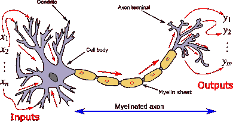
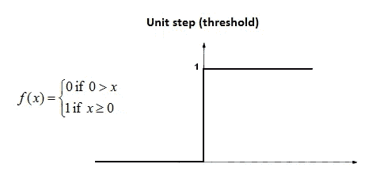

# 深度学习:从初学者到专家水平的直观指南

> 原文：<https://medium.com/analytics-vidhya/deep-learning-an-intuitive-guide-from-a-beginner-to-an-expert-level-999454d8234a?source=collection_archive---------25----------------------->

神经元、感知器、神经网络和反向传播初学者指南。

作者图片

众所周知，机器学习是人工智能的一个分支，在这个分支中，我们赋予机器学习的能力，而无需使用一些数据进行显式编程。在本文中，我们将讨论深度学习。深度学习是一套特殊的机器学习算法，使用人工神经网络。人工神经网络是一种受生物神经网络启发的先进计算系统。这就是为什么说它们描绘了人类的智慧。由于易于获得大计算能力和数据集，深度学习可以用于各种领域，如自然语言处理(NLP)、计算机视觉、欺诈检测、模式识别、语音识别、生物信息学等，因此它们在各种领域都有巨大的需求，如银行部门、医疗保健部门、教育部门、娱乐部门等。所以让我们开始理解深度学习的基础。深度学习本身是一个非常大的领域，并且在不断增长，因此我们需要在掌握这个领域之前学习很多概念。在这篇文章中，我将只涉及深度学习的基础知识。在以后的文章中，我将深入这个领域，并涵盖每个深度学习爱好者必须知道的所有主要流行词汇。

# 内容-

1.  人工神经元如何受到生物神经元的启发？
2.  逻辑回归的神经元表示
3.  感知器
4.  多层感知器(MLP)
5.  训练单个感知器模型
6.  训练多层感知器
7.  反向传播算法
8.  结论
9.  信用

# 人工神经元如何受到生物神经元的启发？

神经元是大脑的基本工作单位。在大脑中，几个神经元相互连接，在激活时执行一项特殊的任务。生物神经元有三个部分:称为树突(一种细胞体)的输入单元和称为轴突的输出单元。树突向神经元提供输入。每个神经元都有一个细胞体，在那里对它们进行特定类型的操作，然后产生输出。这种输出通过轴突传递给其他单位。随着这些轴突与其他几个单元连接，它形成了一个被称为生物神经网络的网络。

生物神经元(来源:维基百科)

人工神经网络就是受这个概念的启发。人工神经元是与生物神经元非常相似的数学函数。像树突一样，人工神经元有输入单元，像轴突一样，人工神经元有输出单元，像细胞体对输入进行一些操作，人工神经元也有数学函数，对输入进行一些操作。如上图所示，一些枝晶比其他的更粗。为了在人工神经元中描述同样的事情，我们给每个输入单元分配权重。所以基本上权重有助于决定哪个输入更重要。然后，存在于人工神经元内部的被称为激活函数的函数获取这些输入和权重，然后对它们进行处理，最后产生输出，该输出然后以与生物神经元相同的方式被传送到输出单元。

人工神经元(来源:cnl.salk.edu)

假设神经元的输入由向量 X(x1，x2，x2)表示，权重由向量 W(w1，w2，w3)表示，那么神经元将首先计算它们的点积，该点积将是 x1.w1+x2.w2+x3.w3。该点积也称为输入的加权和。然后这个点积将通过激活函数‘f’。因此，输出“y”将是 f(x1.w1+x2.w2+x3.w3)。根据我们选择的激活函数，我们将得到不同的输出。

# 逻辑回归的神经元表示

逻辑回归是最简单的分类算法之一。它使用 sigmoid 函数(也称为逻辑函数，用σ表示)来计算给定输入的输出。然后基于输出，我们解释输入的类别。对于输入 X 权重 W 和偏差 b，输出将为 sigmoid(W'X+b)。我们可以用一个简单的神经元来表示逻辑回归。在人工神经元中，如果我们使用 sigmoid 函数作为激活函数，它将表现为逻辑回归。这样，逻辑回归可以成为神经网络的一层。我们可以从随机初始化这些权重开始，然后使用梯度下降算法训练它们。(在以后的博客中，我将讨论一些用于权重初始化及其训练的智能技术)。在神经网络中堆叠更多这样的函数可以帮助它学习输入和输出之间的复杂关系。这就是神经网络的力量所在。

逻辑回归的神经元表示(来源:mc.ai)

# 感知器-

感知器是一种用于二进制分类的监督学习算法。它是一个单层神经网络，使用 Heaviside 阶跃函数进行激活。如果输入为负，阶跃函数输出为 0；如果输入为 0 或正，阶跃函数输出为 1。当加权输入给感知器时，它使用阶跃函数进行计算，然后输出 0 或 1。然后，它更新权重以提高准确性。在这篇博客的后面，我们将了解这些权重是如何更新的。感知机是弗兰克·罗森布拉特在 1958 年发明的。一个有趣的事实是，它是作为机器而不是软件被发明的。感知器是一个简单的人工神经元，以阶跃函数作为激活函数。我们将使用这些感知器来创建一个复杂的神经网络，它将有能力在输入和输出之间形成复杂的关系。

亥维赛阶梯函数(来源:维基百科)

# 多层感知器-

多层感知器(MLP)是一个完全连接的神经网络，这意味着当前层的所有节点都连接到下一层的所有节点。它由一个输入层、几个隐藏层和最后一个输出层组成。隐藏层是那些其输入依赖于先前层的输出的层。如果一个 MLP 只有一个隐藏层，它通常被称为香草网络。为了简单起见，让我们从两个隐藏层开始。为了在继续之前把事情弄清楚，让我们讨论一些我们将使用的符号。

第 I 层第 j 个神经元上的 Fᵢⱼ:函数

从第 I 个神经元到第 j 个神经元的 Wₖᵢⱼ:权重和“k”代表下一层

第 I 层到第 j 层的 Oᵢⱼ:输出

为了简单起见，我没有在图中标出所有的重量。

多层感知器(作者图片)

如果我们使用矩阵来表示层之间的权重，那么它将是 NXM 维数，其中 N 和 M 分别表示每层的神经元数量。因此，输入层和第一隐藏层之间的权重矩阵的大小将为 6×4，第一隐藏层和第二隐藏层之间的权重矩阵的大小将为 4×3，第二隐藏层和最终层之间的权重矩阵的大小将为 3×1。

MLP 使用非线性激活函数来为每个神经元生成输出。基本上，MLP 首先工作，我们初始化所有权重，然后根据当前权重和给定数据点，MLP 计算输出，然后根据该输出，使用实际输出计算损耗。之后，它使用梯度下降算法迭代更新权重以最小化损失(或者使用它的一些变体或优化器，我将在未来的博客中介绍)。

这就是 MLP 的工作原理。让我们深入了解它，理解它工作背后的所有数学原理。

# 训练单个感知器模型:

让我们训练一个单一的感知器模型来执行回归任务。我们有一个由 D 表示的数据集，由输入 X(x1，x2…xn)和相应的输出 Y(y1，y2…yn)组成。假设我们使用 relu 函数作为所有神经元的激活函数，即神经元的输入小于零，那么它的输出也将是零，否则它的输出将与输入相同。为了简单起见，让我们假设我们正在随机初始化权重。当我们在解决回归问题时，让我们使用均方误差函数作为损失函数。这里 W'X+b 代表输入的加权和

作者图片

我们目标是最小化损失函数，表示为-

作者图片

所以我们的目标是找到 W 使得损失(L)最小。让我们用梯度下降算法来做这件事。对于梯度下降，我们需要计算损失函数对重量(w)的导数。

作者图片

设 r 为学习率(0.001)，使用梯度下降权重将更新为

作者图片

重复该过程直到收敛，即重复该过程直到 W(新的)和 W(旧的)变得几乎相同。

到目前为止，我们还没有做任何独特的事情。这个过程后面是所有的优化问题，都是用梯度下降法解决的。我们要做的独特的事情是，我们将使用微分链法则，而不是直接计算损失对重量的导数。在这个阶段，这可能看起来没有用，因为我们可以直接计算导数，但相信我，当我们训练多层感知器时，这将非常非常有用。所以我们不用直接计算损失对重量的导数，而是用这个-

作者图片

因为 L 是“y(pred)”的函数，所以 L 相对于“y(pred)”的导数可以容易地计算，并且因为 y(pred)是 W 的函数，所以 W 相对于 y(pred)的导数也可以容易地计算。我们将使用这个等式来更新权重。

当达到收敛时，我们找到最佳权重以最小化损失的任务就完成了。因此我们的模型被训练。

# 训练一个多层感知器(MLP)模型

训练 MLP 与训练单个感知机模型是一样的。在 MLP，方程式可能看起来非常复杂，但是如果你仔细阅读这篇博客，你会很容易理解它们。我试图用尽可能简单的方式来解释它们。让我们再看一次我们之前用过的图表

作者图片

我们已经在上面的 MLP 中讨论了权重矩阵的维数。如果我们把它们加起来，我们就得到了 6*4+4*3+3*1，也就是 39 个重量。因为它们有很多权重，所以我只计算几个权重来直观地说明如何计算每一层的权重。

对于 MLP，我们也使用与前一个案例相同的假设，即我们随机初始化权重，对所有神经元使用 relu 函数，并使用均方误差来计算总损失。当输入给这个网络时，第一隐藏层中的神经元被激活，然后它们激活第二隐藏层的神经元，并且以这种方式使用前向传播产生输出。然后使用这个输出损失的计算类似于我们对单感知器的计算

作者图片

我们的目标是找到最佳 W，使这种损失最小。为此，我们可以像前面讨论的一样，再次使用梯度下降。我们在这里的主要挑战是计算损失对重量的导数。正如我之前提到的，我们会用微分的链式法则来计算所有这些导数。使用链式法则，我们可以很容易地计算这些导数，然后在梯度下降算法中使用它们。我们将从最后一层开始计算导数，然后向内移动，因为许多这些导数将重复。

使用链式法则计算的 W₃₁₁、W₃₂₁和 W₃₃₁损失的导数为-

作者图片

现在往回走，我们需要计算 W₂₁₁、W₂₁₂、W₂₁₃、W₂₁₄、W₂₂₁、W₂₂₂、W₂₂₃、W₂₂₄ W₂₃₁、w 和 w 的损失导数。

我会用几个例子来展示如何计算这些导数，其余的可以用同样的直觉来计算-

作者图片

现在往回走，我们需要计算损失对这些重量的导数-

W₁₁₁、W₁₂₁、W₁₃₁、W₁₄₁、W₁₅₁、W₁₆₁、W₁₁₂、W₁₂₂

如果我们仔细看我们的 MLP 图，很清楚从输入到输出有 3 条路径。在这种情况下计算导数可以通过这个图像很容易理解。

作者图片

从上面的图像中，很明显这次计算导数将会非常复杂。因此我只计算一个导数，其余的可以用同样的方法计算-

作者图片

重复同样的过程，我们可以用同样的方式计算剩余的导数。

因此，使用上述步骤，可以计算这种多层感知所需的所有导数。现在，我们可以执行梯度下降算法来更新权重，直到收敛。这样，一个 MLP 就被训练出来了。

作者图片

# 反向传播算法

到目前为止，你一定很清楚，为了训练一个 MLP，我们需要计算很多导数。很多只是重复而已。因此，为了避免计算的冗余和优化，我们有一个算法，使用动态规划来计算导数。这种算法被称为反向传播算法。它从最后一层到内层应用了我们前面讨论过的链式法则，以避免冗余的计算和记忆。其余所有步骤与我们之前讨论的相同。

> 简单地说，反向传播是链式法则和动态规划(记忆化)的结合。

# 结论-

在这篇博客中，我讨论了深度学习的基础知识。我们看到了人工神经元如何受到生物神经元的启发，什么是感知器，感知器如何工作，如何使用反向传播算法训练 MLP(深度神经网络)。

# 学分-

1.  [https://en.wikipedia.org/wiki/Artificial_neural_network](https://en.wikipedia.org/wiki/Artificial_neural_network)
2.  【https://en.wikipedia.org/wiki/Artificial_neural_network 号
3.  【http://citeseerx.ist.psu.edu/viewdoc/download? doi = 10 . 1 . 1 . 335 . 3398&rep = re P1&type = pdf
4.  [http://www . cs . stir . AC . uk/courses/itnp 4b/lectures/kms/4-MLP . pdf](http://www.cs.stir.ac.uk/courses/ITNP4B/lectures/kms/4-MLP.pdf)

作者图片

那都是我这边的。感谢阅读这篇文章。使用的少数图片的来源被提及，其余的是我的创作。请随意发表评论，建议改正和改进。通过 Linkedin 与我联系，或者你可以给我发邮件，地址是 sahdevkansal02@gmail.com。我期待听到您的反馈。如果你想阅读更多这样的文章，请关注我的媒体。