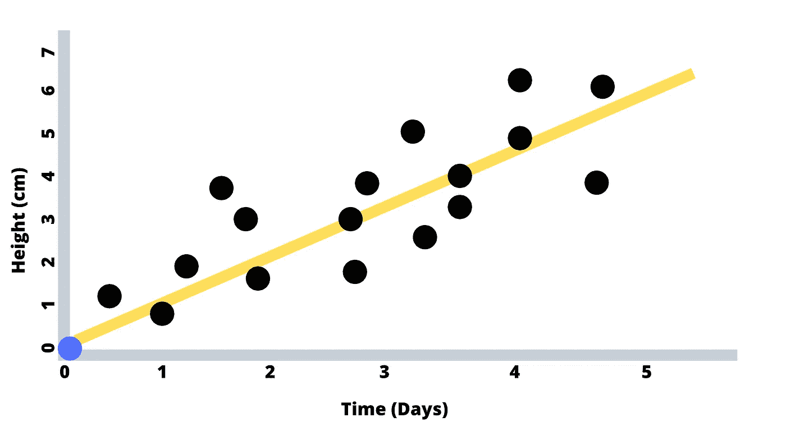

# 向六年级学生解释的深度学习

> 原文：<https://medium.com/analytics-vidhya/deep-learning-as-explained-to-a-6th-grader-e67784e1a25?source=collection_archive---------16----------------------->

深度学习是机器学习的一种，是目前进行数据预测的一种流行方法。要应用深度学习预测模型，你需要对线性代数有很强的理解，要从头开始创建模型，你需要微积分和微分方程的背景。

你很幸运，今天你有我，所以我们不需要线性代数或微积分！我打算只用基础代数来解释深度学习。

**我们开始吧！**

假设我们有一个显示植物生长和时间之间关系的数据集，也就是说，我们在几天内给一些植物浇水，并在图表上记录它们的生长！

正如人们所料，随着时间的推移，我们的植物会越长越高！现在，假设我们有一棵新的植物(在第 0 天显示为蓝色),我们希望使用我们对过去植物生长的了解来预测我们的植物在第 4 天会长多高。我们将如何做到这一点？

好吧，如果我们想让我们的猜测简单一些，我们假设高度和时间之间是线性关系，我们预测出第四天蓝点的位置。从我们的黄色趋势线来看，似乎我们的植物在第 4 天将在 4.5 厘米左右。

很简单。这种方法被称为线性回归建模，是在机器学习和深度学习之前进行预测的最佳方式。

现在，假设我们在接下来的 4 天里给植物浇水，并记录实际的生长结果(蓝点)，然后我们确定我们的预测与植物的实际高度有多接近，我们用红色标记这个距离。

从上面的图表中，我们看到我们的预测做得很好。红线显示在不同的时间点，我们的预测有多远(预测误差)。蓝点表示我们的植物在给定的时间有多高，黄线表示我们期望我们的植物在给定的时间有多高。

所以我们做得很好，但是我们能做得更好吗？几乎可以肯定，通过使用深度学习。

为了建立深度学习预测模型，我们不对高度和时间之间的关系做任何假设。我们的深度学习模型会自己学习这种关系。事实上，在真实的数据集中，这种关系通常不容易被人类理解。

首先，无论何时，我们都将植物高度预测设为 3 厘米。别担心，我们的深度学习模型会很快知道这个假设是不正确的。是的，我们可以从任何趋势开始，包括上面的线性趋势，但我们只会尽可能简单地保持我们的预测，因为深度学习模型无论如何都会找出最佳关系。

至少，我们需要指定 3 个参数来构建深度学习模型:

1.  误差公式(损失函数)告诉我们的深度学习模型如何量化预测误差，例如我们上面使用的红线
2.  为了预测测试数据(例如蓝点)，在对变量之间的真实关系(例如黄色趋势线)做出“最终”预测之前，我们希望给模型多少机会(时期数)来分析训练数据(例如黑点)
3.  一个数字(学习率),指定当我们的模型做出错误预测时，如何积极地调整我们的预测关系

第一个参数，损失函数，指示模型什么是“正确的”。否则，模型不会知道如何比较实际结果和它的预测，以了解如何变得更好，更聪明。

第二个参数，历元的数量，与我们计算机的处理能力和我们的耐心有关。拥有更多的学习机会(纪元)意味着我们的计算机将需要更长的时间来运行模型，但我们更有可能得到最好的预测。但是，如果我们将此值设置得太高，那么我们的模型将过于特定于训练数据(例如黑点)，并且它将无法准确预测与训练数据略有不同的情况(例如蓝点)。

第三个参数是学习率，它与我们的模型在预测不正确时调整预测的程度有关。如果学习率高，我们的模型一错就慌，调整大。这使得我们的模型能够更快地获得更好的预测，但结果是，该模型缺乏获得最佳最终预测的精度。如果学习率较低，模型会缓慢调整其预测，虽然这需要更多的计算机处理，但模型最终会确定更准确的预测。稳扎稳打赢得比赛。

注意，我们通常不会为深度学习模型指定关系公式，就像我们的第一个线性模型示例一样。当我第一次了解深度学习时，这个事实让我很惊讶。我喜欢研究这些图，并试图猜测哪种关系是最好的(例如，线性、对数等)。).在深度学习中，我们放弃了那部分。我们相信这个模型是正确的。

让我们看看深度学习模型能做得多好:

正如我们所见，对于更复杂的关系，深度学习模型有潜力预测更好的结果。红线距离越小，表明模型的预测误差越小。但是我们也看到了黄色趋势线的形状是如何难以描述的，因此高度和时间之间的关系是如何难以定义的。

在上面的例子中，我们只分析了两个变量，高度和时间。但是在更复杂的模型中，我们可能想要包括几个其他变量，例如，设备类型、温度等。来产生更精确的高度预测。正如我们可以预料的那样，深度学习将允许我们基于更好的变量关系表示来预测结果，而不是假设更简单的关系，例如线性关系。

为了建立良好的深度学习模型，我们可以做的最好的事情是 1)将高质量的数据输入模型，2)合理地设置我们的参数。获得准确的参数有时更像是艺术而不是科学，甚至专业人士也使用试错法来获得正确的参数。

这就是要点。我们将需要更多的数学和编码技能来实际应用深度学习模型，因此我们需要从 6 年级毕业，但这一解释提供了深度学习的良好高级背景。

你知道的越多。

**感谢阅读:P**