# 基于深度学习的直播人脸识别

> 原文：<https://medium.com/analytics-vidhya/deep-learning-based-live-streaming-face-recognition-31e9b005ffb?source=collection_archive---------4----------------------->

> **简介**

*人脸识别是一种生物识别过程，它以数学方式绘制个人的面部特征，并将数据存储为人脸纹。它能够从来自视频源的数字图像或视频帧中识别和辨认人。一种有前途的识别人脸的方法是通过将从给定图像中选择的面部特征与人脸指纹数据库进行比较。换句话说，它是一种生物识别人工智能应用程序，通过分析基于人的面部纹理和形状的模式来唯一地识别一个人。它是为数不多的既要求高精度又要求低侵入性的生物识别方法之一。它有多种应用，如生物识别锁和安全系统、犯罪识别，以及在各种社交网络平台上即时识别图像中的人，分别如图 1.a、1.b 和 1.c 所示。*

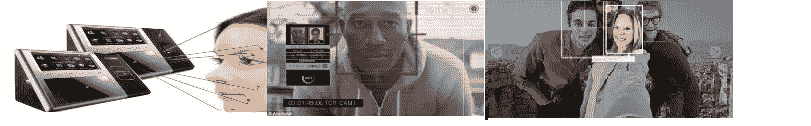

**图 1.a:访问&安全，1.b:刑事鉴定，1.c:社交媒体**

> **系统设计**

所提出的系统通过利用机器学习和深度学习技术从直播流中识别人。整个过程分为 4 个部分:1 .捕获流式图像，2。提取面部特征，3。与现有模板进行比较；4 .将其与预存的人脸特征进行匹配，如图 2 所示。首先，从流式视频中捕获图像帧并检测人脸。现在，诸如眼睛、鼻子、嘴唇和下颌线的面部特征被从检测到的面部中提取出来。在提取面部特征之后，将这些特征与现有的面部模板进行比较和对准。最后，将该特征集与数据库中的现有人脸进行比较。项目代码可在[https://github.com/Deeptichamoli/Live_FaceRecognition-1](https://github.com/Deeptichamoli/Live_FaceRecognition-1)获得

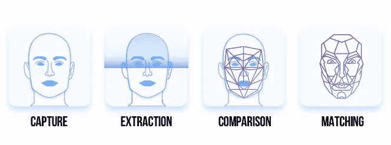

**图 2:系统设计**

实时人脸识别是一个复杂的过程，具有以下困难的任务:

*   **人脸检测:**从视频帧中提取人脸。
*   **摆姿势、投脸:**聚焦每张脸，了解脸部朝向是相同还是不同。
*   **编码人脸:**挑选人脸的独特特征，以区分一张脸和另一张脸，例如眼睛、鼻子、脸和其他的形状和大小。
*   **查找编码和对应的人:**将人脸的独有特征与数据库中所有预先保存的编码进行比对。
*   用摄像机直播这一过程

> **数据集**

使用面部图像数据集，可在[http://cswww.essex.ac.uk/mv/allfaces/index.html](http://cswww.essex.ac.uk/mv/allfaces/index.html)获得。它由 397 张(395+2 张)男性和女性的照片组成。每个人的图像总数是 20，总计 7940 个图像。

出于解释的目的，我们使用了如图 3 所示的两个人的面部数据集，并运行机器学习算法来实时执行它。所有面部识别步骤都应用于这些图像，并且确定这些图像中的人的姓名。

**图 3:样本数据集图像**

> **建筑**

逐一读取数据集的所有图像，并检测人脸。对于每个检测到的人脸，使用 HOG 和 dlib 来校正人脸姿态和投影，以获得居中的眼睛和嘴巴。现在，对于每个校正后的图像，使用 RESNET 提取编码。最后，如图 4 所示，为每个图像获得带有图像标签的 128 维嵌入。

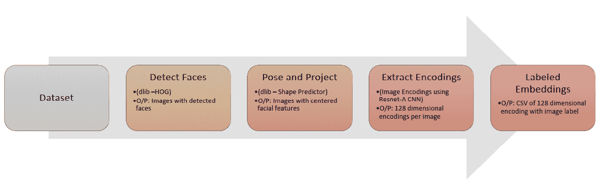

**图 4:从数据集中提取嵌入。**

嵌入和标签集被分成训练和测试数据。学习到的嵌入作为 SVM 分类器的特征，完整的过程如图 5 所示。

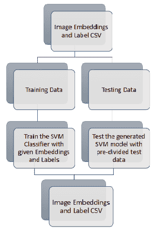

**图 5:训练和测试数据集**

图像帧是从视频中捕获的，1。面部检测，2。姿势和投影，3。学习编码和，4。如图 6 所示，对帧应用并执行分类，以预测视频帧中的人的名字。下一节将详细解释这四个步骤。

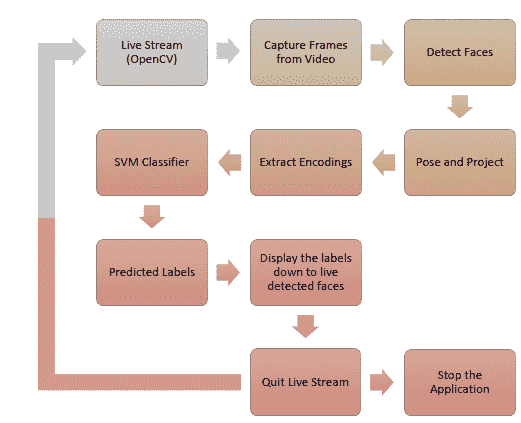

**图 6:直播人脸识别流程**

> **详细描述**

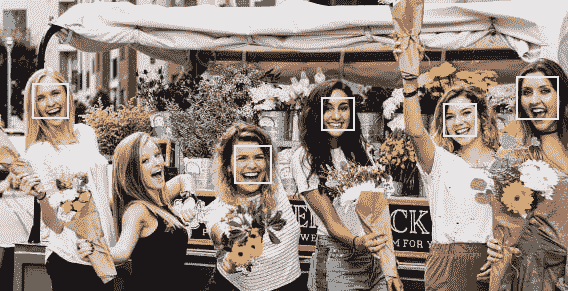

**图 7:人脸检测**

1。 ***人脸检测*** *:* 系统的第一步是检测图像中的所有人脸如图 7 所示，使用 HOG(梯度方向直方图)方法检测所有人脸。

**梯度方向直方图(HOG)** 是图像处理中使用的特征描述符，主要用于物体检测。HOG 描述符技术对图像检测窗口或感兴趣区域(ROI)的局部中梯度方向的出现进行计数。图 8 显示了图像的凸起。它一次获取图像的每个像素，对于每个像素，它将其数字值(DN)与其周围的像素进行比较。

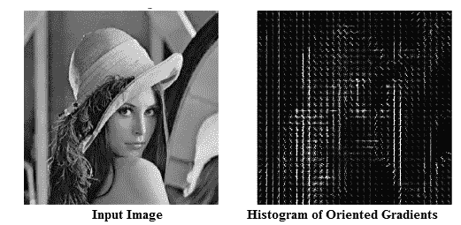

**图 8:图**的 HOG 表示

图 9 显示了当前像素与其相邻像素相比有多暗，并绘制了一个从亮到暗的箭头。

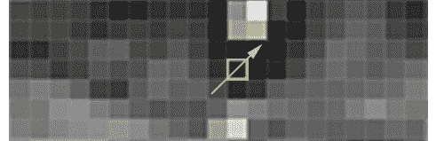

**图 9:一个像素与其相邻像素的比较**

考虑上面的像素和它的相邻像素，图像向右上方越来越暗。对图像中的所有像素重复此操作，并用这样的箭头替换每个像素。这些箭头是梯度，代表图像从亮到暗的流动。

**HOG 的优点**
HOG 特征的优点在于它是基于梯度方向直方图的。它只描述了人脸轮廓的特征，而且对光线和小偏移不敏感。
由于图像可以在黑暗或强光下拍摄，因此如果我们在黑暗和明亮的环境下分析同一个人的像素，那么它们将具有不同的值。但是通过考虑暗图像和亮图像中亮度变化的方向(HOG ),将会以相同的表示结束。为每个像素保存渐变可能会非常麻烦。因此，我们将图像分割成 16*16 像素。在每个方块中，所有主要方向上的梯度都被聚合，并替换为主导方向上的箭头。

**面部检测结果**

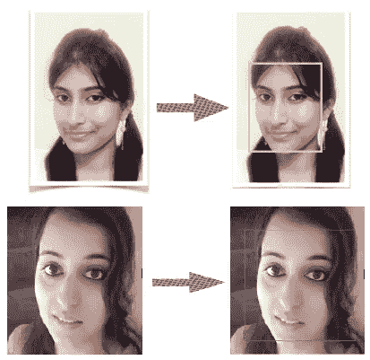

**图 10:检测到的人脸**

2。 ***姿态和人脸投影*** *:* 它处理的是人脸朝向不同方向，光照强度不同的问题，如图 11 所示。为了克服这个问题，使用了**人脸标志估计**方法。它从如图 12 所示的人脸中提取 68 个特定点(称为界标)，并训练 ML 算法来预测任何人脸中的这些点。

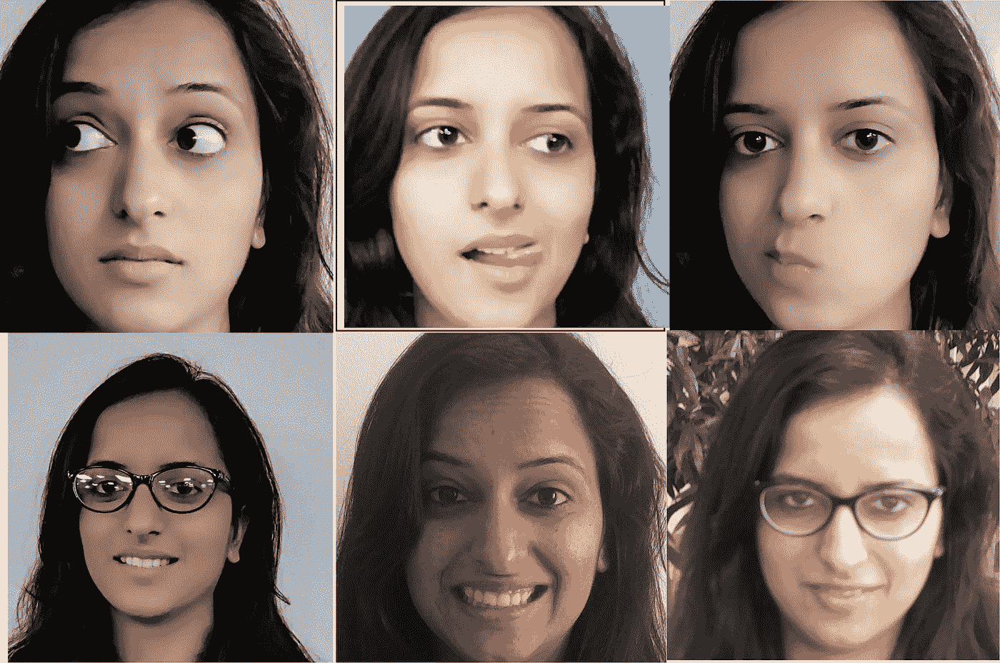

**图 11:同一个人在不同光强下的不同姿势**

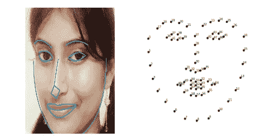

**图 12: 68 人脸标志点**

现在旋转、缩放和剪切图像，使眼睛和嘴巴尽可能居中。脸转向任何方向，都应该居中，这样眼睛、鼻子和嘴等重要特征就可以很容易地进行比较，如图 13 所示。这个重新定位步骤使我们的下一步更加精确。

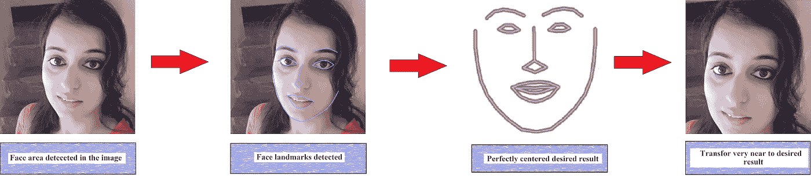

**图 13:完美居中的面部**

3。 ***编码人脸***
识别人脸最简单的方法是什么？让我们以脸书为例，当它需要识别一个朋友来自动标记时，它会直接将我们在步骤 2 中找到的未知人脸与我们所有已经标记的朋友的图片进行比较。当我们发现一张之前标记过的脸和未知的脸看起来非常相似的时候，应该是同一个人。看起来是个很好很简单的主意，对吧？(不！)

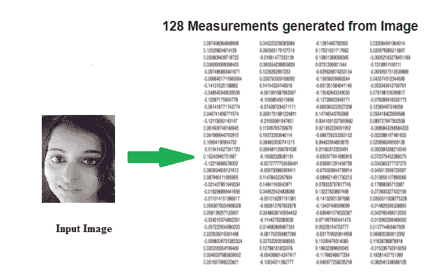

**图 14:图像测量**

这里的问题是有数十亿用户和数万亿张照片，循环遍历所有的脸并与新更新的照片进行比较是愚蠢的。为了解决这个问题，我们需要一种从每张脸上提取基本尺寸的方法。然后我们可以用同样的方法测量未知人脸，找到测量值最接近的已知人脸。测量(如图 14 所示)对人类来说很明显，但对查看图像中单个像素(数值)的计算机来说没有意义。深度学习模型(如 **RESNET** )在估计面部的哪些部分是重要特征方面做了与人类相当的工作。使用 RESNET 模型来学习这些多维向量空间被称为人脸的嵌入，如图 15 所示。

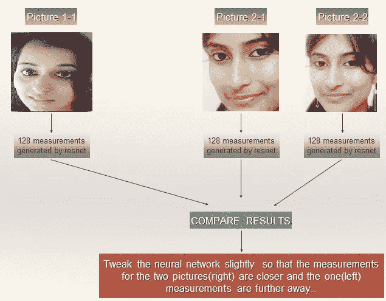

**图 15:使用 RESNET 嵌入人脸**

4。 ***寻找人名***
为了在我们的已知人数据库中找到与我们的测试图像尺寸最接近的人，使用了 **SVM** 分类器。训练 SVM 分类器从测试图像中提取嵌入内容，并预测最匹配的人名。

5。 **使流程直播**
输入:直播流。
输出:直播流中的人名，如图 16 所示。OpenCV 用于用摄像机捕捉实时流。
它从摄像机(应用中使用的笔记本电脑摄像机)捕捉视频。它提取视频的每一帧，并将其作为图像的一个实例，这些实例被作为输入发送到 SVM 进行人脸识别。

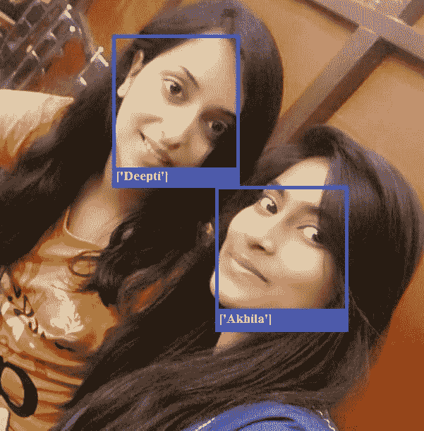

**图 16:直播中的人脸识别**

> **实施**

使用的技术:
编程语言: **Python**
库: **openCV、dlib、numpy、pandas、scikit-learn**
模型:
1 .**形状预测器**(用于步骤 2 的标志)
2。 **RESNET** (用于步骤 3 的嵌入)
3。 **SVM 分类器**(用步骤 4 的嵌入进行训练)

> **结果**

总训练时间
特征数:7940
课时数:397
时间:10 分钟左右
训练准确率:99.37%
测试准确率:99.04%

> ***结论***

所提出的系统使用机器学习和深度学习技术，利用笔记本电脑摄像头从直播视频中实现人脸识别。它从摄像机视频中提取帧，并使用预训练的 RESNET 检测和重新定位人脸，从这些人脸中提取人脸编码。随后，它使用 SVM 分类器来使用经过训练的编码从这些编码中识别人脸。由于数据和计算资源的限制，SVM 用于实时分类。对于指定的数据集，该系统显示出大约 99%的准确度。

参考

[1]资料，[http://cswww.essex.ac.uk/mv/allfaces/index.html](http://cswww.essex.ac.uk/mv/allfaces/index.html)

【2】[基于图像的人脸检测与识别](https://arxiv.org/ftp/arxiv/papers/1302/1302.6379.pdf)；Faizan Ahmad、Aaima Najam 和 Zeeshan Ahmed。

[3]使用基于 LDA 的算法的人脸识别；J Lu，K. N. Plataniotis 和 A. N. Venetsanopoulos。

[【4】用局部二值模式进行人脸识别；](http://www.ee.oulu.fi/research/imag/mvg/files/pdf/pdf_494.pdf) T. Ahonen，A. Hadid，M. Peitikainen。