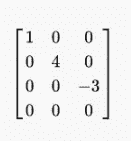

# 浅显英语深度学习书 Ch1

> 原文：<https://medium.com/analytics-vidhya/deep-learning-book-in-plain-english-ch1-2f73e9b71acb?source=collection_archive---------18----------------------->

比阿特丽斯·佩雷斯·莫亚在 [Unsplash](https://unsplash.com?utm_source=medium&utm_medium=referral) 上的照片

这个故事是我对伊恩·古德菲勒、约舒阿·本吉奥和亚伦·库维尔的《深度学习》一书(Ch2)的直觉总结

## 向量和张量

我将从任何系统的这两个关键模块开始，我跳过矩阵和标量值，因为我认为它们对许多读者来说是非常明显的。

## 向量

一组数字，我们可以认为是一组坐标，每个值在不同的轴上，例如 x = [1，2]，x 是一个向量，值在两个不同的轴上。

## 张量

我之所以从向量开始，实际上是为了将它们与张量进行比较，因为这种比较总是让我很困惑。张量是具有多于 2 个值的数组，例如 x = (1，2，3，..)

## 乘法矩阵

深度学习的主要运算之一是矩阵乘法。例如，让我们考虑一个输入数据[0，1，2]和一个密集的权重向量转置层([0.1，0.2，0.3])(注意，我添加了转置，因为我需要将行向量转换为列向量，以便能够用它执行矩阵乘法)

该操作转换为 A = XB，执行如下:

0*0.1 + 1*0.2 + 0.3*2 = value，这就是我们数据的行向量和权重的列向量之间的点积。当您在网络中添加密集层时，就会发生这种情况。这不同于所谓的 hadamard 乘积(元素式乘积)，其执行如下:

结果= [0*0.1，1*0.2，0.3*2] = [0，0.2，0.6]

欲了解更多关于矩阵乘法和哈达玛乘积的区别，[链接](/linear-algebra/part-14-dot-and-hadamard-product-b7e0723b9133)

## 矩阵特征

矩阵乘法是不可交换的，

AB！= BA

然而向量之间的点积是可交换的，

转置(x) * y =转置(y)*x

## 什么是规范？

有时我们需要测量一个给定向量的大小，所以我们简单地使用范数函数来做，范数函数只是简单地将向量映射到非负值，因为它们是从原点 pt 到向量 x 的距离。

机器学习中最常用的范数之一是 L2 范数，它被称为欧几里德范数，并被简单地计算为 x *转置(x)

另一个范数函数是 L1 范数，当向量中的零和非零元素之间的差异非常重要时使用，因为当值从零变为非零时，它赋予很大的权重。例如，如果向量中的值从 0 变到 10，L1 增加 10

另一个范数函数是最大范数，它是向量中的最大元素。

## 特殊类型的矩阵和向量

对角矩阵

只有对角线上的非零值

对称矩阵

A =转置(A)

正交向量

是范数大于 0 并且彼此成 90 度的向量，这意味着如果向量 x 正交于向量 y，则转置(x) * y = 0

由此产生正交矩阵，其向量(列)相互正交。因此，如果我们有矩阵 A 和 B，它们是正交的，那么，转置(A)*B = A *转置(B) =单位矩阵

## 特征分解

把它想象成把物体的大部分分解成更小更直观的部分。这本书实际上给出了一个很好的例子:如果我们可以用 2*2*3 来表示数字 12，那么这些微小的部分给了我们什么信息呢？也许 12 能被 2 除尽，但不能被 5 除尽

同样的想法也适用于特征分解，我们需要将矩阵分为向量和特征值，这是一个简单的计算矩阵 a 的方程。

a* x =λ* x

让我们举个例子来知道这是从哪里来的。

现在我们有一个矩阵 A，我们把它乘以一个向量 x，如果你注意到结果是向量的 3 倍，实际上我们可以把整个操作重写如下。

这告诉我们，3 实际上是一个特征值，向量[1，1，2]是一个特征向量，矩阵 A 的特征向量是一个向量，对于某个数λ给出这个方程

ax =λx

有无限数量的特征向量，但是有限数量的特征值——每个特征值有它自己的特征向量集。我们需要找到特征值来得到特征向量

## 奇异值分解

遵循相同的思想，但是 SVD 是 3 个矩阵 U * E *转置(V)的乘积，对于大小为 m*n 的矩阵 A，U 的大小为 m*m，E 的大小为 m*n，V 的大小为 n*n，其中 V 是转置(A)* A 的特征向量，U 是转置(A)的特征向量

计算 V:

计算 E:

u = V as a*转置(A) =转置(A)*A

现在我们有了 SVD 的 3 个分量，我们可以很容易地计算它了！

## 决定因素

通过计算给定矩阵的所有特征向量的和，将矩阵映射到标量值

## 简单机器学习算法

## 主成分分析

它只是简单地将巨大的数据解码成更小的数据，但这怎么可能呢？我们只是表示同一数据的一个低维版本，因此它可能会更小。有时我们会丢失数据中的一些重要特征，这就是问题所在。为了找到一种解码数据而丢失较少信息的方法，PCA 函数就是 y(x) =转置(D)* x，其中 D 是解码器向量，x 是我们的原始数据，所以我现在想到了一个重要的问题。

我们实际上如何得到这个 D 向量，简单地说，我们得到 Di 使得 xi 的 L2 范数和所代表的 pt xi(Xi 在低维中的代表)是最小的，我听到你我如何计算所代表的 pt Xi 首先，会告诉你

主要等式是，

D = min(sqrt(sum(xj-r(xj))))，r(xj)是表示的 pt

但实际上:r(x)= D *转置(D)*x

所以我们可以代入第一个方程，得到满足要求的 D。这个等式在书中有很长的实现，但我只是给出了它背后的主要直觉。

我希望你喜欢这个漫长系列的第一部分！

谢谢