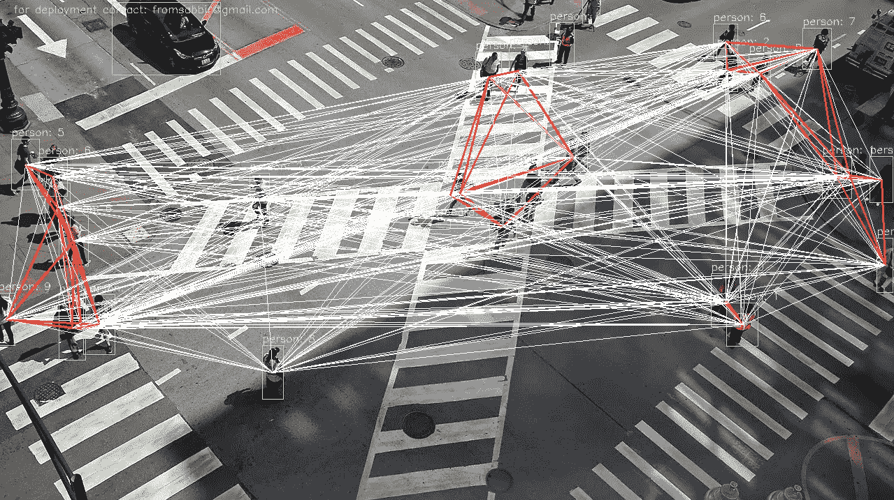

# 深度学习可以保护新冠肺炎期间的户外安全距离

> 原文：<https://medium.com/analytics-vidhya/deep-learning-can-protect-outdoor-safe-distance-during-covid-19-4d59684e5f44?source=collection_archive---------14----------------------->

我们都在经历一个我们从未想象过的时代。那些对人类失去希望的人我们的前线英雄夜以继日的工作证明他们错了。科学家们，其中一位无名英雄，毕生致力于发明疫苗。这个故事是从一个工程师的角度和渴望帮助人类。正如所说，“一幅画胜过千言万语”

具有深度学习的行人接近检测(出于演示目的，增加了距离近似阈值)

计算机视觉多年来一直在解决医学成像和诊断问题。华为制造其诊断系统来检测[新冠肺炎](https://www.huaweicentral.com/huawei-launches-ai-diagnosis-for-covid-19-march-2020/)。

我的方法是从像素计算行人之间的距离，并且该人将被对象检测器检测到。这个项目的演示—

我将演示评估过程有多简单。我建立了基于深度学习的对象检测器，它是用 R-CNN 架构训练的。然后应用非最大抑制来稳定边界框。用“person”类分离包围盒，并估计包围盒的中心。我假设一个人的平均身高是 5 英尺，并据此计算出 6 英尺，我知道这不是火箭科学，但它似乎足够有效。下面的系统可能会出现一些“假阳性”，但这不是一个问题，因为我们需要至少 6 英尺。

就是这样！我们可以将系统部署在—

*   医院
*   超级商店
*   市场/集市
*   道路和高速公路
*   服装/工厂

这种带有跟踪器(即 MIL 或 CSRT 跟踪器)和一点物联网的简单技术可以管理大量人员，并显著减少人工干预。

我住在孟加拉，那里只有 15%的 T2 人收入超过 6 美元。我们承受不了长时间的封锁。我们必须探索其他更安全的选择。但是这个项目可以在其他任何一个国家实施，只要他们的商店和办公室重新开张。然后，我们必须为第二波感染做好准备。

这个项目献给所有为人类奉献生命的前线英雄——医生、护士、科学家和每一位志愿者。

我将引用先知穆罕默德(PBUH)的话来结束我的故事

> 「你若听说某国发生瘟疫，千万不要进去；你在那里的时候，若有瘟疫流行，不要离开那地方
> 
> 萨希·布哈里

让我们呆在家里。