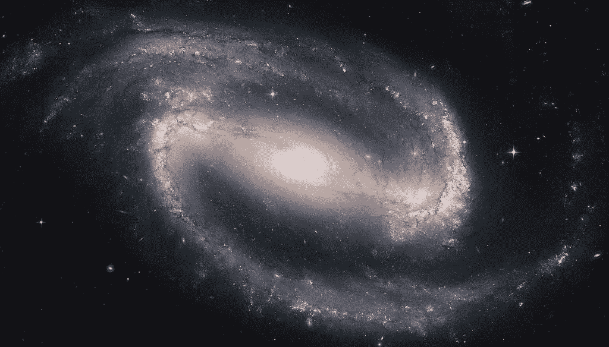
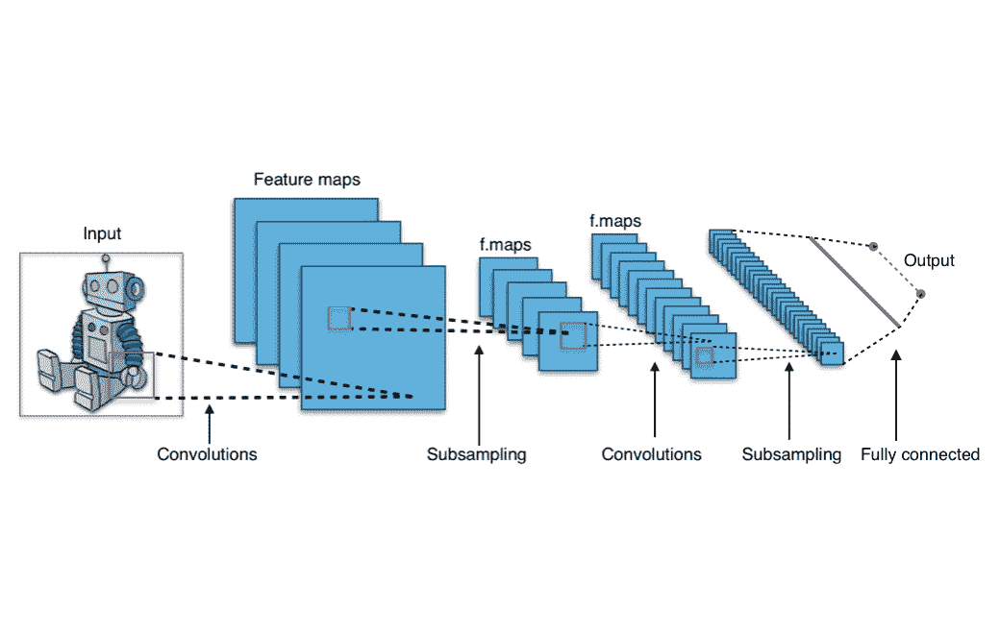
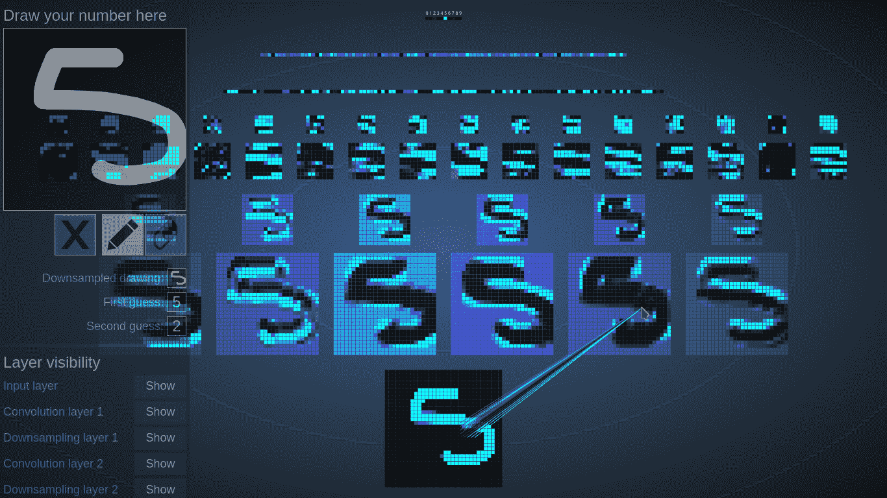
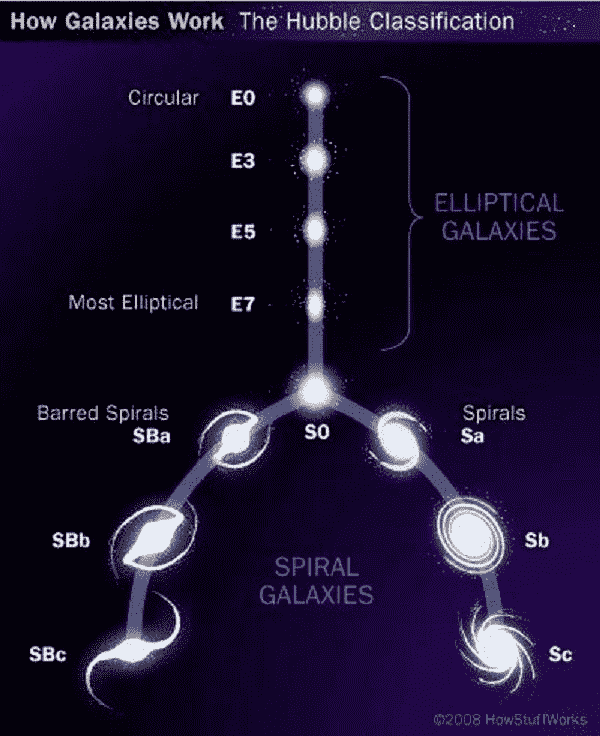
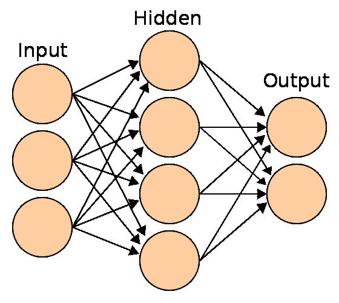
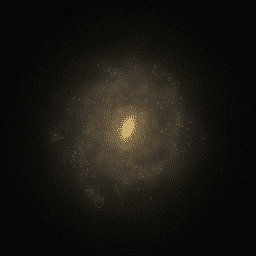

# 天体物理学中的深度学习

> 原文：<https://medium.com/analytics-vidhya/deep-learning-classifying-galaxies-using-artificial-intelligence-cd576514f32d?source=collection_archive---------20----------------------->

## 使用人工智能对星系进行分类

来源:维基百科

你曾经想象过在天文学中使用面部识别技术吗？现在，这已经成为现实，并且运行良好。人工智能(AI)在许多知识领域发展迅速，因此让我们重点介绍它在天体物理学中的一些应用。

在这篇文章中，我将描述构建人工大脑的过程，人工大脑将负责识别螺旋星系，无论它们是真实的还是我们宇宙的巨大模拟产物(听起来可能很疯狂，它们是自发形成的)。但首先我需要给你解释一些事情，尽量简化。

**深度学习**:与人工神经网络协同工作的人工智能。

**人工神经网络**:旨在反映人脑功能的计算架构，以执行预测和决策任务。

**卷积神经网络**:人工神经网络，大多用于寻找图像中的模式。实际上，我将在这里逗留一会儿(只是一会儿)

卷积基本上是对图像进行多次采样的过程。这些样本被作为数字发送到神经网络(我将在后面解释)，在那里神奇的事情发生了，例如，你可以将某物分类为机器人*或不是机器人*的或*。*

来源: [mc.ai](https://mc.ai/)

这张图片展示了对一幅图像进行 [*缩减采样*](https://en.wikipedia.org/wiki/Image_segmentation) 的过程，将图像缩减到其主要特征，如手、脚、眼睛和机器人的 atenna。

我们的目标是缩小信息，原因有两个:神经网络完成其工作需要更少的处理时间，我们可以去除无用的数据。我选择了一个卷积神经网络的实际例子，所以你可以自己尝试一下。以下是网站截图:

来自 app 的截图。

在左上角的框中，我画了一个看起来像数字 5 的东西。然后，卷积神经网络开始对其进行下采样(自下而上)。在第四步，它对人类来说毫无意义，但对计算机来说却包含有价值的信息:每张图片的 RGB 数值。在*第一次猜测*字段中，它返回“5”。也许画得太好了，但你可以试着欺骗机器，从中获得一些乐趣。请注意，鼠标光标会显示每个像素的样本来源。

现在，让我们深入真正重要的事情:做同样的事情，但是用星系！

# 星系分类

来源:Pinterest

我们在这里的目标是建立一个人工大脑，它可以判断螺旋星系是被阻挡的(就像照片左边的那些)还是没有被阻挡的(就像右边的那些)。

出于这个目的，我下载了[星系动物园](https://www.zooniverse.org/projects/zookeeper/galaxy-zoo/)的数据发布，在那里你(是的**你**)可以通过对没有人见过的星系进行分类来为科学做出贡献！

**请**，不要被我们宇宙无尽的多样性分心！

万一你从那里回来，我们就继续。

**星系动物园**的数据包含了几十万个星系的分类，后面是每个星系在[天球](https://en.wikipedia.org/wiki/Celestial_sphere)(天空)上的位置。这个位置就像经纬度，但我们称之为**赤经** ( *ra* )赤纬**(*dec*)。有了这些数字，我们只需要编写一个代码，下载每个星系的*肖像*，并将其存储在一个名为“栅栏 _ 星系 _ 文件夹”的特定文件夹中(未栅栏的存储在另一个文件夹中)。**

我们只需要在下面的链接中输入赤经( **ra** )和赤纬( **dec** )。最终，它被带到了我们面前——就在一大堆花费数年时间扫描夜空的巨大望远镜的帮助下(顺便说一下，如果你感兴趣，我们需要更多的数据科学家来处理所有这些数据)——一个特定地方的小图像，包含想要的天空物体。

> [*http://sky server . SDSS . org/dr16/SkyServerWS/img cutout/get JPEG？TaskName=Skyserver。图表.图片&****ra****= 134.440567016602&****dec****=-1.20324938678741*](http://skyserver.sdss.org/dr16/SkyServerWS/ImgCutout/getjpeg?TaskName=Skyserver.Chart.Image&ra=134.440567016602&dec=-1.20324938678741)

# 训练和预测

我们已经得到了我们需要的一切。现在，让我们深入其中，进行大量的编程、测试、调试等工作。卷积神经网络将接收所有 12 万张下载的图像，而*将*学习如何区分一个有栅栏的星系和一个没有栅栏的星系。我的预测有大约 94%的准确率，但一些科学论文报道的准确率高达 98%。

***技术细节预警*** :对于感兴趣的人，我用过 Keras 和 Tensorflow 两个库。

资料来源:deview.kr

简单来说，流程如下:

神经网络以数字格式输入已经处理过的卷积图像；然后，它为每个“神经元”分配初始随机值(权重)，并将输出与 groundtruth(一个用于测试的文件夹，内有条形星系)进行比较。根据计算出的性能，网络校正权重，并使用相同的图像再次尝试，以检查它是否在新的权重上有所改进。并且它执行这个校正过程很多很多次。

一个经过训练的神经网络拥有正确权重的神经元，当提供未知图片时，这些神经元将能够返回*受限*或*非受限*。

# 模拟

经过训练后，我们可以让大脑工作。与我处理实际图像的方式类似，我从[鹰](https://www.youtube.com/watch?v=6V021B8FdyQ)宇宙模拟中下载了星系的图片，并“要求”新构建的大脑对它们进行分类。结果不如使用真实图像获得的结果好，因为模拟图像有一些警告，例如低分辨率和假颜色。请参见下面的示例。我在寻找更接近真实的图像。

来源:老鹰模拟

老鹰宇宙学模拟中的星系。在适用于气体、恒星、黑洞和暗物质粒子的初始条件和物理定律下自发形成。

# 应用程序

一般来说，深度学习可以帮助研究星系的结构和动力学。比如距离越遥远的星系，*就越老*，我们可以观察不同演化阶段的星系，从整体上研究演化的过程。因此，我们的目标是提供关于宇宙不同“年龄”的*被阻挡*星系的统计相关数据。

具体来说，通过使用人工智能收集这种数据，我们可以推断出我们宇宙中棒形星系的比例——从最古老的到新形成的(仅几十亿年前)——并且还可以检查宇宙学模拟(模拟整个宇宙)的准确性。条形是丰富的信息来源，因为它们代表了宇宙中最持久的不对称结构(由于重力，所有其他结构都趋向于变成球形)。

如果你感兴趣，请跟随[链接](https://arxiv.org/abs/2006.14847)到一篇使用类似技术的科学论文。

相信我，人工智能在天体物理学领域没有极限！

原帖链接:[https://medium . com/@ danielmkeras/深度学习-分类-星系-使用-人工智能-cd576514f32d](/@danielmkeras/deep-learning-classifying-galaxies-using-artificial-intelligence-cd576514f32d)