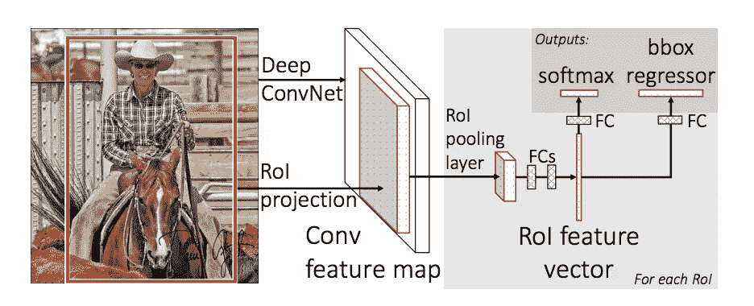
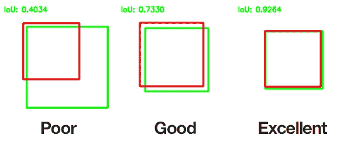

# 深度学习(计算机视觉):使用基于掩蔽区域的卷积神经网络对疟疾图像进行目标检测和感染分类

> 原文：<https://medium.com/analytics-vidhya/deep-learning-computer-vision-object-detection-infection-classification-on-malaria-images-3769b4f51de9?source=collection_archive---------6----------------------->

# **生物应用的描述:**

疟疾是一种由疟原虫寄生虫引起的疾病，它仍然是全球健康的主要威胁，每年影响 2 亿人，导致 40 万人死亡。影响人类的主要疟疾种类是恶性疟原虫和间日疟原虫。对于疟疾和其他微生物感染，由训练有素的显微镜专家人工检查厚血涂片和薄血涂片仍然是寄生虫检测和阶段确定的金标准，因为其试剂和仪器成本低且灵活性高。

尽管手动检测的处理量极低，并且容易受到人为偏差的影响，但由于明视野显微镜图像的变化范围很大，自动计数软件在很大程度上仍未得到使用。然而，一个强大的自动计数和细胞分类解决方案将提供巨大的好处，因为更快和更准确的定量结果，没有人为的可变性；研究人员和医疗专业人员可以更好地表征特定阶段的药物靶标，并更好地量化患者对药物的反应。

部分由于复制、比较和扩展的困难，以前将疟疾的识别和量化过程自动化的尝试没有获得主要的关注。作者也很少让他们的图像集可用，这排除了结果的复制和潜在改进的评估。缺乏一套标准的图像，也没有一套用于报告结果的标准指标，这阻碍了这一领域的发展。

# 示例图像

用吉姆萨试剂染色的血液涂片。

疟疾分类

# 数据集:

图像:
图像在。png 或者。jpg 格式。共有 2 组图像，由 1364 幅图像(约 80，000 个细胞)组成，每组图像由不同的研究人员准备:来自巴西(斯蒂芬妮·洛佩斯)、来自东南亚(Benoit Malleret)和时间进程(Gabriel Rangel)。血液涂片用吉姆萨试剂染色。

网站:https://data.broadinstitute.org/bbbc/BBBC041/

数据大小:2.26 GB
数据来源:https://data.broadinstitute.org/bbbc/BBBC041/malaria.zip

# 基本事实:

数据由两类未感染细胞(红细胞和白细胞)和四类感染细胞(配子体、环、滋养体和裂殖体)组成。注释者被允许将一些单元格标记为困难的，如果在某个单元格类中不清楚的话。数据显示未感染的红细胞与未感染的白细胞和感染的细胞之间存在严重的不平衡，后者占所有细胞的 95%以上。

给每个单元一个类标签和一组边界框坐标。对于所有的数据集，海托尔·维埃拉·多拉多热带医学基金会医院的疟疾研究员斯蒂芬妮·洛佩斯给受感染的细胞贴上了类别标签，表明发育阶段或标记为困难。

# 疟疾的原因:

尽管疟疾病毒没有以变异蚊子的形式出现，但它确实让人感觉像是一个变异问题。这种致命的疾病已经成为流行病，甚至在世界不同地区达到地方病的程度——每年导致大约 40 万人死亡。在世界上的其他地方，它几乎不存在。一些地区特别容易爆发疾病——某些因素使得一个地区更有可能被疟疾感染。

1.高度贫困

2.缺乏适当的医疗保健

3.政治不稳定

4.疾病传播媒介的存在(例如蚊子)

# 当前诊断方法:

最广泛使用的方法(到目前为止)是在显微镜下检查薄血涂片，并目测寻找受感染的细胞。患者的血液涂在载玻片上，用造影剂染色，以便更好地识别红细胞中受感染的寄生虫。然后，临床医生手动计数寄生红细胞的数量——有时高达 5000 个细胞。

# 为什么选择深度学习模型？

深度学习具有自动提取特征和学习过滤器的能力。在以前的机器学习解决方案中，特征必须手动编程，例如，大小、颜色、细胞的形态。利用深度学习将大大加快预测时间，同时反映(甚至超过)临床医生的准确性。我将使用 Keras，与 Tensorflow 后端创建对象检测模型。

# 什么是深度学习？

**深度学习**是机器学习的一个子领域，涉及受大脑结构和功能启发的算法，称为**人工神经网络**。

深度学习(也称为深度结构化学习或差分编程)是基于具有表示学习的人工神经网络的更广泛的机器学习方法家族的一部分。学习可以是有监督的、半监督的或无监督的。

诸如深度神经网络、深度信念网络、递归神经网络和卷积神经网络之类的深度学习架构已经被应用于包括计算机视觉、语音识别、自然语言处理、音频识别、社交网络过滤、机器翻译、生物信息学、药物设计、医学图像分析、材料检查和棋盘游戏程序在内的领域，在这些领域中，它们已经产生了与人类专家的表现相当的结果，并且在某些情况下超过了人类专家的表现。

深度学习是一类机器学习算法，它使用多层从原始输入中逐步提取更高级别的特征。例如，在图像处理中，较低层可以识别边缘，而较高层可以识别与人相关的概念，例如数字、字母或脸。

在深度学习中，每一级都学会将其输入数据转换为稍微更抽象和复合的表示。在图像识别应用中，原始输入可以是像素矩阵；第一表示层可以提取像素并编码边缘；第二层可以构成和编码边缘的排列；第三层可以编码鼻子和眼睛；第四层可以识别出图像包含人脸。重要的是，深度学习过程可以自己学习哪些功能可以最佳地放置在哪个级别。(当然，这并没有完全消除手动调谐的需要；例如，不同数量的层和层大小可以提供不同程度的抽象。)

# 计算机视觉:

计算机视觉是目前深度学习中最热门的研究领域之一。它位于许多学术学科的交叉点，如计算机科学(图形、算法、理论、系统、架构)、数学(信息检索、机器学习)、工程(机器人、语音、NLP、图像处理)、物理(光学)、生物学(神经科学)和心理学(认知科学)。

由于计算机视觉代表了对视觉环境及其上下文的相对理解，许多科学家认为，由于其跨领域的掌握，该领域为人工智能铺平了道路。

# 那么，计算机视觉有哪些应用呢？

最明显的答案是，从这个研究领域衍生出的有用的应用程序正在快速增长。以下是其中的一小部分:

1.面部识别:Snapchat 和脸书使用面部检测算法来应用过滤器，并在照片中识别你。

2.图像检索:Google Images 使用基于内容的查询来搜索相关图像。该算法分析查询图像中的内容，并基于最匹配的内容返回结果。

3.游戏和控制:在游戏中使用立体视觉的一个伟大的商业产品是微软 Kinect。

4.监控:监控摄像头在公共场所无处不在，用于检测可疑行为。

5.生物特征识别:指纹、虹膜和人脸匹配仍然是生物特征识别中的一些常用方法。

6.智能汽车:视觉仍然是检测交通标志和信号灯以及其他视觉特征的主要信息来源。

# 计算机视觉技术的主要类型:

## 1.图像分类

图像分类:猫

图像分类是指计算机视觉中可以根据图像的视觉内容对图像进行分类的过程。例如，图像分类算法可以被设计成辨别图像是否包含人形。

用于图像分类的最流行的架构是**卷积神经网络(CNN)。**CNN 的一个典型用例是，您输入网络图像，网络对数据进行分类。CNN 倾向于从输入“扫描器”开始，它并不打算一次解析所有的训练数据。例如，要输入 100 x 100 像素的图像，您不会想要一个包含 10，000 个节点的图层。

相反，您可以创建一个 10 x 10 的扫描输入层，用于输入图像的前 10 x 10 个像素。一旦您传递了该输入，您可以通过将扫描仪向右移动一个像素来输入下一个 10 x 10 像素。这种技术被称为**滑动窗**。

CNN 图层

## 2.目标检测

物体检测:车辆

对象检测是一种计算机视觉技术，用于定位图像或视频中的对象实例。对象检测算法通常利用机器学习或深度学习来产生有意义的结果。当人类观看图像或视频时，我们可以在瞬间识别并定位感兴趣的对象。物体检测的目标是使用计算机复制这种智能。

在图像中定义对象的任务通常包括输出单个对象的边界框和标签。这不同于分类/定位任务，它将分类和定位应用于许多对象，而不仅仅是单个主要对象。你只有 2 类物体分类，这意味着物体包围盒和非物体包围盒。例如，在上面的图像中，您必须检测给定图像中带有边界框的所有汽车。

"从现在开始，边界框将被称为 bboxes . "

> 主要是分类+定位=物体检测

## 3.目标跟踪

对象跟踪是在视频中定位随时间移动的对象的过程。人们可以简单地问，为什么我们不能在整个视频的每一帧中使用对象检测，并且我们可以跟踪对象。这有几个问题。如果图像有多个对象，那么我们没有办法将当前帧中的对象连接到前面的帧。如果你追踪的物体离开摄像机视野几帧后又出现了另一个物体，我们无法知道这是不是同一个物体。

> 本质上，**在检测过程中，我们一次处理一幅图像，我们不知道物体的运动和过去的运动，所以我们不能唯一地跟踪视频中的物体。**

目标跟踪在计算机视觉中有着广泛的应用，如监控、人机交互、医学成像、交通流量监控、人体活动识别等。如果联邦调查局想用全市监控摄像头追踪一名驾车逃跑的罪犯。

或者需要分析足球比赛的体育分析软件。

或者您想在购物中心的入口处安装一个摄像头，并计算每小时有多少人进出，您不仅想唯一地跟踪人们，还想创建每个人的路径，如下面的 gif 所示。

对象跟踪:人

## 4.语义分割

语义分割

**语义分割**是当今计算机视觉领域的关键问题之一。纵观全局，语义分割是为完整的场景理解铺平道路的高级任务之一。越来越多的应用从图像中推断知识，这一事实突出了场景理解作为核心计算机视觉问题的重要性。这些应用包括自动驾驶车辆、人机交互、虚拟现实等。

特别地，语义分割试图从语义上理解图像中每个像素的作用(例如，它是汽车、摩托车还是其他类型的类别？).例如，在上图中，除了识别人，道路，汽车，树木等。，我们还必须划定每个对象的边界。因此，与分类不同，我们需要来自模型的密集像素预测。

## 5.实例分割

不同的黑白语义和实例分割。

除了语义分割之外，实例分割还分割类的不同实例，例如用 5 种不同的颜色标记 5 辆汽车。在分类中，通常有一个图像以一个物体为焦点，任务是说明这个图像是什么。但是为了分割实例，我们需要执行更复杂的任务。我们看到复杂的景象，有多个重叠的物体和不同的背景，我们不仅对这些不同的物体进行分类，还识别它们的边界、差异和彼此之间的关系！

到目前为止，我们已经看到了如何以许多有趣的方式使用 CNN 特性，通过 bboxes 有效地定位图像中的不同对象。我们能扩展这种技术来定位每个物体的精确像素，而不仅仅是 bboxes 吗？这个实例分割问题在脸书人工智能使用一种被称为 [**Mask R-CNN**](https://arxiv.org/pdf/1703.06870.pdf) 的架构进行了探索。

使用掩模 R-CNN 的实例分割

# **卷积神经网络(CNN):**

卷积神经网络(CNN)是在计算机视觉领域大量使用的神经网络的变体之一。它的名字来源于它所包含的隐藏层的类型。CNN 的隐藏层通常由卷积层、汇集层、全连接层和标准化层组成。这里它仅仅意味着不使用上面定义的正常激活函数，而是使用卷积和汇集函数作为激活函数。

CNN 图表

# 基于地区— CNN:

> R-CNN 广泛应用于解决目标检测问题。它在给定图像中出现的每个对象周围创建一个边界。它可以分两步完成:区域提议步骤和分类步骤。分类步骤包括提取特征向量和线性支持向量机集合。为了解决选择大量区域的问题，使用选择性搜索从图像中仅提取 2000 个区域，这被称为区域提议。因此，我们可以只处理 2000 个区域，而不是试图对大量区域进行分类。选择性搜索算法可以按以下步骤执行:
> 1 .生成初始子分割(许多候选区域)
> 2。使用贪婪算法递归组合相似区域
> 3。使用生成的区域生成最终的区域提案

要了解更多关于选择性搜索算法的信息，请点击这个[链接](https://ivi.fnwi.uva.nl/isis/publications/2013/UijlingsIJCV2013/UijlingsIJCV2013.pdf)。这 2000 个候选区域提议被扭曲成正方形，并被馈送到卷积神经网络，该网络产生 4096 维特征向量作为输出。CNN 充当特征提取器，输出密集层由从图像中提取的特征组成，提取的特征被馈送到 [SVM](https://towardsdatascience.com/support-vector-machine-introduction-to-machine-learning-algorithms-934a444fca47) 中，以对候选区域提议中对象的存在进行分类。除了预测区域提议内对象的存在，该算法还预测四个偏移值，以提高 bbox 的精度。例如，给定一个区域提议，该算法将预测到一个人的存在，但是该区域提议中的那个人的脸可能已经被切成两半。因此，偏移值有助于调整区域提议的边界框。

# 快速 R-CNN:

快速 R-CNN 也使用选择性搜索算法，但是通过在不同区域提议之间共享卷积层的计算来解决 R-CNN 速度慢的问题。

> 在这种技术中，图像作为 CNN 的输入，CNN 生成卷积特征图作为输出。然后，从卷积特征图中识别建议区域，并将其通过 RoI 池层，RoI 池层将建议区域重新调整为固定大小。

我们使用全连接层(FC)将固定大小的特征映射到特征向量。然后，我们使用 softmax 层来预测一类建议区域和 bbox 的偏移值。

快速 RCNN

它比 R-CNN 快，因为所有 2000 个区域的建议并不是每次都被馈送到卷积神经网络。

# 更快的 R-CNN:

现在，为了理解更快的 R-CNN，我们需要理解下面提到的几个主题:

# 区域提案网络(RPN):

我特别想谈谈一个我认为非常聪明的算法或想法。许多人实现 R-CNN 来识别对象，但这种算法特别关注算法如何获得已识别对象周围的框背后的逻辑和数学。

该算法的开发者称之为**区域提议网络**缩写为 **RPN** 。

为了给物体所在的区域生成这些所谓的“建议”，一个小的**网络**滑过最后一个卷积层输出的卷积特征图。

RPN

以上是更快的 R-CNN 的架构。RPN 生成对象的建议。RPN 本身有一个专门的和独特的架构。

# 并集交集(IOU):

我们的 RPN 会给我们 bboxes 作为输出。

这些框只是图像中物体的(x-y)坐标。这些坐标唯一地定义了图像中的对象。

现在，图像中对象的 bbox 主要是手动标记的，可以称为主 BBox。

深度学习模型预测物体周围的 bbox，可以称为预测 BBox。

IOU 可以计算为交集面积除以并集面积

预测 bbox 的模型输出极不可能是现实中的精确主 bbox。因此，为了测量在图像/帧中识别对象的准确度，我们可以使用度量 IOU。

这给了我们一个选项来考虑检测到的对象是否完整。IOU 是评估我们的训练模型+ bbox 及其在测试集上的性能的简单方法。

IOU 的一般阈值可以是 0.5。这可能因问题而异。通常，IOU>0.5 被认为是一个好的预测。

# 感兴趣区域(ROI):

从图像分类到目标检测的主要障碍是对网络的固定大小输入要求，因为存在完全连接的层。在对象检测中，每个提议将具有不同的形状。因此，需要将所有建议转换为完全连接的层所需的固定形状。投资回报池就是这样做的。

感兴趣区域(ROI)池用于将单一特征图用于 RPN 一次生成的所有提案。ROI pooling 解决了目标检测网络对图像大小要求固定的问题。

ROI 合并通过对输入进行最大化合并，从非均匀输入中产生固定大小的特征图。输出通道的数量等于该层的输入通道的数量。ROI 池层接受两个输入:

1.从卷积神经网络经过多次卷积和汇集层后获得的特征图。

2.n '来自区域提案网络的提案或感兴趣的区域。每个建议有五个值，第一个值表示索引，其余四个值是建议坐标。一般代表提案的左上角和右下角。

ROI pooling 从输入中提取每个 ROI，并提取对应于该 ROI 的输入特征图的一部分，并将该特征图部分转换为固定维度的图。每个 ROI 的 ROI 池的输出固定维度既不取决于输入特征图，也不取决于建议大小，它仅取决于层参数。

# 更快的 R-CNN(再次访问):

因此，在这种技术中，图像作为 CNN 的输入，CNN 提供卷积特征图。RPN 用于预测区域提议，而不是在特征图上使用选择性搜索算法。然后使用 RoI 汇集层对区域提议进行整形，然后使用 RoI 汇集层来预测提议区域的类别和 bboxes 的偏移值。

# 屏蔽 R-CNN:

Mask R-CNN 是一种实例分割技术，它定位图像中每个对象的每个像素，而不是 bboxes。它有两个阶段:区域建议，然后对建议进行分类，并生成框和遮罩。这是通过在基于 CNN 的特征图之上使用附加的完全卷积网络来实现的，该特征图具有作为特征图的输入，并且给出在像素属于对象的所有位置上为 1 而在其他地方为 0 的矩阵作为输出。

屏蔽 R-CNN

它由一个主干网络组成，该网络是一个标准的 CNN，如 ResNet50 或 ResNet101。网络早期层检测低级特征，而后期层检测高级特征。图像从 1024x1024px x 3 (RGB)转换为形状为 32x32x2048 的功能图。要素金字塔网络(FPN)是主干网络的扩展，可以更好地以多种比例表示对象。它由两个金字塔组成，其中第二个金字塔接收来自第一个金字塔的高级要素，并将它们传递给较低层。这使得每个级别都可以访问较低和较高级别的功能。

它还使用区域建议网络(RPN)从上到下扫描所有 FPN，并建议可能包含对象的区域。它使用锚，锚是一组具有预定义位置的盒子，并根据输入图像缩放自身。单个锚点被分配给地面实况类和边界框。RPN 为每个锚点生成两个输出—锚点类和边界框规范。锚定类是前景类或背景类。

Mask R-CNN 中的另一个不同模块是 ROI 池。Mask R-CNN 的作者得出结论，RoIPool 选择的特征图区域与原始图像的区域略有偏差。由于图像分割需要图像像素级的特异性，这导致了不准确性。这个问题通过使用 RoIAlign 得到了解决，在 ROI align 中，在不同的点对特征图进行采样，然后应用双线性插值来获得像素 2.93 处的精确概念(像素 2.93 之前被 RoIPool 视为像素 2)。

然后使用卷积网络，该网络采用由 ROI 分类器选择的区域并为它们生成掩模。生成的遮罩具有低分辨率-28×28 像素。在训练期间，掩模被缩小到 28×28 以计算损失，而在推理期间，预测的掩模被放大到 ROI 边界框的大小。这给了我们每个物体的最终遮罩。

# **对疟疾数据集应用屏蔽 R-CNN:**

## 了解数据集:

该数据由 1364 幅图像组成，分为两类。巴布亚新几内亚&。jpg，它也由两个 JSON 文件组成，即 training.json 和 test.json，它们将训练和测试图像分开。根据观察。png 图像存在于训练文件和所有。jpg 用于测试。

JSON 文件看起来像这样:

training.json 文件的快照

## 了解 JSON 文件的字段:

> 领域:意义
> 1。**图像**:图像文件
> 1.1 的细节。**校验和**:用于错误检测
> 1.2。**路径名**:文件名+位置
> 1.3。**形状**:图像尺寸
> 1.3.1。 **r** :图像的高度
> 1.3.2。 **c** :图像宽度
> 1.3.3。**通道**:颜色通道(RGB)
> 2。**对象**:图像
> 2.1 中所有边界框的细节。**包围盒**:每个包围盒的坐标
> 2.1.1。**minimum**:包围盒左上角的坐标
> 2.1.1.1。 **r** : x 坐标值
> 2.1.1.2。 **c** : y 坐标值
> 2.2.1。**最大值**:包围盒右下角的坐标
> 2.2.1.1。【2.2.1.2】r:x 坐标值
> 。 **c** : y 坐标值
> 2.2。**类别**:bbox 已经识别的特定单元格的类别。(例如 rbc、或 ring、或 etc)
> 
> 类似地，一个**图像**可能包含不止一个边界框。准确地说，一幅图像中最小的 bbox 数是 9，最大的 bbox 数是 223。

## 类别:

有 3 种类型的类别:未感染和感染和困难

未感染:红细胞和白细胞

感染:滋养体、环体、裂殖体、配子体

困难:这些是专家无法确定的类别。因此，很难。

列车数据中的计数:

红细胞:77420 ( 96.67 %)
滋养体:1473 (1.84 %)
困难:441 (0.55 %)
环:353 (0.44 %)
裂殖体:179 (0.22 %)
配子体:144 (0.18 %)
白细胞:103 (0.13 %)

正如我们所见，数据非常不平衡。我们需要一个不同的攻击计划，然后常规的方法。

## 我解决问题的方法:

我编写了两个不同的类来加载数据集，这些类定义了屏蔽 R-CNN 的不同功能:

类将所有类和图像加载到内存中

类来加载所有的类和图像，并且只将被感染的 bboxes 加载到内存中

## 为什么是两个不同的数据集？

正如我们前面看到的，数据是非常不平衡的，如果我只训练一个模型，这个模型考虑了训练中的所有数据，那么我们将得到一个只预测一个类别的模型，即“rbc”。此外，该模型的准确性将会很高，因为该模型将会正确地预测“rbc ”,并且还会错误地将感染预测为“rbc ”,因为由于高度的不平衡，该模型的准确性将会很高。这是一个愚蠢的模型！！

## 我如何衡量我的模型的性能？

众所周知，准确性不是用于不平衡数据集中的正确指标。这里我们使用称为 [mAP](/@jonathan_hui/map-mean-average-precision-for-object-detection-45c121a31173) (平均精度)和 [f1-score](https://machinelearningmastery.com/classification-accuracy-is-not-enough-more-performance-measures-you-can-use/) 的东西来分类。是的，我评估了 2 个不同的指标。

维基百科提供的平均精度公式

f1-分数

## 培训和测试分割:

加载所有训练数据

加载受感染的数据进行训练

> 现在，让我们看看所提供的 bboxes 是否与图像正确识别:

为给定的 image_id 加载 BBoxes 和图像并显示的代码

给定图像的显示

## 待训练模型的描述和配置:

在训练模型之前，我们需要为模型定义配置。因此我们定义了一个配置类。在我的例子中，我有 2 个配置类。

所有数据的配置

受感染数据集的配置

现在，我们可以创建用于培训的模型。对于我提到的所有参考资料，我使用了两种不同的模型，现在是时候揭示:

*   为什么需要第二种模式？
*   它的好处是什么？
*   第二个模型与第一个有什么不同？
*   此外，如果第一个模型在所有数据上得到训练，我们为什么要训练第二个模型？

保持冷静，所有的问题都会得到解答…

## 模型 1:

模型 1 的培训模式

该模型是在整个数据集(不平衡数据集)上训练的，因此为我们提供其所有已识别类和预测的原始输出。这是一个常规的面具 R-CNN 模型与正常的做法，我们任何人都将熟悉它，当我们是新的。只需获取数据、扩充数据、传递数据进行训练，并使用模型进行预测。因此，在这个模型中没有什么不同。

## 模型 2:

模型 2 的培训模式

那么，模型 2 有什么不同呢？一切看起来都一样，对吗？即使你看到两个模型的配置，它们是相同的，两个模型有相同的一组训练和测试图像，计数也是相同的，那么有什么不同呢？这是错觉吗？恐怕不是，不是。

受感染模型的数据集实际上并不相同，模型、配置、图像数量可能相同，但请务必查看受感染类的 extract_boxes()的函数描述。来吧，回去检查一下。是的，你没看错！！它说“它只装载被感染细胞的血盒，而不装载红细胞”,这是整个游戏改变的地方。你没想到会这样，是吗？

现在，为了更正式地解释这一点，模型 2 仅在整个数据集的被感染的 bboxes 上被训练。这里的一切似乎都是相同的，即使类的数量与模型 1 相同，但它从未被训练来预测“rbc”。现在你会想，如果它不是在“rbc”上训练的，那么为什么要包括它，假设这是为了一致性，以合并两个模型的输出，最终为我们提供单个输出。

直观地说，如果你看到更大的画面，模型 1 给我们正确地预测所有的 RBC，因为它主要在那上面被训练(由于不平衡),而模型 2 给我们正确地预测所有的感染，因为它只在那上面被训练。现在想象一下，结合模型的输出。我们的模型将变得多么强大，它将正确地预测每个细胞。

## 将我们的计划付诸实施:

> 在分别训练了这两个模型之后，我们保存了权重，现在我们的模型可以进行测试了。让我们看看，我们的理论概念会实际工作吗？

## 定义评估配置:

两种型号的配置。

## 定义评估模型:

推理模型

## 加载用于评估的砝码:

装载重量

## 计算模型的贴图:(单独和组合)

## 模型 1 的评估结果:

## 模型 2 的评估结果:

## 测试数据的最终模型预测图:

根据我们的概念，我们试图评估单个模型，然后将两个模型的输出合并，然后一起评估。在这里，我能够为测试数据绘制一个像样的地图。

## 计算 f1 分数并显示最终模型的混淆矩阵。

最终模型的混淆矩阵。

f1-每个类别的分数

我们可以看到，考虑到数据的不平衡，我们在每个类别上都获得了相当好的精确度和召回率。

**看完所有这些，你会想，已经有足够的数据了，给我看一些视觉效果…我知道，我知道还不要离开，最好的还在后面…**

## 想象我们的最终模型:

在见证结果之前，让我们看看让它发生的代码，

使预测可视化的功能

## ***预测‘滋养体’***

给定数据的实际输出

模型 1 输出。

模型 2 输出

最终模型的输出。

## 预测“环”

图像的实际输出

模型 1 输出

模型 2 输出

最终模型输出

> 现在让我们一起尝试预测多重感染:

## 预测“多重感染”

图像的实际输出

模型 1 输出

模型 2 输出

最终模型输出

现在，我们终于可以亲眼看到结果了，该模型在识别感染方面表现不错，并且有足够的信心。

# 结论:

1.在这篇博客中，我们看到了一项关于计算机视觉的惊人研究。如何使用它来预测感染的疟疾细胞与未感染的 RBC，减少人类检测它们的努力，从而更好地应用于健康科学。

2.我们可以看到，该模型仍然存在缺陷，可以在未来的日子里得到加强。

3.Mask R-CNN 应用于疟疾数据单元。它对红细胞和寄生虫感染细胞的识别效果相当好。

4.该模型仍有改进的余地，因此它可以完美地预测所有的感染。

# 参考资料:

[1。https://arxiv.org/pdf/1311.2524.pdf](https://arxiv.org/pdf/1311.2524.pdf)

[2。https://arxiv.org/pdf/1504.08083.pdf](https://arxiv.org/pdf/1504.08083.pdf)

[3。https://arxiv.org/pdf/1506.01497.pdf](https://arxiv.org/pdf/1506.01497.pdf)

[4。https://arxiv.org/pdf/1703.06870.pdf](https://arxiv.org/pdf/1703.06870.pdf)

[5。https://github.com/matterport/Mask_RCNN](https://github.com/matterport/Mask_RCNN)

6.[https://towardsdatascience.com](https://towardsdatascience.com/instance-segmentation-using-mask-r-cnn-7f77bdd46abd)

7.[https://www.analyticsvidhya.com](https://www.analyticsvidhya.com/)

8.[https://www.quora.com](https://www.quora.com/How-does-ROTAlign-work-in-Mask-RCNN)

9。https://deepsense.ai

10.[https://datascience.stackexchange.com/](https://datascience.stackexchange.com/)

> **感谢阅读！**
> 
> 如果你想了解更多类似的话题或者看看我还能提供什么，一定要访问我的网站:[所有关于东西](https://digital.allaboutstuffs.com/)
> 
> 准备好让你的学习更上一层楼了吗？查看我提供的课程:[课程](https://digital.allaboutstuffs.com/courses/)
> 
> 生活工作压力大？花一点时间来放松和放松我的舒缓和放松的视频！现在就去我的频道，开始你的内心平和与宁静之旅吧