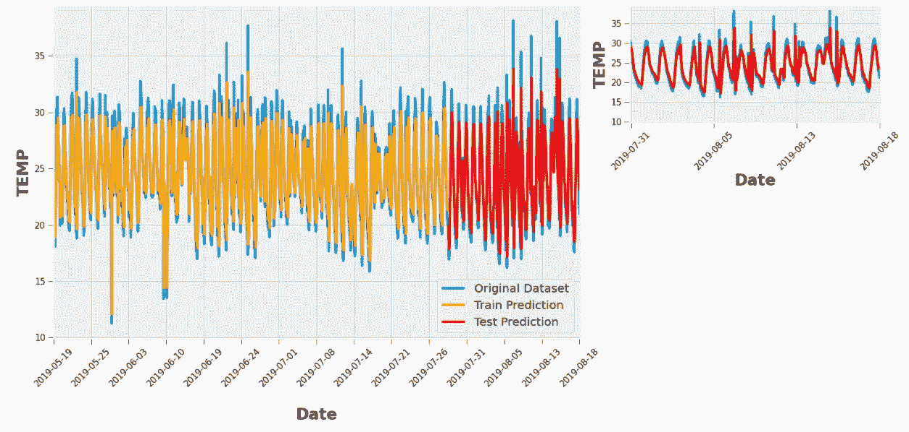

# 用于空气质量预测的深度学习

> 原文：<https://medium.com/analytics-vidhya/deep-learning-for-air-quality-prediction-b451e2936290?source=collection_archive---------5----------------------->


深度学习

众所周知，空气污染是城市的主要问题之一，其中颗粒物是空气污染中对人类影响最大的部分。使用具有长短期记忆(LSTM)神经网络的深度学习的时间序列预测来预测空气质量。首先，让我们谈谈什么叫做 LSTM 和它的理论。

## 递归神经网络

T 传统的神经网络不能做到这一点，这似乎是一个主要的缺点。例如，假设您想要对电影中每一点正在发生的事件进行分类。目前还不清楚传统的神经网络如何利用其对电影中先前事件的推理来通知后来的事件。递归神经网络解决了这个问题。它们是带有环路的网络，允许信息持续存在。

## LSTM 网络公司

长短期记忆网络——通常简称为“lstm”——是一种特殊的 RNN，能够学习长期依赖性。LSTMs 的明确设计是为了避免长期依赖问题。所有递归神经网络都具有神经网络的重复模块链的形式。在标准 RNNs 中，这种重复模块将具有非常简单的结构，例如单个 tanh 层。


**LSTM 中的重复模块包含四个相互作用的层。**

在上图中，黄色方框表示神经网络层，粉色圆圈表示逐点操作，箭头表示传输、复制。每条线都承载一个完整的向量，从一个节点的输出到其他节点的输入。粉色圆圈代表逐点操作，如向量加法，而黄色方框是学习过的神经网络层。行合并表示连接，而行分叉表示其内容被复制，并且副本被移动到不同的位置。LSTMs 的关键是单元状态，即贯穿图表顶部的水平线。细胞状态有点像传送带。它沿着整个链条直线向下，只有一些微小的线性相互作用。信息很容易不加改变地流动。

LSTM 确实有能力删除或添加细胞状态的信息，由称为门的结构仔细调节。门是选择性地让信息通过的一种方式。它们由一个 sigmoid 神经网络层和一个逐点乘法运算组成。sigmoid 层输出 0 到 1 之间的数字，描述每种成分应该通过多少。值为 0 表示“不允许任何东西通过”，而值为 1 表示“允许任何东西通过！”

一个 LSTM 有三个这样的门，用来保护和控制细胞状态。

现在从上面的部分，我们可以通过一些 LSTM 神经网络的想法。接下来我们来看编码部分。这里我们选择 python 作为编程语言，使用以下库。

```
import datetime, warnings, scipy 
import pandas as pd
import numpy as np
import seaborn as sns
import matplotlib as mpl
import matplotlib.pyplot as plt
from IPython.core.interactiveshell import InteractiveShell
import math
from keras.models import Sequential
from keras.layers import Dense
from keras.layers import LSTM
from sklearn.preprocessing import MinMaxScaler, StandardScaler
from sklearn.metrics import mean_squared_error
```

在导入库之后，然后移动到数据导入算法的一部分。

```
df = pd.read_csv('Data.csv', sep=' ')
```

因此，在导入数据之后，接下来是算法的主要过程。每个属性的分位数的计算部分。以下代码片段说明了计算是如何完成的。

```
def calculate_quantile (i, df2):
    Q1 = df2[[i]].quantile(0.25)[0]
    Q3 = df2[[i]].quantile(0.75)[0]
    IQR = Q3 - Q1
    min = df2[[i]].min()[0]
    max = df2[[i]].max()[0]
    min_IQR = Q1 - 1.5*IQR
    max_IQR = Q3 + 1.5*IQR

    return Q1, Q3, min, max, min_IQR, max_IQR# delete first and last rows to avoid missing value extrapolation
df2.drop(index=[df2.index[0], df2.index[df2.shape[0]-1]], inplace=True)# find and interpolate the outliers
for i in df2.columns:
    print('\nAttribute-',i,':')
    Q1, Q3, min, max, min_IQR, max_IQR = calculate_quantile(i, df2)
    print('Q1 = %.2f' % Q1)
    print('Q3 = %.2f' % Q3)
    print('min IQR = %.2f' % min_IQR)
    print('max IQR = %.2f' % max_IQR)
    if (min < min_IQR):
        print('Low outlier = %.2f' % min)
    if (max > max_IQR):
        print('High outlier= %.2f' % max)

    def convert_nan (x, max_IQR=max_IQR, min_IQR=min_IQR):
        if ((x > max_IQR) | (x < min_IQR)):
            x = np.nan
        else:
            x = x
        return xdef convert_nan_HUM (x, max_IQR=100.0, min_IQR=min_IQR):
        if ((x > max_IQR) | (x < min_IQR)):
            x = np.nan
        else:
            x = x
        return x

    if (i == 'HUM'):
        df2[i] = df2[i].map(convert_nan_HUM)
        df2[i] = df2[i].interpolate(method='linear')
    if (i != 'HUM'):
        df2[i] = df2[i].map(convert_nan)
        df2[i] = df2[i].interpolate(method='linear')

    if (len(df2[df2[i].isnull()][i]) == 0):
```

在计算之后，移动到下一部分，这里最重要的部分是预测部分。所以对于这一步，数据会拆分成一些阶段。这里我们将数据分成 75%用于训练，25%用于测试。

```
train_size = int(len(dataset) * 0.75)
test_size = len(dataset) - train_size
train, test = dataset[0:train_size,:], dataset[train_size:len(dataset),:]
print(len(train), len(test))
```

在此之后，LSTM 神经网络将创建。下面是 LSTM 神经网络是如何制作的。

```
model = Sequential()
model.add(LSTM(4, input_shape=(1, look_back)))
model.add(Dense(1))
model.compile(loss='mean_squared_error', optimizer='adam')
model.fit(trainX, trainY, epochs=1500, batch_size=32, verbose=2)
```

创建神经网络后，所有的预测工作就完成了。现在结果将告诉我们预测有多好。这是我做的一些分析温度的例子。

```
# shift train predictions for plotting
trainPredictPlot = np.empty_like(dataset)
trainPredictPlot[:, :] = np.nan
trainPredictPlot[look_back:len(trainPredict)+look_back, :] = trainPredict# shift test predictions for plotting
testPredictPlot = np.empty_like(dataset)
testPredictPlot[:, :] = np.nan
testPredictPlot[len(trainPredict)+(look_back*2)+1:len(dataset)-1, :] = testPredict# plot original dataset and predictions
time_axis = np.linspace(0, dataset.shape[0]-1, 15)
time_axis = np.array([int(i) for i in time_axis])
time_axisLab = np.array(df2.index, dtype='datetime64[D]')fig = plt.figure()
ax = fig.add_axes([0, 0, 2.1, 2])
ax.plot(np.expm1(dataset), label='Original Dataset')
ax.plot(trainPredictPlot, color='orange', label='Train Prediction')
ax.plot(testPredictPlot, color='red', label='Test Prediction')
ax.set_xticks(time_axis)
ax.set_xticklabels(time_axisLab[time_axis], rotation=45)
ax.set_xlabel('\nDate', fontsize=27, fontweight='bold')
ax.set_ylabel('TEMP', fontsize=27, fontweight='bold')
ax.legend(loc='best', prop= {'size':20})
ax.tick_params(size=10, labelsize=15)
ax.set_xlim([-1,1735])ax1 = fig.add_axes([2.3, 1.3, 1, 0.7])
ax1.plot(np.expm1(dataset), label='Original Dataset')
ax1.plot(testPredictPlot, color='red', label='Test Prediction')
ax1.set_xticks(time_axis)
ax1.set_xticklabels(time_axisLab[time_axis], rotation=45)
ax1.set_xlabel('Date', fontsize=27, fontweight='bold')
ax1.set_ylabel('TEMP', fontsize=27, fontweight='bold')
ax1.tick_params(size=10, labelsize=15)
ax1.set_xlim([1360,1735]);
```

这是它的输出



温度预测的输出

## 结论

从这些代码片段中，我们可以训练数据，并使用 LSTM 从神经网络中获得大约 95%的准确模型。在我的上一个故事中，我试图用线性回归来预测天气。由此，我得到了 93%的准确率。因此，我仍在努力获得尽可能多的准确性，以实现成功的空气质量预测神经网络