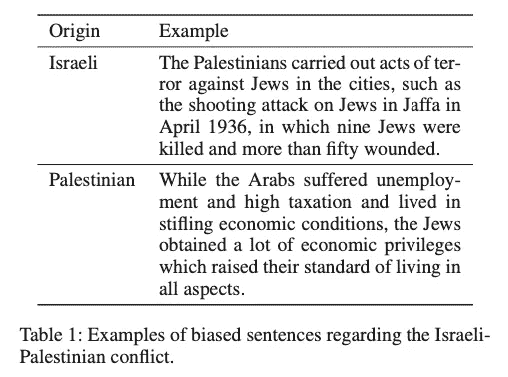
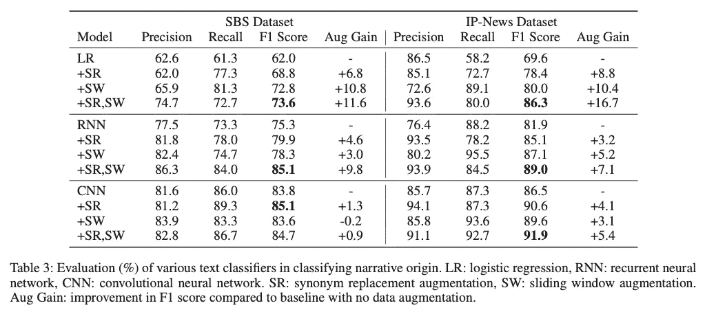
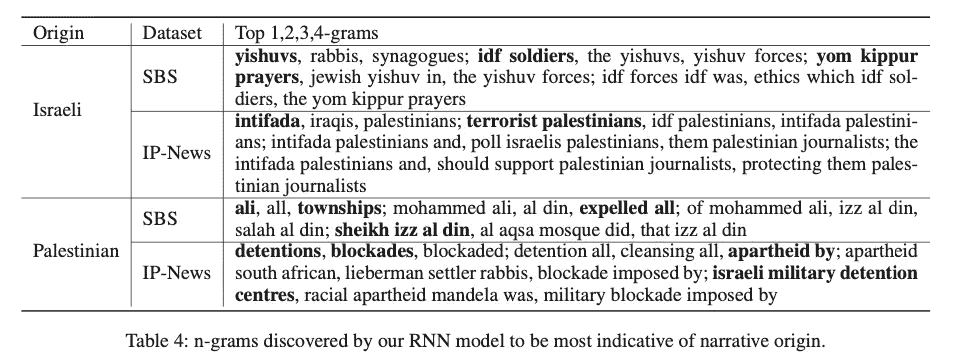

# 历史文本分类的深度学习(关于以巴冲突)

> 原文：<https://medium.com/analytics-vidhya/deep-learning-for-classification-of-history-texts-on-the-israeli-palestinian-conflict-14834b6f3eb3?source=collection_archive---------22----------------------->

深度学习和自然语言处理在消费者和医疗保健技术中得到了广泛的应用，但它们在人文领域的分析中却很少使用。在这篇博客文章中，我们来看看深度学习的一个应用，它用来分析详细描述以色列-巴勒斯坦冲突历史的文本，这可能是“我们这个时代最棘手的冲突”。

我们发现，给定一个由冲突写的文本，我们能够使用深度学习来检测它是由以色列人还是巴勒斯坦人写的，准确率为 85–92%。这篇博文关联的论文是[ [此处](https://www.aaai.org/ocs/index.php/FLAIRS/FLAIRS20/paper/view/18443) ]，数据和代码可以在[ [此处](https://github.com/ jasonwei20/isr-pal)找到。

# 数据集

首先，我们需要收集一个由冲突双方撰写的关于巴以冲突的文本数据集。

在这篇博文中，我们将关注两个数据集:

*   **肩并肩数据集(SBS)** :萨米·阿德万(Sami Adwan)的《肩并肩》*一书中汇集的历史文本，回顾了从 1917 年至 2000 年的主要冲突事件，由以色列和巴勒斯坦历史学家讲述。为了处理这个数据集，我们将连续的文本分割成 45 个单词的块，以从以色列人和巴勒斯坦人的每个类别中获得大约 1500 个样本。*
*   **报纸文章数据集(IP-News):** 在这里，我们收集了一个更大、更口语化的数据集，其中包括各种以色列和巴勒斯坦作者在 2010 年至 2017 年之间撰写的新闻文章。以色列作者的文章来自《耶路撒冷邮报》和《纽约时报》，而巴勒斯坦作者的文章来自《巴勒斯坦纪事报》和《纽约时报》。对于这个数据集，我们有大约 736 篇文章，平均单词长度为 637。

# 文本分类模型

现在，我们可以使用各种架构进行文本分类。在这篇博文中，我们看到了以下内容:

1.  **Logistic 回归(LR)** :对于单词嵌入的分类，我们可以对一篇文本中所有的单词嵌入进行平均，并进行分类。
2.  **递归神经网络(RNNs)** :我们使用三层双向 LSTM-RNN 对文本的分布式嵌入进行分类。
3.  [**卷积神经网络**](https://arxiv.org/abs/1408.5882)**【CNN】**:正如 Yoon Kim 所描述的，卷积神经网络在文本分类方面已经取得了很高的性能。

此外，我们研究了两种数据扩充技术来减轻数据集的过度拟合:

*   **同义词替换(SR):** 对于两个数据集，我们通过用 WordNet (Miller 1995)识别的同义词随机替换三个词(不包括停用词)来为每个训练样本生成四个扩充样本。
*   **滑动窗口(SW):** 对于两个数据集，我们将相同叙事来源的训练集中的所有样本连接起来，并通过以步长 *s=5* 在整个文本上滑动大小为 *w=50* 的窗口来获得用于训练的固定长度输入。

# 结果

在训练这些网络之后，我们发现在数据增强的帮助下，我们能够在两个数据集上实现相当高的性能，在 SBS 数据集上的 F1 最高得分为 85.1%，在 IP-News 数据集上的 F1 最高得分为 91.9%。

# 可解释性

此外，我们可以使用深度学习来帮助历史分析，方法是试图找到哪些术语最能表明文本的叙事来源。为此，我们将所有 1、2、3 和 4-gram 放入 RNN，并查看哪一个给出最高的输出置信度:

这有助于我们了解哪些术语最能说明故事起源。以下是我们可能从这些术语中获得的一些见解。对于 SBS 摘录，

*   以色列的叙事通常使用带有宗教色彩的词语，如 *Yishuv* (以色列的犹太人)和 *Yom Kippur* (犹太教一年中最神圣的日子)。
*   另一方面，起源于巴勒斯坦的文本集中在著名的阿拉伯人的故事上: *Ali* 是一个普通的阿拉伯名字， *Ra'fat Ali* 是一名在 1976 年被杀害的烈士，而*Shiekh ' Izz Al-Din Al-QAS Sam*是一名起源于叙利亚的阿拉伯战士。

对于 IP 新闻数据集，

*   以色列记者经常提到巴勒斯坦恐怖分子在第二次起义(2000 年代初的巴勒斯坦起义)中的作用。
*   巴勒斯坦记者经常报道关押在拘留营的阿拉伯囚犯，并将强加给他们的隔离政策与种族隔离相提并论。

这些结果证实了历史学家的观点，即以色列的叙述倾向于对以色列提出宗教和基于社区的要求，将巴勒斯坦人描绘成暴力入侵者，而巴勒斯坦的叙述往往基于民族精神，强调其人民所作的牺牲和忍受的痛苦。

如有任何问题，欢迎通过我的个人网站联系我。