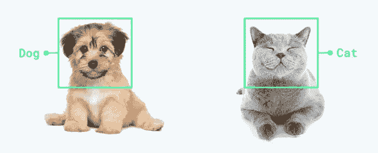
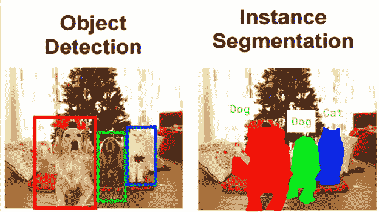
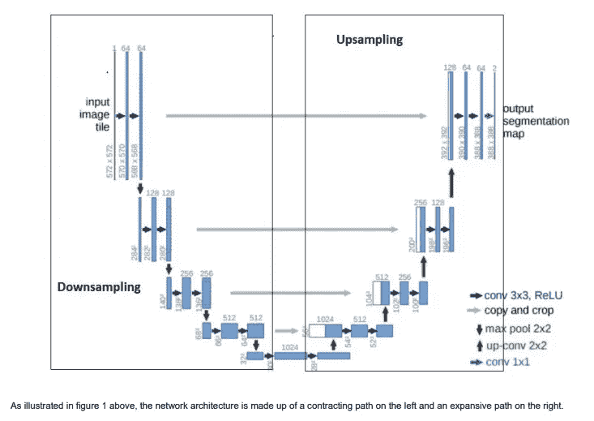
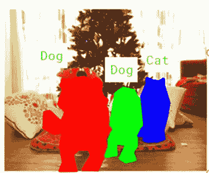

# 深度学习:图像分割和定位——U-Net 架构

> 原文：<https://medium.com/analytics-vidhya/deep-learning-image-segmentation-and-localization-u-net-architecture-ea4cff5595d9?source=collection_archive---------4----------------------->

# **1。简介**

**人工智能(AI)** 一直是媒体激烈炒作的主题。机器学习、深度学习和人工智能出现在无数的文章中，通常是在技术型出版物之外。在过去的两年中，深度卷积网络在许多视觉识别任务中已经超越了最先进的技术。

但是你注意到这些视觉识别任务的复杂性了吗？不太容易。

卷积网络(CNN)的出现使得研究取得了前所未有的进展。使用 CNN，我们可以将一幅图像分类，归属于它自己的类别。



卷积网络通常用于分类任务，其中图像的输出是单个类别标签。然而，在许多视觉任务中，特别是在图像处理中，期望的输出应该包括定位，即应该为每个像素分配一个类别标签。

因此，我们需要一个 CNN 网络，它可以通过在输入中的像素周围提供一个局部区域(小块)来预测每个像素的类别标签。这被称为检测图像中的对象并预测其像素周围的类别标签。



卷积神经网络在较简单的图像分割问题上给出了不错的结果，但在复杂的图像分割问题上没有取得任何进展。这就是 U-Net 出现的原因。U-Net 最初是专门为医学图像分割而设计的。它显示出如此好的效果，以至于后来它被用于许多其他领域。

# 2.U-net 架构(看起来像 U)

为了预测同一图像上的类别，我们将使用语义分割的概念，其中我们对图像进行逐像素分类。我们可以认为语义分割是像素级的图像分类。



该架构由两部分组成:

> 收缩/下采样层(左侧)
> 
> 扩展/上采样层(右侧)
> 
> 输出层

## 收缩/下采样层

收缩路径遵循卷积网络的典型架构。它由两个 3×3 卷积(无填充卷积)的重复应用组成，每个卷积后跟一个整流线性单元(ReLU)和一个 2×2 最大池操作，步长为 2，用于下采样。

在每个下采样步骤中，我们将特征通道的数量增加一倍。

该收缩路径的目的是捕获输入图像的上下文，以便能够进行分割。

以下是收缩层的 keras 代码:

**#签约层数:**

**取初始核大小为 8，在下一个收缩层加倍。我们可以添加多个收缩层来获得更好的功能。**

> 第 1 层:收缩层

```
**c1 = Conv2D(8, (3, 3), padding=’same’ (inputs)****c1 = Activation(‘relu’) (c1)****c1 = Conv2D(8, (3, 3), padding=’same’ (c1)****c1 = Activation(‘relu’) (c1)****p1 = MaxPooling2D((2, 2)) (c1)**
```

> 第 2 层:收缩层

```
**c2 = Conv2D(16, (3, 3), padding=’same’ (p1)****c2 = Activation(‘relu’) (c2)****c2 = Conv2D(16, (3, 3), padding=’same’ (c2)****c2 = Activation(‘relu’) (c2)****p2 = MaxPooling2D((2, 2)) (c2)**
```

> 第三层:收缩层

```
**c3 = Conv2D(32, (3, 3), padding=’same’ (p2)****c3 = Activation(‘relu’) (c3)****c3 = Conv2D(32, (3, 3), padding=’same’ (c3)****c3 = Activation(‘relu’) (c3)****p3 = MaxPooling2D((2, 2)) (c3)**
```

**下采样会发生什么？**

该路径用于通过在每个阶段加倍过滤器的数量来获得图像的更多特征。

在进入下一阶段时，我们将进行 2x2 max-pooling 以获得最大像素值，因此失去了一些功能，但保留了最大像素值。

所以在下采样的最后一层，我们得到了图像的低级特征。

假设，一个图像有两个类别，猫和狗，这些类别通过分配像素值反映在像素中。

例如，我们正在按像素方式进行类别分割:

类别 CAT-图层上的像素值要素-135

图层上的类狗-像素值要素-150

对于无缺陷像素值为 0。

通过这种方式，我们可以按像素进行分类，也可以对类别进行分段。



## 扩展/上采样层

类似于收缩层，也是由几个膨胀块组成。扩展路径中的每一步都包括特征图的上采样，随后是将特征通道数量减半的 2×2 卷积(上卷积)，与收缩路径中相应裁剪的特征图的连接，以及两个 3×3 卷积，每个卷积之后是 ReLU。

该扩展路径的目的是实现与来自收缩路径的上下文信息相结合的精确定位。

以下是扩展层的 keras 代码:

**#扩展层:**

**取初始籽粒大小为 8。**

> 第 1 层:膨胀层

```
u4 = Conv2DTranspose(32, (2, 2),strides=(2, 2), padding=’same’) (c3)u4 = concatenate([u4, c3])c4 = Conv2D(32, (3, 3), padding=’same’) (u4)c4 = Activation(‘relu’) (c4)c4 = Conv2D(32, (3, 3), padding=’same’) (c4)c4 = Activation(‘relu’) (c4)
```

> 第 2 层:膨胀层

```
u5 = Conv2DTranspose(16, (2, 2),strides=(2, 2), padding=’same’) (c4)u5 = concatenate([u5, c2])c5 = Conv2D(16, (3, 3), padding=’same’) (u5)c5 = Activation(‘relu’) (c5)c5 = Conv2D(16, (3, 3), padding=’same’) (c5)c5 = Activation(‘relu’) (c5)
```

> 第三层:膨胀层

```
u6 = Conv2DTranspose(8, (2, 2),strides=(2, 2), padding=’same’) (c5)u6 = concatenate([u6, c1])c6 = Conv2D(8, (3, 3), padding=’same’) (u6)c6 = Activation(‘relu’) (c6)c6 = Conv2D(8, (3, 3), padding=’same’) (c6)c6 = Activation(‘relu’) (c6)
```

**上采样发生了什么？**

我们将在同一阶段进行上采样，以保持图像的相同大小。

现在在下采样中，我们已经得到了所有类的像素特征值。由于使用最大池，我们失去了一些降采样的特性，所以不必担心。

在上采样中，我们通过将具有相同下采样滤波器的级别的特征图复制到相同上采样滤波器的级别，从而保留特征，来得到完整的图像。因此，我们得到完整的图像，并可以定位每一类图像中存在缺陷的位置。这就是所谓的转置卷积。

然后，我们再次通过应用卷积学习全尺寸图像。

因此在上采样中，基本上下采样侧的每个特征层都被添加到上采样侧的相应特征层，以获得全分辨率图像，从而定位类别。

整合图像的局部信息和全局信息。

## 输出层

```
**outputs = Conv2D(2, (1, 1), activation=’sigmoid’) (c9)**
```

在最后一层中，我们有两个与每个类相关的输出，猫和狗

猫- C1

狗- C2

每个类都有自己的 1 X 1 过滤器。

因此，c1 过滤器将遍历每个像素地图，并预测 CAT 类出现的概率。

在理想情况下，c1=1 和 c2 的概率为零。

输出图层将给出每个像素属于所有过滤器的特定类别的概率。像素属于该类别的概率越大。

## 3.损失函数

我们使用**二元交叉熵**作为损失函数，因为它将给出属于该区域的每个像素的逐像素损失或概率。

# 参考

1.  https://arxiv.org/pdf/1505.04597.pdf
2.  【https://www.youtube.com/watch?v=NzY5IJodjek 
3.  [https://developers.arcgis.com/python/guide/how-unet-works/](https://developers.arcgis.com/python/guide/how-unet-works/)