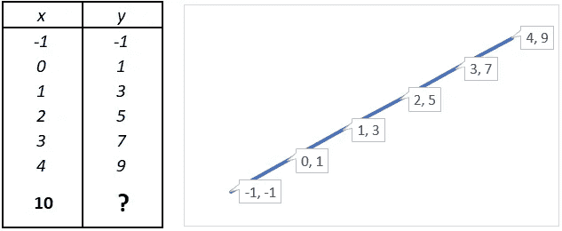

# 深度学习很简单！

> 原文：<https://medium.com/analytics-vidhya/deep-learning-is-simple-dlseries-1-6fa4a09ba95b?source=collection_archive---------31----------------------->

## 成为深度学习专家的分步指南，第 1 部分


马库斯·温克勒在 [Unsplash](https://unsplash.com?utm_source=medium&utm_medium=referral) 上的照片

你对深度学习和它改变我们日常世界的方式着迷吗？每天我们都会听到不同的故事，讲述深度学习如何创造以前无法想象的更新的可能性。如果你想成为这种新的电力的一部分，那么这个系列是给你的。在本系列中，您将使用计算机视觉、语音处理、自然语言等构建令人惊叹的应用程序。别担心，我们不指望你成为计算机科学、统计学、控制理论、决策理论、计算复杂性的大师……..

如果你认为深度学习的发展与宇宙大爆炸理论一样古老，那么你错了，随着神经网络训练的突破性研究，这一领域的严重发展才刚刚开始。简而言之，数据、计算能力和算法创新的爆炸导致了深度学习的指数增长。

就在几年前，你必须是编程、数学、统计领域的专家，甚至是实现这些应用程序中最简单的模板。但由于深度学习框架的发展，如 Caffe，CNTK，TensorFlow，Keras，Torch 等，现在只需几行代码，您就可以实现最困难的应用程序，而无需了解背景的复杂性。不相信我？看到这篇文章里的自己。

让我们开始吧。

在这个系列中，我们将使用 Keras 和 TensorFlow 框架对深度神经网络进行编码。你不需要安装任何东西，只需点击这个[链接](https://colab.research.google.com/drive/1NsiZXRWjWDaIWjCEJoxXtfa-0lhGSWS_#scrollTo=9wjcjQQvY8kN)并按 Shift+Enter 运行单元格中编写的代码。

```
#Step-1import tensorflow as tffrom tensorflow import kerasimport numpy as np#Step-2model = tf.keras.Sequential([keras.layers.Dense(units=1, input_shape=[1])])model.compile(optimizer='sgd', loss='mean_squared_error')x = np.array([-1, 0, 1, 2, 3, 4], dtype=float)y = np.array([-1, 1, 3, 5, 7, 9], dtype=float)model.fit(x, y, epochs=500)print(model.predict([10]))
```

恭喜你。！你成功编写了你的第一个深度学习代码。

如果上面写的代码让您感到害怕，不要惊慌，我们将在本文中讨论所有这些内容，并在后续文章中获得更多详细说明。

这里，我们的目的是在给定变量 x 的新值的情况下，通过从给定的一组示例中学习 x 和 y 之间的关系来预测 y 的值。如果仔细观察数据，我们会发现 x 和 y 只是通过线性关系 y = 2x +1 来关联。这对你来说似乎很容易，但我们想要的是神经网络自己找到这一点，而不需要我们显式地编码这种关系。



关系 b/w x 和 y

在第一步中，首先我们导入 *TensorFlow* ，为了方便使用，我们称它为 *tf* 。我们还导入了 *keras* ，这是一个将神经网络定义为一组连续层的框架。我们导入了 *numpy* ，这有助于我们将数据表示为数组。

简而言之，一个神经网络由一个输入层、几个隐含层和一个输出层依次连接而成。每一层由几个称为神经元的单元组成。通常在实际操作中，我们在计算神经网络总层数时会排除输入层。例如，在当前代码中，神经网络具有 1 个输入层、无隐藏层和 1 个输出层，并且输出层中只有一个神经元。这是一个单层神经网络，是最简单的神经网络。


典型的神经网络

在第二步中，我们定义了我们的模型，它是一系列的层。我们使用类型为 *Dense* 的输出层，因为它只有一个神经元，所以我们定义 *units = 1* 并且我们只给它一个输入 x，所以 *input_shape* 也被赋予值 1。

神经网络模型学习的方式是进行猜测，可能 y=5x+10。然后，用参数 *loss* 定义的损失函数对照已知的正确答案来测量猜测的答案，并测量它做得有多好或有多差。然后基于这个损失函数*优化器*进行另一个猜测以最小化这个损失。它对定义的多个*时期*重复该过程。

然后我们把 x 和 y 定义为数组。在这之后，我们在模型中*拟合*这些数组。

现在你可以*预测*新的 x 值的 y 值。

现在你可以做的是调整 x 和 y 数组中的值，并探索神经网络发现的新关系。

如果你想了解更多关于数据科学、深度学习和人工智能的知识，请在 Medium 上关注我，并关注我的下一篇帖子！